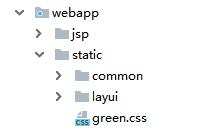

# Layui

1. 导入layui框架放置与webapp下的static文件夹

   

2. 改变layui原有布局中的css和js文件引入地址：

   ​	

```html
<body class="layui-layout-body">
<div class="layui-layout layui-layout-admin">
    <!--此处引入公用的布局文件-->
    <jsp:include page="/static/common/header.jsp"></jsp:include>
    <div class="layui-body">
        <!-- 内容主体区域 -->
        <div style="padding: 15px;">内容主体区域</div>
    </div>

    <div class="layui-footer">
        <!-- 底部固定区域 -->
        © layui.com - 底部固定区域
    </div>
</div>
<script src="${webpath}/static/layui/layui.js"></script>
<script>
    //JavaScript代码区域
    layui.use('element', function(){
        var element = layui.element;

    });
</script>
</body>
```

3. 表格文件测试:

   ```java
   @Controller
   @RequestMapping("/Layui")
   public class LayuiController {
       @RequestMapping("/getlist")
       public String getit(Model model){
            List<User> users=new ArrayList<User>();
            User u1=new User(1,"u1","p1");
            User u2=new User(2,"u2","p2");
            User u3=new User(3,"u3","p3");
            User u4=new User(4,"u4","p4");
           Collections.addAll(users,u1,u2,u3,u4);
           model.addAttribute("users",users);
           return "layusers";
       }
   }
   ```

   ```html
   <table class="layui-table">
       <thead>
       <tr>
           <th>用户id</th>
           <th>用户名称</th>
           <th>用户密码</th>
       </tr>
       </thead>
       <tbody>
       <c:forEach items="${users}" var="user">
           <tr>
               <td>${user.id}</td>
               <td>${user.username}</td>
               <td>${user.password}</td>
           </tr>
       </c:forEach>
       </tbody>
   </table>
   ```
