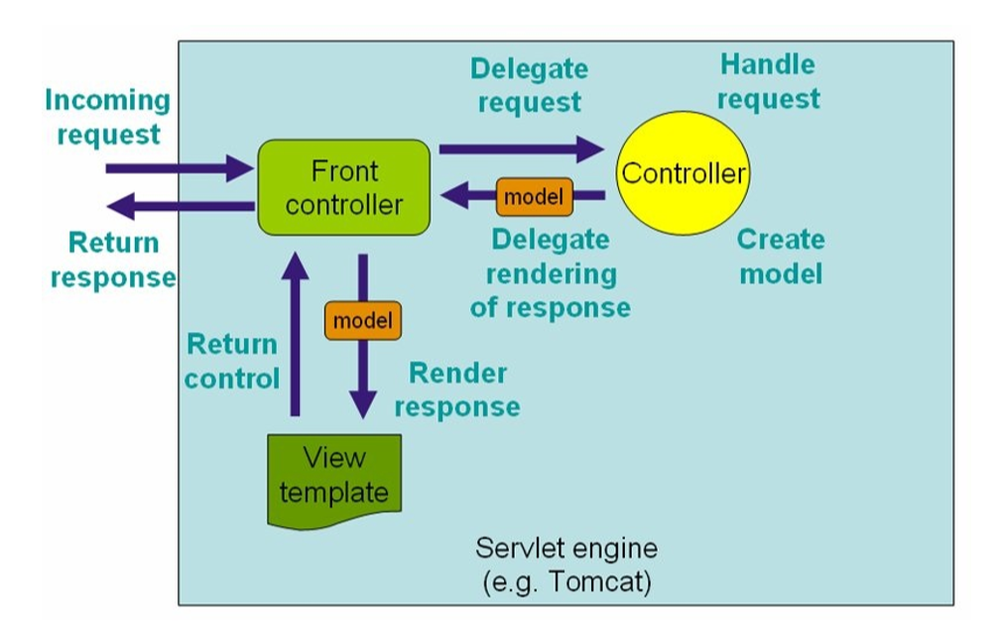
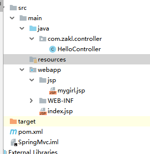

SpringMVC

+ **SpringMVC结构图**

  

1. 创建webproject

   1. 直接使用maven提供的web.app模板創建

      项目结构图：

      

2. 编写web.xml，在其中注册一个特殊的servlet,前端控制器,字符乱码问题

   ```xml
   <?xml version="1.0" encoding="UTF-8"?>
   <web-app version="2.5"
            xmlns="http://java.sun.com/xml/ns/javaee"
            xmlns:xsi="http://www.w3.org/2001/XMLSchema-instance"
            xsi:schemaLocation="http://java.sun.com/xml/ns/javaee
   	http://java.sun.com/xml/ns/javaee/web-app_2_5.xsd">
   
       
       <display-name>Archetype Created Web Application</display-name>
       
       <servlet>
           <servlet-name>springmvc</servlet-name>
           <servlet-class>org.springframework.web.servlet.DispatcherServlet</servlet-class>
           <init-param>
               <param-name>contextConfigLocation</param-name>
               <param-value>classpath:mvc.xml</param-value>
           </init-param>
       </servlet>
   
       <!-- 字符编码-->
       <filter>
           <filter-name>characterEncodingFilter</filter-name>
           <filter-class>org.springframework.web.filter.CharacterEncodingFilter</filter-class>
           <init-param>
               <param-name>encoding</param-name>
               <param-value>UTF-8</param-value>
           </init-param>
       </filter>
       <filter-mapping>
           <filter-name>characterEncodingFilter</filter-name>
           <url-pattern>/*</url-pattern>
       </filter-mapping>
   
   
       <!--该过滤器支持所有的http请求类型-->
       <filter>
           <filter-name>hiddenHttpMethodFilter</filter-name>
           <filter-class>org.springframework.web.filter.HiddenHttpMethodFilter</filter-class>
       </filter>
       <filter-mapping>
           <filter-name>hiddenHttpMethodFilter</filter-name>
           <url-pattern>/*</url-pattern>
       </filter-mapping>
       
   	<!--url pattern写/而不是/* -->
       <servlet-mapping>
           <servlet-name>springmvc</servlet-name>
           <url-pattern>/</url-pattern>
       </servlet-mapping>
   </web-app>
   
   ```

3. 编写一个SpringMvc的配置文件

   1. 注册一个视图解析器 (在web-inf下新建springmvc-servlet.xml文件，该文件供web.xml中的DispatcherServlet注册时查找)

      ```xml
      <?xml version="1.0" encoding="UTF-8"?>
      <beans xmlns="http://www.springframework.org/schema/beans"
             xmlns:xsi="http://www.w3.org/2001/XMLSchema-instance"
              xmlns:context="http://www.springframework.org/schema/context"
             xsi:schemaLocation="http://www.springframework.org/schema/beans http://www.springframework.org/schema/beans/spring-beans.xsd
                                 http://www.springframework.org/schema/context http://www.springframework.org/schema/context/spring-context-3.1.xsd">
          <!--用以查找jsp文件:/jsp文件夹下的以.jsp结尾的文件-->
          <bean class="org.springframework.web.servlet.view.InternalResourceViewResolver">
              <!--前綴-->
              <property name="prefix" value="/jsp/"></property>
              <!--後綴-->
              <property name="suffix" value=".jsp"></property>
          </bean>
          <!--配置注解扫描文件-->
          <context:component-scan base-package="com.zakl.controller"></context:component-scan>
      
          <bean class="com.zakl.controller.HelloController" name="/helloController" ></bean>
      </beans>
      ```


4.编写控制器(注意将返回视图放置与webapp下的jsp文件夹中，如果直接放在在根目录下，则setViewName("/mygirl.jsp"))

```java
//controller 只具有一个方法的接口成为函数式接口
public class HelloController implements Controller {
    @Override
    public ModelAndView handleRequest(HttpServletRequest httpServletRequest, HttpServletResponse httpServletResponse) throws Exception {
        ModelAndView mav=new ModelAndView();
        mav.addObject("girl","linda");
        mav.setViewName("mygirl");
        return mav;
    }
},

/* 基于注解模式-- 需要在springmvc-servlet.xml中注册扫描bean，该种实现比以上方法更简便  */

@Controller //标记为spring的一个组件，并且是控制器的组件，此时handlermappong会去扫描这个controller是否与之匹配，匹配成功就将工作交予该controller，匹配原则通过@RequestMapping(URI)进行匹配  
public class ByeController {
    @RequestMapping("/bbbb")
    public String method(Model model){
        model.addAttribute("model","李荣浩");
        return "bye";
    }
}
<context:component-scan base-package="com.zakl.controller"></context:component-scan>

/*基于注解模式 --无需在springmvc.servlet.xml中注册component-sacn 但是需要注册controller Bean*/
<bean class="com.zakl.controller.ByeController" ></bean>
@Controller
public class ByeController {
    @RequestMapping("/aa")
    public String bye(Model model){
        model.addAttribute("model","李荣浩");
        return "bye";//返回的string就是逻辑视图名称 bye.jsp
    }
    //访问路径aa
    //为什么可以成功，我都唔知。。。
```


5.返回视图

```xml
<%@ page contentType="text/html;charset=UTF-8" language="java" %>
<html>
<head>
    <title>Title</title>
</head>
<body>
    this is my girl: ${girl}
</body>
</html>
```


### Springmvc-servlet.xml配置位置：

​	DispatcerSerlvet默认查找web-inf下的springmvc-servlet.xml文件

可以通过<init-param>标签更改位置满足maven项目式结构开发：

```xml
<servlet>
	    <!--[<servlet-name>]-servlet =namespace
		默认为在web-inf下查找namespace(springmvc-servlet).xml文件
		-->
        <servlet-name>springmvc</servlet-name>
        <servlet-class>org.springframework.web.servlet.DispatcherServlet</servlet-class>
        <init-param>
            <param-name>contextConfigLocation</param-name>
            <param-value>classpath:mvc.xml</param-value>
        </init-param>
   		 <!-- 该种配置将命名空间更改为mvc = 在web-inf下查找mvc.xml文件
    		<init-param>
          	  <param-name>namespace</param-name>
         	   <param-value>mvc</param-value>
   			 </init-param>
	    -->
    </servlet>
```


jsp <c:foreach 遍历>

```xml
 <c:forEach items="${users}" var="user">
        <tr>
            <td>${user.id}</td>
            <td>${user.username}</td>
            <td>${user.password}</td>
        </tr>
    </c:forEach>
```


## 转发与重定向

默认的 return 就是一种转发

```java
@RequestMapping("/aa")
    public String bye(Model model){
        model.addAttribute("model","李荣浩");
        return "bye";
    }
```

重定向到页面（注意这里的的return要返回path ，注意以反斜杠表明地址,重定向无法传递当前数据，相当于用户重新发起一次request请求)

```java
@RequestMapping("/redirecttojsp")
    public String redirecttojsp(Model model){
        System.out.println("重定向");
        return "redirect:/index.jsp";
    }
```

转发到控制器forward:控制器声明URI（其中的model数据仍然可以被新的控制器所接收，并最终返回给页面):

```java
@RequestMapping("/forward")
    public String forwardtoController(Model model){
        model.addAttribute("mmm","1111");
        System.out.println("forwardtoController");
        return "forward:/Bye/users";
    }
```

## springmvc访问web元素

+ request

  + ```java
    @Controller
    @RequestMapping("/test")
    public class TestController {
        @RequestMapping("/request")
        public String getrequest(HttpServletRequest httpServletRequest){
            String o=httpServletRequest.getParameter("boy");
            System.out.println("输出内容"+o);
            return null;
        }
    }
    //控制台应答数据为：输出内容wuzerui
    //浏览器访问路径为：http://localhost:8080/SpringMvc_war_exploded/test/request?boy=wuzerui
    ```


+ hisession 

  ​	

  ```java
  @RequestMapping("/session")
  public String setsession(HttpSession session){
      session.setAttribute("session","hi")
      session.getServletContext().setAttribute("会话","这是我的会话");
      return null;
  }
  //可通过另一个test.jsp页面中的${会话},${session}，得到数据
  ```

​	

application

### SpringMVC注解详情

+ ##### 路劲数组访问，多路径访问一个controller

  + @RequestMapping(value=["/uri","/uri2"])

  + @RequestMapping(path=["/uri","/uri2"])

+ ##### 限定请求方式只能为GET(其他方式同理,可以写成数组）:

  @RequestMapping(method=RequestMethod.GET)

  ```java
  @RequestMapping(path ={"p1","p2"},method= RequestMethod.GET)
      public String onlyget(){
          System.out.println("this is onlygetMethod");
          return "test";
      }
  ```

##### 获取项目的地址：

```java
@WebServlet(urlPatterns = {},loadOnStartup = 2)
public class WebPatInitServlet extends HttpServlet {
    @Override
    public void init(ServletConfig config) throws ServletException {
        //在整个应用中上下文使用webpath来存储上下文路径
       		 	      config.getServletContext().setAttribute("webpath",config.getServletContext().getContextPath());
        super.init(config);
    }
}
//loadonstartup =2 是为了让这个servlet最快加载，可以优先获取到webpath
```

##### 表单访问：

```xml
<form action="${webpath}/test/p1" method="post" >
        <input type="submit">
</form>
<!--      以前的写法  ------->
 <form action="${pageContext.request.contextPath}/test/p1" method="post" onsubmit="">
        <input type="submit">
 </form>
```

+ ##### @ResponseBody (在请求页面返回数据)

  ```
  @ResponseBody
  public String put(){
      return "put";
  }
  ```

+ ##### @Requestbody

    用来前台传递json数据到后台，使用方式

  ```javascript
    $('#b1').click(function () {
                    var obj={
                    "username":"周振昭",
                        "password":"goudongxi"
                    }
                    $.ajax({
                            url: '${webpath}/Json2/m1',
                            type: 'post',
                            contentType:'application/json',
                            data:JSON.stringify(obj),
                            success: function (data) {
                            }
                        }
                    )
                })
  ```

  ```java
    @Controller
    @RequestMapping("Json2")
    public class JsonController2 {
        @RequestMapping("m1")
        public String t1(@RequestBody User user){
            System.out.println(user.getUsername()+user.getPassword());
            return null;
        }
    }
  ```

+ ##### @ModelAttribute

  默认初始化信息：

  若前端jsp有传值，则使用前端传入的值，否则则使用@ModelAttribute注解下的默认初始化值

  ```java
  @ModelAttribute
  public void init(Model model){
      System.out.println("initing.........");
      User u=new User();
      u.setUsername("linpr");
      model.addAttribute("user",u);
  }
  
  @RequestMapping("p5")
  @ResponseBody
  public String MA(User user){
      System.out.println(user.getUsername());
      return user.getUsername();
  }
  ```

```xml
<form action="${webpath}/test/p5" method="post" >
    <input type="text" name="username">
    <input type="submit">
</form>
```


+ ##### @SessionAttributes

  ​	添加到类上面，在session中放置模型

  ```java
  @Controller
  @RequestMapping("/test")
  @SessionAttributes("user")
  public class TestController {
  @RequestMapping("p8")
      public String redirecttojsp(User user){
          System.out.println("重定向");
          return "redirect:/index.jsp";
      }
   }
  ```

   jsp中：

```xml
${sessionScope.user.username}
```

+ ##### @SessionAttribute

  登录的狗会被注册的狗给覆盖，只有进行了注册才能进行登录，且只能登录当前注册账号

  ```java
  @Controller
  @RequestMapping("/dog")
  @SessionAttributes("dog")
  public class DogController {
      @RequestMapping("/register")
      @ResponseBody
      public String  register(Dog dog){
          System.out.println("注册的狗名为:"+dog.getName());
          return dog.getName();
      }
      //会检查当前会话中是否含有Dog对象，如果，则会出现400错误
      @RequestMapping("/login")
      public String login(@SessionAttribute Dog dog){
          System.out.println(" 登录的名字"+dog.getName());
          return "dog";
      }
  }
  ```

- ##### @PathVariable注解

```java
 @RequestMapping("/restful/{id}/{name}")
    public void test(@PathVariable("id")Integer id,@PathVariable("name")String name){
        System.out.println("id为："+id+"姓名为："+name);

    }

```

+ ##### @RestController

  +  @RestController=Controller+@Responsebody //当该Controller全是返回数据的方法时，可直接使用@RestController


### 请求路径问题

  springmvc支持ant风格路径

+   ？ 任意的字符，斜杠除外
+ `*` 0到n,任意个字符都可以，斜杠除外
+  **  支持任意层路径  /m/**  

### 静态资源访问

+ 需要在mvc.xml中注册，否则对静态资源的访问会被认为是一次请求

```xml


```

```html
<head>
    <!--访问static文件夹中的green.css-->
    <link href="${webpath}/static/green.css" rel="stylesheet" type="text/css"/>    <title>Title</title>
</head>
```

### 关于form表单提交数据的方式

+ 方式一：通过属性名称绑定，页面表单元素的name值与后台形参一致：

  ​	

  ```xml
  <form action="${webpath}/test/p6" method="post" >
      姓名：<input type="text" name="name" ><br>
      密码：<input type="password" name="password">
      <input type="submit">
  </form>
  ```

```java
@RequestMapping("p6")
public String T(String name,String password,Model model){
    System.out.println(name+password);
    model.addAttribute("name",name);
    model.addAttribute("password" ,password);
    return "msg";
}
```


+ 方式二 利用@requestparam


+ 方式三 直接使用pojo形式传递 jsp不变

```xml
<form action="${webpath}/test/p4" method="post" >
  	<input type="text" name="username">
    <input type="submit">
</form>
```

```java
public String MA(User user){
    System.out.println(user.getUsername());
    return user.getUsername();
}
```

+ form表单提交日期

  + 使用@InitBinder注解

  ```java
  @InitBinder()
      public void init(WebDataBinder webDataBinder){
          //指定输入日期格式
          SimpleDateFormat sdf=new SimpleDateFormat("yyyy-MM-dd HH:mm:ss");
          sdf.setLenient(false);//严格解析时间
          //webDataBinder.addCustomFormatter(new DateFormatter("yyyy-MM-dd HH"),Date.class);
          webDataBinder.registerCustomEditor(Date.class,new CustomDateEditor(sdf,false));
      }
      @RequestMapping("p7")
      @ResponseBody
      public String getbirth( User user){
          System.out.println(user.getUsername()+user.getPassword()+user.getBirth());
          return "ok";
      }
  ```

  + 使用@DatatimeFormat注解

    ```java
    @DateTimeFormat(pattern = "yyyy-MM-dd HH:mm:ss")//注意时间格式
    private Date birth;
    public Date getBirth() {
        return birth;
    }
    public void setBirth(Date birth) {
        this.birth = birth;
    }
    ```

+ 时间参数传递：

  + ```java
    public Result test(@RequestParam("startDate") @DateTimeFormat(pattern="yyyy/MM/dd") Date startDate,@RequestParam("endDate") @DateTimeFormat(pattern="yyyy/MM/dd") Date endDate){
        return null;
    }
    ```