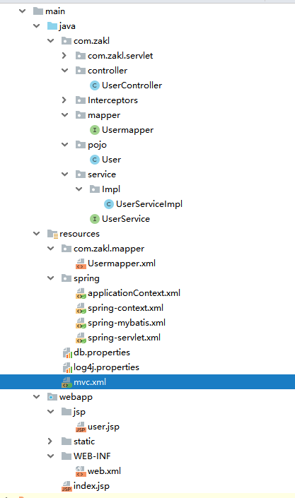

# SSM整合

## 项目结构图



#### 所需依赖

```xml
   <dependencies>
        <dependency>
            <groupId>junit</groupId>
            <artifactId>junit</artifactId>
            <version>4.11</version>
            <scope>test</scope>
        </dependency>

        <!-- https://mvnrepository.com/artifact/org.springframework/spring-webmvc -->
        <dependency>
            <groupId>org.springframework</groupId>
            <artifactId>spring-webmvc</artifactId>
            <version>5.1.1.RELEASE</version>
        </dependency>
        <!-- https://mvnrepository.com/artifact/javax.servlet/javax.servlet-api -->
        <dependency>
            <groupId>javax.servlet</groupId>
            <artifactId>javax.servlet-api</artifactId>
            <version>3.1.0</version>
            <scope>provided</scope>
        </dependency>
        <!-- https://mvnrepository.com/artifact/jstl/jstl -->
        <dependency>
            <groupId>jstl</groupId>
            <artifactId>jstl</artifactId>
            <version>1.2</version>
        </dependency>

        <!-- 添加jason依赖包-->
        <!-- https://mvnrepository.com/artifact/com.fasterxml.jackson.core/jackson-core -->
        <dependency>
            <groupId>com.fasterxml.jackson.core</groupId>
            <artifactId>jackson-core</artifactId>
            <version>2.9.7</version>
        </dependency>

        <!-- https://mvnrepository.com/artifact/com.fasterxml.jackson.core/jackson-databind -->
        <dependency>
            <groupId>com.fasterxml.jackson.core</groupId>
            <artifactId>jackson-databind</artifactId>
            <version>2.9.7</version>
        </dependency>

        <!-- https://mvnrepository.com/artifact/com.fasterxml.jackson.core/jackson-annotations -->
        <dependency>
            <groupId>com.fasterxml.jackson.core</groupId>
            <artifactId>jackson-annotations</artifactId>
            <version>2.9.7</version>
        </dependency>

        <!-- https://mvnrepository.com/artifact/net.sf.json-lib/json-lib -->
        <dependency>
            <groupId>net.sf.json-lib</groupId>
            <artifactId>json-lib</artifactId>
            <version>2.4</version>
        </dependency>

        <!-- 添加处理json为javabean-->
        <!-- https://mvnrepository.com/artifact/org.codehaus.jackson/jackson-core-asl -->
        <dependency>
            <groupId>org.codehaus.jackson</groupId>
            <artifactId>jackson-core-asl</artifactId>
            <version>1.9.13</version>
        </dependency>

        <!-- https://mvnrepository.com/artifact/org.codehaus.jackson/jackson-mapper-asl -->
        <dependency>
            <groupId>org.codehaus.jackson</groupId>
            <artifactId>jackson-mapper-asl</artifactId>
            <version>1.9.13</version>
        </dependency>

        <!-- https://mvnrepository.com/artifact/com.fasterxml.jackson.dataformat/jackson-dataformat-cbor -->
        <dependency>
            <groupId>com.fasterxml.jackson.dataformat</groupId>
            <artifactId>jackson-dataformat-cbor</artifactId>
            <version>2.9.7</version>
        </dependency>

        <!--&lt;!&ndash;处理xml返回类型 &ndash;&gt;
        &lt;!&ndash; https://mvnrepository.com/artifact/com.fasterxml.jackson.dataformat/jackson-dataformat-xml &ndash;&gt;
        <dependency>
            <groupId>com.fasterxml.jackson.dataformat</groupId>
            <artifactId>jackson-dataformat-xml</artifactId>
            <version>2.9.6</version>
        </dependency>-->
        <!-- https://mvnrepository.com/artifact/commons-fileupload/commons-fileupload -->
        <dependency>
            <groupId>commons-fileupload</groupId>
            <artifactId>commons-fileupload</artifactId>
            <version>1.3.3</version>
        </dependency>

        <dependency>
            <groupId>log4j</groupId>
            <artifactId>log4j</artifactId>
            <version>1.2.17</version>
        </dependency>

        <!--连接池-->
        <dependency>
            <groupId>com.mchange</groupId>
            <artifactId>c3p0</artifactId>
            <version>0.9.5.2</version>
        </dependency>

        <dependency>
            <groupId>mysql</groupId>
            <artifactId>mysql-connector-java</artifactId>
            <version>8.0.13</version>
        </dependency>

        <!-- spring依赖-->
        <!-- https://mvnrepository.com/artifact/org.springframework/spring-context -->
        <dependency>
            <groupId>org.springframework</groupId>
            <artifactId>spring-context</artifactId>
            <version>5.1.3.RELEASE</version>
        </dependency>

        <!-- https://mvnrepository.com/artifact/org.springframework/spring-core -->
        <dependency>
            <groupId>org.springframework</groupId>
            <artifactId>spring-core</artifactId>
            <version>5.1.3.RELEASE</version>
        </dependency>

        <!-- https://mvnrepository.com/artifact/org.springframework/spring-beans -->
        <dependency>
            <groupId>org.springframework</groupId>
            <artifactId>spring-beans</artifactId>
            <version>5.1.3.RELEASE</version>
        </dependency>

        <!-- https://mvnrepository.com/artifact/org.springframework/spring-context-support -->
        <dependency>
            <groupId>org.springframework</groupId>
            <artifactId>spring-context-support</artifactId>
            <version>5.1.3.RELEASE</version>
        </dependency>

        <!-- https://mvnrepository.com/artifact/org.springframework/spring-web -->
        <dependency>
            <groupId>org.springframework</groupId>
            <artifactId>spring-web</artifactId>
            <version>5.1.3.RELEASE</version>
        </dependency>

        <!-- https://mvnrepository.com/artifact/org.springframework/spring-aspects -->
        <dependency>
            <groupId>org.springframework</groupId>
            <artifactId>spring-aspects</artifactId>
            <version>5.1.3.RELEASE</version>
        </dependency>

        <!-- https://mvnrepository.com/artifact/org.springframework/spring-jdbc -->
        <dependency>
            <groupId>org.springframework</groupId>
            <artifactId>spring-jdbc</artifactId>
            <version>5.1.3.RELEASE</version>
        </dependency>
        <!-- https://mvnrepository.com/artifact/org.springframework/spring-tx -->
        <dependency>
            <groupId>org.springframework</groupId>
            <artifactId>spring-tx</artifactId>
            <version>5.1.3.RELEASE</version>
        </dependency>
        <!--持久化层-->
        <!-- https://mvnrepository.com/artifact/org.mybatis/mybatis -->
        <dependency>
            <groupId>org.mybatis</groupId>
            <artifactId>mybatis</artifactId>
            <version>3.4.1</version>
        </dependency>

      <!--   https://mvnrepository.com/artifact/org.slf4j/slf4j-api
        <dependency>
            <groupId>org.slf4j</groupId>
            <artifactId>slf4j-api</artifactId>
            <version>1.7.12</version>
        </dependency>

        &lt;!&ndash; https://mvnrepository.com/artifact/org.slf4j/slf4j-log4j12 &ndash;&gt;
        <dependency>
            <groupId>org.slf4j</groupId>
            <artifactId>slf4j-log4j12</artifactId>
            <version>1.7.12</version>
            <scope>test</scope>
        </dependency>-->
        <!--mybatis与spring整合-->
        <!-- https://mvnrepository.com/artifact/org.mybatis/mybatis-spring -->
        <dependency>
            <groupId>org.mybatis</groupId>
            <artifactId>mybatis-spring</artifactId>
            <version>1.3.0</version>
        </dependency>

        <!-- https://mvnrepository.com/artifact/javax.servlet.jsp/javax.servlet.jsp-api -->
        <dependency>
            <groupId>javax.servlet.jsp</groupId>
            <artifactId>javax.servlet.jsp-api</artifactId>
            <version>2.3.1</version>
            <scope>provided</scope>
        </dependency>

        <!-- https://mvnrepository.com/artifact/javax.servlet.jsp.jstl/jstl -->
        <dependency>
            <groupId>javax.servlet.jsp.jstl</groupId>
            <artifactId>jstl</artifactId>
            <version>1.2</version>
        </dependency>

        <!-- https://mvnrepository.com/artifact/joda-time/joda-time -->
        <dependency>
            <groupId>joda-time</groupId>
            <artifactId>joda-time</artifactId>
            <version>2.10.1</version>
        </dependency>

        <!-- https://mvnrepository.com/artifact/com.github.pagehelper/pagehelper -->
        <dependency>
            <groupId>com.github.pagehelper</groupId>
            <artifactId>pagehelper</artifactId>
            <version>5.1.2</version>
        </dependency>

        <!--分页加密-->
        <!-- https://mvnrepository.com/artifact/commons-codec/commons-codec -->
        <dependency>
            <groupId>commons-codec</groupId>
            <artifactId>commons-codec</artifactId>
            <version>1.11</version>
        </dependency>
    </dependencies>

```

#### web.xml配置

```xml
<context-param>
    <param-name>contextConfigLocation</param-name>
    <param-value>classpath:spring/applicationContext.xml</param-value>
</context-param>
<listener>
    <listener-class>org.springframework.web.context.ContextLoaderListener</listener-class>
</listener>
```


#### applicationContext.xml

```xml
<?xml version="1.0" encoding="UTF-8"?>
<beans xmlns="http://www.springframework.org/schema/beans"
       xmlns:xsi="http://www.w3.org/2001/XMLSchema-instance" xmlns:p="http://www.springframework.org/schema/p"
       xsi:schemaLocation="http://www.springframework.org/schema/beans
                        http://www.springframework.org/schema/beans/spring-beans-2.0.xsd
                        ">
    <import resource="classpath:spring/spring-*.xml"></import>
</beans>
```

#### spring-mybatis.xml

```xml
<?xml version="1.0" encoding="UTF-8"?>
<beans xmlns="http://www.springframework.org/schema/beans"
       xmlns:xsi="http://www.w3.org/2001/XMLSchema-instance" xmlns:p="http://www.springframework.org/schema/p"
       xmlns:aop="http://www.springframework.org/schema/aop"
       xmlns:context="http://www.springframework.org/schema/context"
       xmlns:mvc="http://www.springframework.org/schema/mvc"
       xmlns:tx="http://www.springframework.org/schema/tx"
       xsi:schemaLocation="http://www.springframework.org/schema/beans
                        http://www.springframework.org/schema/beans/spring-beans-2.0.xsd
                        http://www.springframework.org/schema/aop
                        http://www.springframework.org/schema/aop/spring-aop.xsd
                        http://www.springframework.org/schema/context
                        http://www.springframework.org/schema/context/spring-context.xsd
                        http://www.springframework.org/schema/mvc
                        http://www.springframework.org/schema/mvc/spring-mvc-3.0.xsd
                        http://www.springframework.org/schema/tx
                        http://www.springframework.org/schema/tx/spring-tx.xsd http://www.springframework.org/schema/tool http://www.springframework.org/schema/tool/spring-tool.xsd">


    <context:component-scan base-package="com.zakl.mapper">
        <context:exclude-filter type="annotation"
                                expression="org.springframework.stereotype.Controller"></context:exclude-filter>
    </context:component-scan>
    <!-- 引入数据库相关信息的配置文件-->
    <context:property-placeholder location="classpath:db.properties"></context:property-placeholder>
    <bean id="dateSource" class="com.mchange.v2.c3p0.ComboPooledDataSource">
        <property name="driverClass" value="${jdbc.driver}"></property>
        <property name="jdbcUrl" value="${jdbc.url}"></property>
        <property name="user" value="${jdbc.user}"></property>
        <property name="password" value="${jdbc.password}"></property>

        <property name="maxPoolSize" value="30"></property>
        <property name="minPoolSize" value="10"></property>

    </bean>

    <!--整合mybatis -->
    <bean id="sqlSessionFactory" class="org.mybatis.spring.SqlSessionFactoryBean">
        <property name="dataSource" ref="dateSource"></property>
        <!--引入com/zakl/mapper下的.xml文件-->
        <property name="mapperLocations" value="classpath:com/zakl/mapper/**/*.xml"></property>

        <!--&lt;!&ndash;分页插件配置&ndash;&gt;
        <property name="plugins">
            <array>
                <bean class="com.github.pagehelper.PageHelper">
                    <property name="properties">
                        <value>
                            helperDialect=mysql
                            reasonable=true
                            supportMethodsArguments=true
                            params=count=countSql
                            autoRuntimeDialect=true
                        </value>
                    </property>
                </bean>
            </array>
        </property>-->
    </bean>
    <!-- 持久层接口-->
    <bean class="org.mybatis.spring.mapper.MapperScannerConfigurer">
        <property name="basePackage" value="com.zakl.mapper"></property>
        <property name="sqlSessionFactoryBeanName" value="sqlSessionFactory"></property>
    </bean>

    <!--事务管理-->
    <bean id="transactionManager" class="org.springframework.jdbc.datasource.DataSourceTransactionManager">
        <property name="dataSource" ref="dateSource"></property>
    </bean>

    <tx:advice transaction-manager="transactionManager" id="transactionAdvice"></tx:advice>

    <aop:config>
        <aop:pointcut id="txcut" expression="execution(* com.zakl.service..*.*(..))"></aop:pointcut>
        <aop:advisor advice-ref="transactionAdvice" pointcut-ref="txcut"></aop:advisor>
    </aop:config>

    <tx:annotation-driven transaction-manager="transactionManager"></tx:annotation-driven>
</beans>
```

#### spring-context.xml

```xml
<?xml version="1.0" encoding="UTF-8"?>
<beans xmlns="http://www.springframework.org/schema/beans"
       xmlns:xsi="http://www.w3.org/2001/XMLSchema-instance" xmlns:p="http://www.springframework.org/schema/p"
       xmlns:aop="http://www.springframework.org/schema/aop"
       xmlns:context="http://www.springframework.org/schema/context"
       xmlns:mvc="http://www.springframework.org/schema/mvc"
       xmlns:tx="http://www.springframework.org/schema/tx"
       xsi:schemaLocation="http://www.springframework.org/schema/beans
                        http://www.springframework.org/schema/beans/spring-beans-2.0.xsd
                        http://www.springframework.org/schema/aop
                        http://www.springframework.org/schema/aop/spring-aop.xsd
                        http://www.springframework.org/schema/context
                        http://www.springframework.org/schema/context/spring-context.xsd
                        http://www.springframework.org/schema/mvc
                        http://www.springframework.org/schema/mvc/spring-mvc-3.0.xsd
                        http://www.springframework.org/schema/tx
                        http://www.springframework.org/schema/tx/spring-tx.xsd http://www.springframework.org/schema/tool http://www.springframework.org/schema/tool/spring-tool.xsd">

    <!-- spring的基础配置-->
    <!--spring容器注册-->
    <context:annotation-config></context:annotation-config>
    <!--自动扫描配置-->
    <context:component-scan base-package="com.zakl"/>
    <!--激活aop注解的代理-->
    <aop:aspectj-autoproxy/>
    
    <!--消息格式轉換-->
    <bean id="conversionService" class="org.springframework.format.support.FormattingConversionServiceFactoryBean">
        <property name="registerDefaultFormatters" value="false"/>
        <property name="formatters">
            <set>
                <bean class="org.springframework.format.number.NumberFormatAnnotationFormatterFactory"/>
            </set>
        </property>
        <property name="formatterRegistrars">
            <set>
                <bean class="org.springframework.format.datetime.joda.JodaTimeFormatterRegistrar">
                    <property name="dateFormatter">
                        <bean
                            class="org.springframework.format.datetime.joda.DateTimeFormatterFactoryBean">
                            <property name="pattern" value="yyyyMMdd"/>
                        </bean>
                    </property>
                </bean>

            </set>
        </property>
    </bean>

</beans>
```

#### spring-servlet.xml

```xml
<?xml version="1.0" encoding="UTF-8"?>
<beans xmlns="http://www.springframework.org/schema/beans"
       xmlns:xsi="http://www.w3.org/2001/XMLSchema-instance" xmlns:p="http://www.springframework.org/schema/p"
       xmlns:aop="http://www.springframework.org/schema/aop"
       xmlns:context="http://www.springframework.org/schema/context"
       xmlns:mvc="http://www.springframework.org/schema/mvc"
       xmlns:tx="http://www.springframework.org/schema/tx"
       xsi:schemaLocation="http://www.springframework.org/schema/beans
                        http://www.springframework.org/schema/beans/spring-beans-2.0.xsd
                        http://www.springframework.org/schema/aop
                        http://www.springframework.org/schema/aop/spring-aop.xsd
                        http://www.springframework.org/schema/context
                        http://www.springframework.org/schema/context/spring-context.xsd
                        http://www.springframework.org/schema/mvc
                        http://www.springframework.org/schema/mvc/spring-mvc-3.0.xsd
                        http://www.springframework.org/schema/tx
                        http://www.springframework.org/schema/tx/spring-tx.xsd http://www.springframework.org/schema/tool http://www.springframework.org/schema/tool/spring-tool.xsd">

    <!--启动注解
        排除了service注解
        -->
    <context:component-scan base-package="com.zakl">
        <context:exclude-filter type="annotation" expression="org.springframework.stereotype.Service"></context:exclude-filter>
    </context:component-scan>

    <!--配置视图解析器-->
    <bean class="org.springframework.web.servlet.view.InternalResourceViewResolver">
        <!--前綴-->
        <property name="prefix" value="/jsp/"></property>
        <!--後綴-->
        <property name="suffix" value=".jsp"></property>
    </bean>
    <!--添加mvc驱动-->
    <mvc:annotation-driven>
        <!--配置消息转换器以支持Json的使用-->
        <mvc:message-converters>
            <bean class="org.springframework.http.converter.StringHttpMessageConverter">
                <property name="supportedMediaTypes">
                    <list>
                        <value>application/json;charset=UTF-8</value>
                    </list>
                </property>
            </bean>
        </mvc:message-converters>
    </mvc:annotation-driven>

    <bean class="org.springframework.web.servlet.mvc.method.annotation.RequestMappingHandlerAdapter">
        <property name="messageConverters">
            <list>
                <bean class="org.springframework.http.converter.StringHttpMessageConverter">
                    <property name="supportedMediaTypes">
                        <list>
                            <value>
                                text/html;charst=UTF-8
                            </value>
                            <value>
                                application/json;charst=UTF-8
                            </value>
                        </list>
                    </property>
                </bean>
                <bean class="org.springframework.http.converter.cbor.MappingJackson2CborHttpMessageConverter">
                    <property name="supportedMediaTypes">
                        <list>
                            <value>
                                text/html;charst=UTF-8
                            </value>
                            <value>
                                application/json;charst=UTF-8
                            </value>
                        </list>
                    </property>
                </bean>
            </list>
        </property>
    </bean>
    <bean id="mutlipartResolver" class="org.springframework.web.multipart.commons.CommonsMultipartResolver">
        <property name="maxUploadSize" value="5400000000"></property>
        <property name="defaultEncoding" value="UTF-8"></property>
    </bean>

</beans>
```
