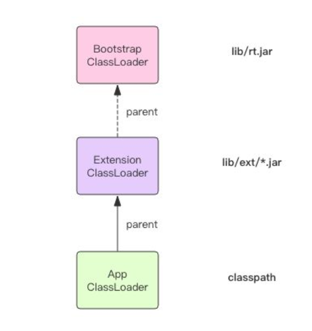

#  Jvm


## 类加载：

+ 加载：
  + 查找并加载类的二进制数据,将类的.class文件中的二进制数据读入到内存中，将其放在运行时数据区的，然后在内存创建一个java.lang.class对象用来封装类在方法区内的数据结构。
  + 加载方式：
    + 从本地系统中直接加载
    + 通过网络下载的.class文件
    + 从zip，jar等归档文件中加载.class文件
    + 将java源文件动态编译为.class文件(反射，jsp等)
  + 用ClassLoader加载类，是不会导致类的初始化（也就是说不会执行**<clinit>**方法）.Class.forName(...)加载类，不但会将类加载，还会执行会执行类的初始化方法.

    + 注意: 并非所有的类都会拥有一个**<clinit>**方法, 满足下列条件之一的类不会拥有**<clinit>**方法:
      1. 该类既没有声明任何类变量，也没有静态初始化语句;
      2. 该类声明了类变量，但没有明确使用类变量初始化语句或静态初始化语句初始化;
      3. 该类仅包含静态 final 变量的类变量初始化语句，并且类变量初始化语句是编译时常量表达式;
+ 连接：
  + 验证：确保被加载类的正确性
    + 类文件的结构检查
    + 语义检查
    + 字节码验证
    + 二进制兼容性的验证
  + 准备：为类的静态变量分配内存，并将其初始化为默认值
  + 解析：把类中符号引用转换为直接引用(将字符串(类和接口的全限定名,字段名称和描述符,方法名称和描述符)转换为直接地址)
+ 初始化：为类的静态变量赋于正确的初始值

+ 类的使用和卸载：
  + 使用
  + 卸载(卸载后如果需要再使用需要重新被类加载器加载)
  
+ 类的使用方式
  + 主动使用(在首次主动使用的时候才初始化目标类)：
    + 创建类的实例
    + 访问某个类或接口的静态变量，或者对该静态变量赋值
    + 调用类的静态方法
    + 反射(Class.forName("com.test.Test"))
    + 初始化一个类的子类
      + 此条规则不适用于接口(Interface)
      + 在初始化一个类时，并不会先初始化他所实现的接口
      + 在初始化一个接口时，并不会先初始化它的父接口
      + 只有当程序首次使用特定接口的静态变量时，才会导致该接口的初始化。
    + JVM启动时被表明为启动类的类
  + 被动使用(并不会导致类的**初始化**)

  ```java
  public class MyTest1 {
      public static void main(String[] args) {
          System.out.println(Child.str);
        	//对与Child来说Child类是被动使用，使用的str变量是其父类所拥有的，所以这里是主动使用父类，被动使用字类
      }
  }
  
  class Parent {
      public static String str = "Hello World";
      static {
          System.out.println("Parent");
      }
  }
  class Child extends Parent {
      public static String str2 = "Fuck";
      static {
          System.out.println("Child");
      }
  }
  
  //output
  Parent 
  HelloWorld 
  
  ```


### ClassLoader

+ **数组类型的对象加载是在运行时被classloader动态创建生成的**
+ 如果数组中的对象是原生数据类型(int,long...) ,则该对象的classloader为null
+ 自定义类加载器通过拓展类加载器来拓展JVM动态加载类的能力(通过双亲委托机制)
+ **AppClassLoader和ExtensionClassLoader是由BootStrapClassLoader(启动类加载器)加载**(由CPP编写,无需被类加载(破解先有鸡还是先有蛋的问题 ))
  + 启动类加载器还会负责加载JRE正常运行所需要的基本组件,这包括java.util与java.lang包中的类等等。
+ 类加载器通常会被安全管理器所使用来确保类加载过程的安全。
+ 类加载器的命名空间：

  + 每个类加载器都有自己的命名空间, <font color='red'> **命名空间由该加载器及所有父类加载器所加载的类组成** </font>
  + 同一个加载器加载的类是相互可见的(同一命名空间)
  + <font color="red">在同一个命名空间中，不会出现类的完整名字(包括类的包名)相同的两个类</font>
  + <font color='red'>在不同的命名空间中，有可能会出现类的完整名字(包括类的包名)相同的两个类</font>
  + **子加载器所加载的类能够访问到父加载器所加载的类**
  + **父加载器所加载的类无法访问到字加载器所加载的类**
+ 线程上下文类加载器-context Classloader
  + 线程上下文类加载器就是当前线程的Current Classloader.
  + 父ClassLoader可以使用当前线程Thead.currentThread().getContextClassLoader()所指定的classloader加载的类。间接改变了父ClassLoader不能使用子ClassLoader或是其他没有直接父子关系的ClassLoader加载的类的情况,即改变了双亲委托模型。
  + 在双亲委托模型下,类加载是由下至上的，即下层的类加载器会委托上层进行加载.但是对于SPI(Service provider Interface)来说,有些接口是Java核心库所提供的,而Java核心库是由启动类加载器来加载的，而这些SPI接口的实现来自于不同的Jar包(厂商提供),Java的启动类加载器是不会加载其他来源的Jar包，这样的传统的双亲委托模型就无法满足SPI的要求。而通过给当前线程设置上下文类加载器，就可以设置上下文类加载来实现对于接口实现类的加载

## 双亲委托机制与自定义类加载器

+ ## 双亲委派

  +  AppClassLoader 只负责加载 Classpath 下面的类库，如果遇到没有加载的系统类库怎么办，AppClassLoader 必须将系统类库的加载工作交给 BootstrapClassLoader 和 ExtensionClassLoader 来做，这就是我们常说的「双亲委派」。
     + 
     + AppClassLoader 在加载一个未知的类名时，它并不是立即去搜寻 Classpath，它会首先将这个类名称交给 ExtensionClassLoader 来加载，如果 ExtensionClassLoader 可以加载，那么 AppClassLoader 就不用麻烦了。否则它就会搜索 Classpath 。而 ExtensionClassLoader 在加载一个未知的类名时，它也并不是立即搜寻 ext 路径，它会首先将类名称交给 BootstrapClassLoader 来加载，如果 BootstrapClassLoader 可以加载，那么 ExtensionClassLoader 也就不用麻烦了。否则它就会搜索 ext 路径下的 jar 包。这三个 ClassLoader 之间形成了级联的父子关系，每个 ClassLoader 都很懒，尽量把工作交给父亲做，父亲干不了了自己才会干。每个 ClassLoader 对象内部都会有一个 parent 属性指向它的父加载器。
     + 值得注意的是ExtensionClassLoader不会直接加载.class文件而是加载.jar文件。

+ 使用双亲委托机制的好处:

  1. 确保Java核心库的类型安全:所有的java应用都至少会引用java.lang.Object类，也就是在运行期，java.lang.Object这个类会被加载到Java虚拟机中，如果这个过程是由自定义类加载器完成，那么就有可能在jvm中存在多个版本的Java.lang.Object类，且因为类加载器命名空间的原因，导致这些类互相不可见。而使用了双亲委托机制则保证了java的核心类库是由同一个类加载器创建，互相之间具有可见性。
  2. 确保Java核心类库所提供的类不会被自定义的类所替代
  3. 不同的类加载器可以为相同的限定类名(binary name) 的类提供额外的命名空间。相同名称的类可以并存在Java虚拟机中，只需要用不同的类加载器来加载他们即可，不同的类加载器所加载的类是互不可见的，相当于在jvm虚拟机中创建了不同的java类空间。

+ 自定义类加载器与双亲委托机制:

  + ```java
    package com.zakl;
    
    import java.io.*;
    import java.lang.reflect.InvocationTargetException;
    
    public class MyClassLoader extends ClassLoader {
        private String classLoaderName;
    
        private String path;
        private final String fileExtension = ".class";
    
    
        public MyClassLoader(String classLoaderName) {
            super();
            this.classLoaderName = classLoaderName;
        }
    
        public MyClassLoader(ClassLoader parent, String classLoaderName) {
            super(parent);
            this.classLoaderName = classLoaderName;
        }
    
    
        @Override
        protected Class<?> findClass(String name) {
            System.out.printf("%s loaded by %s \n", name, classLoaderName);
            byte[] bytes = this.loadClassData(name);
            return defineClass(name, bytes, 0, bytes.length);
        }
    
        private byte[] loadClassData(String className) {
            InputStream is = null;
            byte[] data = null;
            ByteArrayOutputStream baos = null;
    
            try {
                className = className.replace(".", "//");
                is = new FileInputStream(new File(this.path + className + this.fileExtension));
                baos = new ByteArrayOutputStream();
                int ch;
                while (-1 != (ch = is.read())) {
                    baos.write(ch);
                }
                data = baos.toByteArray();
            } catch (IOException e) {
                e.printStackTrace();
            } finally {
                try {
                    is.close();
                    baos.close();
                } catch (IOException e) {
                    e.printStackTrace();
                }
            }
            return data;
        }
    
        @Override
        public String toString() {
            return "MyClassLoader{" +
                    "classLoaderName='" + classLoaderName + '\'' +
                    ", fileExtension='" + fileExtension + '\'' +
                    '}';
        }
    
        public void setPath(String path) {
            this.path = path;
        }
    
        public static void test(ClassLoader classLoader) throws ClassNotFoundException, NoSuchMethodException, IllegalAccessException, InvocationTargetException, InstantiationException {
            Class<?> c = classLoader.loadClass("com.zakl.Main");
            Object o = c.getDeclaredConstructor().newInstance();
            System.out.println(o);
            System.out.println(o.getClass().getClassLoader());
        }
    
        public static void main(String[] args) throws ClassNotFoundException, NoSuchMethodException, InvocationTargetException, InstantiationException, IllegalAccessException {
            MyClassLoader loader1 = new MyClassLoader("myClassLoader1");
            loader1.setPath("C:\\Users\\Administrator\\Desktop\\");
            test(loader1);
            System.out.println();
            /*---------------使用loader1作为loader2的父加载器------------------*/
            /*---------------loader1是loader2的父加载器,根据双亲委托模型,目标类会被loader2的父类加载，即loader1,因为类被loader1加载过一次,所以直接从loader1中取出已经被加载的Main.class就好*/
            MyClassLoader loader2 = new MyClassLoader(loader1, "myClassLoader2");
            loader2.setPath("C:\\Users\\Administrator\\Desktop\\");
            test(loader2);
            System.out.println();
    
            /*---------------不同命名空间的类加载器-----------------*/
    
            MyClassLoader loader3 = new MyClassLoader("myClassLoader3");
            loader3.setPath("C:\\Users\\Administrator\\Desktop\\");
            test(loader3);
        }
    }
    //保留代码接口，即原编译位置的Main.class(D:\Projects\Jvm_letter\out\production\Jvm_letter\com\zakl\Main.class)
    //运行代码输出结果为:
    com.zakl.Main@2f4d3709
    jdk.internal.loader.ClassLoaders$AppClassLoader@3fee733d
    
    com.zakl.Main@1d81eb93
    jdk.internal.loader.ClassLoaders$AppClassLoader@3fee733d
    
    com.zakl.Main@34a245ab
    jdk.internal.loader.ClassLoaders$AppClassLoader@3fee733d
    以上结果是因为双亲委托机制,都交给了父类,所以是加载了一次
        
    //使用自定义类加载加载的情况以及,主动设置父类加载器，加载的代码位置为C:\\Users\\Administrator\\Desktop\\com\\zakl\\Main.class
    //运行代码输出结果为:
    com.zakl.Main loaded by myClassLoader1 
    com.zakl.Main@37bba400
    MyClassLoader{classLoaderName='myClassLoader1', fileExtension='.class'}
    
    com.zakl.Main@31cefde0
    MyClassLoader{classLoaderName='myClassLoader1', fileExtension='.class'}
    
    com.zakl.Main loaded by myClassLoader3 
    com.zakl.Main@17f052a3
    MyClassLoader{classLoaderName='myClassLoader3', fileExtension='.class'}
    
    
    ```
    
  + 
  
+ 类的卸载：

  + 当类被加载,连接和初始化后,它的生命周期就开始了.当代表类的class对象不在被引用，即不可触及时,类对象就会结束生命周期，类在方法去中的数据也会被卸载，从而结束类的生命周期。
  + 一个类合适结束生命周期，取决于代表它的Class对象何时结束生命周期.
  + 不可被卸载的类:由java虚拟机自带的类加载器(根加载器/扩展类加载器/系统类加载器)所加载的类，在虚拟机的生命周期中，始终不会被卸载。jvm始终会引用这些类加载器,这些类加载器会始终引用他们所加载的Class对象，因此这些**Class对象**始终是可触及的。 
  + 可被卸载的类:用户自定义的类加载器加载的类
  + 卸载实例:
    + 