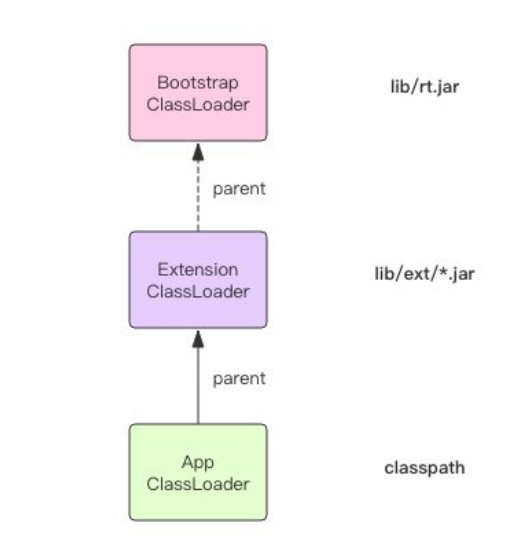
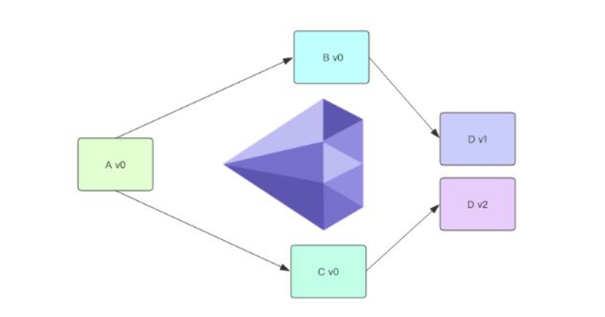
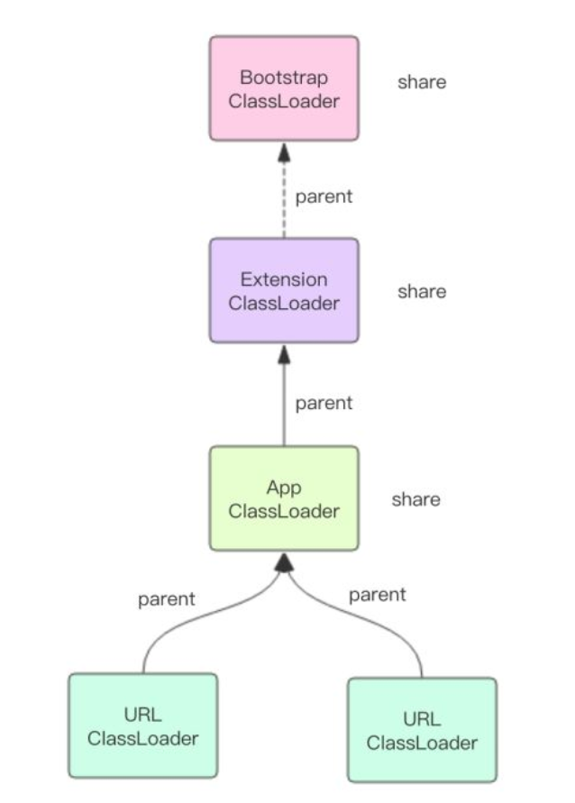

Java面试通关手册（Java学习指南）github地址（欢迎star和pull）：[https://github.com/Snailclimb/Java_Guide](https://github.com/Snailclimb/Java_Guide)


下面是按jvm虚拟机知识点分章节总结的一些jvm学习与面试相关的一些东西。一般作为Java程序员在面试的时候一般会问的大多就是**Java内存区域、虚拟机垃圾算法、虚拟垃圾收集器、JVM内存管理**这些问题了。这些内容参考周的《深入理解Java虚拟机》中第二章和第三章就足够了对应下面的[深入理解虚拟机之Java内存区域：](https://link.zhihu.com/?target=https%3A//mp.weixin.qq.com/s%3F__biz%3DMzU4NDQ4MzU5OA%3D%3D%26mid%3D2247483910%26idx%3D1%26sn%3D246f39051a85fc312577499691fba89f%26chksm%3Dfd985467caefdd71f9a7c275952be34484b14f9e092723c19bd4ef557c324169ed084f868bdb%23rd)和[深入理解虚拟机之垃圾回收](https://link.zhihu.com/?target=https%3A//mp.weixin.qq.com/s%3F__biz%3DMzU4NDQ4MzU5OA%3D%3D%26mid%3D2247483914%26idx%3D1%26sn%3D9aa157d4a1570962c39783cdeec7e539%26chksm%3Dfd98546bcaefdd7d9f61cd356e5584e56b64e234c3a403ed93cb6d4dde07a505e3000fd0c427%23rd)这两篇文章。


> ### 常见面试题

[深入理解虚拟机之Java内存区域：](https://link.zhihu.com/?target=https%3A//mp.weixin.qq.com/s%3F__biz%3DMzU4NDQ4MzU5OA%3D%3D%26mid%3D2247483910%26idx%3D1%26sn%3D246f39051a85fc312577499691fba89f%26chksm%3Dfd985467caefdd71f9a7c275952be34484b14f9e092723c19bd4ef557c324169ed084f868bdb%23rd)

1. 介绍下Java内存区域（运行时数据区）。

2. 对象的访问定位的两种方式。


[深入理解虚拟机之垃圾回收](https://link.zhihu.com/?target=https%3A//mp.weixin.qq.com/s%3F__biz%3DMzU4NDQ4MzU5OA%3D%3D%26mid%3D2247483914%26idx%3D1%26sn%3D9aa157d4a1570962c39783cdeec7e539%26chksm%3Dfd98546bcaefdd7d9f61cd356e5584e56b64e234c3a403ed93cb6d4dde07a505e3000fd0c427%23rd)

1. 如何判断对象是否死亡（两种方法）。

2. 简单的介绍一下强引用、软引用、弱引用、虚引用（虚引用与软引用和弱引用的区别、使用软引用能带来的好处）。

3. 垃圾收集有哪些算法，各自的特点？

4. HotSpot为什么要分为新生代和老年代？

5. 常见的垃圾回收器有那些？

6. 介绍一下CMS,G1收集器。

7. Minor Gc和Full GC 有什么不同呢？


[虚拟机性能监控和故障处理工具](https://link.zhihu.com/?target=https%3A//mp.weixin.qq.com/s%3F__biz%3DMzU4NDQ4MzU5OA%3D%3D%26mid%3D2247483922%26idx%3D1%26sn%3D0695ff4c2700ccebb8fbc39011866bd8%26chksm%3Dfd985473caefdd6583eb42dbbc7f01918dc6827c808292bb74a5b6333e3d526c097c9351e694%23rd)

1. JVM调优的常见命令行工具有哪些？

[深入理解虚拟机之类文件结构](https://link.zhihu.com/?target=https%3A//mp.weixin.qq.com/s%3F__biz%3DMzU4NDQ4MzU5OA%3D%3D%26mid%3D2247483926%26idx%3D1%26sn%3D224413da998f7e024f7b8d87397934d9%26chksm%3Dfd985477caefdd61a2fe1a3f0be29e057082252e579332f5b6d9072a150b838cefe2c47b6e5a%23rd)

1. 简单介绍一下Class类文件结构（常量池主要存放的是那两大常量？Class文件的继承关系是如何确定的？字段表、方法表、属性表主要包含那些信息？）

[深入理解虚拟机之虚拟机类加载机制](http://mp.weixin.qq.com/s?__biz=MzU4NDQ4MzU5OA==&mid=2247483934&idx=1&sn=f247f9bee4e240f5e7fac25659da3bff&chksm=fd98547fcaefdd6996e1a7046e03f29df9308bdf82ceeffd111112766ffd3187892700f64b40#rd)

1. 简单说说类加载过程，里面执行了哪些操作？

2. 对类加载器有了解吗？

3. 什么是双亲委派模型？

4. 双亲委派模型的工作过程以及使用它的好处。


## JVM_classLoader

+ BootstrapClassLoader
  +  负责加载 JVM 运行时核心类，这些类位于 JAVA_HOME/lib/rt.jar 文件中，我们常用内置库 java.xxx.* 都在里面，比如 java.util.*、java.io.*、java.nio.*、java.lang.* 等等。这个 ClassLoader 比较特殊，它是由 C 代码实现的，我们将它称之为「根加载器」。
+ ExtensionClassLoader
  +  负责加载 JVM 扩展类，比如 swing 系列、内置的 js 引擎、xml 解析器 等等，这些库名通常以 javax 开头，它们的 jar 包位于 JAVA_HOME/lib/ext/*.jar 中，有很多 jar 包。
+ AppClassLoader
  +  才是直接面向我们用户的加载器，它会加载 Classpath 环境变量里定义的路径中的 jar 包和目录。我们自己编写的代码以及使用的第三方 jar 包通常都是由它来加载的。AppClassLoader 可以由 ClassLoader 类提供的静态方法 getSystemClassLoader() 得到，它就是我们所说的「系统类加载器」，我们用户平时编写的类代码通常都是由它加载的。当我们的 main 方法执行的时候，这第一个用户类的加载器就是 AppClassLoader。
+ URLClassLoader
  + 那些位于网络上静态文件服务器提供的 jar 包和 class文件，jdk 内置了一个 URLClassLoader，用户只需要传递规范的网络路径给构造器，就可以使用 URLClassLoader 来加载远程类库了。URLClassLoader 不但可以加载远程类库，还可以加载本地路径的类库，取决于构造器中不同的地址形式。ExtensionClassLoader 和 AppClassLoader 都是 URLClassLoader 的子类，它们都是从本地文件系统里加载类库。

## 双亲委派

+  AppClassLoader 只负责加载 Classpath 下面的类库，如果遇到没有加载的系统类库怎么办，AppClassLoader 必须将系统类库的加载工作交给 BootstrapClassLoader 和 ExtensionClassLoader 来做，这就是我们常说的「双亲委派」。
  + 
  + AppClassLoader 在加载一个未知的类名时，它并不是立即去搜寻 Classpath，它会首先将这个类名称交给 ExtensionClassLoader 来加载，如果 ExtensionClassLoader 可以加载，那么 AppClassLoader 就不用麻烦了。否则它就会搜索 Classpath 。而 ExtensionClassLoader 在加载一个未知的类名时，它也并不是立即搜寻 ext 路径，它会首先将类名称交给 BootstrapClassLoader 来加载，如果 BootstrapClassLoader 可以加载，那么 ExtensionClassLoader 也就不用麻烦了。否则它就会搜索 ext 路径下的 jar 包。这三个 ClassLoader 之间形成了级联的父子关系，每个 ClassLoader 都很懒，尽量把工作交给父亲做，父亲干不了了自己才会干。每个 ClassLoader 对象内部都会有一个 parent 属性指向它的父加载器。

## **Class.forName**

当我们在使用 jdbc 驱动时，经常会使用 Class.forName 方法来动态加载驱动类。

```java
Class.forName("com.mysql.cj.jdbc.Driver");
```

其原理是 mysql 驱动的 Driver 类里有一个静态代码块，它会在 Driver 类被加载的时候执行。这个静态代码块会将 mysql 驱动实例注册到全局的 jdbc 驱动管理器里。

```java
class Driver {
  static {
    try {
       java.sql.DriverManager.registerDriver(new Driver());
    } catch (SQLException E) {
       throw new RuntimeException("Can't register driver!");
    }
  }
  ...
}
```

forName 方法同样也是使用调用者 Class 对象的 ClassLoader 来加载目标类。不过 forName 还提供了多参数版本，可以指定使用哪个 ClassLoader 来加载

```java
Class<?> forName(String name, boolean initialize, ClassLoader cl)
```

通过这种形式的 forName 方法可以突破内置加载器的限制，通过使用自定类加载器允许我们自由加载其它任意来源的类库。根据 ClassLoader 的传递性，目标类库传递引用到的其它类库也将会使用自定义加载器加载。

```java
Class.forName("com.mysql.cj.jdbc.Driver");
```


## **自定义加载器**

ClassLoader 里面有三个重要的方法 loadClass()、findClass() 和 defineClass()。

loadClass() 方法是加载目标类的入口，它首先会查找当前 ClassLoader 以及它的双亲里面是否已经加载了目标类，如果没有找到就会让双亲尝试加载，如果双亲都加载不了，就会调用 findClass() 让自定义加载器自己来加载目标类。ClassLoader 的 findClass() 方法是需要子类来覆盖的，不同的加载器将使用不同的逻辑来获取目标类的字节码。拿到这个字节码之后再调用 defineClass() 方法将字节码转换成 Class 对象。下面我使用伪代码表示一下基本过程

```java
class ClassLoader {

  // 加载入口，定义了双亲委派规则
  Class loadClass(String name) {
    // 是否已经加载了
    Class t = this.findFromLoaded(name);
    if(t == null) {
      // 交给双亲
      t = this.parent.loadClass(name)
    }
    if(t == null) {
      // 双亲都不行，只能靠自己了
      t = this.findClass(name);
    }
    return t;
  }

  // 交给子类自己去实现
  Class findClass(String name) {
    throw ClassNotFoundException();
  }

  // 组装Class对象
  Class defineClass(byte[] code, String name) {
    return buildClassFromCode(code, name);
  }
}

//自定义类加载器
class CustomClassLoader extends ClassLoader {

  Class findClass(String name) {
    // 寻找字节码
    byte[] code = findCodeFromSomewhere(name);
    // 组装Class对象
    return this.defineClass(code, name);
  }
}
```

自定义类加载器不易破坏双亲委派规则，不要轻易覆盖 loadClass 方法。否则可能会导致自定义加载器无法加载内置的核心类库。在使用自定义加载器时，要明确好它的父加载器是谁，将父加载器通过子类的构造器传入。如果父类加载器是 null，那就表示父加载器是「根加载器」。

```java
// ClassLoader 构造器
protected ClassLoader(String name, ClassLoader parent);
```

双亲委派规则可能会变成三亲委派，四亲委派，取决于你使用的父加载器是谁，它会一直递归委派到根加载器。

## **Class.forName vs ClassLoader.loadClass**

这两个方法都可以用来加载目标类，它们之间有一个小小的区别，那就是 Class.forName() 方法可以获取原生类型的 Class，而 ClassLoader.loadClass() 则会报错。

```java
Class<?> x = Class.forName("ClassA"); //会执行static代码块 初始化static变量
//Class.forName(className,true,classloader); true表示进行链接 进行<clint/>
System.out.println(x);


//不会执行static代码块 也不会初始化static变量
x = ClassLoader.getSystemClassLoader().loadClass("ClassA");
//ClassLoader.loadClass(className,false); false表示不进行链接
System.out.println(x);

---------------------
class ClassA

Exception in thread "main" java.lang.ClassNotFoundException: ClassA
...
```


## **钻石依赖**

项目管理上有一个著名的概念叫着「钻石依赖」，是指软件依赖导致同一个软件包的两个版本需要共存而不能冲突。



我们平时使用的 maven 是这样解决钻石依赖的，它会从多个冲突的版本中选择一个来使用，如果不同的版本之间兼容性很糟糕，那么程序将无法正常编译运行。Maven 这种形式叫「扁平化」依赖管理。

使用 ClassLoader 可以解决钻石依赖问题。不同版本的软件包使用不同的 ClassLoader 来加载，**位于不同 ClassLoader 中名称一样的类实际上是不同的类**。下面让我们使用 URLClassLoader 来尝试一个简单的例子，它默认的父加载器是 AppClassLoader

```java
$ cat ~/source/jcl/v1/Dep.java
public class Dep {
    public void print() {
        System.out.println("v1");
    }
}

$ cat ~/source/jcl/v2/Dep.java
public class Dep {
 public void print() {
  System.out.println("v2");
 }
}

$ cat ~/source/jcl/Test.java
public class Test {
    public static void main(String[] args) throws Exception {
        String v1dir = "file:///Users/qianwp/source/jcl/v1/";
        String v2dir = "file:///Users/qianwp/source/jcl/v2/";
        URLClassLoader v1 = new URLClassLoader(new URL[]{new URL(v1dir)});
        URLClassLoader v2 = new URLClassLoader(new URL[]{new URL(v2dir)});

        Class<?> depv1Class = v1.loadClass("Dep");
        Object depv1 = depv1Class.getConstructor().newInstance();
        depv1Class.getMethod("print").invoke(depv1);

        Class<?> depv2Class = v2.loadClass("Dep");
        Object depv2 = depv2Class.getConstructor().newInstance();
        depv2Class.getMethod("print").invoke(depv2);

        System.out.println(depv1Class.equals(depv2Class));
   }
}
```

在运行之前，我们需要对依赖的类库进行编译

```java
$ cd ~/source/jcl/v1
$ javac Dep.java
$ cd ~/source/jcl/v2
$ javac Dep.java
$ cd ~/source/jcl
$ javac Test.java
$ java Test
v1
v2
false
```

在这个例子中如果两个 URLClassLoader 指向的路径是一样的，下面这个表达式还是 false，因为**即使是同样的字节码用不同的 ClassLoader 加载出来的类都不能算同一个类**

```java
depv1Class.equals(depv2Class)
```

我们还可以让两个不同版本的 Dep 类实现同一个接口，这样可以避免使用反射的方式来调用 Dep 类里面的方法。

```java
Class<?> depv1Class = v1.loadClass("Dep");
IPrint depv1 = (IPrint)depv1Class.getConstructor().newInstance();
depv1.print()
```

ClassLoader 固然可以解决依赖冲突问题，不过它也限制了不同软件包的操作界面必须使用反射或接口的方式进行动态调用。Maven 没有这种限制，它依赖于虚拟机的默认懒惰加载策略，运行过程中如果没有显示使用定制的 ClassLoader，那么从头到尾都是在使用 AppClassLoader，而不同版本的同名类必须使用不同的 ClassLoader 加载，所以 Maven 不能完美解决钻石依赖。
如果你想知道有没有开源的包管理工具可以解决钻石依赖的，我推荐你了解一下 sofa-ark，它是蚂蚁金服开源的轻量级类隔离框架。


## **分工与合作**

这里我们重新理解一下 ClassLoader 的意义，它相当于类的命名空间，起到了类隔离的作用。位于同一个 ClassLoader 里面的类名是唯一的，不同的 ClassLoader 可以持有同名的类。ClassLoader 是类名称的容器，是类的沙箱。



不同的 ClassLoader 之间也会有合作，它们之间的合作是通过 parent 属性和双亲委派机制来完成的。parent 具有更高的加载优先级。除此之外，parent 还表达了一种共享关系，**当多个子 ClassLoader 共享同一个 parent 时，那么这个 parent 里面包含的类可以认为是所有子 ClassLoader 共享的**。这也是为什么 BootstrapClassLoader 被所有的类加载器视为祖先加载器，JVM 核心类库自然应该被共享。


## **Thread.contextClassLoader**

如果你稍微阅读过 Thread 的源代码，你会在它的实例字段中发现有一个字段非常特别

```java
class Thread {
  ...
  private ClassLoader contextClassLoader;

  public ClassLoader getContextClassLoader() {
    return contextClassLoader;
  }

  public void setContextClassLoader(ClassLoader cl) {
    this.contextClassLoader = cl;
  }
  ...
}
```

contextClassLoader「线程上下文类加载器」，这究竟是什么东西？

首先 contextClassLoader 是那种需要显示使用的类加载器，如果你没有显示使用它，也就永远不会在任何地方用到它。你可以使用下面这种方式来显示使用它

```java
Thread.currentThread().getContextClassLoader().loadClass(name);
```

这意味着如果你使用 forName(string name) 方法加载目标类，它不会自动使用 contextClassLoader。那些因为代码上的依赖关系而懒惰加载的类也不会自动使用 contextClassLoader来加载。

其次线程的 contextClassLoader 是从父线程那里继承过来的，所谓父线程就是创建了当前线程的线程。程序启动时的 main 线程的 contextClassLoader 就是 AppClassLoader。这意味着如果没有人工去设置，那么所有的线程的 contextClassLoader 都是 AppClassLoader。

那这个 contextClassLoader 究竟是做什么用的？我们要使用前面提到了类加载器分工与合作的原理来解释它的用途。

它可以做到跨线程共享类，只要它们共享同一个 contextClassLoader。父子线程之间会自动传递 contextClassLoader，所以共享起来将是自动化的。

如果不同的线程使用不同的 contextClassLoader，那么不同的线程使用的类就可以隔离开来。

如果我们对业务进行划分，不同的业务使用不同的线程池，线程池内部共享同一个 contextClassLoader，线程池之间使用不同的 contextClassLoader，就可以很好的起到隔离保护的作用，避免类版本冲突。

如果我们不去定制 contextClassLoader，那么所有的线程将会默认使用 AppClassLoader，所有的类都将会是共享的。

线程的 contextClassLoader 使用场合比较罕见，如果上面的逻辑晦涩难懂也不必过于计较。

JDK9 增加了模块功能之后对类加载器的结构设计做了一定程度的修改，不过类加载器的原理还是类似的，作为类的容器，它起到类隔离的作用，同时还需要依靠双亲委派机制来建立不同的类加载器之间的合作关系。
