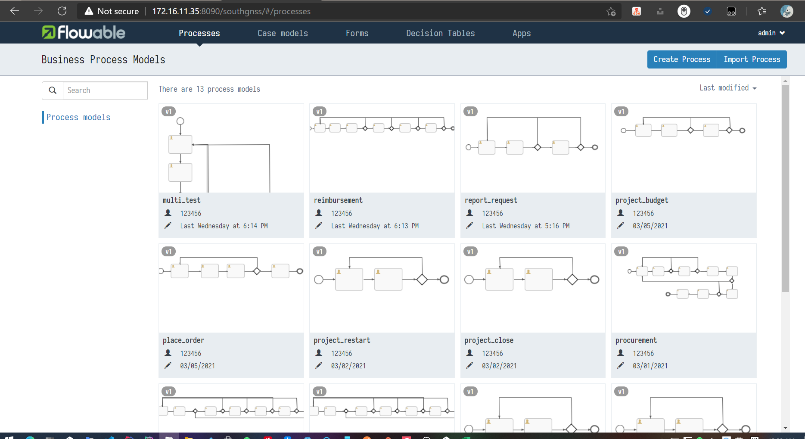

# Flowable 简介与安装使用

+ 简介

  Flowable项目提供了一套核心的开源业务流程引擎，其结构紧凑，效率高。它们为开发人员、系统管理员和业务用户提供了一个工作流和业务流程管理（BPM）平台。

+ 前言:

  在flowable 的官方网站中,提供了flowable的使用方法,这里仅提供链接,如需深入学习的同学,可以根据文档学习使用[快速开始](https://flowable.com/open-source/docs/bpmn/ch02-GettingStarted/)

  工作流的一个使用问题是,表单数据,大多数的工作流框架都提供了表单设计器,通过动态组合表单的功能来实现数据的存储交互,好处的灵活度高,可拓展能力强,缺点也是显而易见的,数据表单被框架所控制者,开发者本身对表单数据不能完全掌控,业务数据交互功能繁杂.基于以上原因,此文档仅描述,使用flowable进行工作流流程设计,节点流转功能,表单数据由开发者自行维护.

+ 流程设计器:

  flowable官方开源框架提供了flowable完成的功能,包含流程设计,表单设计,实例运行等功能,此处我们仅需要流程设计功能,该功能已经被开发者抽取开源:

  本文档目录下也将提供一份开源流程设计器代码实例

  +  github地址:[flowable-modeler_github](https://gitee.com/ZAKL/flowable-modeler-demo)
  + 内网 gitLab地址:[flowable-modeler_gitlab](http://172.16.11.133/production3/flowable/flowable-modeler)

  + 操作使用:

    1. 拉取源代码

    2. 配置yml文件,指定本机数据库

       ```yml
       spring.application.name=flowableDemo
       server.port=8099
       spring.datasource.url=jdbc:postgresql://ip:port/flowableDemo
       spring.datasource.username=root
       spring.datasource.password=123456
       spring.datasource.driver-class-name=
       spring.datasource.type=
       ```

    3. mvn clean&&install

    4. run(进入流程设计界面):
       

+ **将流程设计器绑定在自建项目中**:

  1. **原有项目导入flowable/flowable-modeler 相关依赖包**:

     下方依赖包分别剔除了h2数据库(使用项目自带数据库mysql/pgsql),slf4j门面日志实现

     ````xml
             <!--flowable 工作流相关-->
             <dependency>
                 <groupId>org.flowable</groupId>
                 <artifactId>flowable-spring-boot-starter</artifactId>
                 <version>6.4.0</version>
                 <exclusions>
                     <exclusion>
                         <groupId>com.h2database</groupId>
                         <artifactId>h2</artifactId>
                     </exclusion>
                     <exclusion>
                         <groupId>org.slf4j</groupId>
                         <artifactId>slf4j-api</artifactId>
                     </exclusion>
                     <exclusion>
                         <groupId>org.apache.logging.log4j</groupId>
                         <artifactId>log4j-slf4j-impl</artifactId>
                     </exclusion>
                 </exclusions>
             </dependency>
     
             <!-- flowable-modeler 核心 -->
             <dependency>
                 <groupId>org.flowable</groupId>
                 <artifactId>flowable-ui-modeler-conf</artifactId>
                 <version>>6.4.0</version>
                 <exclusions>
                     <exclusion>
                         <groupId>org.slf4j</groupId>
                         <artifactId>slf4j-api</artifactId>
                     </exclusion>
                     <exclusion>
                         <groupId>org.apache.logging.log4j</groupId>
                         <artifactId>log4j-slf4j-impl</artifactId>
                     </exclusion>
                 </exclusions>
             </dependency>
     ````

  2. **导入流程设计器hack代码**(hack是为了绕过flowable框架的权限验证功能,使流程设计功能能够无需使用flowable的用户管理系统即可正常使用)

     hack代码即为上述开源流程设计器项目主代码

     

  3. **导入流程设计器静态资源**:

     静态资源数据也为上述开源流程设计器中的resources资源

     

  4. **更改配置文件**:

     由于只需要开启flowable的流程设计器与节点流转功能,我们可以将其他不适用的缺省配置关闭,在**propterties**中

     ````yml
     #flowable 配置
     #关闭自动从process文件中部署功能,文档2会提及
     flowable.app.deploy-resources=false
     flowable.idm.enabled=false
     flowable.cmmn.enabled=false
     flowable.form.enabled=false
     flowable.dmn.enabled=false
     flowable.app.enabled=false
     
     # 配置其他信息,包括数据库,项目启动信息
     ````

  5. **启动项目**:

     flowable会在首次启动时生成如下库表,用以保存流程设计信息,和节点流转信息

     

     进入流程设计器页面:
     
     
     
     


​    

​     

  

  

  

  

  

  

  

  

  

