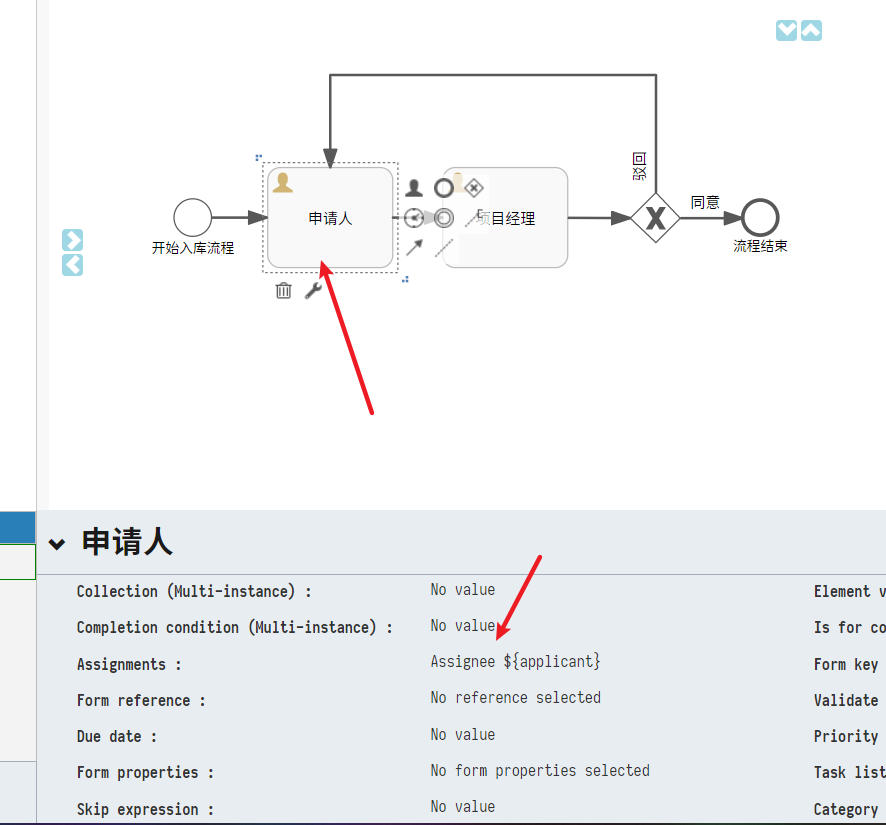
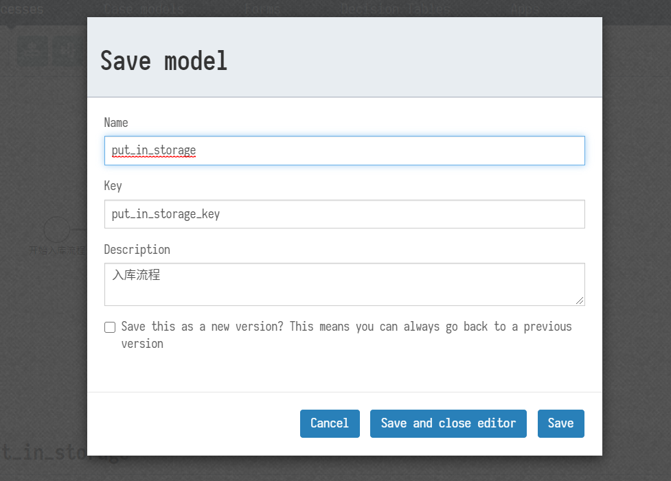
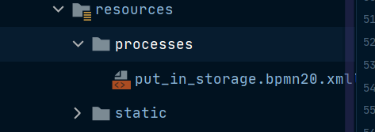

# 流程设计与使用


## 流程设计

+ **设计**:

  + **通过流程设计器设计如图的一个入库流程:**

    

  

  + **指定任务审批人占位符**(流程运行时需要以键值对的方式传入指定的占位符信息,如 "applicant"->userid001",表示只有userid001才能在此流程中进行申请人的任务):

    

    

  

  + **设置流程流转条件**:

    + **驳回**

  	
  	
  	  + **同意**
  	
  	


+ **保存流程**

  注意每一个流程模板都拥有一个key(开发者维护,需要唯一):

  


## 部署流程(两种方式)


### **手动下载部署**:

1. **手动下载流程**

   

2. **流程模板文件(包含流程模板信息)**

   

   

3. **导入项目的resource中的process文件夹中(项目启动会自动加载该流程模板,需要在配置文件中先开启自动部署功能)**

   ```yml
   flowable.app.deploy-resources=true
   ```

   

   

### 使用Flowable提供的Api进行自动部署

+ (**无需下载**,设计完成流程后即可自动部署流程,文档后续内容都将继续此部署方式,简单快捷,便于流程变更修改)

1.  **注入flowable 相关api**

   `````java
       //提供 流程启动/实例删除/获取实例运行时数据相关API
   	@Autowired
       private RuntimeService runtimeService;
   	
   	//提供 运行时任务(每一个实例任务节点在对于当前节点指定用户都是一个运行时任务)相关API,包括获取用户任务,进行任务处理,获取/添加实例数据
       @Autowired
       private TaskService taskService;
   
   	//提供对流程定义和部署存储库的访问的服务
       @Autowired
       private RepositoryService repositoryService;
   
   	//提供设计流程,更改流程,获取流程,保存流程相关服务
       @Autowired
       private ModelService modelService;
   
   `````

2. **部署指定流程**  modelkey为上述流程设计中提及的唯一key,如果不传递则部署所有被设计的流程

   ```java
       @GetMapping("/deploy")
       public Object deploy(String modelKey) {
        //查询获取已部署的所有模板
           List<AbstractModel> modelsByModelType = modelService.getModelsByModelType(0);
           int size = repositoryService.createDeploymentQuery().list().size();
           if (size == modelsByModelType.size()) {
               return null;
           }
           for (AbstractModel model : modelsByModelType) {
               BpmnModel bpmnModel = modelService.getBpmnModel(model);
               if (StrUtil.isNotEmpty(modelKey)) {
                   if (model.getKey().equals(modelKey)) {
                       //调用createDeployment() 函数对指定的key模板进行部署
                       repositoryService.createDeployment().key(modelKey).name(model.getName()).addBpmnModel(model.getKey() + ".bpmn", bpmnModel).deploy();
                       break;
                   }
               } else {
   			  	//调用createDeployment() 函数对指定的所有的模板进行部署
                   repositoryService.createDeployment().key(model.getKey()).name(model.getName()).addBpmnModel(model.getKey() + ".bpmn", bpmnModel).deploy();
               }
           }
           //获取已经部署的模板信息,并进行返回.
           List<Deployment> list = repositoryService.createDeploymentQuery().list();
           return ResultUtil.success(list.stream().flatMap(i -> Stream.of(i.toString())).collect(Collectors.toList()));
       }
   ```
   
   

3. **删除部署的流程** modelkey为上述流程设计中提及的唯一key,如果不传递则删除所有被部署的流程 

   ```java
         @GetMapping("/delDeploy")
         public Object delDeploy(String modelKey) {
             //查询遍历已经部署的所有流程模板
             for (Deployment deployment : repositoryService.createDeploymentQuery().list()) {
                 if (StrUtil.isNotEmpty(modelKey)) {
                     if (deployment.getKey().equals(modelKey)) {
                         //如果传入指定key,表明要删除该部署
                         repositoryService.deleteDeployment(deployment.getId());
                         break;
                     }
                 } else {
     				//如果key为空,表明要删除所有部署
                     repositoryService.deleteDeployment(deployment.getId());
                 }
             }
             return "success";
         }
   ```

   
+ **其他部分流程部署相关api**:

  + 获取所有部署信息:

    ```java
        @GetMapping("/getAllDeployment")
        @OperationLog(detail = "获取所有部署", operationType = OperationType.SELECT)
        public Object getAllDeployment() {
            //通过repositoryService获取所有部署的流程信息
            List<ProcessDefinition> list = repositoryService.createProcessDefinitionQuery().list();
            return list.stream().collect(Collectors.toMap(ProcessDefinition::getKey, ProcessDefinition::getName));
        }
    ```

  + 清除运行时实例与任务:

    ```java
        @GetMapping("/clearProcessInstance")
        @OperationLog(detail = "清除所有运行实例", operationType = OperationType.OTHER)
        public Object clearAllProcess(String modelKey) {
            Set<String> processInstanceIdSet = new HashSet<>();
            ProcessDefinition processDefinition = null;
            //获取modelKey对应的流程模板
            if (modelKey != null) {
                processDefinition = repositoryService.createProcessDefinitionQuery().processDefinitionKey(modelKey).singleResult();
            }
            //获取并遍历所有的模板运行实例
            for (Execution execution : runtimeService.createExecutionQuery().list()) {
                String processInstanceId = execution.getProcessInstanceId();
                ProcessInstance processInstance = runtimeService.createProcessInstanceQuery().processInstanceId(processInstanceId).singleResult();
                if (processDefinition != null) {
                    //如果key不为空,获取modelKey对应的模板实例
                    if (processDefinition.getId().equals(processInstance.getProcessDefinitionId())) {
                        processInstanceIdSet.add(processInstanceId);
                    }
                } else {
                    processInstanceIdSet.add(processInstanceId);
                }
            }
            //清除运行时实例
            for (String s : processInstanceIdSet) {
                runtimeService.deleteProcessInstance(s, "del");
            }
            //清除对应的实例任务信息
            for (String processInstanceId : processInstanceIdSet) {
                //获取对应实例的运行时任务
                List<Task> tasks = taskService.createTaskQuery().processInstanceId(processInstanceId).list();
                //删除对应实例的运行时任务
                taskService.deleteTasks(tasks.stream().flatMap(i -> Stream.of(i.getId())).collect(Collectors.toList()));
            }
            return "success";
        }
    ```

  + 获取运行时任务信息:

    ```java
        @GetMapping("/getAllTask")
        @OperationLog(detail = "获取所有任务", operationType = OperationType.SELECT)
        public Object getAll(String processInstanceId) {
            List<Task> list;
            if (StrUtil.isNotEmpty(processInstanceId)) {
                //查询对应实例的任务信息
                list = taskService.createTaskQuery().processInstanceId(processInstanceId).list();
            } else {
                //查询所有的实例任务信息
                list = taskService.createTaskQuery().list();
            }
            return list.stream().flatMap(i -> Stream.of(i.toString())).collect(Collectors.toList());
        }
    ```

+ **other**:

  + 如果存在某个流程正在开启了实例,又想对该流程重新部署,应该如何操作呢?
    1. 调用**clearAllProcess** 函数,传入指定流程Key
    2. 调用**delDeploy**函数,传入指定流程key
    3. 进入流程设计器界面,对流程重新设计,保存
    4. 调用**deploy**函数,重新部署指定流程.


## 启动流程&&处理任务

+ **启动流程,传入占位信息**

  实例代码,表示开启一个入库流程的实例(注意模板与实例的关系,参考java类对象和类实例)
  其中**map.put("applicant", "userid001");** 表示开启实例后的第一个任务由**userId001**处理

  `````java
      public ProcessInstance startProcess() {
          Map<String, Object> map = new HashMap<>();
          map.put("applicant", "userid001");
          return runtimeService.startProcessInstanceByKey("put_in_storage_key", map);
      }
  `````

+ **处理任务**:

  ``````java
  //开启流程
  ProcessInstance processInstance=startProcess() {
          Map<String, Object> map = new HashMap<>();
          map.put("applicant", "userid001");
          return runtimeService.startProcessInstanceByKey("put_in_storage_key", map);
      }
  
  //获取当前用户所拥有的任务
  String processInstanceId =processInstance.getProcessInstanceId();
  Task task = taskService.createTaskQuery().taskAssignee("userid001").processInstanceId(processInstanceId).singleResult();
  
  Map<String, Object> map = new HashMap<>();
  //指定下一个流程节点由userid002审理
  map.put("projectManager", "userid002");
  taskService.complete(task.getId(), map);
  
  //userid002获取自己的任务
  task = taskService.createTaskQuery().taskAssignee("userid002").processInstanceId(processInstanceId).singleResult();
  map = new HashMap<>();
  //项目经理所在节点无下一个任务节点，无需指定用户执行任务
  //项目经理需要进行审批,所以项目经理需要传入是否审批通过参数 approved,此参数为上述流程设计器中设计的流转占位符
  
  
  //通过参数
  map.put("approved", true);
  
  //不通过参数
  //map.put("approved", false);
  
  taskService.complete(task.getId(), map);

  //到这里为止一个简单流程即完成审批操作。
  ``````
  
  

