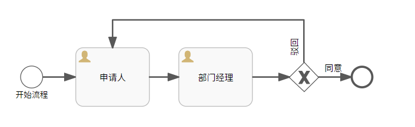

# 基于角色的审批流程实现


+ **前言**:

  设计一个流程,当流程提交到下一个节点时,根据节点指定的用户角色,来进行审批,比如节点指定角色为**部门经理**,若此部门存在多个部门经理(正副),则其中任意一个部门经理均可获取该节点的审批权限,且任一部门经理,审批完毕之后视作该节点审批通过(实质上仍然是单人会签).

+ **流程设计**:

  + 请假流程(key为**levave_key**)

    

    在此流程中,我们申明部门经理节点的指定审批用户占位符为**departMentManager**,同意条件占位符为**approved**,驳回条件为**!approved**

+ **代码实现(部分代码为伪代码)**:

  1. **启动并提交一个请假申请**

     ```java
       //调用文档2中的部署API 对该模板进行配置
       deploy(String modelKey);
       
       //用户"testUserId001"开启一个实例流程(提交一个请假申请审批)
       Map<String, Object> params = new HashMap<>();
       params.put("applicant", "testUserId001");
       
       //指定下个节点(部门经理) 由 <dmm> 进行审批
       //此处dmm为占位符,表示部门经理
       params.put("departMentManager", "dmm");
       ProcessInstance processInstance= runtimeService.startProcessInstanceByKey("levave_key", params);
       
       
       //获取当前用户所拥有的任务
       String processInstanceId =processInstance.getProcessInstanceId();
       Task task = taskService.createTaskQuery().taskAssignee("testUserId001").processInstanceId(processInstanceId).singleResult();
       
       //执行申请人节点处理流程
       taskService.complete(task.getId());
     ```

  2. **任一部门经理登录并进行审批**

     ```java
     //任一用户登录系统;
     
     SysUserInfo userInfo=getMyUserInfo(); //getMyUserInfo() 为伪代码,指获取当前登录用户信息
     
     if(userInfo.getRole().equals("部门经理")){
     	//上一个环节中,指定了由dmm来审批部门经理节点
         //进入此逻辑的用户可能为任一一个用户,但是角色为部门经理,
         Task task = taskService.createTaskQuery().taskAssignee("dmm").processInstanceId(processInstanceId).singleResult();
      
     	Map params=new HashMap<String,Object>();
      //同意
         params.put("approved",true);
         //驳回
         //params.put("approved",false);
         
         //部门经理执行审批处理
         taskService.complete(task.getId(),params);
     }
     ```
  
  

## 补充说明

+ 在此流程设计中,我们在启动流程时,并没有指定部门经理占位符为具体某个用户比如: `` params.put("departMentManager", "testUserId002");``而是以引入一个新的占位符**<font color=red>dmm</font>**:``params.put("departMentManager","dmm")``是表明,该节点不是指定某个具体用户进行处理,而是指定任一所有具有**<font color=red>dmm</font>**特征都可以进行处理。

+ 在处理环节,当用户登录系统,后,如果用户具有**<font color=red>dmm</font>**特征,则用户以**<font color=red>dmm</font>**特征获取**<font color=red>dmm</font>**对应的审批任务,执行任务处理.

+ 到此为止,一个简单的**基于角色的自动指定用户审批流程**就得意实现。

  

   

