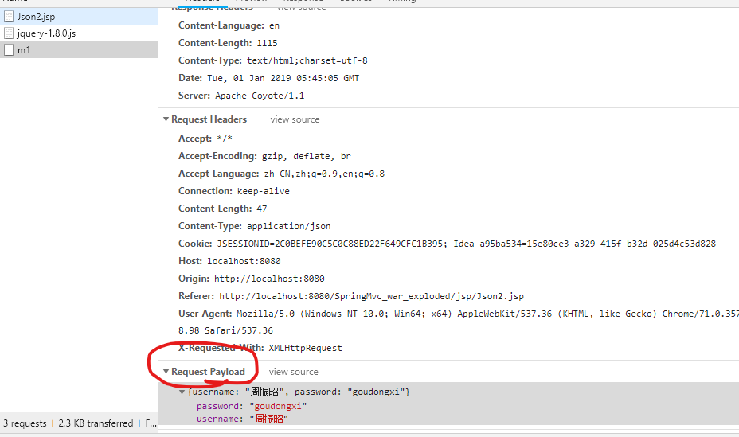
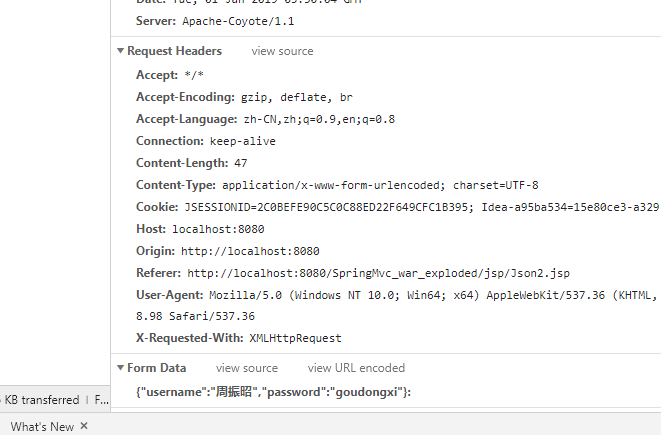

# json的返回与解析

添加json依赖包以及处理json为bean的包

```xml
<!-- 添加jason依赖包-->
<!-- https://mvnrepository.com/artifact/com.fasterxml.jackson.core/jackson-core -->
<dependency>
    <groupId>com.fasterxml.jackson.core</groupId>
    <artifactId>jackson-core</artifactId>
    <version>2.9.7</version>
</dependency>

<!-- https://mvnrepository.com/artifact/com.fasterxml.jackson.core/jackson-databind -->
<dependency>
    <groupId>com.fasterxml.jackson.core</groupId>
    <artifactId>jackson-databind</artifactId>
    <version>2.9.7</version>
</dependency>

<!-- https://mvnrepository.com/artifact/com.fasterxml.jackson.core/jackson-annotations -->
<dependency>
    <groupId>com.fasterxml.jackson.core</groupId>
    <artifactId>jackson-annotations</artifactId>
    <version>2.9.7</version>
</dependency>

<!-- https://mvnrepository.com/artifact/net.sf.json-lib/json-lib -->
<dependency>
    <groupId>net.sf.json-lib</groupId>
    <artifactId>json-lib</artifactId>
    <version>2.4</version>
</dependency>

<!-- 添加处理json为javabean-->
<!-- https://mvnrepository.com/artifact/org.codehaus.jackson/jackson-core-asl -->
<dependency>
    <groupId>org.codehaus.jackson</groupId>
    <artifactId>jackson-core-asl</artifactId>
    <version>1.9.13</version>
</dependency>

<!-- https://mvnrepository.com/artifact/org.codehaus.jackson/jackson-mapper-asl -->
<dependency>
    <groupId>org.codehaus.jackson</groupId>
    <artifactId>jackson-mapper-asl</artifactId>
    <version>1.9.13</version>
</dependency>
```

#### 返回json格式数据到前端(返回信息均为键值对格式)

```java
@Controller
@RequestMapping("/Json")
public class JsonController {
    @RequestMapping("/m1")
    @ResponseBody
    //返回pojo类型
    public User t1(){
        User u=new User();
        u.setUsername("二狗");
        u.setPassword("ergou");
        return u;
    }
    @RequestMapping("/m2")
    @ResponseBody
    //返回Map类型
    public Map<Object,Object> t2(){
        Map<Object,Object> map=new HashMap<>();
        map.put(1, "yiyi");
        map.put(2, "erer");
        return map;
    }
     @RequestMapping("/m3")
    //返回数组类型，@Controller改写成@RestController
    public User[] t3(){
        User u=new User();
        u.setUsername("二狗");
        u.setPassword("ergou");
        User u2=new User();
        u2.setUsername("三羊");
        u2.setPassword("sanyang");
        User[] users =new User[]{u,u2};
        return users;
    }
	
    @RequestMapping("/m4")
    //返回List类型
    public List<User> t4(){
        User u=new User();
        u.setUsername("二狗");
        u.setPassword("ergou");
        User u2=new User();
        u2.setUsername("三羊");
        u2.setPassword("sanyang");
        List<User> users=new ArrayList<>();
        Collections.addAll(users,u,u2);
        return users;
    }
}
```

####  前台解析json数据

​	四种前台数据内容解析(使用jquery)：

```html

<%@ page contentType="text/html;charset=UTF-8" language="java" %>
<html>
<head>
    <title>Title</title>
    <script src="http://ajax.aspnetcdn.com/ajax/jQuery/jquery-1.8.0.js">
    </script>
    <script type="text/javascript">
        $(document).ready(function(){
            <!--解析pojo类型-->
            $('#b1').click(function(){
                $.ajax({
                    url:'${webpath}/Json/m1',
                    type:'post',
                    success:function (data) {
                        alert(data.username);
                        alert(data.password);
                    }
                })
            });
             <!--解析Map类型-->
            $('#b2').click(function(){
                $.ajax({
                    url:'${webpath}/Json/m2',
                    type:'post',
                    success:function (data) {
                        alert(data.key1);
                        alert(data.key2);
                    }
                })
            });
             <!--解析数组类型（注意使用遍历）-->
            $('#b3').click(function(){
                $.ajax({
                    url:'${webpath}/Json/m3',
                    type:'post',
                    success:function (data) {
                        for (var i=0;i<data.length;i++){
                            alert(data[i].username);
                            alert(data[i].password);
                        }
                    }
                })
            });
             <!--解析List类型-->
            $('#b4').click(function(){
                $.ajax({
                    url:'${webpath}/Json/m4',
                    type:'post',
                    success:function (data) {
                        for (var i=0;i<data.length;i++){
                            alert(data[i].username);
                            alert(data[i].password);
                        }
                    }
                })
            });
        });
    </script>
</head>
<body>
----json数据解析-----<br>
<button id="b1">pojo类解析</button>
<button id="b2">map类数据解析</button>
<button id="b3">数组类数据解析</button>
<button id="b4">List类数据类型解析</button>
</body>
</html>
```

​	我也不知道为什么之前一直导本地的jquery.js文件会一直失败，转成导入网络版的js就没问题了，很傻比，十分傻逼，十分十分的傻逼。


#### 前端传数据到后台

注意**contentType:'application/json',
​             data:JSON.stringify(obj),**

```html
<%@ page contentType="text/html;charset=UTF-8" language="java" %>
<html>
<head>
    <title>Title</title>
    <script src="http://ajax.aspnetcdn.com/ajax/jQuery/jquery-1.8.0.js">
    </script>
    <script>
        $(document).ready(function () {
            $('#b1').click(function () {
                var obj={
                "username":"周振昭",
                    "password":"goudongxi"
                }
                $.ajax({
                        url: '${webpath}/Json2/m1',
                        type: 'post',
                        contentType:'application/json',
                        data:JSON.stringify(obj),
                        success: function (data) {
                        }
                    }
                )
            })
        })
    </script>
</head>
<body>

<button id="b1">传入自定义的json格式数据到后台</button>
</body>
</html>
```

后台java代码：

注意添加**@RequestBody**

```java
@Controller
@RequestMapping("Json2")
public class JsonController2 {
    @RequestMapping("m1")
    public String t1(@RequestBody User user){
        System.out.println(user.getUsername()+user.getPassword());
        return null;
    }
}
```

使用自定义json发送数据是浏览器信息为：



使用表单提交数据是浏览器信息为


前台传递一组数据到后台:

```javascript
$('#b2').click(function () {
                var obj={
                "username":"周振昭",
                    "password":"goudongxi"
                }
                var obj2={
                "username":"小几把",
                    "password":"xiaojiba"
                }
                var users=new Array();
                users.push(obj,obj2);
                $.ajax({
                        url: '${webpath}/Json2/m2',
                        type: 'post',
                       contentType:'application/json',
                        data:JSON.stringify(users),
                        success: function (data) {
                            if (data.code==200){
                                alert("fine");
                            }
                        }
                    }
                )
            })
```

```java
@RequestMapping("m2")
@ResponseBody
public Map<String ,Integer> t1(@RequestBody List<User> users){
    Map<String,Integer> map=new HashMap<>();
    System.out.println(users);
    map.put("code",200);
    return map;
}
```

#### 后台验证数据

```js
<input type="text" name="username" >
$('input[name=username]').blur(function () {
                var username=$('input[name=username]').val();
                var obj={
                    username:username
                }
                $.ajax({
                  url:'${webpath}/Json2/m3',
                  type:'post',
                  contentType:'application/json',
                  data:JSON.stringify(obj),
                  success:function(data){
                      if (data.code==2000){
                          alert("该用户名可以注册")
                      }else {
                          alert("该用户名已被注册")
                      }
                  }
                })

            })
```

```java
@RequestMapping("m3")
    @ResponseBody
    public Map<String ,Integer> checkname(@RequestBody User user){
        System.out.println(user);
        Map<String,Integer> map=new HashMap<>();
        int code=2000;
        if (user.getUsername().equals("二狗")){
            code =1;
        }
        map.put("code",code);
        return map;
    }
```

​	当传入为String username时候，测试失败。暂时不知道怎么回事。


## XML数据交互

 添加xml处理jar包

```xml
<!-- https://mvnrepository.com/artifact/com.fasterxml.jackson.dataformat/jackson-dataformat-xml -->
<dependency>
    <groupId>com.fasterxml.jackson.dataformat</groupId>
    <artifactId>jackson-dataformat-xml</artifactId>
    <version>2.9.6</version>
</dependency>
```

```java
//注意添加produces ={MediaType.APPLICATION_XML_VALUE}
@RequestMapping(value="/m4",produces ={MediaType.APPLICATION_XML_VALUE})
@ResponseBody
public User t4(){
    User u = new User();
    u.setUsername("zhouzhou");
    u.setPassword("jiji");
    return u;
}
```

 在添加xml处理之后，原有json返回数据类型会被xml覆盖，仅返回xml数据类型。
