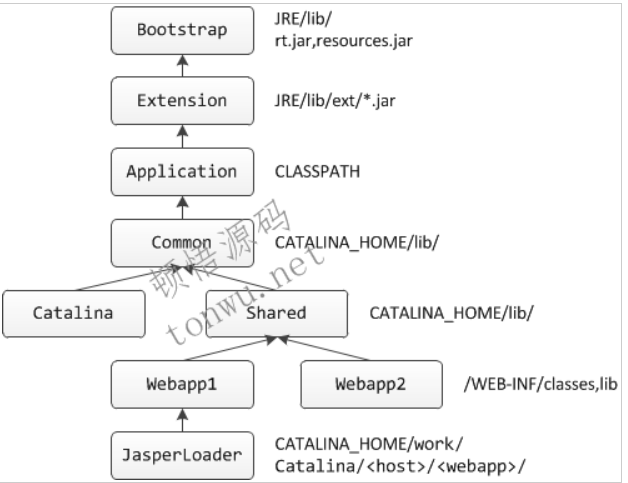

# Tomcat 

### Tomca类加载器

+ Web应用类加载器默认加载顺序如下:
  1. 从缓存中加载
  2. 如果没有,从JVM的Bootstrap类加载器加载
  3. 如果没有,从当前类加载器加载(按照WEB-INF/classes,WEB-INF/lib的顺序) 
     + **注意此处,没有启用Java 委派模式，并没有优先从父类开始加载所需类。**
     + 如果配置delegate=true(默认为false) ，表示开启java默认双亲委派模式，此时**加载顺序3和4将互换**
  4. 如果没有,则从父类加载器加载,由于父类加载器采用默认的委派模式,所以加载顺序为System，Common，Shared