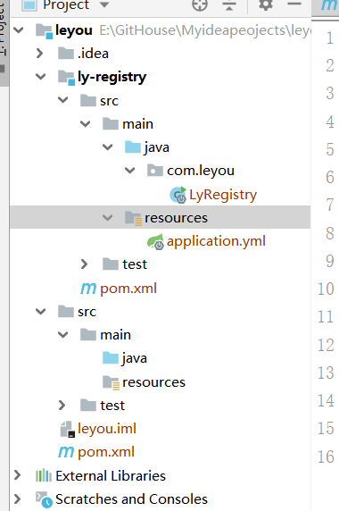
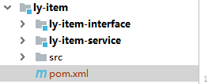

# 项目框架搭建

##  父工程的搭建(配置文件编写，依赖管理)：

```xml
<?xml version="1.0" encoding="UTF-8"?>
<project xmlns="http://maven.apache.org/POM/4.0.0"
         xmlns:xsi="http://www.w3.org/2001/XMLSchema-instance"
         xsi:schemaLocation="http://maven.apache.org/POM/4.0.0 http://maven.apache.org/xsd/maven-4.0.0.xsd">
    <modelVersion>4.0.0</modelVersion>

    <groupId>com.leyou.parent</groupId>
    <artifactId>leyou</artifactId>
    <version>1.0.0-SNAPSHOT</version>
    <packaging>pom</packaging>

    <name>leyou</name>

    <parent>
        <groupId>org.springframework.boot</groupId>
        <artifactId>spring-boot-starter-parent</artifactId>
        <version>2.0.1.RELEASE</version>
    </parent>

    <properties>
        <project.build.sourceEncoding>UTF-8</project.build.sourceEncoding>
        <project.reporting.outputEncoding>UTF-8</project.reporting.outputEncoding>
        <java.version>1.8</java.version>
        <spring-cloud.version>Finchley.RC1</spring-cloud.version>
        <mybatis.starter.version>1.3.2</mybatis.starter.version>
        <mapper.starter.version>2.0.2</mapper.starter.version>
        <druid.starter.version>1.1.9</druid.starter.version>
        <mysql.version>8.0.12</mysql.version>
        <pageHelper.starter.version>1.2.3</pageHelper.starter.version>
        <leyou.latest.version>1.0.0-SNAPSHOT</leyou.latest.version>
        <fastDFS.client.version>1.26.1-RELEASE</fastDFS.client.version>
    </properties>


    <dependencyManagement>
        <dependencies>
            <!--springCloud-->
            <dependency>
                <groupId>org.springframework.cloud</groupId>
                <artifactId>spring-cloud-dependencies</artifactId>
                <version>${spring-cloud.version}</version>
                <type>pom</type>
                <scope>import</scope>
            </dependency>
            <!--mybatis启动器-->
            <dependency>
                <groupId>org.mybatis.spring.boot</groupId>
                <artifactId>mybatis-spring-boot-starter</artifactId>
                <version>${mybatis.starter.version}</version>
            </dependency>
            <!--通用Mapper启动器-->
            <dependency>
                <groupId>tk.mybatis</groupId>
                <artifactId>mapper-spring-boot-starter</artifactId>
                <version>${mapper.starter.version}</version>
            </dependency>

            <!--分页助手启动器-->
            <dependency>
                <groupId>com.github.pagehelper</groupId>
                <artifactId>pagehelper-spring-boot-starter</artifactId>
                <version>${pageHelper.starter.version}</version>
            </dependency>

            <!--mysql驱动-->
            <dependency>
                <groupId>mysql</groupId>
                <artifactId>mysql-connector-java</artifactId>
                <version>${mysql.version}</version>
            </dependency>

            <!--FastDFS客户端-->
            <dependency>
                <groupId>com.github.tobato</groupId>
                <artifactId>fastdfs-client</artifactId>
                <version>${fastDFS.client.version}</version>
            </dependency>
        </dependencies>
    </dependencyManagement>
    <build>
        <plugins>
            <plugin>
                <groupId>org.springframework.boot</groupId>
                <artifactId>spring-boot-maven-plugin</artifactId>
            </plugin>
        </plugins>
    </build>

    <repositories>
        <repository>
            <id>spring-milestones</id>
            <name>Spring Milestones</name>
            <url>https://repo.spring.io/milestone</url>
            <snapshots>
                <enabled>false</enabled>
            </snapshots>

        </repository>
    </repositories>


</project>
```

## 创建eureka注册中心

+ 项目结构：
  + 

+ 配置文件编写

```xml
<?xml version="1.0" encoding="UTF-8"?>
<project xmlns="http://maven.apache.org/POM/4.0.0"
         xmlns:xsi="http://www.w3.org/2001/XMLSchema-instance"
         xsi:schemaLocation="http://maven.apache.org/POM/4.0.0 http:// maven.apache.org/xsd/maven-4.0.0.xsd">
    <parent>
        <artifactId>leyou</artifactId>
        <groupId>com.leyou.parent</groupId>
        <version>1.0.0-SNAPSHOT</version>
    </parent>
    <modelVersion>4.0.0</modelVersion>

    <groupId>com.leyou.commom</groupId>
    <artifactId>ly-registry</artifactId>
    <version>1.0.0-SNAPSHOT</version>

    <dependencies>
        <dependency>
            <groupId>org.springframework.cloud</groupId>
            <artifactId>spring-cloud-starter-netflix-eureka-server</artifactId>
        </dependency>
        <dependency>
            <groupId>org.springframework.boot</groupId>
            <artifactId>spring-boot-autoconfigure</artifactId>
            <version>2.1.3.RELEASE</version>
        </dependency>
    </dependencies>
</project>
```

+ 启动类编写：

```java
package com.leyou;

import org.springframework.boot.SpringApplication;
import org.springframework.boot.autoconfigure.SpringBootApplication;
import org.springframework.cloud.netflix.eureka.server.EnableEurekaServer;

@SpringBootApplication
@EnableEurekaServer
public class LyRegistry {
    public static void main(String[] args) {
        SpringApplication.run(LyRegistry.class, args);
    }

}

```

+ application.yml配置：

```yml
server:
  port: 10086
spring:
  application:
    name: ly-registry
eureka:
  client:
    fetch-registry: false
    register-with-eureka: false
    service-url:
      defaultZone: http://127.0.0.1:${server.port}/eureka

  server:
    enable-self-preservation: false
    eviction-interval-timer-in-ms: 5000

```

## zuul网关配置：

+ yml文件

  ```yml
  server:
    port: 10010
  spring:
    application:
      name: apt-gateway
  
  eureka:
    client:
      service-url:
        defaultZone: http://127.0.0.1:10086/eureka
      registry-fetch-interval-seconds: 5
    instance:
      prefer-ip-address: true #当获取host时，返回的不是主机名而是ip地址
      ip-address: 127.0.0.1
      instance-id: ${spring.application.name}:${server.port}
  
  zuul:
    prefix: /api #添加路由前缀
    retryable: true
    routes:
      item-service: /item/**
  ribbon:
    ConnectTimeout: 250 #连接超时时间（ms）
    ReadTimeout: 2000 #通信超时时间（ms)
    OkToRetryOnAllOperations: true # 是否对所有操作重试
    MaxAutoRetriesNextServerL: 1 #同一服务的不同实例的重试次数
    MaxAutoRetries: 1 #同一实例的重试次数
  
  hystrix:
    command:
      execution:
        isolation:
          thread:
            timeoutInMillisecond: 10000 #熔断超时时长
  ```

  + pom.xml

    ```xml
     <dependencies>
            <dependency>
                <groupId>org.springframework.cloud</groupId>
                <artifactId>spring-cloud-starter-netflix-eureka-client</artifactId>
                <version>2.1.0.RELEASE</version>
            </dependency>
            <dependency>
                <groupId>org.springframework.cloud</groupId>
                <artifactId>spring-cloud-starter-netflix-zuul</artifactId>
            </dependency>
            <!--spring boot提供的微服务检测接口，默认对外提供几个接口/info-->
            <dependency>
                <groupId>org.springframework.boot</groupId>
                <artifactId>spring-boot-starter-actuator</artifactId>
            </dependency>
        </dependencies>
    ```

  + 启动类

  ```java
  @SpringBootApplication
  @EnableDiscoveryClient
  @EnableZuulProxy
  public class LyApiGateway {
      public static void main(String[] args) {
          SpringApplication.run(LyApiGateway.class,args);
      }
  }
  
  ```

  

## 服务创建： 

将item拆分为对外的接口interface以及内部业务逻辑



+ 打包为pom包：

  ```xml
  <?xml version="1.0" encoding="UTF-8"?>
  <project xmlns="http://maven.apache.org/POM/4.0.0"
           xmlns:xsi="http://www.w3.org/2001/XMLSchema-instance"
           xsi:schemaLocation="http://maven.apache.org/POM/4.0.0 http://maven.apache.org/xsd/maven-4.0.0.xsd">
      <parent>
          <artifactId>leyou</artifactId>
          <groupId>com.leyou.parent</groupId>
          <version>1.0.0-SNAPSHOT</version>
      </parent>
      <modelVersion>4.0.0</modelVersion>
  
      <groupId>com.leyou.service</groupId>
      <artifactId>ly-item</artifactId>
      <version>1.0.0-SNAPSHOT</version>
      <modules>
          <module>ly-item-interface</module>
          <module>ly-item-service</module>
      </modules>
      <packaging>pom</packaging>
  
  
  
  </project>
  ```

+ 创建两个Module

  1. ly-item-interface(用以对外提供服务)

  2. ly-item-service(业务逻辑)：

     1. yml文件编写，注册到eureka：

     ```yml
     server:
       port: 8081
     spring:
       application:
         name: item-service
     
       datasource:
         url: jdbc:mysql://localhost:3306/leyou?serverTimezone=UTC
         username: root
         password: root
         hikari:
           maximum-pool-size: 30
           minimum-idle: 10
     
     eureka:
       client:
         service-url:
           defaultZone: http://127.0.0.1:10086/eureka
         registry-fetch-interval-seconds: 5
       instance:
         prefer-ip-address: true #当获取host时，返回的不是主机名而是ip地址
         ip-address: 127.0.0.1
         instance-id: ${spring.application.name}:${server.port}
         lease-renewal-interval-in-seconds: 5 #每隔5s钟发送一次心跳
         lease-expiration-duration-in-seconds: 10 #10秒钟不发送就过期
     
     ```

     2. 导入必要jar包

     ```xml
     <?xml version="1.0" encoding="UTF-8"?>
     <project xmlns="http://maven.apache.org/POM/4.0.0"
              xmlns:xsi="http://www.w3.org/2001/XMLSchema-instance"
              xsi:schemaLocation="http://maven.apache.org/POM/4.0.0 http://maven.apache.org/xsd/maven-4.0.0.xsd">
         <parent>
             <artifactId>ly-item</artifactId>
             <groupId>com.leyou.service</groupId>
             <version>1.0.0-SNAPSHOT</version>
         </parent>
         <modelVersion>4.0.0</modelVersion>
     
         <groupId>com.leyou.service</groupId>
         <artifactId>ly-item-service</artifactId>
         <version>1.0.0-SNAPSHOT</version>
     
     
         <dependencies>
             <dependency>
                 <groupId>org.springframework.boot</groupId>
                 <artifactId>spring-boot-starter-web</artifactId>
             </dependency>
             <dependency>
                 <groupId>org.springframework.cloud</groupId>
                 <artifactId>spring-cloud-starter-netflix-eureka-client</artifactId>
                 <version>2.1.0.RELEASE</version>
             </dependency>
             <dependency>
                 <groupId>org.mybatis.spring.boot</groupId>
                 <artifactId>mybatis-spring-boot-starter</artifactId>
             </dependency>
             <dependency>
                 <groupId>tk.mybatis</groupId>
                 <artifactId>mapper-spring-boot-starter</artifactId>
             </dependency>
             <dependency>
                 <groupId>com.github.pagehelper</groupId>
                 <artifactId>pagehelper-spring-boot-starter</artifactId>
             </dependency>
     
             <dependency>
                 <groupId>org.springframework.boot</groupId>
                 <artifactId>spring-boot-starter-jdbc</artifactId>
             </dependency>
     
             <dependency>
                 <groupId>mysql</groupId>
                 <artifactId>mysql-connector-java</artifactId>
             </dependency>
            <!--导入item-interface-->
             <dependency>
                 <groupId>com.leyou.service</groupId>
                 <artifactId>ly-item-interface</artifactId>
                 <version>1.0.0-SNAPSHOT</version>
             </dependency>
             <!--用于微服务测试-->
             <dependency>
                 <groupId>org.springframework.boot</groupId>
                 <artifactId>spring-boot-starter-actuator</artifactId>
             </dependency>
         </dependencies>
     </project>
     ```

     
