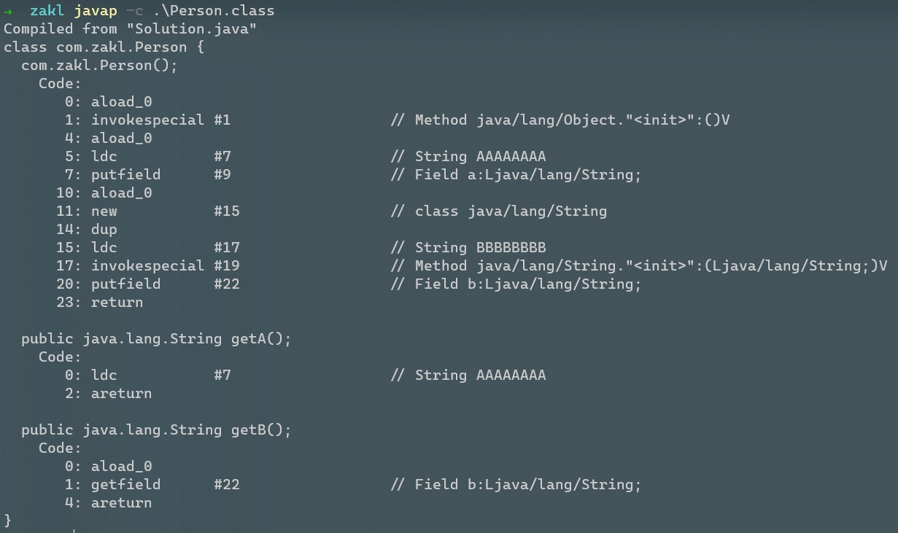

首先看一下以下这段代码,猜想会输出什么内容呢？

```java
    static class Person {
        private final String a = "AAAAAAAA";
        private final String b = new String("BBBBBBBB");

        public String getA() {
            return a;
        }

        public String getB() {
            return b;
        }
    }


    public static void main(String[] args) throws NoSuchFieldException, IllegalAccessException {
        Person person = new Person();
        Field a = person.getClass().getDeclaredField("a");
        Field b = person.getClass().getDeclaredField("b");
        a.setAccessible(true);
        b.setAccessible(true);
        a.set(person, "newA");
        b.set(person, "newB");
        System.out.println("origin a:  " + person.getA());
        System.out.println("invoke a:  " + a.get(person));
        System.out.println("----------");
        System.out.println("origin b:  " + person.getB());
        System.out.println("invoke b:  " + b.get(person));
    }
```

--------------------------------------------------------------------------------------------------------

```
origin a:  AAAAAAAA
invoke a:  newA
----------
origin b:  newB
invoke b:  newB
```

是不是有点超乎想象?

为什么有一点点奇怪，为什么a字段没有被反射修改值成功呢？

原因就在a和b的赋值方式，值得注意的是，ab字段都拥有final声明，证明ab的值无法被更改，而b在初始化时需要生成一个String类的实例，而a则是直接赋值，将变量值放入了常量池。在jvm编译的时候，经过jvm主动优化，判定a值一定永远为“AAAAAAAA”，且为final类型，永远不可能发生改变，则将getA()函数优化为了直接返回“AAAAAAAAA"而不是return a

与a字段不同的是，虽然b字段也是final修饰不可被修改，但是编译器判定b是一个尚未创建的实例引用，而类实例需要运行时创建，无法准确获取b的实例的值，则无法对getB()函数进行优化。

证实：

​	证明方法其实十分简单，直接查看编译后生成的person类即可:

+ 对Person.class反编译:

+ IDEA提供的反编译:

  ```java
  class Person {
      private final String a = "AAAAAAAA";
      private final String b = new String("BBBBBBBB");
  
      Person() {
      }
  
      public String getA() {
          return "AAAAAAAA";
      }
  
      public String getB() {
          return this.b;
      }
  }
  ```


+ 结果显而易见,在反编辑器的帮助下,我们可以得知Person在编译成class字节码时,编译器主动进行了优化,将要返回的a的值,硬编码到了getA()中,而b由于需要实例化对象的原因,没有享受到这个待遇,所以我们的反射设置类变量的值,其实获得了圆满的成功。