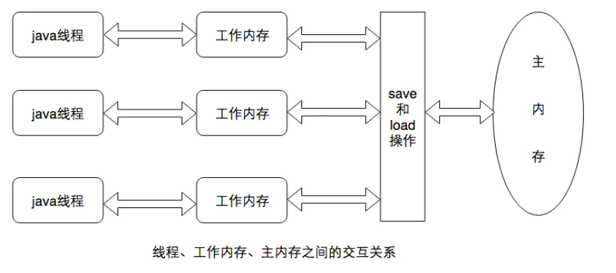
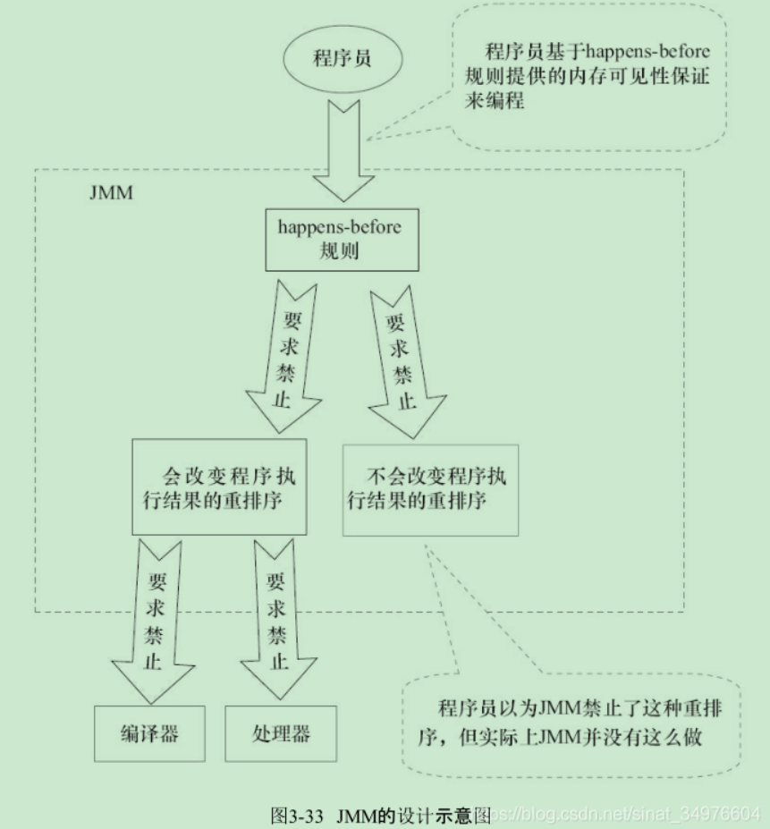

# Java内存模型_JMM


## 内存模型基础知识



+ 指令重排序: JMM通过禁止特定类型的编译器重排序和处理器重排序，为程序员提供一致的内存可见性保证。

+ JMM内存屏障类型：

  | 屏障类型            | 指令示例                   | 说明                                                         |
  | ------------------- | -------------------------- | ------------------------------------------------------------ |
  | LoadLoad Barriers   | Load1; LoadLoad; Load2     | 确保Load1数据的装载，之前于Load2及所有后续装载指令的装载     |
  | StoreStore Barriers | Store1; StoreStore; Store2 | 确保Store1数据对于其他处理器可见（刷新到内存），之前于Store2及所有后续存储指令的存储 |
  | LoadStore Barriers  | Load1; LoadStore; Store2   | 确保Load1数据的装载，之前于Store2及所有后续的存储指令刷新到内存 |
  | StoreLoad Barriers  | Store1; StoreLoad; Load2   | 确保Store1数据对于其他处理器可见，之前于Load2及所有后续装载指令的装载，StoreLoad Barriesrs会使该屏障之前的所有内存访问指令（存储和装载指令）完成之后，才执行该屏障之后的内存访问指令。 |

  StoreLoad Barriers是一个全能型的屏障，同时具有其他三个屏障的效果，现代处理器大多支持该屏障，执行该屏障开销很高，因为写完后需要将写缓冲区中的数据全部刷新到内存中(Buffer Fully Flush).

+ Happens_Before

  用happens-before的概念来阐述操作之间的内存可见性。在JMM中，如果一个操作执行的结果需要对另一个操作可见，那么这两个操作之间必须要存在happens-before关系 。happens-before关系本质上和as-if-serial语义是一回事。as-if-serial语义保证单线程内程序的执行结果不被改变，happens-before关系保证正确同步的多线程程序的执行结果不被改变。

  + 程序顺序规则：一个线程中的每个操作，happens-before于该线程中的任意后续操作

  + 监视器锁规则：对一个锁的解锁，happens-before于随后对这个锁的加锁

   + volatile变量规则：对一个volatile域的写，happens-before于任意后续对这个volatile域的读。

   + 传递性：如果A happens-before B，且B happens-before C，那么A happens-before C

   + start()规则：如果线程A执行操作ThreadB.start()（启动线程B），那么A线程的ThreadB.start()操作happens-before于线程B中的任意操作。

   + join规则：如果线程A执行操作ThreadB.join()并成功返回，那么线程B中的任意操作happens-before于线程A从ThreadB.join()操作成功返回。

   + 线程中断规则：对线程interrupt方法的调用happens-before于被中断线程的代码检测到中断事件的发生。

     

## 重排序

+ 数据依赖性: 如果两个操作同时访问同一个变量,且这两个操作有一个为写操作,此时这两个操作之间就存在数据依赖性,有三种数据依赖类型：
  + 写后读: a=1;b=a;
  + 写后写: a=1;a=2;
  + 读后写: a=b;b=1;
+ as-if-serial:不管怎么进行重排序,单线程程序的执行结果不能与预期不同,编译器，runtime，和处理器都必须遵守as-if-serial语义。

+ 重排序对多线程的影响：
  + 数据依赖：多线程中各线程的操作之间没有数据依赖关系，编译器和处理器对操作进行重排序，可能会影响另一个线程对数据的判断。
  + 控制依赖：单线程程序中对存在控制依赖的操作，不会改变结果(as-if-serial)语义，在多线程中对存在控制依赖的操作重排序，可能会改变程序执行的结果。

## 顺序一致性

+ 数据竞争：
  1. 在一个线程中写一个变量
  2. 在另一个线程中读同一个变量
  3. 以上两个操作没有使用同步来排序

+ tips:
  + JMM不保证对64位的long型和double型变量的写操作具有原子性(在32位处理器中，long和double会被拆成两个32位写入)。
  + jsr-133(JDK5) 限制对于64位的long和double，写入时可以拆分为两个32位的写，但是在读的时候需要具有原子性(即任意读操作必须要在单个事务中执行)。
  + 

## volatile

+ 线程间通信，使得被volatile修饰的变量具有可见性

  + 一个线程对变量的写一定对之后对这个变量的读的线程可见

  ```java
  public class Test {
      public static void main(String[] args) throws InterruptedException {
          T t = new T();
          Thread t1 = new Thread(t);
          t1.start();
          new Thread(()->{
              try {
                  Thread.sleep(5000);
                  t.setIsrunning(false);
              } catch (InterruptedException e) {
                  e.printStackTrace();
              }
          }).start();
      }
  
  
  
      static class T implements Runnable {
          private volatile boolean isRunning = true; //如果不添加volatile关键字，则另一个线程修改该状态时，此线程无法发现改变。
          boolean isIsrunning() {
              return isRunning;
          }
  
          void setIsrunning(boolean isrunning) {
              this.isRunning = isrunning;
          }
  
          @Override
          public void run() {
              while (isIsrunning() == true) {
                  System.out.println("is running");
                  try {
                      Thread.sleep(1000);
                  } catch (InterruptedException e) {
                      e.printStackTrace();
                  }
              }
          }
      }
  }
  
  ```

+ 只能在有限的一些情形下使用 volatile 变量替代锁。要使 volatile 变量提供理想的线程安全，必须同时满足下面两个条件：

  - （1）对变量的写操作不依赖于当前值。
  - （2）该变量没有包含在具有其他变量的不变式中

+ 多线程关键字：

  - 可见性：对一个volatile的读，总是可以看到任意线程对这个变量的最后写入。
  - 有序性 (happens-before)
  - 原子性：对任意单个volatile的读/写具有原子性，但是对于volatile++复合操作不具有原子性。
    - volatile可以保证前两个特性
    - CAS算法，也就是CPU级别的同步指令，相当于乐观锁，可以检测到其他线程对共享数据的变化情况。

+ volatile写读语义：

  + 写：JMM会将线程对应的本地内存中的共享变量刷新到主内存
  + 读：JMM会先将本地内存值为无效，从主内存中读取共享变量

+ volatile内存语义实现：

  | 是否能重排序 | 第二个操作 |             |             |
  | ------------ | ---------- | ----------- | ----------- |
  | 第一个操作   | 普通读/写  | volatile 读 | volatile 写 |
  | 普通读/写    |            |             | NO          |
  | volatile 读  | NO         | NO          | NO          |
  | volatile 写  |            | NO          | NO          |

  1. 当第二个操作是volatile 写时，不管第一个操作是什么，都不能重排序。这个规则确保**volatile 写之前的操作不会被编译器重排序到volatile 写之后**。
  2. 当第一个操作是volatile 读时，不管第二个操作是什么，都不能重排序。这个规则确保**volatile 读之后的操作不会被编译器重排序到volatile 读之前**。
  3. 当第一个操作是volatile 写，第二个操作是volatile 读时，不能重排序(CAS 语义实现)。

## 锁的内存语义

+ 锁的获取:JVM将该线程对应的本地内存置为无效，从而使被监视器保护的临界区代码必须从主内存中读取共享变量。
+ 锁的释放:获取建立的happens-before关系
  + 锁释放与volatile写有相同的内存语义
  + 锁获取与volatile读有相同的内存语义
    1. 线程A释放锁，实际上是线程A向接下来将要获取这个锁的某个线程发出了消息。
    2. 线程B获取一个锁，实质上是线程B接收了之前某个线程发出的(在释放这个锁之前对共享变量所作的修改)的消息
    3. A释放锁，B获取锁，实际上是线程A通过主内存向线程B发送消息。

+ 锁释放-获取的内存语义实现：
  + 利用volatile变量的写-读所具有的内存语义
  + 利用CAS锁附带的volatile读写内存语义
  + CAS操作步骤：
    + 获取锁:volatile读(禁止后面的操作重排序)/**volatile读-LoadLoad-LoadSotre**
    + 释放锁:volatile写(禁止前面的操作重排序) /**StoreSotre-volatile写-StoreLoad**