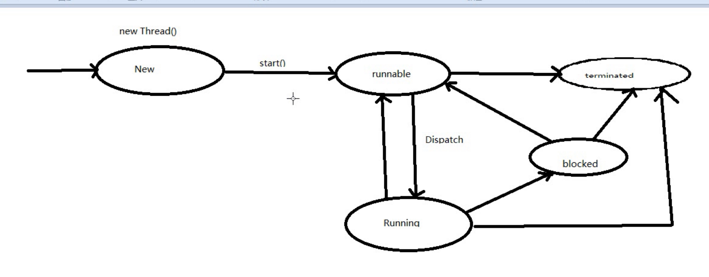
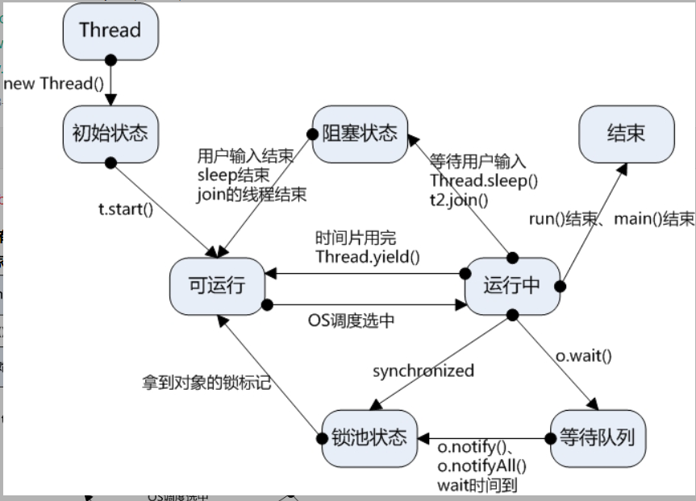
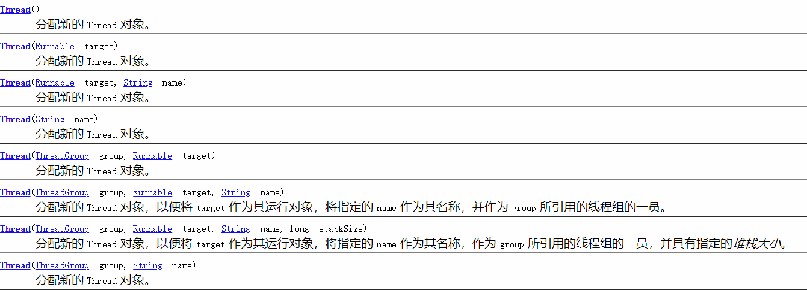

# Java 多线程

### 生命周期

+ 
+ 

```java
Thread t1 = new Thread(new Runnable() {
    public void run() {
        System.out.println(Thread.currentThread().getName());
    }
});
t1.setName("线程t1");
//t1.start();  不能同时开启两个同样的线程
t1.start();

//output
线程t1


 Thread t1 = new Thread(new Runnable() {
            public void run() {
                System.out.println(Thread.currentThread().getName());
            }
        });
 t1.setName("线程t1");
 t1.run();
//output
main

```

1. 只有.start()方法才会启动一个新线程，.run()只是调用实例方法，而不是开启一个新线程
2. main函数的调用就是主线程的开启
3. 当调用一个新线程时候，至少有两个线程开启，一个是被调用的线程，一个是调用者线程(比如main线程)
4. 线程的生命周期有new ，runnable , running, block, terminate
5. jvm启动后，实际上有多个线程,但是至少有一个非守护线程

### 创建一个线程



1. 创建一个线程默认具有线程名Thread-i(i代表创建的第几个线程)

2. 构造线程对象时象时未传入ThreadGroup,Thread会默认获取父线程的TreadGroup，此时子线程和父线程将会在同一个ThreadGroup。main函数的ThreadGroup就是main.

3. 默认的线程栈帧大小(不唯一)

   ```java
   public class CreateThread {
       private static int counter = 0;
       //由jvm创建的main线程
       public static void main(String[] args) throws ParseException {
           Thread t = new Thread(null, new Runnable() {
               @Override
               public void run() {
                   try {
                       add(1);
                   } catch (Error error) {
                       System.out.println("默认栈帧大小" + counter);
                   }
               }
               private void add(int i) {
                   counter++;
                   add(i + 1);
               }
           }, "TestStack");
           t.start();
       }
   }
   //output
   默认栈帧大小14958
   ```

4. 指定线程栈帧大小

   ```java
   public class CreateThread {
   
       private static int counter = 0;
   
       //由jvm创建的main线程
       public static void main(String[] args) throws ParseException {
           Thread t = new Thread(null, new Runnable() {
               @Override
               public void run() {
                   try {
                       add(1);
                   } catch (Error error) {
                       System.out.println("默认栈帧大小" + counter);
                   }
               }
               private void add(int i) {
                   counter++;
                   add(i + 1);
               }
           }, "TestStack",1<<24); //24位大小的栈空间 
           t.start();
       }
   }
   //output
   自定义栈大小1003481
   ```

### 守护线程

1. setDaemon()，当父线程结束时，被设置为守护线程的子线程一定结束。非Daemon线程则将仍然保持原有状态：

   ```java
   //非Daemon线程
   public class DaemonThread2 {
       public static void main(String[] args) {
           Thread t = new Thread("T") {
               @Override
               public void run() {
                  Thread innerThread= new Thread(new Runnable() {
                       public void run() {
                           int count=0;
                           while (true) {
                               System.out.println(Thread.currentThread().getName()+"is Running"+count+++"times");
                               try {
                                   Thread.sleep(2000);
                               } catch (InterruptedException e) {
                                   e.printStackTrace();
                               }
                           }
                       }
                   },"innerThread");
                  //将InnerThread设置为守护线程
                  //innerThread.setDaemon(true);
                   innerThread.start();
                   try {
                       Thread.sleep(1000);
                       System.out.println(Thread.currentThread().getName()+"is finished");
                   } catch (InterruptedException e) {
                       e.printStackTrace();
                   }
               }
           };
           t.start();
       }
   }
   
   //output
   innerThreadis Running0times //T的子线程开始运行
   Tis finished  //T线程结束运行
   innerThreadis Running1times //T的子线程仍然是active 状态
   innerThreadis Running2times
   innerThreadis Running3times
   innerThreadis Running4times
   innerThreadis Running5times
   innerThreadis Running6times
   innerThreadis Running7times
   innerThreadis Running8times
   innerThreadis Running9times
   innerThreadis Running10times
   ```

   设置为守护线程：

   ```java
   public class DaemonThread2 {
       public static void main(String[] args) {
           Thread t = new Thread("T") {
               @Override
               public void run() {
                  Thread innerThread= new Thread(new Runnable() {
                       public void run() {
                           int count=0;
                           while (true) {
                               System.out.println(Thread.currentThread().getName()+"is Running"+count+++"times");
                               try {
                                   Thread.sleep(2000);
                               } catch (InterruptedException e) {
                                   e.printStackTrace();
                               }
                           }
                       }
                   },"innerThread");
                  //将InnerThread设置为守护线程
                   innerThread.setDaemon(true);
                   innerThread.start();
                   try {
                       Thread.sleep(1000);
                       System.out.println(Thread.currentThread().getName()+"is finished");
                   } catch (InterruptedException e) {
                       e.printStackTrace();
                   }
               }
           };
           t.start();
       }
   }
   //output
   innerThreadis Running0times //T的子线程 innerThread开始运行
   Tis finished  //T结束运行，它的子(守护)线程也结束运行，
   
   Process finished with exit code 0
   
   ```


### ThreadAPI

+ 设置线程启动优先级

+ ```java
  public class ThreadSimpleAPI {
  
      public static void main(String[] args) {
          Thread t1 = new Thread(()->{
              for (int i = 0; i < 100; i++) {
                  Optional.of(Thread.currentThread().getName() + "-Index" + i);
              }
          },"线程一");
          t1.setPriority(Thread.MIN_PRIORITY); //将线程设置为最低优先级
          Thread t2 = new Thread(()->{
              for (int i = 0; i < 100; i++) {
                  Optional.of(Thread.currentThread().getName() + "-Index" + i);
              }
          },"线程二");
          t2.setPriority(Thread.NORM_PRIORITY); //将线程设置为普通启动优先级
          Thread t3 = new Thread(()->{
              for (int i = 0; i < 100; i++) {
                  Optional.of(Thread.currentThread().getName() + "-Index" + i);
              }
          },"线程三");
          t3.setPriority(Thread.MAX_PRIORITY); //将线程设置为最高启动优先级
  
          t1.start();
          t2.start();
          t3.start();
      }
  }
  
  //注意：即使将设置了线程的优先级，线程执行的先后顺序也不一定就百分百按照指定的顺序执行
  ```

+ ### Join()

+ ```java
  public class ThreadJoin {
      public static void main(String[] args) throws InterruptedException {
          Thread t1 = new Thread(() -> {
              IntStream.range(1, 1000).forEach(i -> System.out.println(Thread.currentThread().getName() + "-Index" + i));
          },"子线程一");
          Thread t2 = new Thread(() -> {
              IntStream.range(1, 1000).forEach(i -> System.out.println(Thread.currentThread().getName() + "-Index" + i));
          },"子线程二");
          t1.start();
          t2.start();
          t1.join(); //让该线程相对于父线程同步，只有当该线程执行完毕后,父线程才会继续执行
          t2.join(); //
  
          System.out.println("子线程执行完毕");
          IntStream.range(1, 1000).forEach(i -> System.out.println(Thread.currentThread().getName() + "-Index" + i));
      }
  }
  ```

+ Join(1000) //表示等待1000毫秒，如果线程还没执行完毕，则父线程不再等待。

+ 使用**interrupt()**方法搭配**join()**以及**wait()** 方法来打断线程(及其不建议使用**stop()**)

+ ```java
  public class ThreadInterrupt {
      private static final Object obj = new Object();
      public static void main(String[] args) {
          Thread t = new Thread() {
              @Override
              public void run() {
                  while (true) {
                      synchronized (obj) {
                          try {
                              obj.wait();
                          } catch (InterruptedException e) {
                              e.printStackTrace();
                              System.out.println("t线程被打断");
                          }
                      }
                  }
              }
          };
          t.start();
          Thread currentThread = Thread.currentThread();
          Thread t2 = new Thread() {
              @Override
              public void run() {
                  try {
                      Thread.sleep(100);
                  } catch (InterruptedException e) {
                      e.printStackTrace();
                  }
                  t.interrupt(); //使用这个方法打断的是t线程
                  currentThread.interrupt(); //使用这个方法是打断下面的t.join()的main线程
                  System.out.println("interrupt");
              }
          };
          t2.start();
          try {
              t.join(); //join的是t的父线程main线程
          } catch (InterruptedException e) {
              e.printStackTrace();
              System.out.println(Thread.currentThread()+"线程被打断");
          }
      }
  }
  
  ```

+ **优雅关闭线程**

+ 使用共享变量valatile修饰的 status来关闭

+ ```java
  public class ThreadCloseGraceful {
      private static class Worker extends Thread {
          private volatile Boolean status = true;
          @Override
          public void run() {
              while (status) {
                  System.out.println("--------");
                  try {
                      Thread.sleep(1000);
                  } catch (InterruptedException e) {
                      e.printStackTrace();
                  }
              }
          }
          private void shutdown() {
              this.status = false;
          }
      }
      public static void main(String[] args) {
          Worker worker = new Worker();
          worker.start();
          try {
              Thread.sleep(5000);
          } catch (InterruptedException e) {
              e.printStackTrace();
          }
          worker.shutdown();
      }
  }
  ```

+ 使用中断

+ ```java
  public class ThreadCloseGraceful2 {
      private static class Worker extends Thread {
          @Override
          public void run() {
              while (true) {
                  try {
                      Thread.sleep(1);
                  } catch (InterruptedException e) {
                      e.printStackTrace();
                      System.out.println("中断，结束线程");
                      break; //当捕获到中断信号时候跳出循环
                  }
              }
          }
      }
      public static void main(String[] args) throws InterruptedException {
          Worker worker = new Worker();
          worker.start();
          Thread.sleep(5000);
          worker.interrupt();
      }
  }
  
  ```

+ ```java
  public class ThreadService {
      private static Boolean finished = false;
      private Thread executeThread;
  
      public void excute(Runnable task) throws InterruptedException {
          executeThread = new Thread(){
              @Override
              public void run() {
                  Thread taskThread = new Thread(task);
                  taskThread.setDaemon(true); //将任务线程作为守护线程
                  taskThread.start();
                  try {
                      taskThread.join();
                      finished = true;  //当任务线程执行完毕后将标志位标志为true
                  } catch (InterruptedException e) {
                      e.printStackTrace();
                  }
              }
          };
          executeThread.start();
      }
      //todo 正常执行完毕后是怎样中断的
      public void shutDownService(Long mills) {
          long currentTime = System.currentTimeMillis();
          while (!finished) {
              if (System.currentTimeMillis() - currentTime > mills) {
                  System.out.println("任务超时需要中断！");
                  executeThread.interrupt();
                  break;
              }
              //当线程还没执行完毕且没超过限定时间时
              try {
                  Thread.sleep(1);
              } catch (InterruptedException e) {
                  System.out.println("执行线程被打断");
                  break;
              }
          }
          finished = false;
      }
  }
  ```

  ### This锁和对象锁
  
  + this锁：
  
    ```java
    public class SynchronizedTest {
        private static ThisLock thisLock = new ThisLock();
        public static void main(String[] args) {
            new Thread("线程一") {
                @Override
                public void run() {
                    thisLock.m1();
                }
            }.start();
            new Thread("线程二") {
                @Override
                public void run() {
                    thisLock.m1();
                }
            }.start();
    
    
        }
    }
    //这里两个方法使用的同一把this锁
    class ThisLock{
        public synchronized void m1() {
            System.out.println(Thread.currentThread().getName()+"抢到了锁");
            try {
                Thread.sleep(5000);
            } catch (InterruptedException e) {
                e.printStackTrace();
            }
        }
        public synchronized void m2(){
            System.out.println(Thread.currentThread().getName()+"抢到了锁");
            try {
                Thread.sleep(5000);
            } catch (InterruptedException e) {
                e.printStackTrace();
            }
        }
    }
    
    ```
  
  + 对象锁
  
    ```java
    public class SynchronizedTest {
        private static ThisLock thisLock = new ThisLock();
        public static void main(String[] args) {
            new Thread("线程一") {
                @Override
                public void run() {
                    thisLock.m1();
                }
            }.start();
            new Thread("线程二") {
                @Override
                public void run() {
                    thisLock.m1();
                }
            }.start();
        }
    }
    class ThisLock {
        private final  Object obj = new Object();
        //使用this锁
        public synchronized void m1() {
            System.out.println(Thread.currentThread().getName() + "抢到了锁");
            try {
                Thread.sleep(5000);
            } catch (InterruptedException e) {
                e.printStackTrace();
            }
        }
        //对象锁，与上面的synchronized不是同一把锁
        public void m2() {
            synchronized (obj) {
                System.out.println(Thread.currentThread().getName() + "抢到了锁");
                try {
                    Thread.sleep(5000);
                } catch (InterruptedException e) {
                    e.printStackTrace();
                }
            }
        }
    }
    ```
  
  
  ### 类锁
  
  + ```java
    public class SynchronizedStatic {
        static {
            //class锁
            synchronized (SynchronizedStatic.class) {
                System.out.println("static" + Thread.currentThread().getName());
                try {
                    Thread.sleep(5_000);
                } catch (InterruptedException e) {
                    e.printStackTrace();
                }
            }
        }
    
        synchronized static void m1() {
            System.out.println("m1 " + Thread.currentThread().getName());
            try {
                Thread.sleep(10_000L);
            } catch (InterruptedException e) {
                e.printStackTrace();
            }
        }
    
        synchronized static void m2() {
            System.out.println("m2 " + Thread.currentThread().getName());
            try {
                Thread.sleep(10_000L);
            } catch (InterruptedException e) {
                e.printStackTrace();
            }
        }
    
        static void m3() {
            System.out.println("m3 " + Thread.currentThread().getName());
            try {
                Thread.sleep(5_000L);
            } catch (InterruptedException e) {
                e.printStackTrace();
            }
        }
    }
    //------测试类
    public class SychronizedStaticTest {
        public static void main(String[] args) {
            new Thread("T1") {
                @Override
                public void run() {
                    SynchronizedStatic.m1();
                }
            }.start();
            new Thread("T2") {
    
                @Override
                public void run() {
                    SynchronizedStatic.m2();
                }
            }.start();
            new Thread("T3") {
                @Override
                public void run() {
    
                    SynchronizedStatic.m3();
    
                }
            }.start();
        }
    }
    ```
  
  
  ### 死锁
  
  ```java
  public class DeadLockTest {
      public static void main(String[] args) {
          OtherService otherService = new OtherService();
          DeadLock deadLock = new DeadLock(otherService);
          otherService.setDeadLock(deadLock);
          
          new Thread() {
              @Override
              public void run() {
                  while (true) {
                      deadLock.m1();
                  }
              }
          }.start();   //1.第一个线程开始执行，并且m1()方法永远持有对象锁(while(true));
          new Thread() {
              @Override
              public void run() {
                  while (true) {
                      otherService.s2();
                  }
              }
          }.start();  //4.第二个线程开始执行
  
      }
  }
  
  
  //----------
  public class DeadLock {
      private OtherService otherService;
      private final Object obj = new Object();
  
      public DeadLock(OtherService otherService) {
          this.otherService = otherService;
      }
  	
      void m1() {
          synchronized (obj) { 
              System.out.println("m1");
              otherService.s1(); //2.m1()方法调用的s1()，在执行期间会释放锁
          }
      }
      void m2() {
          synchronized (obj) {  //6.m2()执行失败，因为锁被m1()持有，并且此时m1()调用的s1方法在等待s2（）释放锁。造成死锁
              System.out.println("m2");
          }
      }
  }
  
  //----------
  public class OtherService {
      private Object obj = new Object();
      private DeadLock deadLock;
      public void setDeadLock(DeadLock deadLock) {
          this.deadLock = deadLock;
      }
      void s1() {
          synchronized (obj) {  //3.s1持有OtherService中的obj锁，但在执行期间会释放
              System.out.println("S1===========================");
          }
      }
      void s2() {
          synchronized (obj) {      //5.获得m1()执行期间释放的锁，开始调用m2
              System.out.println("S2========================");
              deadLock.m2();
          }
      }
  }
  
  ```


+ ​	解决死锁的方法:
  + 避免一个线程同时获取多个锁
  + 避免一个线程在锁内同时占用多个资源，尽量保证每个锁只占用一个资源
  + 尝试使用定时锁，使用`lock.try(timeout)`来代替内部锁机制
  + 对于数据库锁，加锁和解锁都必须在一个数据库链接里，否则会出现解锁失败的情况

### 线程的等待和唤醒

+ Object类中关于等待/唤醒的API详细信息如下：
  + **notify**-- 唤醒在此对象监视器上等待的单个线程。
  + **notifyAll()**   -- 唤醒在此对象监视器上等待的所有线程。
  + **wait()**                                         -- 让当前线程处于“等待(阻塞)状态”，“直到其他线程调用此对象的 
  + **notify()** 方法或 **notifyAll()** 方法”，当前线程被唤醒(进入“就绪状态”)。
  + **wait(long timeout)**                    -- 让当前线程处于“等待(阻塞)状态”，“直到其他线程调用此对象的 
  + **notify()** 方法或 **notifyAll()** 方法，或者超过指定的时间量”，当前线程被唤醒(进入“就绪状态”)。
  + **wait(long timeout, int nanos)**  -- 让当前线程处于“等待(阻塞)状态”，“直到其他线程调用此对象的 
  + **notify()** 方法或 **notifyAll()** 方法，或者其他某个线程中断当前线程，或者已超过某个实际时间量”，当前线程被唤醒(进入“就绪状态”)。
+ **wait()**和**sleep()**的区别wait()会释放锁，并且将等待被唤醒，sleep不会释放锁，并且是自己主动唤醒。
  + sleep是Thread的方法，wait是所有Object对象的方法
  + sleep不会释放锁，wait会释放锁
  + 使用sleep不需要定义synchronize()方法。
  + 使用sleep的时候不需要被唤醒，wait（）需要被唤醒wait(long timeout)除外
  
    

### 生产-消费者模型

+ ```java
  public class ProduceConsumerVersion2 {
      private int i = 0;
      private final Object LOCK = new Object();
      private volatile Boolean isProduced = false;
      void produce() {
          synchronized (LOCK) {
              if (isProduced) {
                  try {
                      LOCK.wait(); //释放锁，不再生产，让消费者能够持有锁,并且等待被notify唤醒
                  } catch (InterruptedException e) {
                      e.printStackTrace();
                  }
              } else {
                  System.out.println("P->" + ++i);
                  isProduced = true;
                  LOCK.notify();  //通知消费者可以继续消费
              }
          }
      }
      void consume() {
          synchronized (LOCK) {
              if (isProduced) {
                  System.out.println("C->" + i);
                  isProduced = false;
                  LOCK.notify();  //通知生产者可以继续设生产了
              } else {
                  try {
                      LOCK.wait(); //无可消费的商品，释放锁，并且等待下一次唤醒
                  } catch (InterruptedException e) {
                      e.printStackTrace();
                  }
              }
          }
      }
      public static void main(String[] args) {
          ProduceConsumerVersion2 pc = new ProduceConsumerVersion2();
          new Thread("P") {
              @Override
              public void run() {
                  while (true) {
                      pc.produce();
                      try {
                          Thread.sleep(1000);
                      } catch (InterruptedException e) {
                          e.printStackTrace();
                      }
                  }
              }
          }.start();
          new Thread("C"){
              @Override
              public void run() {
                  while (true) {
                      pc.consume();
                  }
              }
          }.start();
  
      }
  }
  //这种模型下多个消费生产线程时会出现所有线程wait状态。不适合多个生产者消费者同时进行
  ```

+ 多线程生产消费者模型

  ```java
  public class ProduceConsumerVersion3 {
      private int i = 0;
      private final Object LOCK = new Object();
      private volatile Boolean isProduced = false;
  
      void produce() {
          synchronized (LOCK) {
              while (isProduced) {
                  try {
                      LOCK.wait(); //释放锁，不再生产，让消费者能够持有锁,并且等待被notify唤醒
                  } catch (InterruptedException e) {
                      e.printStackTrace();
                  }
              }
              System.out.println(Thread.currentThread().getName() + "->" + ++i);
              LOCK.notifyAll();  //通知消费者可以继续消费
              isProduced = true;
  
          }
      }
      void consume() {
          synchronized (LOCK) {
              while (!isProduced) {
                  try {
                      LOCK.wait(); //释放锁，不再消费，让生产者能够持有锁,并且等待被notify唤醒
                  } catch (InterruptedException e) {
                      e.printStackTrace();
                  }
              }
              System.out.println(Thread.currentThread().getName() + "->" + i);
              isProduced = false;
              LOCK.notifyAll();  //通知生产者可以继续设生产了
          }
      }
      public static void main(String[] args) {
          ProduceConsumerVersion3 pc = new ProduceConsumerVersion3();
          Stream.of("p1", "p2", "p3").forEach(it -> new Thread(it) {
              @Override
              public void run() {
                  while (true) {
                      pc.produce();
                  }
              }
          }.start());
          Stream.of("c1", "c2", "c3").forEach(it -> new Thread(it) {
              @Override
              public void run() {
                  while (true) {
                      pc.consume();
                  }
              }
          }.start());
      }
  }
  ```

  **自定义显示锁LOCK**
  
  + ```java
    public interface Lock {
        static class TimeOutException extends Exception {
            public TimeOutException(String str) {
                super(str);
            }
        }
    
        void lock() throws InterruptedException;
    
        void lock(long mills) throws InterruptedException, TimeOutException;
    
        void unlock();
    
        Collection<Thread> getBlockedThread();
    
        int getBlockSedSize();
    }
    //--------------------------
    public class BooleanLock implements Lock {
    
        //true indicated the lock have been token
        //false indicated the lock is free(can be token)
        private boolean initValue;
    
        private Collection<Thread> blockedTheadCollection = new ArrayList<>();
    
        private Thread currentThread;
    
        public BooleanLock() {
            this.initValue = false;
        }
    
        @Override
        public synchronized void lock() throws InterruptedException {
            while (initValue) {
                blockedTheadCollection.add(Thread.currentThread());
                this.wait();
            }
            blockedTheadCollection.remove(Thread.currentThread());
            currentThread = Thread.currentThread();
            //表明锁已经被拿了
            this.initValue = true;
        }
    
        @Override
        public synchronized void lock(long mills) throws InterruptedException, TimeOutException {
            if (mills <= 0) lock();
            long hasRemaining = mills;
            long endTime = System.currentTimeMillis() + mills;
            while (initValue) {
                if (hasRemaining <= 0) throw new TimeOutException("time out");
                blockedTheadCollection.add(Thread.currentThread());
                //休眠时间超过mills就会主动唤醒，寻找锁，也可以被notifyAll唤醒
                this.wait(mills);
                hasRemaining = System.currentTimeMillis() - endTime;
            }
    
            this.initValue = true;
            this.currentThread = Thread.currentThread();
        }
        @Override
        public synchronized void unlock() {
            //阻止非启动线程释放锁
            if (Thread.currentThread() == currentThread) {
                this.initValue = false;
                System.out.println(Thread.currentThread() + "release the lock monitor");
                this.notifyAll();
            }
        }
        @Override
        public Collection<Thread> getBlockedThread() {
            //阻止被修改
            return Collections.unmodifiableCollection(blockedTheadCollection);
        }
    
        @Override
        public int getBlockSedSize() {
            return blockedTheadCollection.size();
        }
    }
    
    //----------------------
    public class LockTest {
        public static void main(String[] args) {
            final BooleanLock booleanLock = new BooleanLock();
            Stream.of("T1", "T2", "T3", "T3").forEach(it -> new Thread(it) {
                @Override
                public void run() {
                    try {
                        booleanLock.lock(10_000L);
                        Optional.of(Thread.currentThread().getName() + "->hold the lock ,and begin to work").ifPresent(System.out::println);
                        work();
                    } catch (InterruptedException e) {
                        e.printStackTrace();
                    } catch (TimeOutException e) {
                        System.out.println(Thread.currentThread()+"-->"+e.getMessage());
                    } finally {
                        booleanLock.unlock();
                    }
                }
            }.start());
        }
        private static void work() throws InterruptedException {
            Optional.of(Thread.currentThread().getName() + "->isWorking...").ifPresent(System.out::println);
            Thread.sleep(5_000);
        }
    }
    ```
  
+ **捕获线程报错**

  + ```java
    t.setUncaughtExceptionHandler((thread,e)->{
        //todo 执行逻辑代码
    })
    ```

+ **并发编程三大要素**

  + 可见性
  + 有序性
  + 原子性
    - volatile可以保证前两个特性
    - CAS算法，也就是CPU级别的同步指令，相当于乐观锁，可以检测到其他线程对共享数据的变化情况。(可能会产生ABA问题)
  
+ **volatile关键字** 

  + 保证不同线程之间的共享变量可见性
  
  + 禁止jvm进行重排序,保证了有序性
  
  + **并未保证原子性**
  
  + 使用场景：
  
    + 状态量的标记
  
    + 屏障前后一致性
  
+ + 不可变对象一定是线程安全的，里面的任何属性或者引用类型的属性都不能被修改：String
  + 可变对象不一定是不安全的：StringBuffer (需要注意的是StringBuilder不是线程安全的)

