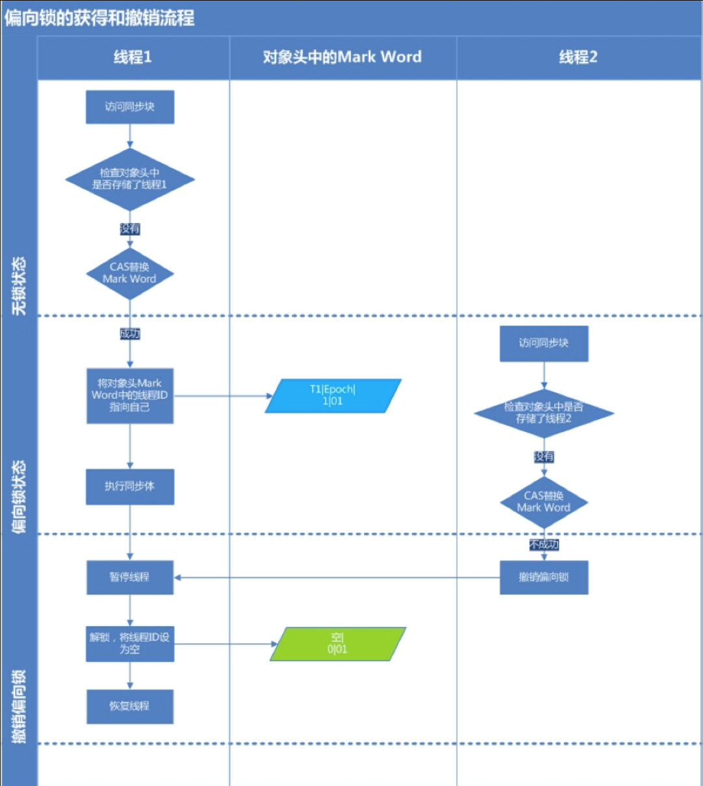

# Java中的锁

## JAVA对象头

- 对象自身的运行时数据
  如：哈希吗（HashCode）、GC分代年龄(Generational GC Age)等，这部分数据的长度在32位和64位的虚拟机中分别为32bit和64bit，简称“Mark Word”

- 如果对象是数组类型，则虚拟机用3个Word（字宽）存储对象头，如果对象是非数组类型，则用2Word存储对象头。

- 指向方法区对象类型数据的指针，如果是数组对象的话，还会有一个额外的部分用于存储数组长度。

- 对象头信息是与对象自身定义的数据无关的额外存储成本。它会根据对象的状态复用自己的存储空间。例如：在32位的HotSpot虚拟机中对象未被锁定的状态下，Mark Word的32bit空间中的25bit用于存储对象哈希吗（HashCode），4bit用于存储对象分代年龄，2bit用于存储锁标志位，1bit固定为0

- ### 其他状态下对象的存储内容

  锁状态包括：轻量级锁定、重量级锁定、GC标记、可偏向

  32位JVM的Mark Word的默认存储结构如下：

  

  64位JVM下， Mark Word是64bit大小的，存储结构如下：

  

## 偏向锁

- 优点：消除数据在无竞争情况下的同步原语，提高性能。
- 偏向锁与轻量级锁理念上的区别：
  - 轻量级锁：在无竞争的情况下使用CAS操作去消除同步使用的互斥量
  - 偏向锁：线程在进入和推出同步代码块的时候不需要进行CAS操作来加锁和解锁，只需要测试一下对象头中的`MARK WORD`里是否存储着指向当前线程的偏向锁。如果测试成功，表示已经获得锁，如果失败，测试一下`mark word`中偏向锁的标识是否为1(表示当前锁是偏向锁),如果没有设置，则使用CAS竞争锁,如果设置了,尝试使用CAS将对象头偏向锁指向当前线程。
- 意义：锁偏向于第一个获得它的线程。如果在接下来的执行过程中，该锁没有被其他的线程获取，则持有偏向锁的线程将永远不需要再进行同步。
- 相关参数：
  - 默认-XX:+UseBiasedLocking=true
  - -XX:-UseBiasedLocking=false关闭偏向锁
  - 应用程序启动几秒钟之后才激活
  - -XX：BiasedLockingStartupDelay = 0关闭延迟

+ 偏向锁的获得和撤销流程:
  + 

## 轻量锁

如果说偏向锁是为了解决同步代码在单线程下访问性能问题，那么轻量锁是为了解决**减少无实际竞争情况下，使用重量级锁产生的性能消耗**

+ 加锁:轻量锁，顾名思义，轻量是相对于重量的问题，使用轻量锁时，不需要申请互斥量(mutex),而是将mark word中的信息复制到当前线程的栈中(Displaced Mark Word)，然后通过cas尝试修改mark word并替换成轻量锁，如果替换成功则执行同步代码。如果此时有线程2来竞争，并且他也尝试cas修改mark word但是失败了，那么线程2会进入自旋状态，如果在自旋状态也没有修改成功，那么轻量锁将膨胀成状态，mark word会被修改成重量锁标记(10) ,线程进入阻塞状态。
+ 解锁:首先使用CAS操作将Displace Mark Word 替换到原来的对象头中，如果成功,表示没有竞争发生，如果失败，表示当前锁存在竞争(下图的线程二就是在线程一释放锁的竞争锁，导致锁膨胀为重量锁)，锁就会膨胀成重量级锁。

当然，由于轻量级锁天然瞄准不存在锁竞争的场景，如果存在锁竞争但不激烈，仍然可以用自旋锁优化，*自旋失败后再膨胀为重量级锁*。

## 重量锁

在jvm规范中，synchronized是基于监视器锁(monitor)来实现的，它会在同步代码之前添加一个`monitorenter`指令，获取到该对象的monitor，同时它会在同步代码结束处和异常处添加一个`monitorexit`指令去释放该对象的monitor,需要注意的是每一个对象都有一个monitor与之配对，当一个monitor被获取之后 也就是被`monitorenter`，它会处于一个锁定状态，其他尝试获取该对象的monitor的线程会获取失败，只有当获取该对象的monitor的线程执行了`monitorexit`指令后，其他线程才有可能获取该对象的monitor成功。

所以从上面描述可以得出，监视器锁就是`monitor`它是互斥的(mutex)。由于它是互斥的，那么它的操作成本就非常的高，包括系统调用引起的内核态与用户态切换、线程阻塞造成的线程切换等。因此，后来称这种锁为“重量级锁”。

## 优缺点对比

| 锁               | 优点                                                         | 缺点                                          | 适用场景                                                  |
| ---------------- | ------------------------------------------------------------ | --------------------------------------------- | --------------------------------------------------------- |
| 偏向锁(乐观)     | 加锁和解锁不需要额外的消耗，和执行非同步方法相比仅存在纳秒级的差距 | 如果线程间存在锁竞争，会带来额外的锁撤销消耗  | 适用于只有一个线程访问同步块的场景（那还开个线程搞毛线... |
| 轻量级锁（乐观） | 竞争的线程不会阻塞，提高了程序的响应速度。                   | 如果始终得不到锁竞争的线程，使用自旋会消耗cpu | 追求响应时间，同步块执行速度非常块                        |
| 重量级锁         | 线程竞争不使用自旋                                           | 线程阻塞，响应时间缓慢                        | 追求吞吐量,同步块执行速度长                               |

## Lock 接口

