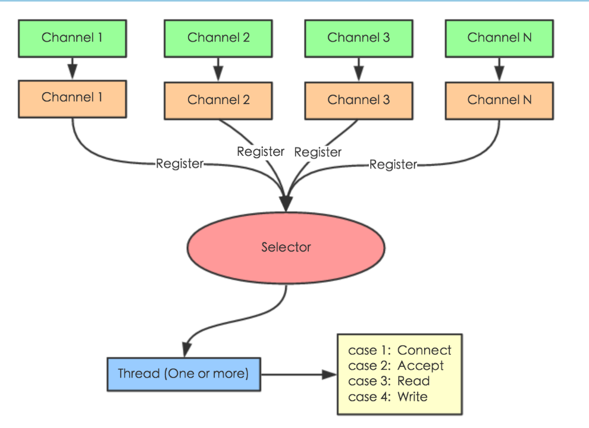
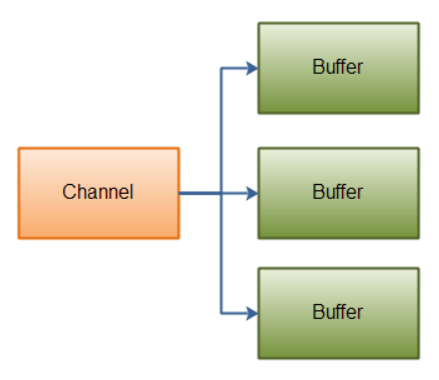
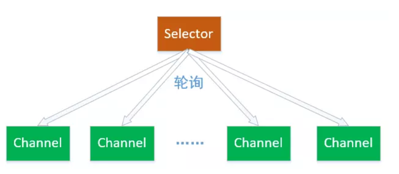
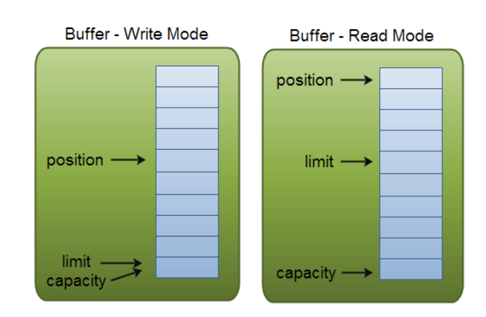
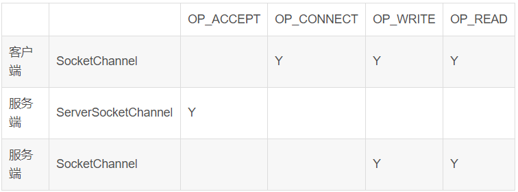

+ 在java io中，核心概念为流（Stream)，面向流的编程，一个流要么是输出流，要么是输入流，不能够同时是输出流又同时是输入流。

+ java nio中有三个核心概念，Selector,Channel，Buffer，在Nio中，我们是面向块（block)或者缓冲区（buffer)编程。Buffer本身是一块内存，底层实际就是数组，数据的读写，都是通过Buffer来实现的。

+ **Buffer**:提供了对于数据的结构化访问方式，并且可以追踪到系统的读写过程。在java中，七种原生数据类型都有各自的Buffer类型，如**IntBuffer,LongBuffer,ByteBuffer...** **Buffer使用flip()方法来改变读写状态**

+ **Channel**:可以向其中写入或是从中读取数据的对象，类似于java.io中的Stream。所有的Channel的数据读写都是通过Buffer来进行的，永远不能直接向Channel直接读取对象或者直接写入对象。

+ **Selector**:**Selector** 一般称 为**选择器** ，当然你也可以翻译为 **多路复用器** 。它是Java NIO核心组件中的一个，用于检查一个或多个NIO Channel（通道）的状态是否处于可读、可写。如此可以实现单线程管理多个channels,也就是可以管理多个网络链接。

+ Nio结构模型

  

+ Channel与Buffer的关系

  

+ Selector:

  

  

### Buffer&Channel _Examples

1. Buffer的读写

   ```java
   public class NioTest1 {
       public static void main(String[] args) {
           IntBuffer intBuffer = IntBuffer.allocate(10);
   
           for (int i = 0; i < intBuffer.capacity(); i++) {
               int randomNumber = new Random().nextInt(20);
               intBuffer.put(randomNumber);
           }
           //状态反转，使buffer成为可读状态
           intBuffer.flip();
   
           while (intBuffer.hasRemaining()) {
               System.out.println(intBuffer.get());
           }
       }
   }
   ```

2. 通过Channel把文件读取到程序中(需要使用FileInputStream)

   ```java
   
   public class NioTest2 {
       public static void main(String[] args) throws IOException {
   
   
           //传统io读取数据
           BufferedReader bufferedReader = new BufferedReader(new InputStreamReader(new FileInputStream("src/main/java/com/zakl/nio/NioTest2.txt"),"UTF-8"));
   
           while (bufferedReader.ready()) {
               System.out.println(bufferedReader.readLine());
           }
   
           System.out.println("----------");
   
           //nio读取数据
           ByteBuffer byteBuffer = ByteBuffer.allocate(512);
           FileChannel fileChannel = new FileInputStream("src/main/java/com/zakl/nio/NioTest2.txt").getChannel();
   
           //将Channel中的数据读取到byteBuffer中
           fileChannel.read(byteBuffer);
   
           //改变bytebuffer状态，由可写变成可读
           byteBuffer.flip();
   
           while (byteBuffer.hasRemaining()) {
               System.out.print((char) byteBuffer.get());
           }
       }
   }
   ```

3. 通过Channel将数据写入到文件中(需要使用FileOutputStream)

   ```java
   public class NioTest3 {
       public static void main(String[] args) throws IOException {
           FileOutputStream fileOutputStream = new FileOutputStream("src/main/java/com/zakl/nio/NioTest3.txt");
           FileChannel channel = fileOutputStream.getChannel();
   
           ByteBuffer byteBuffer = ByteBuffer.allocate(512);
   
           byte[] messages = "message test".getBytes();
   
           for (int i = 0; i < messages.length; i++) {
               byteBuffer.put(messages[i]);
           }
           byteBuffer.flip();
   
           //将byteBuffer中的消息写入到channel中
           channel.write(byteBuffer);
   
           channel.close();
           fileOutputStream.close();
       }
   }
   ```

### Buffer的三个特性：capacity,  limit ,  position （要理解读写模式，是相对的，channel.read(buffer)是将channel中数据读取到buffer中，此时buffer是写模式，buffer的put也是写模式。反之亦然）

​     **0<=mark<=position<=limit<=capacity**

1. capacity:构建Buffer时进行初始化，全局不可变。
2. position: 永远指向下一个读或者写的元素索引。
3. limit:默认位置为capacity的值，当调用flip()时，limit位置指向方法调用前的position位置。
4. 

+ flip()使得buffer由可写变成可读状态，limit=position,position=0 
+ clear()使得变成可写状态，limit=capacity,position=0
+ rewind()重新使得position的位置置于0;数据不变,可以继续执行读操作，重复取出buffer中的数据

### 单个Channel与多个Buffer的交互(Scattering与Gathering):

```java
public class NioTest11 {
    public static void main(String[] args) throws IOException {
        ServerSocketChannel serverSocketChannel = ServerSocketChannel.open();
        InetSocketAddress address = new InetSocketAddress(8899);
        //服务器监听8899端口
        serverSocketChannel.socket().bind(address);
        int messageLength = 2 + 3 + 4;
        ByteBuffer[] byteBuffers = new ByteBuffer[3];
        byteBuffers[0] = ByteBuffer.allocate(2);
        byteBuffers[1] = ByteBuffer.allocate(3);
        byteBuffers[2] = ByteBuffer.allocate(4);

        SocketChannel socketChannel = serverSocketChannel.accept();

        while (true) {
            int bytesRead = 0;
            while (bytesRead < messageLength) {
                //将buffer数组进行写入操作。第一个满了就写第二个，返回该次写入的总长度
                long r = socketChannel.read(byteBuffers);
                bytesRead += r;
                System.out.println("byteRead:" + bytesRead);
                //stream将每一个buffer对象转化成String对象
                Arrays.asList(byteBuffers).stream().map(buffer->"position:"+buffer.position()+"limit:"+buffer.limit()).forEach(System.out::println);
            }
            Arrays.asList(byteBuffers).forEach(byteBuffer -> {
                byteBuffer.flip();
            });
            long byteWritten =0;
            while (byteWritten < messageLength) {
                long r = socketChannel.write(byteBuffers);
                byteWritten += r;
            }
            Arrays.asList(byteBuffers).forEach(byteBuffer -> byteBuffer.clear());
            System.out.println("bytesRead:" + bytesRead + ",bytesWritten:" + byteWritten + ",messageLength:"+messageLength);
        }

    }
}
```

​	

## selector（多路复用器）  

​	**用于检查一个或多个NIO Channel的状态是否处于可读、可写。如此可以实现单线程管理多个channels,也就是可以管理多个网络链接。**

1. Registered key-set:

   ​	所有与选择器关联的通道所生成的键的集合称为已经注册的键的集合。并不是所有注册过的键都仍然有效。这个	集合通过 **keys()** 方法返回，并且可能是空的。这个已注册的键的集合不是可以直接修改的；试图这么做的话将	引发java.lang.UnsupportedOperationException。

   ​	

2. selected-key:

   ​	所有与选择器关联的通道所生成的键的集合称为已经注册的键的集合。并不是所有注册过的键都仍然有效。这个	集合通过 **keys()** 方法返回，并且可能是空的。这个已注册的键的集合不是可以直接修改的；试图这么做的话将	引发java.lang.UnsupportedOperationException。

   

3. cancelled-key:

   ​	已注册的键的集合的子集，这个集合包含了 **cancel()** 方法被调用过的键(这个键已经被无效化)，但它们还没有被	注销。这个集合是选择器对象的私有成员，因而无法直接访问。

   ​	**注意：** 当键被取消（ 可以通过**isValid( )** 方法来判断）时，它将被放在相关的选择器的已取消的键的集合里。注	册不会立即被取消，但键会立即失效。当再次调用 **select( )** 方法时（或者一个正在进行的select()调用结束     	时），已取消的键的集合中的被取消的键将被清理掉，并且相应的注销也将完成。通道会被注销，而新的	    	SelectionKey将被返回。当通道关闭时，所有相关的键会自动取消（记住，一个通道可以被注册到多个选择器	上）。当选择器关闭时，所有被注册到该选择器的通道都将被注销，并且相关的键将立即被无效化（取消）。一	旦键被无效化，调用它的与选择相关的方法就将抛出CancelledKeyException。

   

+ Channel与Selector与SelectionKey的关系

  + Channel的四个events:

    ```java
    SelectionKey.OP_ACCEPT  //接收就绪,一般用于服务器判断是否可以接收
    SelectionKey.OP_CONNECT //连接就绪，一般用户客户端判断是否连接成功
    SelectionKey.OP_READ	//读取就绪
    SelectionKey.OP_WRITE   //写入就绪
    ```

    

  + 注册Channel到Selector

    ```java
    int ops = SelectionKey.OP_ACCEPT | SelectionKey.OP_CONNECT;//表示要关注的channel状态集合
    SelectionKey register(Selector sel, int ops)  //所需参数为selector对象，需要关注的Channel集合。由非阻塞Channel调用， FileChannel（阻塞Channel）对象不可调用.返回当前一个SelectKey对象
    ```

  + SelectionKey:表示了一个特定的通道对象和一个特定的选择器对象之间的注册关系。

    ```JAVA
    key.attachment(); //返回SelectionKey的attachment，attachment可以在注册channel的时候指定。
    key.channel(); // 返回该SelectionKey对应的channel。
    key.selector(); // 返回该SelectionKey对应的Selector。
    key.interestOps(); //返回代表需要Selector监控的IO操作的bit mask
    key.readyOps(); // 返回一个bit mask，代表在相应channel上可以进行的IO操作。
    ```

  + 判断Selector是否对某个Channel的某种event感兴趣

    ```java
    int interestSet = selectionKey.interestOps(); 
    boolean isInterestedInAccept = (interestSet & SelectionKey.OP_ACCEPT) == SelectionKey.OP_ACCEPT；
    boolean isInterestedInConnect = interestSet & SelectionKey.OP_CONNECT;
    boolean isInterestedInRead = interestSet & SelectionKey.OP_READ;
    boolean isInterestedInWrite = interestSet & SelectionKey.OP_WRITE;
    ```

  + 判断某个Channel的操作是否准备就绪（readyOps()）

    ```java
    //创建ready集合的方法
    int readySet = selectionKey.readyOps();
    //检查这些操作是否就绪的方法
    boolean isAcceptable=key.isAcceptable();//是否可读，是返回 true
    boolean isWritable()：//是否可写，是返回 true
    boolean isConnectable()：//是否可连接，是返回 true
    boolean isAcceptable()：//是否可接收，是返回 true
    ```

  + 通过SelectionKey访问其对应的Chnnel与Selector

    ```java
    Channel channel = key.channel();
    Selector selector = key.selector();
    ```

  + 将更多的信息附着在SelectionKey上：

    ```java
    key.attach(theObject);
    Object attachedObj = key.attachment();
    //或者在注册时想Selector中附加对象
    SelectionKey key = channel.register(selector, interestSet, theObject);
    ```

    

### 一个典型的Nio聊天程序

客户端

```java

public class NioClient {
    public static void main(String[] args) throws Exception {
        SocketChannel socketChannel = SocketChannel.open();
        socketChannel.configureBlocking(false);
        Selector selector = Selector.open();
        //对连接感兴趣
        socketChannel.register(selector, SelectionKey.OP_CONNECT);
        //连接到远程服务器
        socketChannel.connect(new InetSocketAddress(8989));


        while (true) {
            selector.select();
            Set<SelectionKey> selectionKeys = selector.selectedKeys();
            selectionKeys.forEach(selectionKey -> {
                try {

                    if (selectionKey.isConnectable()) {
                        SocketChannel client = (SocketChannel) selectionKey.channel();
                        //判断是否处于连接过程中
                        if (client.isConnectionPending()) {
                            //完成连接
                            client.finishConnect();
                            ByteBuffer byteBuffer = ByteBuffer.allocate(1024);
                            byteBuffer.put((LocalDateTime.now() + client.getLocalAddress().toString() + "连接成功").getBytes());
                            byteBuffer.flip();
                            client.write(byteBuffer);
                            //接受键盘输入
                            ExecutorService executorService = Executors.newSingleThreadExecutor(Executors.defaultThreadFactory());
                            executorService.submit(() -> {
                                while (true) {
                                    try {
                                        InputStreamReader inputStreamReader = new InputStreamReader(System.in);
                                        BufferedReader bufferedReader = new BufferedReader(inputStreamReader);
                                        String msg = bufferedReader.readLine();
                                        byteBuffer.clear();
                                        byteBuffer.put(msg.getBytes());
                                        byteBuffer.flip();
                                        client.write(byteBuffer);
                                    } catch (Exception e) {
                                        e.printStackTrace();
                                    }
                                }
                            });
                        }
                        client.register(selector, SelectionKey.OP_READ);
                    } else if (selectionKey.isReadable()) {
                        SocketChannel socketChannel1 = (SocketChannel) selectionKey.channel();
                        ByteBuffer byteBuffer = ByteBuffer.allocate(1024);
                        try {
                            int read = socketChannel1.read(byteBuffer);
                            if (read > 0) {
                                byteBuffer.flip();
                                System.out.println(new String(byteBuffer.array(), 0, read));
                            }
                        } catch (Exception e) {
                            System.out.println(socketChannel1.getRemoteAddress().toString() + "断开连接");

                            socketChannel1.close();
                        }

                    }

                } catch (Exception e) {
                    e.printStackTrace();
                }
            });
            selectionKeys.clear();
        }

    }
}

```

服务端：

```java
public class NioServer {
    private static Map<String, SocketChannel> clientMap = new HashMap<>();

    public static void main(String[] args) throws IOException {
        ServerSocketChannel serverSocketChannel = ServerSocketChannel.open();
        serverSocketChannel.configureBlocking(false);
        //绑定监听8899端口
        ServerSocket socket = serverSocketChannel.socket();
        socket.bind(new InetSocketAddress(8989));
        Selector selector = Selector.open();
        serverSocketChannel.register(selector, SelectionKey.OP_ACCEPT);

        while (true) {
            try {
                selector.select();
                Set<SelectionKey> selectionKeys = selector.selectedKeys();
                selectionKeys.forEach(
                        selectionKey -> {
                            final SocketChannel socketChannel;
                            try {
                                if (selectionKey.isAcceptable()) {
                                    ServerSocketChannel server = (ServerSocketChannel) selectionKey.channel();
                                    socketChannel = server.accept();
                                    System.out.println("客户端：" + socketChannel.getRemoteAddress() + "已经通过端口：" + socketChannel.getLocalAddress() + "连接");
                                    socketChannel.configureBlocking(false);
                                    socketChannel.register(selector, SelectionKey.OP_READ);
                                    clientMap.put("[" + UUID.randomUUID().toString() + "]", socketChannel);
                                    selectionKeys.remove(selectionKey);
                                } else if (selectionKey.isReadable()) {
                                    ByteBuffer byteBuffer = ByteBuffer.allocate(512);
                                    socketChannel = (SocketChannel) selectionKey.channel();
                                    try {
                                        int read = socketChannel.read(byteBuffer);
                                        if (read > 0) {
                                            byteBuffer.flip();
                                            Charset charset = Charset.forName("utf-8");
                                            String receiveMsg = String.valueOf(charset.decode(byteBuffer).array());
                                            System.out.println(socketChannel + ":" + receiveMsg);

                                            for (Map.Entry<String, SocketChannel> entry : clientMap.entrySet()) {
                                                SocketChannel returnMsg = entry.getValue();
                                                ByteBuffer msgByffer = ByteBuffer.allocate(1024);
                                                msgByffer.put(("senderkey:" + entry.getKey() + receiveMsg).getBytes());
                                                msgByffer.flip();
                                                returnMsg.write(msgByffer);
                                            }
                                        }
                                    } catch (Exception e) {
                                        System.out.println(socketChannel.getRemoteAddress().toString() + "断开连接");
                                        socketChannel.close();
                                        String senderkey = null;
                                        for (Map.Entry<String, SocketChannel> entry : clientMap.entrySet()) {
                                            if (entry.getValue() == socketChannel) {
                                                senderkey = entry.getKey();
                                                break;
                                            }
                                        }
                                        clientMap.remove(senderkey, socketChannel);
                                    }
                                    selectionKeys.remove(selectionKey);
                                }
                            } catch (Exception e) {
                                e.printStackTrace();
                            }
                        }
                );
            } catch (Exception e) {
                e.printStackTrace();
            }
        }

    }


}
```

