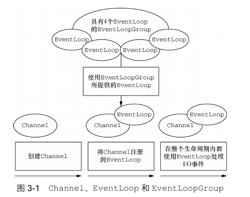
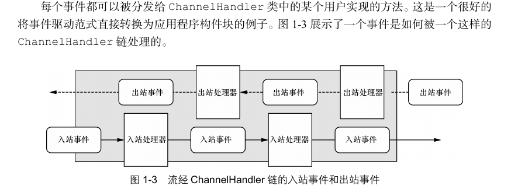
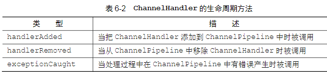
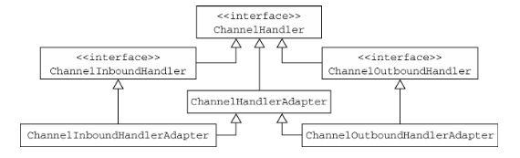
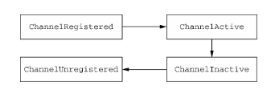

# NETTY


## 核心名词

+ channel:Socket

  + 基本的I/O操作(bind(),connect(),read(),write()) 依赖于底层网络传输所提供的原语.
  + 部分实现:
    + EmbeddedChannel:嵌入式设备使用的Channel
    + LocalServerChannel:用于本地传输的ServerChannel ，允许进行VM通信
    + NioDatagramChannel:发送和接收AddressedEnvelope的NIO数据报Channel   。
    + NioSctpChannel: 该实现使用非阻塞模式，并允许将SctpMessage读/写到基础SctpChannel 。 请注意，并非所有操作系统都支持SCTP。Java 7+上受支持
    + NioSocketChannel: SocketChannel使用基于NIO选择器的实现

+ EventLoop:控制流,多线程处理,并发

  + EventLoop 定义了Netty的核心抽象,用于处理连接的生命周期所发生的事件

    

  + 图中各成员关系:

    + 一个EvevtLoopGroup包含一个或多个EventLoop
    + 一个EventLoop在它的生命周期内只和一个Thread绑定
    + 所有由EventLoop处理的I/O时间都将在它专有的Thread上处理
    + 一个Channel在他的生命周期内只注册于一个EventLoop
    + 一个EventLoop可能会被分配给一个或多个Channel

+ **ChannelFuture**:异步通知

  + Netty中所有的I/O操作都是异步的。因为一个操作可能不会立即返回，所以我们需要一种用于在之后的某个时间点确定其结果的方法。为此，Netty提供了ChannelFuture接口

+ **ChannelHandler**:处理I / O事件或拦截I / O操作，并将其转发到其ChannelPipeline下一个处理程序。
  子类型ChannelHandler本身并不提供许多方法，但是通常必须实现其子类型之一

  + ChannelInboundHandler处理入站I / O事件，以及ChannelOutboundHandler处理出站I / O操作。

  + 另外，为了方便，提供了以下适配器类：ChannelInboundHandlerAdapter处理入站I / O事件，
    ChannelOutboundHandlerAdapter来处理出站I / O操作，以及ChannelDuplexHandler处理入站和出站事件

  + 在Netty中，有两种发送消息的方式:

    + 直接写到Channel中(需要先获取channel)(消息从Channel-Pipeline的尾端开始流动)

      ```java
      ctx.channel().write("abc")
      Override
      public final ChannelFuture write(Object msg) {
          return tail.write(msg);
      }
      ```

    + 写到和Channel-Handler相关联的ChannelHandlerContext对象:(消息从ChannelPipeline中的下一个Channel-Handler开始流动)

      ```java
      ctx.write("abc")
      @Override
      public ChannelFuture write(Object msg) {
          return pipeline.write(msg);
      }
      ```


+ **ChannelPipeline**:

  每一个新创建的Channel都将会被分配一个新的ChannelPipeline。这项关联是永久性的；Channel既不能附加另外一个ChannelPipeline，也不能分离其当前的。在Netty组件的生命周期中，这是一项固定的操作，不需要开发人员的任何干预.

  **ChannelPipeline**提供了**ChannelHandler**链的容器，并定义了用于在该链上传播入站和出站事件流的API。当Channel被创建时，它会被自动地分配到它专属的ChannelPipeline。ChannelHandler安装到ChannelPipeline中的过程如下所示：


  + 一个ChannelInitializer的实现被注册到了ServerBootstrap中

  + 当ChannelInitializer.initChannel()方法被调用时，ChannelInitializer将在ChannelPipeline中安装一组自定义的ChannelHandler

  + ChannelInitializer将它自己从ChannelPipeline中移除

  + 责任链调用:

    ```kotlin
    ch.pipeline().addLast(TimeDecoder(), TimeClientHandler(),TimeClientHandler2())
    
    //handhler
    
    class TimeClientHandler : ChannelInboundHandlerAdapter() {
        override fun channelRead(ctx: ChannelHandlerContext, msg: Any) {
            val unixTime = msg as UnixTime
            println(unixTime)
            //此处如果不调用super方法,入站调用将在此处停止
            super.channelRead(ctx, msg)
        }
    }
    
    class TimeClientHandler2 : ChannelInboundHandlerAdapter() {
        override fun channelRead(ctx: ChannelHandlerContext, msg: Any) {
            val unixTime = msg as UnixTime
            println("2$unixTime")
            super.channelRead(ctx, msg)
        }
    }
    
    // Adapter提供的调用实现   
    @Override
    public void channelRead(ChannelHandlerContext ctx, Object msg) throws Exception {
        ctx.fireChannelRead(msg);
    }
    //通过super 方法是为了调用AbstractChannelHandlerContext 中的方法,进行进行责任链调用.
    @Override
    public ChannelHandlerContext fireChannelRead(final Object msg) {
        invokeChannelRead(findContextInbound(MASK_CHANNEL_READ), msg);
        return this;
    }
    ```

  + channelPipeline调用链

```
*  +---------------------------------------------------+---------------+
*  |                           ChannelPipeline         |               |
*  |                                                  \|/              |
*  |    +---------------------+            +-----------+----------+    |
*  |    | Inbound Handler  N  |            | Outbound Handler  1  |    |
*  |    +----------+----------+            +-----------+----------+    |
*  |              /|\                                  |               |
*  |               |                                  \|/              |
*  |    +----------+----------+            +-----------+----------+    |
*  |    | Inbound Handler N-1 |            | Outbound Handler  2  |    |
*  |    +----------+----------+            +-----------+----------+    |
*  |              /|\                                  .               |
*  |               .                                   .               |
*  | ChannelHandlerContext.fireIN_EVT() ChannelHandlerContext.OUT_EVT()|
*  |        [ method call]                       [method call]         |
*  |               .                                   .               |
*  |               .                                  \|/              |
*  |    +----------+----------+            +-----------+----------+    |
*  |    | Inbound Handler  2  |            | Outbound Handler M-1 |    |
*  |    +----------+----------+            +-----------+----------+    |
*  |              /|\                                  |               |
*  |               |                                  \|/              |
*  |    +----------+----------+            +-----------+----------+    |
*  |    | Inbound Handler  1  |            | Outbound Handler  M  |    |
*  |    +----------+----------+            +-----------+----------+    |
*  |              /|\                                  |               |
*  +---------------+-----------------------------------+---------------+
*                  |                                  \|/
*  +---------------+-----------------------------------+---------------+
*  |               |                                   |               |
*  |       [ Socket.read() ]                    [ Socket.write() ]     |
*  |                                                                   |
*  |  Netty Internal I/O Threads (Transport Implementation)            |
*  +-------------------------------------------------------------------+
```




## ByteBuf

+ release(最后一个负责):

  + 如果一个[发送]组件应该将一个引用计数的对象传递给另一个[接收]组件，发送组件通常不需要销毁它，而是将这个决定推迟到接收组件。

  + 如果一个组件消耗了一个引用计数的对象，并且知道没有任何其他的东西会再访问它（即不把一个引用传递给另一个组件），该组件应该销毁它。

  + **注意**:在**SimpleChannelInboundHandler**和**ByteToMessageDecoder**以及**MessageToByteEncoder** 不需要手动释放计数对象.

  + ```java
    public ByteBuf a(ByteBuf input) {
        input.writeByte(42);
        return input;
    }
    
    public ByteBuf b(ByteBuf input) {
        try {
            output = input.alloc().directBuffer(input.readableBytes() + 1);
            output.writeBytes(input);
            output.writeByte(42);
            return output;
        } finally {
            input.release();
        }
    }
    
    public void c(ByteBuf input) {
        System.out.println(input);
        input.release();
    }
    
    public void main() {
        ...
        ByteBuf buf = ...;
        // This will print buf to System.out and destroy it.
        c(b(a(buf)));
        assert buf.refCnt() == 0;
    }
    ```

  + why should manually release() byteBuf?

    + **direct ByteBuffer** 是被直接创建在系统内核空间,非堆内存中,无法被JAVA GC所捕捉释放.
    + 堆缓冲区在被内核处理之前，当你在执行I/O操作的时候，需要将其复制到直接内存中。当你使用直接缓冲区时，你可以省去这种复制操作，这就是使用直接缓冲区的主要优点。缺点是直接内存分配比从java堆分配要贵，所以Netty引入了pooling概念。


## ChannelHandler

+ ChannelHandler的生命周期

  

  

+ ChannelInboundHandler:处理入站数据以及各种状态变化.

  + ChannelInboundHandlerAdapter(): 适配器
  + SimpleChannelInboundHandler(): 适配器

+ ChannelOutboundHandler:处理出站数据并且允许拦截所有的操作.

  + ChannelOutboundHandlerAdapter():适配器

### channel

+ channel的生命周期

  


## ChannelHandlerContext

​	ChannelHandlerContext代表了ChannelHandler和ChannelPipeline之间的关联， 每  当有ChannelHandler添加到ChannelPipeline中时，  都会创建ChannelHandler-Context。ChannelHandlerContext的主要功能是管理它所关联的ChannelHandler和在同一个ChannelPipeline中的其他ChannelHandler之间的交互.

​	ChannelHandlerContext有很多的方法，其中一些方法也存在于Channel和ChannelPipeline本身上，但是有一点重要的不同。如果调用Channel或者ChannelPipeline上的这些方法，它们将沿着整个ChannelPipeline进行传播。而调用位于ChannelHandlerContext上的相同方法，则 将从当前所关联的ChannelHandler开始，并且只会传播给位于该ChannelPipeline中的下一个能够处理该事件的ChannelHandler。

## 注解

+ **@Sharable**:正常情况下同一个ChannelHandler,的不同的实例会被添加到不同的Channel管理的管线里面的，但是如果你需要全局统计一些信息，比如所有连接报错次数（exceptionCaught）等，这时候你可能需要使用单例的ChannelHandler，需要注意的是这时候ChannelHandler上需要添加@Sharable注解

## 示例应用

+ nettydemo:

```java
public class TestServer {
    private static final int port = 10000;

    public static void main(String[] args) throws InterruptedException {

        //看做一个死循环，程序永远保持运行
        EventLoopGroup bossGroup = new NioEventLoopGroup(); //完成线程的接收，将连接发送给worker
        EventLoopGroup workerGroup = new NioEventLoopGroup(); //完成连接的处理
        try {
            //对于相关启动信息进行封装
            ServerBootstrap serverBootstrap = new ServerBootstrap();
            serverBootstrap
                    .group(bossGroup, workerGroup) //注入两个group
                    .channel(NioServerSocketChannel.class)
                    .childHandler(new TestServerInitializer())
					.option(ChannelOption.SO_BACKLOG, 128) // option()是用于接受传入连接的NioServerSocketChannel
                    .childOption(ChannelOption.SO_KEEPALIVE, true); //childOption()是用于父ServerChannel接受的Channel
            //绑定端口对端口进行监听,启动服务器
            ChannelFuture channelFuture = serverBootstrap.bind(port).sync();
            channelFuture.channel().closeFuture().sync();
        } finally {
            bossGroup.shutdownGracefully();
            workerGroup.shutdownGracefully();
        }
    }
}

```

Initializer：

```java
public class TestServerInitializer extends ChannelInitializer<SocketChannel> {
    @Override
    protected void initChannel(SocketChannel ch) throws Exception {
        //类似于一个拦截器链
        ChannelPipeline pipeline = ch.pipeline();

        pipeline.addLast("httpServerCodec", new HttpServerCodec()); //对于web请求进行编解码作用
        pipeline.addLast("testHttpServerHandler", new TestHttpServerHandler());

    }
}
```

自定义处理器ServerHandler(用作逻辑处理)

```java
public class TestHttpServerHandler extends SimpleChannelInboundHandler<HttpObject> {
    //读取客户端发过来的请求，并且向客户端响应
    @Override
    protected void channelRead0(ChannelHandlerContext ctx, HttpObject msg) throws Exception {
        if (msg instanceof HttpRequest) {
            HttpRequest httpRequest = (HttpRequest) msg;

            //设置响应内容，以及响应编码格式
            ByteBuf content = Unpooled.copiedBuffer("Hello World", CharsetUtil.UTF_8);
            //指定http协议，响应状态码，响应内容
            FullHttpResponse response = new DefaultFullHttpResponse(HttpVersion.HTTP_1_1, HttpResponseStatus.OK, content);
            response.headers().set(HttpHeaderNames.CONTENT_TYPE, "text/plain"); //设置响应类型
            response.headers().set(HttpHeaderNames.CONTENT_LENGTH, content.readableBytes()); //设置响应字节长度

            //将内容返回到客户端
            ctx.writeAndFlush(response);
            ctx.channel().close(); //关闭连接
        }
    }

    @Override
    public void channelActive(ChannelHandlerContext ctx) throws Exception {
        System.out.println("channel active");
        super.channelActive(ctx);
    }

    @Override
    public void channelRegistered(ChannelHandlerContext ctx) throws Exception {
        System.out.println("channel registered");
        super.channelRegistered(ctx);
    }


    @Override
    public void handlerAdded(ChannelHandlerContext ctx) throws Exception {
        System.out.println("handler added");
        super.handlerAdded(ctx);
    }

    @Override
    public void channelInactive(ChannelHandlerContext ctx) throws Exception {
        System.out.println("channel inactive");
        super.channelInactive(ctx);
    }

    @Override
    public void channelUnregistered(ChannelHandlerContext ctx) throws Exception {
        System.out.println("channel unregister");
        super.channelUnregistered(ctx);
    }

}
```


服务端心跳检测：

+ 如果设备断网或者断电后，channelInactive并不会被触发,则需要服务端主动进行监控客户端连接

+ 使用redis解决：

  + 使用redis来实现，每次设备发起心跳，server就更新一次redis，当设备断网超过一定时间，则redis中数据失效。这时候就认为设备失联，可以发送告警。
    每次server重启，从数据库中读取所有设备号，然后储存在内存中，同时启动一个线程，定时根据设备号去redis中获取数据，如果有，则认为设备在线，如果没有，则设备失联。

+ 使用IdleStateHandler:

  + dleStateHandler中的三个参数解释如下：

    1. readerIdleTime：为读超时时间；

    2. writerIdleTime：为写超时时间；

    3. allIdleTime：所有类型的超时时间；

       这里最重要是的readerIdleTime，当设置了readerIdleTime以后，服务端server会每隔readerIdleTime时间去检查一次channelRead方法被调用的情况，如果在readerIdleTime时间内该channel上的channelRead()方法没有被触发，就会调用userEventTriggered方法。


## others

+ **handle**r和**childHandler:**
  + handler在**初始化时**就会执行，而**childHandler**会在客户端成功connect后才执行，这是两者的区别。

+ websocket协议：ws://server:port/content_path

+ rmi: remote method invocation,只针对java
  + client: stub
  + server: skeleton
+ 序列化与反序列化: 编码与解码
+ RPC: Remote Procedure Call ,远程过程调用，很多RPC框架是跨语言的
  + 定义一个接口说明文件:描述了对象(结构体),对象成员,接口方法等一系列文件
  + 通过RPC框架所提供的编译器，将接口说明文件编译成具体语言文件。
  + 在客户端与服务器端分别引入RPC编译器所生成的文件，即可像调用本地方法一样调用远程方法。
  + 一般通过socket传输


+ ChannelFuture  ChannelFuture的作用是用来保存Channel异步操作的结果。

+ ChannelPipeline ： 可以看做是ChannelHandler的链表，用来添加不同的ChannelHandler

+ tcp每次交换数据,不保证数据会被一次性全部接收,有可能会存在,单次发送数据被分片接收.但是作为一个面向流的协议,tcp保证了数据片将会按照服务器发给他们的顺序接收.