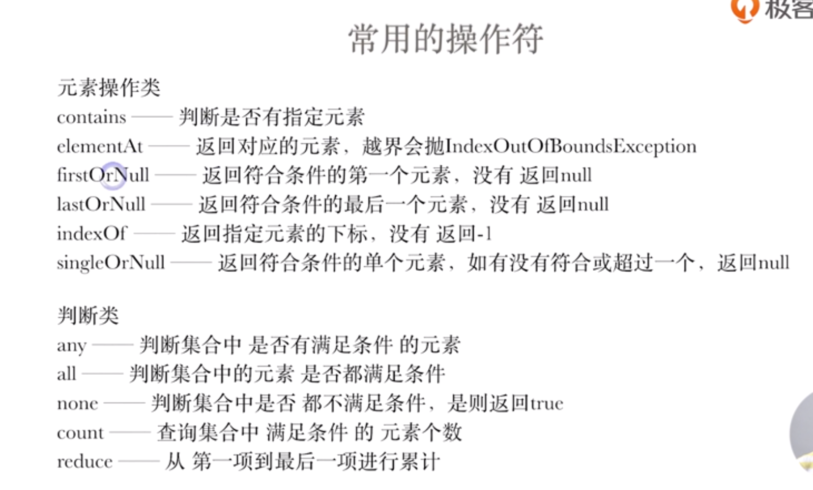
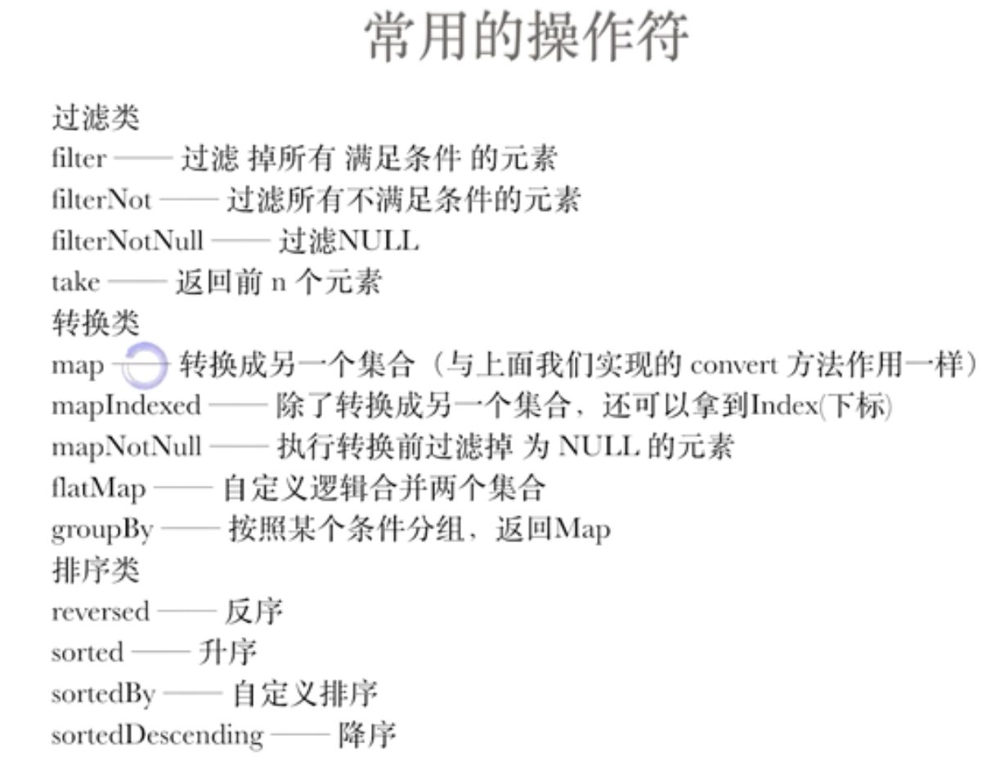
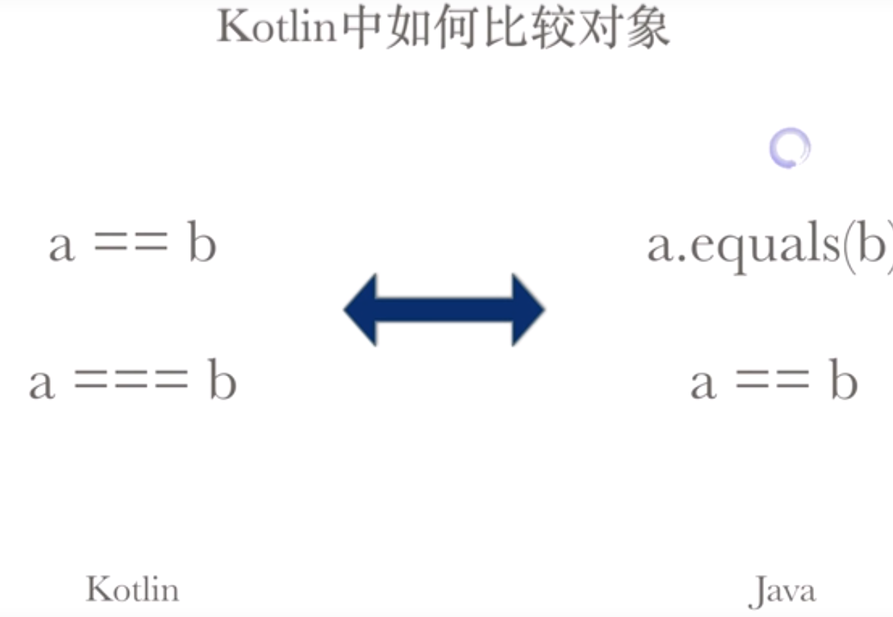

# Kotlin

### 关键字

1. Object:

   1. 简化生成静态内部类

   2. 生成匿名内部类对象

   3. 生成单例对象

      ***如果object只是声明，它代表一个静态内部类。如果用变量接收object表达式，它代表一个匿名内部类对象。***

   ```kotlin
   object Admin {
       private var username = "admin"
       private var password = "admin"
   
       fun info(): String {
           return "${this.username}/${this.password}"
       }
   
       fun changePassword(password:String){
           this.password = password
       }
   }
   
   fun main(args: Array<String>) {
       Admin.changePassword("new-password")
       println(Admin.info()) // admin/new-password
   }
   ```

2. 伴生对象：

   1. 可以把伴生对象看成是一个普通Java类的单例对象，因为它最终也是按照普通类对象进行编译的，只不过默认给你生成了一个唯一的实例。
   2. Kotlin为什么没有static的东西，我觉得第一个原因是我们不仅可以引用一个kt文件中的类，也可以引用它所定义的变量以及方法，完全可以用这种方式实现所谓的静态属性以及静态方法；如果前面的方式不能满足需求，companion object带给我们的优势是我们可以像对待其他普通类一样继承类或实现接口，相对于static class给我们带来了更大的自由度

   ```kotlin
   class Admin {
   
       companion object {
           private var username = "admin"
           private var password = "admin"
   
           fun info(): String {
               return "${this.username}/${this.password}"
           }
   
           fun changePassword(password:String){
               this.password = password
           }
       }
   }
   
   fun main(args: Array<String>) {
       Admin.changePassword("new-password")
       println(Admin.info()) // admin/new-password
       Admin.changePassword("new-password2")
       println(Admin.info()) // admin/new-password2
   }
   ```

   

3. By:

   1. 类的代理 class

      ```kotlin
      //kotlin代理 编译后实为java中的静态代理
      interface Animal{
          fun bark()
      }
      
      class Dog : Animal {
          override fun bark() {
              println("DOG's Bark()")
          }
      }
      
      class Zoo(animal: Animal) : Animal by animal {
          override fun bark() {
              println("ZOO’s Bark")
          }
      }
      
      fun main(args: Array<String>) {
          Zoo(Dog()).bark()
      }
      
      ```

      ```kotlin
      interface Base {
          val message: String
          fun print()
      }
      
      class BaseImpl(val x: Int) : Base {
          override val message = "BaseImpl: x = $x"
          override fun print() { println(message) }
      }
      
      class Derived(b: Base) : Base by b {
          // 在 b 的 `print` 实现中不会访问到这个属性
          override val message = "Message of Derived"
      	//但是在复写了print方法后，执行的依然是Derived的print方法调用的本类中的成员变量
      //    override fun print() {
      //        println(message)
      //    }
      }
      
      fun main() {
          val b = BaseImpl(10)
          val derived = Derived(b)
          derived.print()
          println(derived.message)
      }
      ```

   2. 属性延迟加载 lazy

   3. 监听属性变化 Delegates.observable ( 扩展 Delegates.vetoable )

   4. 自定义监听属性变化 ReadWriteProperty

   5. 属性非空强校验 Delegates.notNull()

   6. Map值 映射到类属性 map

4. inner

   1、inner修饰的内部类可理解为java中的非静态内部类，调用方式：

   外部类().内部类().方法()；

   2、kotlin内部类默认为静态的，理解为java中使用static修饰的内部类，调用方式：

   外部类.内部类().方法()；

   3、如果需要在静态内部类中使用外部类，可参考java中实现方式，在内部类中定义外部类弱引用，通过构造方法传入外部类对象；

   ```kotlin
   class InnerTest{
       var a=5
   
       class NotInner{
           fun m1(i: Int):Int {
   //            a=i  编译不通过
               return i + 1
           }
       }
   
       //inner修饰过的内部类可以访问外部内成员变量
       inner class WithInner{
           fun m2(i: Int):Int {
               a=i
               return a
           }
       }
   }
   
   
   fun main(args: Array<String>) {
       print(InnerTest.NotInner().m1(5)) //调用没有被inner修饰过的内部类时，外部类不需要被实例化，类似与java中的静态内部类
       print(InnerTest().WithInner().m2(5)) //InnerTest类需要实例化才能调用被inner修饰过的内部类
   
   }
   ```

5. 解构Operator：

   1. 无date关键词

      ```kotlin
      //解构 方法体必须声明为componentN()
      class Boy(var age: Int, var name: String){
          operator fun component1()=age
          operator fun component2()=name
      }
      
      
      
      fun main(args: Array<String>) {
          var p1 = Person(19, "张三", "张二狗")
          var(age,name,lastname)=p1
      }
      ```

   2. 有date关键字

      ```kotlin
      //数据类中自带了operator操作符，无需使用componentN()函数
      data class Person(val age: Int, val name: String, val lastName: String)
          
          
      fun main(args: Array<String>) {
          var (age, name) = Boy(15, "珠海")
      }
      ```

6. 循环

   ```kotlin
   for(i in 1..10){}//包括10
   for(i in 1 until 10) //不包括10
   for(i in 10 downTo 1)
   for(i in 1..10 step 2) //步进2
   repeat(10){} //循环10次	
   ```


   ```kotlin
   //循环list
   val testList = listOf<String>("a", "b", "c")
   for ((index, value) in testList.withIndex()) {
           print(index.toString()+value)
    }
   ```

7. 作用域函数

   ```kotlin
   //返回lambda表达式结果
   run{...}
   let{...}
   with(T){...}
   //返回上下文对象
   apply{...}
   also{...}
   ```

8. 集合的创建

   Kotlin 没有专门的语法结构创建 list 或 set。 要用标准库的方法，如 `listOf()`、 `mutableListOf()`、 `setOf()`、 `mutableSetOf()`。 在非性能关键代码中创建 map 可以用一个简单的[惯用法](https://www.kotlincn.net/docs/reference/idioms.html#%E5%8F%AA%E8%AF%BB-map)来完成：`mapOf(a to b, c to d)`

   ```kotlin
   val list = mutableListOf<Int>()
   var map: HashMap<Char, Char> = hashMapOf()
   
   ```

   

9. 集合常用操作符

   常用操作符

   

   

10. Lambda闭包

   ```kotlin
    val echo = { name: String -> print(name) }
    echo.invoke("张三")//invoke 调用，操作符重载 等价于下面一条语句
    echo("王二")
   ```

   

11. 高阶函数(使用闭包函数作为参数传入)

   ```kotlin
   //高阶函数
   fun onlyif(age:Int,isDebug: Boolean, block: (a:Int) -> Unit) {
       if (isDebug){
           block(age)
       }
   }
   fun main(args: Array<String>) {
       val lam:(a:Int)->Unit//lambda声明
   
       lam={ print(it + 1)} //lambda表达式实现
   
       onlyif(5,true,lam)//调用方法，传入参数
   }
   ```

11. inline

   通过该关键字来优化代码，编译器将使用函数的定义体来替代函数调用语句，这种替代行为发生在编译阶段而非程序运行阶段

   ```kotlin
    fun plus(i: Int){
        i += 1
    }
    //该段代码会报Val cannot be reassigned的错误,因为kotlin是直接值传递，而java在值传递时候形参实际上是经过一次复制后的新值(内存地址改变，value不变)
   ```

11. sealed关键字

    ```kotlin
    sealed class CompareResult{
        object Less:CompareResult() {
            override fun toString(): String {
                return "小于"
            }
        }
        object More : CompareResult() {
            override fun toString(): String {
                return "大于"
            }
        }
        object Equals : CompareResult() {
            override fun toString(): String {
                return "相等"
            }
        }
    }
    //一旦使用密封类就要用完密封类中所有的子类，不然会编译期报错
    fun check(cr: CompareResult):String {
        when (cr) {
            is CompareResult.Equals -> return cr.toString()
            is CompareResult.More -> return cr.toString()
            is CompareResult.Less -> return cr.toString()
        }
    }
    
    infix fun Int.vs(num: Int): CompareResult =
        if (this > num) {
            CompareResult.More
        }else if (this < num) {
            CompareResult.Less
        }else{
            CompareResult.Equals
        }
    
    fun main(args: Array<String>) {
        print(7 vs 7)
    }
    ```

12. infix关键字

    使用该关键字进行操作符重载

    ```kotlin
    infix fun Int.vs(num: Int): CompareResult =  //自定义了一个操作符vs 该操作符是以拓展函数的放法添加在目标类上的。
        if (this > num) {
            CompareResult.More
        }else if (this < num) {
            CompareResult.Less
        }else{
            CompareResult.Equals
        }
    
    fun main(args: Array<String>) {
        print(7 vs 7)
    }
    ```

13. enum枚举

    ```kotlin
    enum class AE(var age: Int, var lname: String) {
        A(14, "张三") {
            override fun a(a: Int): Int = a + 1
        },
        B(15, "王二") {
            override fun a(a: Int): Int = a + 2
        };
    
        //抽象方法，需要枚举实例自己实现方法
        abstract fun a(a: Int): Int
    
        //每个枚举实例都默认实现该方法跟java枚举一样
        fun b(str: String): String = str + this.lname
    }
    
    fun check(a: AE) {
        when (a) {
            AE.A -> print(a.lname)
            AE.B -> print(a.age)
        }
    }
    
    fun main(args: Array<String>) {
        check(AE.A)
    }
    ```

14. 比较是否相等

    

15. 集合

    kotlin中的集合默认为只读类型,可变类型是在不可变类型前添加Mutable

    获取一个新集合

    ```kotlin
    
    var nums= mutableListOf<Int>()
    ```

    

