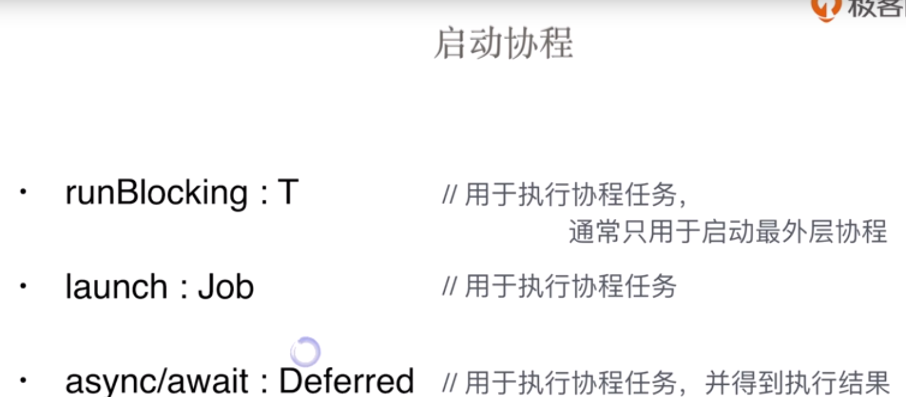

# 协程(使用gradle构建demo)

+ 需要导入的包以及中央库

  ```groovy
  dependencies {
      ...
      implementation "org.jetbrains.kotlinx:kotlinx-coroutines-core:1.1.1"
  }
  repositories {
      jcenter()
  }
  ```

1. 启动协程的几个方法

   1. launch

      ```kotlin
      GlobalScope.launch {
          delay(1000)
          println("Hello")
      }
      ```

   2. runBlocking {}

      ```kotlin
      runBlocking {
          ...
      }
      ```

   3. async/await(返回一个Defferred<T>实例)

      ```kotlin
      //依次返回1到一百万的的数
      val deferred = (1..1_000_000).map { n ->
          GlobalScope.async {
              n
          }
      }
      //挂起函数只被允许在协程或另一个挂起函数中调用，所以讲await()放入runBlocking中挂起，这是异步并行操作
      runBlocking {
          val sum = deferred.sumBy { it.await() }
          println("Sum: $sum")
      }
      ```

      

2. 协程的结束cancel()

   ```kotlin
   fun main(args: Array<String>) = runBlocking { //使用runBlock来进行外部线程和内部协程的切换
       val launch = launch {
           var count: Int = 0
           while (true) {
               count++
               println(count)
               delay(500)
           }
       }
       delay(5000)
       println("准备终止该协程函数")
       launch.cancel()
       println("结束终止该协程函数")
   }
   ```

   

   

3. 关键词suspend

   + 因为协程函数只能够协程或者另一个挂起函数中使用，所以如果在普通的函数中使用了协程函数，则需要将普通函数添加suspend修饰。

     ```kotlin
     suspend fun workload(n: Int): Int {
         delay(1000)
         return n
     }
     GlobalScope.async {
         workload(n)
     }
     //or 主函数在调用的时候也必须声明为suspend
     suspend fun main(args: Array<String>) {
     
         print(workload(5))
     
     }
     ```

     
