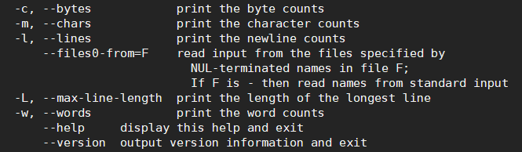
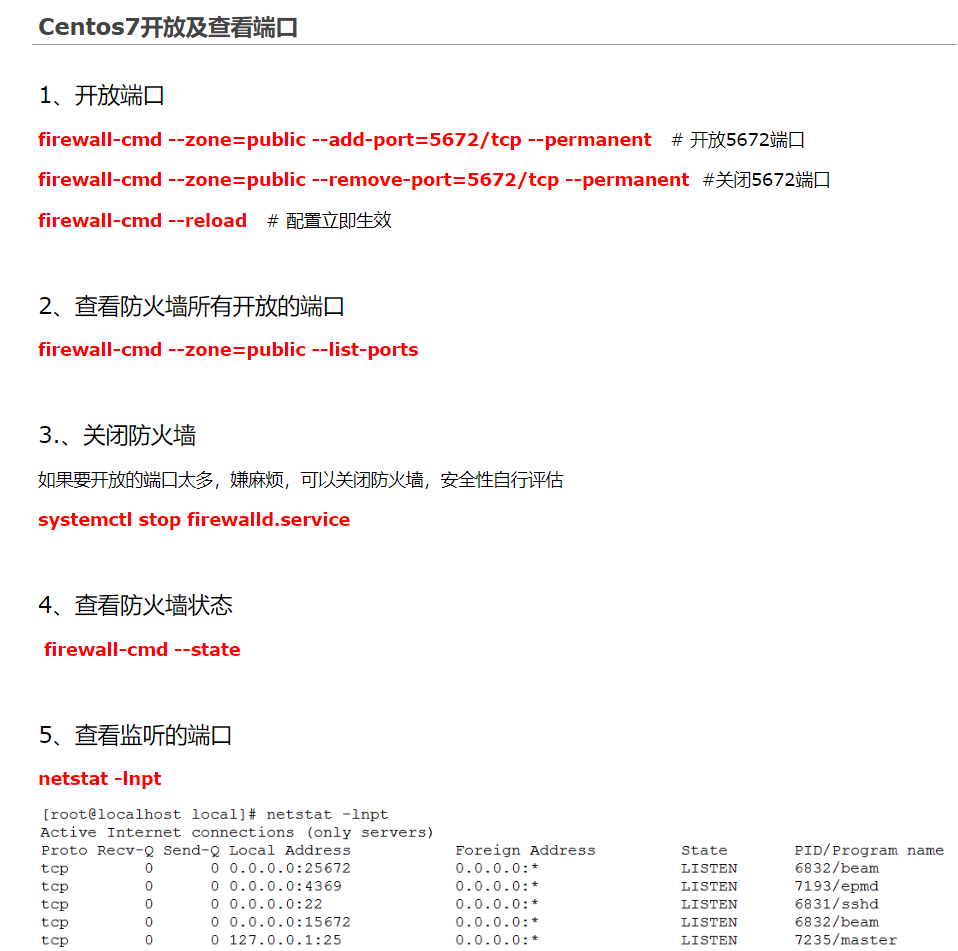

**ls file** 

+ 查看目录：ls   
+ 查看所有信息: ls -r
+ 查看文件基本类型（.后缀名）：file filenam

### wc(查看文件信息)

+ 

### cd
+ 进入退出文件夹：cd
+ 复制： cp old  new //递归辅助 cp -R old new 
+ 远程文件拷贝： scp   -r root@<ip地址>:<文件路径>   <本地路径>
+ 拷贝文件到远程：scp -r  <本地文件路径>   root@<ip地址>:<目标文件路径>
+ 剪切/移动 ： mv old new(rename)
+ 创建文件夹：mkdir
+ 查看当前工作目录：pwd

### rm

+ 删除空文件夹：rmdir
+ 删除带有文件的文件夹 : rm -r floder / rm -rf floder
+ 删除文件带有提示： rm -i file
+ 编辑文件：vim

### cat

+  查看文件 ：cat
+ 将文件内容移动 ：cat resource > target
+ 将文件内容打包后移动 : cat resource1 resource2 >targetfile
+ 将文件内容移动到另一个文件： cat  resource >> targerfile(exit)

### Chmod 权限

+ 显示权限: ls -l
  drwxr-xr-x 2 root root 4096 Jan  7 10:39 floder1
  + 当前用户所持有权限drwxr: d代表文件夹/r可读/w可写/x可执行
  + group所持有权限xr:可执行/可读取 
  + others所持有权限x:可执行   


+ 更改权限： chmod u+r(用户user添加可读权限)  file

  + ​	     chmod u-w(用户user删除可写权限)  file

+ 切换到root用户: sudo su

+ 使用符号模式可以设置多个项目：who（用户类型），operator（操作符）和 permission（权限），每个项目的设置可以用逗号隔开。 命令 chmod 将修改 who 指定的用户类型对文件的访问权限，用户类型由一个或者多个字母在 who 的位置来说明，如 who 的符号模式表所示:

  | who  | 用户类型 | 说明                   |
  | :--- | :------- | :--------------------- |
  | `u`  | user     | 文件所有者             |
  | `g`  | group    | 文件所有者所在组       |
  | `o`  | others   | 所有其他用户           |
  | `a`  | all      | 所用用户, 相当于 *ugo* |

  operator 的符号模式表:

  | Operator | 说明                                                   |
  | :------- | :----------------------------------------------------- |
  | `+`      | 为指定的用户类型增加权限                               |
  | `-`      | 去除指定用户类型的权限                                 |
  | `=`      | 设置指定用户权限的设置，即将用户类型的所有权限重新设置 |

  permission 的符号模式表:

  | 模式 | 名字         | 说明                                                         |
  | :--- | :----------- | :----------------------------------------------------------- |
  | `r`  | 读           | 设置为可读权限                                               |
  | `w`  | 写           | 设置为可写权限                                               |
  | `x`  | 执行权限     | 设置为可执行权限                                             |
  | `X`  | 特殊执行权限 | 只有当文件为目录文件，或者其他类型的用户有可执行权限时，才将文件权限设置可执行 |
  | `s`  | setuid/gid   | 当文件被执行时，根据who参数指定的用户类型设置文件的setuid或者setgid权限 |
  | `t`  | 粘贴位       | 设置粘贴位，只有超级用户可以设置该位，只有文件所有者u可以使用该位 |


### find查询
+ 语法：find [PATH] [option] [action]


### 进程
+ 查看当前进程：ps -ef

+ 查看所有状态:  ps -aux

+ -e：显示所有进程。

  -f：全格式。

  -h：不显示标题。

  -l：长格式。

  -w：宽输出。

  -a：显示终端上的所有进程，包括其他用户的进程。

  -r：只显示正在运行的进程。

  -x：显示没有控制终端的进程。
  
+ 查看端口号的进程: ss -lntpd | grep :808*  (查看808*的端口号信息)

+ netstat -tnlp | grep :808* ：同上

+ 根据进程pid查端口：          lsof -i | grep pid     

+ 根据端口port查进程：     lsof  -i:port          

+ 根据进程pid查端口：        netstat -nap | grep pid     

+ 根据端口port查进程        netstat -nap | grep port

### 终止进程：

+ **终止进程(慎用)**: kill -9[pid]    直接终止进程
+ **退出进程**： kill  [pid]   让进程正常退出，相当于 kill -15  [pid]

### 正则表达式：grep
+ 语法：grep [-acinv] [--color=auto] '查找字符串' filename

+ 查看进程为java的状态: ps -aux|grep java

+ grep -v  xxx: 表示匹配xxx以外的东西(去除xxx的匹配内容)  

  NOT匹配

  ```bash
  #查询run.jar的pid
  #grep -v grep 排除查询时grep命令
  #awk '{print $2}' 按照空格切分取第二个值
  pid= ps -ef|grep run.jar|grep -v grep|awk '{print $2}'
  ```

+ grep进行OR匹配

  ```bash
  grep -E 'pattern1|pattern2' filename  
  #-------------------------------------
  grep 'pattern1\|pattern2' filename  
  #--------------------------------------
  egrep 'pattern1|pattern2' filename  
  #--------------------------------------
  grep -e pattern1 -e pattern2 filename  
  ```

+ grep 进行AND匹配

  ```bash
  grep -E 'pattern1.*pattern2' filename  
  grep -E 'pattern1.*pattern2|pattern2.*pattern1' filename  
  
  #------------------------------------------------
  grep -E 'pattern1' filename | grep -E 'pattern2'  
  ```

  


### 系统任务相关：
+ 将命令放置在后台执行：&（放置在命令之后） vim f1.txt &

+ 当前命令的终止:crtl+c

+ 将正在执行的命令放置在后台并且暂停执行::crtl+z

+ 将后台暂停的命令变成继续执行

+ 查看后台运行的命令：jobs

  + 其中**+** 表示当前任务,**-** 表示当前任务的前一个任务

    ```shell
    [1]    running    bin/kafka-server-start.sh config/server.properties
    [2]  + running    ./bin/kafka-server-start.sh config/server-1.properties
    [3]  - running    ./bin/kafka-server-start.sh config/server-2.properties
    ```

+ 将后台命令调至前台继续执行：fg %num

+ 将后台停止的进程在后台继续运行: bg %num

### tar命令：

+ 参数：

  + -c: 建立压缩档案
    -x：解压
    -t：查看内容
    -r：向压缩归档文件末尾追加文件
    -u：更新原压缩包中的文件

    这五个是独立的命令，压缩解压都要用到其中一个，可以和别的命令连用但只能用其中一个。下面的参数是根据需要在压缩或解压档案时可选的。

    -z：有gzip属性的
    -j：有bz2属性的
    -Z：有compress属性的
    -v：显示所有过程
    -O：将文件解开到标准输出

    下面的参数-f是必须的

    -f: 使用档案名字，切记，这个参数是最后一个参数，后面只能接档案名

+ 压缩

  - tar –cvf jpg.tar *.jpg  将目录里所有jpg文件打包成tar.jpg
  - tar –czf jpg.tar.gz *.jpg   将目录里所有jpg文件打包成jpg.tar后，并且将其用gzip压缩，生成一个gzip压缩过的包，命名为jpg.tar.gz
  - tar –cjf jpg.tar.bz2 *.jpg 将目录里所有jpg文件打包成jpg.tar后，并且将其用bzip2压缩，生成一个bzip2压缩过的包，命名为jpg.tar.bz2
  - tar –cZf jpg.tar.Z *.jpg   将目录里所有jpg文件打包成jpg.tar后，并且将其用compress压缩，生成一个umcompress压缩过的包，命名为jpg.tar.Z
  - rar a jpg.rar *.jpg rar格式的压缩，需要先下载rar for linux
  - zip jpg.zip *.jpg   zip格式的压缩，需要先下载zip for linux 

  解压

  - tar –xvf file.tar  解压 tar包
  - tar -xzvf file.tar.gz 解压tar.gz
  - tar -xjvf file.tar.bz2   解压 tar.bz2
  - tar –xZvf file.tar.Z   解压tar.Z
  - unrar e file.rar 解压rar
  - unzip file.zip 解压zip

  总结

  1. *.tar 用 tar –xvf 解压
  2. *.gz 用 gzip -d或者gunzip 解压
  3. *.tar.gz和*.tgz 用 tar –xzf 解压
  4. *.bz2 用 bzip2 -d或者用bunzip2 解压
  5. *.tar.bz2用tar –xjf 解压
  6. *.Z 用 uncompress 解压
  7. *.tar.Z 用tar –xZf 解压
  8. *.rar 用 unrar e解压
  9. *.zip 用 unzip 解压

## others
+ 切换用户： su -username
+ 切换至root: sudo su

## java

+ 查看java相关的后台 jps
+ 后台运行    nohup java -jar superboot.jar &
+ 后台运行并且重定向日志  nohup command >>my.log 2>&1  & 
  + 其中2>&1 表示将标准错误重定向到标准输出，当command指令出现问题的时候,运行错误内容会输出到my.log中
+ tail -f  用于监视file文件的增长

## linux 软连接
+ 将python3软连接到pyton 

  ```bash
  sudo ln -s /usr/bin/python3 /usr/bin/python
  ```
  
  ### `1、建立软链接`
  
  ```
  具体用法是：ln -s 源文件 目标文件。源：实际存放文件的位置
  1
  ```
  
  当 我们需要在不同的目录，用到相同的文件时，我们不需要在每一个需要的目录下都放一个必须相同的文件，我们只要在某个固定的目录，放上该文件，然后在其它的 目录下用ln命令链接（link）它就可以，不必重复的占用磁盘空间。
  
  -s 是代号（symbolic）的意思
  
  ## 注意:
  
  ln的链接又软链接 和硬链接两种
  
  -  **软链接**`ln -s ** **`,它只会在你选定的位置上生成一个文件的镜像，不会占用磁盘空间
  -  **硬链接**`ln ** **`, 没有参数-s, 它会在你选定的位置上生成一个和源文件大小相同的文件
  
  无论是软链接还是硬链接，文件都保持同步变化
  
  ```
  比如我的文件在 /opt/cs 下面，我想在 /opt/var/cs 这个路径下面也能访问到，那么应该这样来做
  
  ln -s  /opt/cs   /opt/var      /opt/var下面不用创建cs这个目录，会自动创建
  123
  ```
  
  ## 2、查看建立的软链接
  
  ```
  ls -il
  1
  ```
  
  ### 3、删除软链接
  
  ```
  rm -rf file
  ```
## 管道符 |

+ ps -ef | grep <args> : 将查询到的所有的进程传递到grep命令中，进行匹配查询

+ Echo {1..100} |tr ' ' '+'|bc  ： 将输入的1到100中的空格替换为+号，将表达将表达式传递给bc，bc进行计算输入1加到100的值

  

## tail

+ tail -f  <filename> ：持续查看文件的增长情况

+ tail -f -n <num> <filename> :持续查看文件最新num行的增长情况

  
  
  
## 硬盘\&\&内存&&CPU

+ free -m/g  查看内存

+ df :

  + df -hl 查看磁盘剩余空间
  
  + df -h 查看每个根路径的分区大小
  
  + du -sh [目录名] 返回该目录的大小
  
  + du -sm [文件夹] 返回该文件夹总M数
  
  + du -h [目录名] 查看指定文件夹下的所有文件大小（包含子文件夹）
  
+ top  查看CPU使用信息
  
  
### AWK

​	

### SED

### 防火墙:

+ ### centos7 

  + firewalld的基本使用
  + 启动： systemctl start firewalld
  + 关闭： systemctl stop firewalld
  + 查看状态： systemctl status firewalld 
  + 开机禁用 ： systemctl disable firewalld
  + 开机启用 ： systemctl enable firewalld
  + 开放端口： firewall-cmd --zone=public --add-port=5672/tcp --permanent  （开放5672端口，tcp协议
  + 关闭端口： firewall-cmd --zone=public --remove-port=5672/tcp --permanent （关闭5672端口
  + 刷新配置： firewall-cmd --reload 
  + 查看防火墙所有开放的端口 firewall-cmd --zone=public --list-ports

+ **ubuntu**

  + 添加一个开放端口如80端口: sbin/iptables -I INPUT -p tcp --dport 80 -j ACCEPT
  + 保存设置: /etc/rc.d/init.d/iptables save
  + 重启服务即可生效: /etc/init.d/iptables restart
  + 查看开放端口是否生效:/sbin/iptables -L -n

+ 1. firewalld的基本使用
  2. 启动： systemctl start firewalld
  3. 关闭： systemctl stop firewalld
  4. 查看状态： systemctl status firewalld 
  5. 开机禁用 ： systemctl disable firewalld
  6. 开机启用 ： systemctl enable firewalld
  7. 开放端口： firewall-cmd --zone=public --add-port=5672/tcp --permanent  （开放5672端口，tcp协议
  8. 关闭端口： firewall-cmd --zone=public --remove-port=5672/tcp --permanent （关闭5672端口
  9. 刷新配置： firewall-cmd --reload 
  10. 查看防火墙所有开放的端口 firewall-cmd --zone=public --list-port


### other

1. 指令 > : 如果文件存在，将原来文件的内容覆盖；原文件不存在则创建文件，再添加信息。

   ```bash
   echo “内容” > filename	将内容写入覆盖到文件中
   ```

2. 指令 >>:不会覆盖原文件内容，将内容追加到文件的尾部。

   ```bash
   echo “内容” >> filename	将内容追加到文件末尾
   ```

3.  echo -n : 不换行输出

4. echo -e: 处理特殊字符:

   ```
   若字符串中出现以下字符，则特别加以处理，而不会将它当成一般文字输出：
   \a 发出警告声；
   \b 删除前一个字符；
   \c 最后不加上换行符号；
   \f 换行但光标仍旧停留在原来的位置；
   \n 换行且光标移至行首；
   \r 光标移至行首，但不换行；
   \t 插入tab；
   \v 与\f相同；
   \ 插入\字符；
   \nnn 插入nnn（八进制）所代表的ASCII字符；
   ```
   
5. bash命令:

   ```bash
   编辑
   Ctrl + U    删除光标前的所有内容
   Ctrl + K    删除光标后的所有内容
   
   Ctrl + W    删除光标前的一个单词
   Ctrl + H    删除光标前一个字符(backspace)
   
   Ctrl + T    交换光标前的两个字符
   Esc + T     交换光标前的两个单词
   
   ctrl + _, 撤销上一次删除操作
   ctrl + y, 撤销上一次 ctrl + u的删除操作(实际上是将上一次剪切的文本重新粘贴到光标位置)
   ctrl + ?, 撤销上一次的输入操作
   
   光标移动
   Ctrl + A    光标移动到字符串头
   Ctrl + E    光标移动到字符串尾
   Ctrl + B 	光标移动到上一个字符
   Ctrl + F	光标移动到下一个字符
   Alt + F    	光标移动到下一个单词
   Alt + B     光标移动到上一个单词
   
   其他
   
   Ctrl + L    清屏(clear)
   Ctrl + R    在history中搜索
   Ctrl + C    关闭当前程序
   Ctrl + D    退出当前shell
   Ctrl + Z    将当前程序挂起到后台
   
   Tab         Auto-complete files and folder names
   ```


### 抓包

+ UDP端口抓包: tcpdump -i eth0 -s 0 port 1814

+ UDP发包测试：nc -vuz 120.78.203.41 5060


-----



