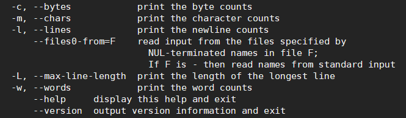

**ls file** 

+ 查看目录：ls   
+ 查看所有信息: ls -r
+ 查看文件基本类型（.后缀名）：file filenam

### wc(查看文件信息)

+ 

### cd
+ 进入退出文件夹：cd
+ 复制： cp old  new //递归辅助 cp -R old new 
+ 远程文件拷贝： scp   -r root@<ip地址>:<文件路径>   <本地路径>
+ 拷贝文件到远程：scp -r  <本地文件路径>   root@<ip地址>:<目标文件路径>
+ 剪切/移动 ： mv old new(rename)
+ 创建文件夹：mkdir
+ 查看当前工作目录：pwd

### rm

+ 删除空文件夹：rmdir
+ 删除带有文件的文件夹 : rm -r floder / rm -rf floder
+ 删除文件带有提示： rm -i file
+ 编辑文件：vim

### cat

+  查看文件 ：cat
+ 将文件内容移动 ：cat resource > target
+ 将文件内容打包后移动 : cat resource1 resource2 >targetfile
+ 将文件内容移动到另一个文件： cat  resource >> targerfile(exit)

### 权限

+ 显示权限: ls -l
  drwxr-xr-x 2 root root 4096 Jan  7 10:39 floder1
  + 当前用户所持有权限drwxr: d代表文件夹/r可读/w可写/x可执行
  + group所持有权限xr:可执行/可读取 
  + others所持有权限x:可执行   

+ 更改权限： chmod u+r(用户user添加可读权限)  file

  + ​	     chmod u-w(用户user删除可写权限)  file

+ 切换到root用户: sudo su

### find查询
+ 语法：find [PATH] [option] [action]

### 进程
+ 查看当前进程：ps -ef

+ 查看所有状态:  ps -aux

+ -e：显示所有进程。

  -f：全格式。

  -h：不显示标题。

  -l：长格式。

  -w：宽输出。

  -a：显示终端上的所有进程，包括其他用户的进程。

  -r：只显示正在运行的进程。

  -x：显示没有控制终端的进程。
  
+ 查看端口号的进程: ss -lntpd | grep :808*  (查看808*的端口号信息)

+ netstat -tnlp | grep :808* ：同上

### 终止进ss -lntpd | grep :22程：
+ 终止进程: kill -9[pid]    直接终止进程
+ 退出进程： kill  [pid]   让进程正常退出，相当于 kill -15  [pid]

### 正则表达式：grep
+ 语法：grep [-acinv] [--color=auto] '查找字符串' filename
+ 查看进程为java的状态: ps -aux|grep java

### 系统任务相关：
+ 将命令放置在后台执行：&（放置在命令之后） vim f1.txt &
+ 当前命令的终止:crtl+c
+ 将正在执行的命令放置在后台并且暂停执行::crtl+z
+ 将后台暂停的命令变成继续执行
+ 查看后台运行的命令：jobs
+ 将后台命令调至前台继续执行：fg

### tar命令：

+ 参数：

  + -c: 建立压缩档案
    -x：解压
    -t：查看内容
    -r：向压缩归档文件末尾追加文件
    -u：更新原压缩包中的文件

    这五个是独立的命令，压缩解压都要用到其中一个，可以和别的命令连用但只能用其中一个。下面的参数是根据需要在压缩或解压档案时可选的。

    -z：有gzip属性的
    -j：有bz2属性的
    -Z：有compress属性的
    -v：显示所有过程
    -O：将文件解开到标准输出

    下面的参数-f是必须的

    -f: 使用档案名字，切记，这个参数是最后一个参数，后面只能接档案名

+ 压缩

  - tar –cvf jpg.tar *.jpg  将目录里所有jpg文件打包成tar.jpg
  - tar –czf jpg.tar.gz *.jpg   将目录里所有jpg文件打包成jpg.tar后，并且将其用gzip压缩，生成一个gzip压缩过的包，命名为jpg.tar.gz
  - tar –cjf jpg.tar.bz2 *.jpg 将目录里所有jpg文件打包成jpg.tar后，并且将其用bzip2压缩，生成一个bzip2压缩过的包，命名为jpg.tar.bz2
  - tar –cZf jpg.tar.Z *.jpg   将目录里所有jpg文件打包成jpg.tar后，并且将其用compress压缩，生成一个umcompress压缩过的包，命名为jpg.tar.Z
  - rar a jpg.rar *.jpg rar格式的压缩，需要先下载rar for linux
  - zip jpg.zip *.jpg   zip格式的压缩，需要先下载zip for linux 

  解压

  - tar –xvf file.tar  解压 tar包
  - tar -xzvf file.tar.gz 解压tar.gz
  - tar -xjvf file.tar.bz2   解压 tar.bz2
  - tar –xZvf file.tar.Z   解压tar.Z
  - unrar e file.rar 解压rar
  - unzip file.zip 解压zip

  总结

  1. *.tar 用 tar –xvf 解压
  2. *.gz 用 gzip -d或者gunzip 解压
  3. *.tar.gz和*.tgz 用 tar –xzf 解压
  4. *.bz2 用 bzip2 -d或者用bunzip2 解压
  5. *.tar.bz2用tar –xjf 解压
  6. *.Z 用 uncompress 解压
  7. *.tar.Z 用tar –xZf 解压
  8. *.rar 用 unrar e解压
  9. *.zip 用 unzip 解压

## others
+ 切换用户： su -username
+ 切换至root: sudo su

## java

+ 查看java相关的后台 jps

+ 后台运行    nohup java -jar superboot.jar &

+ tail -f  用于监视file文件的增长

  
## 管道符 |

+ ps -ef | grep <args> : 将查询到的所有的进程传递到grep命令中，进行匹配查询

+ Echo {1..100} |tr ' ' '+'|bc  ： 将输入的1到100中的空格替换为+号，将表达将表达式传递给bc，bc进行计算输入1加到100的值

  

## tail

+ tail -f  <filename> ：持续查看文件的增长情况

+ tail -f -n <num> <filename> :持续查看文件最新num行的增长情况

  
  
  
## 硬盘\&\&内存&&CPU

+ free -m/g  查看内存

+ dh :

  + df -hl 查看磁盘剩余空间
  
  + df -h 查看每个根路径的分区大小
  
  + du -sh [目录名] 返回该目录的大小
  
  + du -sm [文件夹] 返回该文件夹总M数
  
  + du -h [目录名] 查看指定文件夹下的所有文件大小（包含子文件夹）
  
+ top  查看CPU使用信息
  
  
  
### AWK

​	

### SED

