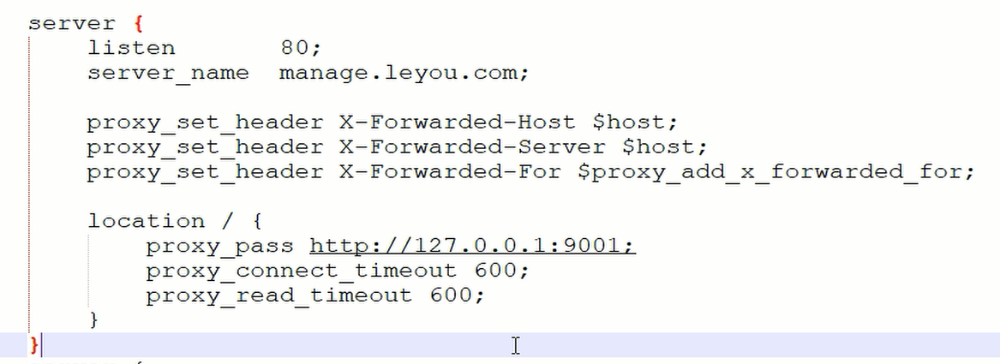

监听本机的80端口，将听到的manage.leyou.com转发到http://127.0.0.1:9001,在这之后，可以进行zuul进行路由，再通过负载均衡选择合适的服务


文件目录  //etx/nginx

启动 nginx : service  nginx start

测试配置文件是否正确 : nginx -t

重启nginx :  nginx -s reload

关闭nginx : nginx -s  stop

nginx配置ssl

```properties
user  nginx;
worker_processes  1;

error_log  /var/log/nginx/error.log warn;
pid        /var/run/nginx.pid;


events {
    worker_connections  1024;
}


http {
    include       /etc/nginx/mime.types;
    default_type  application/octet-stream;

    log_format  main  '$remote_addr - $remote_user [$time_local] "$request" '
                      '$status $body_bytes_sent "$http_referer" '
                      '"$http_user_agent" "$http_x_forwarded_for"';

    access_log  /var/log/nginx/access.log  main;

    sendfile        on;
    #tcp_nopush     on;

    keepalive_timeout  65;

    gzip  on;

    add_header Access-Control-Allow-Origin *;
    add_header Access-Control-Allow-Headers X-Requested-With;
    add_header Access-Control-Allow-Methods GET,POST,OPTIONS;

    
    include /etc/nginx/conf.d/*.conf;


    #http节点中可以添加多个server节点
    server{
        #监听443端口
        listen 443 ssl;
        server_name zzk.linpr.cn;
        #ssl on;
        #从腾讯云获取到的第一个文件的全路径
        ssl_certificate /etc/ssl/certs/2118294_zzk.linpr.cn.pem;
        #从腾讯云获取到的第二个文件的全路径
        ssl_certificate_key /etc/ssl/certs/2118294_zzk.linpr.cn.key;
        ssl_session_timeout 5m;
        ssl_protocols TLSv1 TLSv1.1 TLSv1.2;
        ssl_ciphers ECDHE-RSA-AES128-GCM-SHA256:HIGH:!aNULL:!MD5:!RC4:!DHE;
        ssl_prefer_server_ciphers on;
	proxy_set_header Cookies $http_cookie;
	proxy_set_header X-Forwarded-Server $host;
	proxy_set_header X-Forwarded-For $proxy_add_x_forwarded_for;
        location /checksys {
               
	     	proxy_pass  http://localhost:8080/checksys;
	        proxy_connect_timeout 1000;
    		proxy_read_timeout 1000;
	        proxy_set_header Host $host;
                proxy_set_header X-Real-IP $remote_addr;
                proxy_set_header X-Forwarded-For $proxy_add_x_forwarded_for;

        }
	location /wanglun { 
		proxy_pass http://localhost:8081/wanglun;
		proxy_connect_timeout 1000;
		proxy_read_timeout 1000;
		proxy_set_header Host $host;
		proxy_set_header X-Real-IP $remote_addr;
		proxy_set_header X-Forwarded-For $proxy_add_x_forwarded_for;
	}
     }
     
}

```

