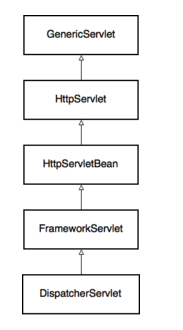

# How SpringMvc Works



+ GenericServlet

  + GenericServlet是Servlet规范中不直接关注HTTP的一部分。它定义了接收传入请求并产生响应的service()方法。这个方法最终会在任何对服务器的请求中被调用，包括一个简单的GET请求。**它并不与HTTP协议绑定**

    ```java
    public abstract void service(ServletRequest req, ServletResponse res) 
      throws ServletException, IOException;
    ```

+ HttpServlet

  + HttpServlet类顾名思义，就是以HTTP为核心的Servlet实现，也是规范所定义的。在更实际的情况下，HttpServlet是一个抽象类，它的service()方法实现，按照HTTP方法类型来拆分请求，大致看起来是这样的

    ```java
    protected void service(HttpServletRequest req, HttpServletResponse resp)
        throws ServletException, IOException {
    
        String method = req.getMethod();
        if (method.equals(METHOD_GET)) {
            // ...
            doGet(req, resp);
        } else if (method.equals(METHOD_HEAD)) {
            // ...
            doHead(req, resp);
        } else if (method.equals(METHOD_POST)) {
            doPost(req, resp);
            // ...
        }
    ```

+ HttpServletBean

  + HttpServletBean是层次结构中的第一个Spring-aware类，它使用从web.xml或WebApplicationInitializer接收的servlet init-param值来注入bean的属性。它使用从web.xml或从WebApplicationInitializer接收到的servlet init-param值注入bean的属性。在向应用程序发出请求的情况下，doGet()、doPost()等方法会被调用来处理这些特定的HTTP请求。

+ FrameworkServlet

  + FrameworkServlet将Servlet功能与Web应用上下文整合在一起，实现了ApplicationContextAware接口。但它也能够自己创建一个web应用上下文。

+ *DispatcherServlet*: 

  + 统一请求处理

    + HttpServlet.service()的实现，通过HTTP动词的类型来路由请求，在低级servlets的上下文中是非常合理的。然而，在Spring MVC的抽象层次上，方法类型只是可以用来将请求映射到其处理程序的参数之一。

      ```java
          @Override
          protected final void doGet(HttpServletRequest request, 
            HttpServletResponse response) throws ServletException, IOException {
              processRequest(request, response);
          }
          
          @Override
          protected final void doPost(HttpServletRequest request, 
            HttpServletResponse response) throws ServletException, IOException {
              processRequest(request, response);
          }
      ```

  + 为request添加更多信息

    + DispatcherServlet实现了doService()方法。这里，它在请求中添加了一些有用的对象，这些对象可能会在处理管道中派上用场：Web应用上下文、locale解析器、主题解析器、主题源等。

      ```java
      request.setAttribute(WEB_APPLICATION_CONTEXT_ATTRIBUTE,getWebApplicationContext());
      request.setAttribute(LOCALE_RESOLVER_ATTRIBUTE, this.localeResolver);
      request.setAttribute(THEME_RESOLVER_ATTRIBUTE, this.themeResolver);
      request.setAttribute(THEME_SOURCE_ATTRIBUTE, getThemeSource());
      ```

    + 另外，doService()方法还准备了输入和输出**flash maps**。flash maps基本上是一种模式，用于将一个请求的参数传递给紧接着的另一个请求。这在重定向过程中可能非常有用（比如在重定向后向用户展示一个一次性的信息消息）。

      ```java
      FlashMap inputFlashMap = this.flashMapManager
        .retrieveAndUpdate(request, response);
      if (inputFlashMap != null) {
          request.setAttribute(INPUT_FLASH_MAP_ATTRIBUTE, 
            Collections.unmodifiableMap(inputFlashMap));
      }
      request.setAttribute(OUTPUT_FLASH_MAP_ATTRIBUTE, new FlashMap());
      ```

      然后，doService()方法调用负责请求调度的doDispatch()方法。

  + 路由请求

    + dispatch()方法的主要目的是为请求找到一个合适的处理程序，并向其提供请求/响应参数。处理程序基本上是任何一种Object，而不限于特定的接口。这也就意味着Spring需要为这个处理程序找到一个知道如何与处理程序 "对话 "的适配器。为了找到与请求相匹配的处理程序，Spring会通过HandlerMapping接口的注册实现。有许多不同的实现可以满足你的需求。SimpleUrlHandlerMapping允许通过URL将一个请求映射到某个处理Bean。例如，可以通过将其映射属性注入类似于这样的java.util.Properties实例来配置它。

      ```xml
      /welcome.html=ticketController
      /show.html=ticketController
      ```

      处理程序映射最广泛使用的类可能是**RequestMappingHandlerMapping**，它将一个请求映射到一个@Controller类的@RequestMapping-annotated方法。这正是连接调度器与控制器的hello()和login()方法的映射。

      请注意，你的Spring-aware方法相应地用@GetMapping和@PostMapping进行了注解。这些注解又被标记为@RequestMapping元注解。

      dispatch()方法还负责其他一些HTTP特有的任务。

      1. 在资源未被修改的情况下，对GET请求进行短路处理。
      2. 对相应的请求采用多部分解析器
      3. 如果处理程序选择异步处理，则对请求进行异步处理。

  + 处理请求

    + 现在Spring已经确定了请求的处理程序和处理程序的适配器，是时候最终处理请求了。这里是HandlerAdapter.handle()方法的签名。需要注意的是，处理程序可以选择如何处理请求。
      返回一个ModelAndView对象，由DispatcherServlet渲染。

      ```java
      @Nullable
      ModelAndView handle(HttpServletRequest request, 
                          HttpServletResponse response, 
                          Object handler) throws Exception;
      ```

    + 有几种提供的处理程序类型。下面是SimpleControllerHandlerAdapter如何处理一个Spring MVC控制器实例（不要把它与@Controller-annotated POJO混淆）。

      请注意控制器处理程序如何返回ModelAndView对象，而不是自己渲染视图。

      ```java
      public ModelAndView handle(HttpServletRequest request, 
        HttpServletResponse response, Object handler) throws Exception {
          return ((Controller) handler).handleRequest(request, response);
      }
      ```

    + 第二个是SimpleServletHandlerAdapter，它将一个普通的Servlet适配为请求处理程序。

      Servlet不知道任何关于ModelAndView的事情，只是自己处理请求，将结果渲染成响应对象。所以这个适配器只是返回null而不是ModelAndView。

      ```java
      public ModelAndView handle(HttpServletRequest request, 
        HttpServletResponse response, Object handler) throws Exception {
          ((Servlet) handler).service(request, response);
          return null;
      }
      ```

      在例子中，Controller是一个POJO，有几个@RequestMapping注解，所以任何处理程序基本上都是这个类的一个方法，包装在一个HandlerMethod实例中。为了适应这种处理程序类型，Spring使用了RequestMappingHandlerAdapter类。

+ HandlerMethod处理request参数和返回值

  + 需要注意的是，控制器方法通常不接收HttpServletRequest和HttpServletResponse参数，而是接收和返回许多不同类型的数据，如域对象、路径参数等。

    另外，请注意，你不需要从控制器方法中返回一个ModelAndView实例。你可以返回一个视图名称，或一个ResponseEntity或一个将被转换为JSON响应的POJO等。

    RequestMappingHandlerAdapter确保方法的参数是从HttpServletRequest中解析出来的。同时，它还从方法的返回值中创建ModelAndView对象。

    在RequestMappingHandlerAdapter中有一段重要的代码，它确保了所有这些转换的发生。

    ```java
    ServletInvocableHandlerMethod invocableMethod 
      = createInvocableHandlerMethod(handlerMethod);
    if (this.argumentResolvers != null) {
        invocableMethod.setHandlerMethodArgumentResolvers(
          this.argumentResolvers);
    }
    if (this.returnValueHandlers != null) {
        invocableMethod.setHandlerMethodReturnValueHandlers(
          this.returnValueHandlers);
    }
    ```

    

