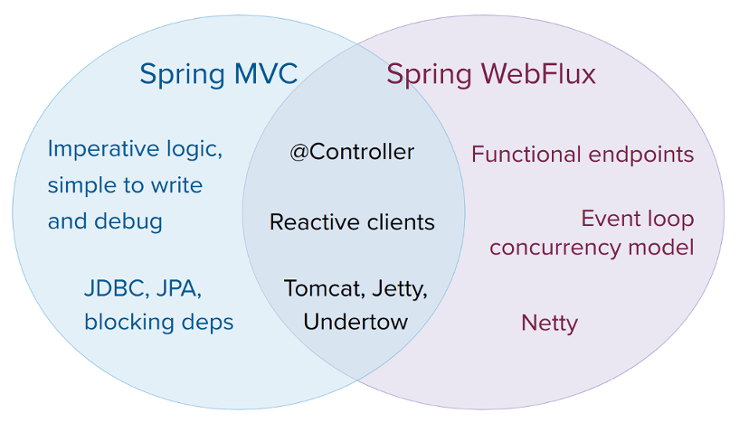

# SpringWebFlux

+ 核心库Reactor
  + **Mono**: 0..1
  + **Flux**: 0..N

+ 编程风格:
  + **Annotated Controller**:
    + 与Spring MVC一致，并基于spring-web模块的相同注解。Spring MVC和WebFlux控制器都支持反应式（Reactor和RxJava）返回类型，因此，不容易区分它们。一个显著的区别是，WebFlux也支持反应式的@RequestBody参数。
  + **Functional Endpoints**:
    + 基于Lambda的、轻量级的、功能性的编程模型。你可以把它看作是一个小库或一组实用程序，应用程序可以用来路由和处理请求。与**@Controller**的区别是，应用程序从头到尾负责请求处理，而不是通过注解声明意图并被回调。

+ 与SpringMvc的功能点差异:

  + 

  