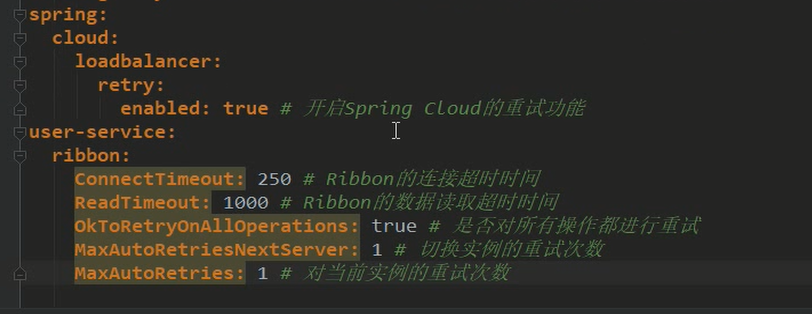
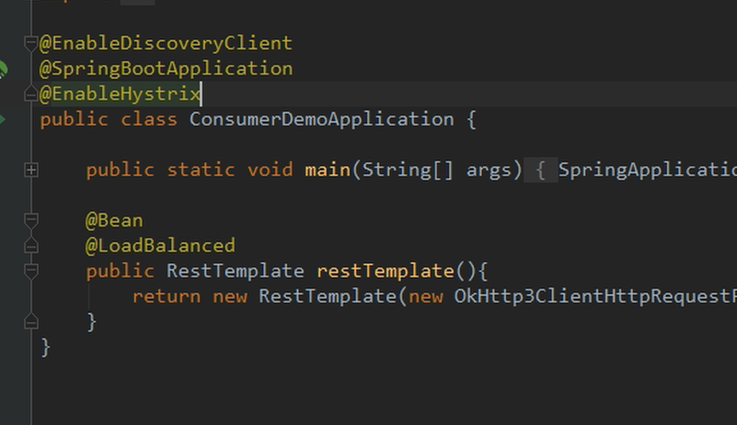

HTTP调用服务的两种方式：

1. 使用HttpClient工具调用

   ```java
   HttpClient httpClient;
    @Before
       public void init() {
           httpClient = HttpClients.createDefault();
       }
       @Test
       public void HttpDD() throws IOException {
           HttpPost get = new HttpPost("http://localhost:8080/language?id=3");
           String response = this.httpClient.execute(get, new BasicResponseHandler());
           System.out.println(response);
       }
   ```

2. 使用Spring的RestTemplate调用((需要在@Configuration中注册)：

   ```java
   @Bean
   public RestTemplate template(){
       return new RestTemplate();
   }
   ```

   ```java
   @Autowired
   private RestTemplate restTemplate;
   @Test
   public void restttt(){
       MultiValueMap<String, String> map= new LinkedMultiValueMap<String, String>();
       map.add("id","3");
       Languagepojo languagepojo = restTemplate.postForObject("http://localhost:8080/language", map, Languagepojo.class);
       System.out.println(languagepojo);
   }
   ```


## eureka服务注册中心

+ 启动类添加@EnableEurekaServer：

```java
@SpringBootApplication
@EnableEurekaServer
public class EurekaApplication {
    public static void main(String[] args) {
        SpringApplication.run(EurekaApplication.class, args);
    }

}
```


+ eureka服务中心

```yml
server:
  port: 10087

spring:
  application:
    name: eureka-server2

eureka:
  client:
    register-with-eureka: true
    fetch-registry: true
    service-url:
      defaultZone: http://localhost:10086/eureka #将自己注册到端口为10086的eureka形成集群
#优先使用ip地址注册
  instance:
    prefer-ip-address: true
```

+ productor服务提供者：
  + 启动类添加@EnableDiscoveryClient：

```java
@SpringBootApplication
@EnableDiscoveryClient
public class UserservericeApplication {

    public static void main(String[] args) {
        SpringApplication.run(UserservericeApplication.class, args);
    }
}
```

```yml
eureka:
  client:
    service-url:
      defaultZone: http://localhost:10086/eureka #将服务注册到端口为10086的eureka
spring:
  application:
    name: productor
server:
  port: 8088
```

+  consumer消费者
  + 启动类添加@EnableDiscoveryClient
  + 同提供者一样需要将自己注册到eureka

```yml
eureka:
  client:
    service-url:
       defaultZone: http://localhost:10086/eureka
spring:
  application:
    name: comsumer
server:
  port: 8081
```

+ 消费者调用服务：

  + 需要现在配置类中注册RestTemplate @Bean 	

    ```java
    @Autowired
    private RestTemplate restTemplate;
    
    @Autowired
    private DiscoveryClient discoveryClient;
    
    @Test
    public void TT() {
        List<ServiceInstance> serviceInstances = discoveryClient.getInstances("productor"); //通过前文的服务提供者的application name进行调用
        String url = "http://" + serviceInstances.get(0).getHost() + ":" + serviceInstances.get(0).getPort() + "/cc";
        logger.info(url);
        Map m = restTemplate.getForObject(url, Map.class);
        System.out.println(m);
    }
    ```

+ 负载均衡：

  + 添加robbin依赖：

  ```xml
  <dependency>
      <groupId>org.springframework.cloud</groupId>
      <artifactId>spring-cloud-starter-ribbon</artifactId>
  </dependency>   
  ```

  + 在RestTemplate上注册@LoadBalanced

  ```java
  	@Bean
      @LoadBalanced
      public RestTemplate restTemplate() {
          return new RestTemplate();
      }
  ```

  + 直接通过服务名来进行访问(不再使用DiscoveryClient)：

  ```java
  	@Autowired
      private RestTemplate restTemplate;
      @Test
      public void TT() {
          String url="http://service-name/";
          Map m = restTemplate.getForObject(url, Map.class);
          System.out.println(m);
      }
  ```

  + 更改负载均衡策略：

    消费者中配置

    

  ​	

  + 重试机制：
  + 
    + 消费者中配置：
    + 
  + 熔断机制：
    + 启动类配置：
  + 熔断机制与重试机制的优化：
    + 
