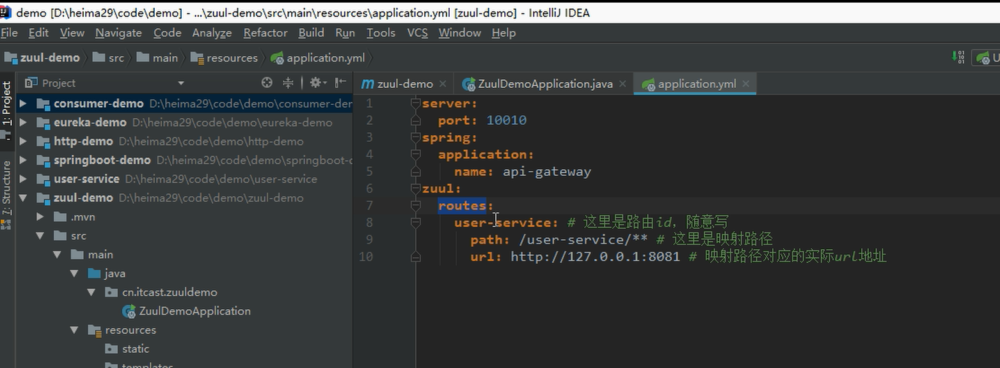

# zuul网关注册

+ 启动类中添加@EnableZuulProxy

+ yml配置文件编写：

  ```yml
  server:
    port: 10010
  
  spring:
    application:
      name: api-gateway
  
  zuul:
    routes:
     user-service:
       path: /userservice/**
       url: http://localhost:8188
  ```

  (将原服务的http://localhost:8188转换成为了http://localhost:10010/userservice,相当于做了一次路由映射)

+ 使用服务名后的zuul(能够使用负载均衡)：

  这样的方式能够让zuul去eureka自动拉取对应的服务

  ```yml
  server:
    port: 10010
  
  spring:
    application:
      name: api-gateway
  
  zuul:
    prefix: /XXX 可以通过这个来添加前缀，用以服务类别区分 访问方式变成			                                           http://localhost:10010/XXX/userservice 
    routes:
     user-service:
       path: /userservice/**
       serviceid: productor2 #服务提供者名称 注册时的spring:application:name: productor2
       
  #也可以写成：
  #zuul:
  #  routes:
  #  productor2: /userservice/**
      
  eureka:
    client:
      service-url:
        defaultZone: http://localhost:10086/eureka
  ```

  

# 过滤器

+ 继承ZuulFilter过滤器并且在Spring容器中进行注册：

  ```java
  package com.zuul.zuuldemo.Fliter;
  
  import com.netflix.discovery.util.StringUtil;
  import com.netflix.zuul.ZuulFilter;
  import com.netflix.zuul.context.RequestContext;
  import com.netflix.zuul.exception.ZuulException;
  import org.apache.commons.lang.StringUtils;
  import org.apache.http.HttpStatus;
  import org.springframework.http.HttpRequest;
  import org.springframework.stereotype.Component;
  
  import javax.servlet.http.HttpServletRequest;
  
  //进行鉴权
  @Component
  public class Zuulfilter extends ZuulFilter {
      @Override
      public String filterType() {
          return "pre";
      }
  
      @Override
      public int filterOrder() {
          return 2;
      }
  
      @Override
      public boolean shouldFilter() {
          return true;
      }
  
      @Override
      public Object run() throws ZuulException {
          //获取上下文，获取request请求
          RequestContext ctx=RequestContext.getCurrentContext();
          HttpServletRequest req=ctx.getRequest();
          String token=req.getParameter("token");
          if (StringUtils.isEmpty(token)) {
              //返回状态码
              ctx.setResponseStatusCode(HttpStatus.SC_UNAUTHORIZED);
              //不再进行路由
              ctx.setSendZuulResponse(false);
          }
          return null;
      }
  }
  
  ```

  
