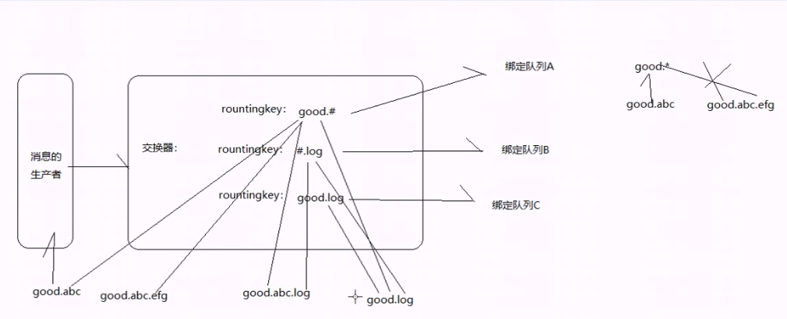
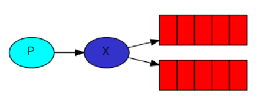

# EXCHANGE

AMQP协议中的核心思想就是生产者和消费者隔离，生产者从不直接将消息发送给队列。生产者通常不知道是否一个消息会被发送到队列中，只是将消息发送到一个交换机。先由Exchange来接收，然后Exchange按照特定的策略转发到Queue进行存储。同理，消费者也是如此。Exchange 就类似于一个交换机，转发各个消息分发到相应的队列中。发送者无需关心对某个具体队列发送,只需要对交换机做配置即可。

1. Exchange的使用过程大概如下:

   1. 客户端连接到消息队列服务器，打开一个channel。
   2. 客户端声明一个exchange，并设置相关属性。
   3. 客户端声明一个queue，并设置相关属性。
   4. 客户端使用routing key，在exchange和queue之间建立好绑定关系。
   5. 客户端投递消息到exchange。

2. RabbitMq处理分发:

   exchange接收到消息后，就根据消息的key和已经设置的binding，进行消息路由，将消息投递到一个或多个队列里。

   exchange也有几个类型:

   1. **Direct**:完全根据key进行投递,例如，绑定时设置了routing key为”abc”，那么客户端提交的消息，只有设置了key为”abc”的才会投递到队列。

   2. **Topic**: 对key进行模式匹配后进行投递的叫做Topic交换机，符 号”#”匹配一个或多个词，符号”*”匹配正好一个词。例如”abc.#”匹配”abc.def.ghi”，”abc.*”只匹配”abc.def”。

      

   3. **Fanout**:广播模式，一个消息进来时，投递到与该交换机绑定的所有队列。

   RabbitMQ中，所有生产者提交的消息都由Exchange来接受，然后Exchange按照特定的策略转发到Queue进行存储

   RabbitMQ提供了四种Exchange:fanout,direct,topic,header

   性能排序：fanout > direct >> topic。比例大约为11：10：6


+ fantout模式:

  

  ```java
  public class Publisher {
      private final static String EXCHANGE_NAME = "logs";
  
      public static void main(String[] args) throws IOException, TimeoutException {
          Publisher publisher = new Publisher();
          Channel pushChannel = MqUitl.getPushChannel(publisher);
          //声明路由
          pushChannel.exchangeDeclare(EXCHANGE_NAME, "fanout");
          //如果没有显式指定队列名称,则会随机生成队列名
          //当连接关闭时,此队列会自动删除
          String queueName = pushChannel.queueDeclare().getQueue();
          pushChannel.queueBind(queueName, "logs", "");
  
          String msg = "published msg";
          pushChannel.basicPublish(EXCHANGE_NAME, "", null, msg.getBytes(StandardCharsets.UTF_8));
          System.out.println(" [x] Sent '" + msg + "'");
          pushChannel.close();
          MqUitl.getMqConnection(publisher).close();
      }
  }
  ```

  ```java
  public class Subscriber {
      private static final String EXCHANGE_NAME = "logs";
  
      public static void main(String[] argv) throws Exception {
          Channel channel = MqUitl.getRecvChannel(new Subscriber());
          channel.exchangeDeclare(EXCHANGE_NAME, "fanout");
          String queueName = channel.queueDeclare().getQueue();
          channel.queueBind(queueName, EXCHANGE_NAME, "");
  
          System.out.println(" [*] Waiting for messages. To exit press CTRL+C");
  
          DeliverCallback deliverCallback = (consumerTag, delivery) -> {
              String message = new String(delivery.getBody(), StandardCharsets.UTF_8);
              System.out.println(" [x] Received '" + message + "'");
          };
          channel.basicConsume(queueName, true, deliverCallback, consumerTag -> {
          });
      }
  }
  ```

  

