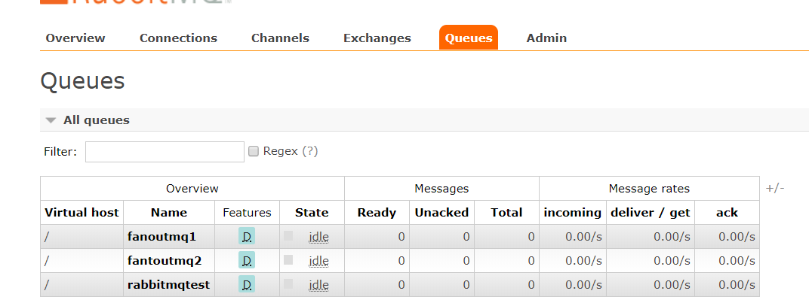
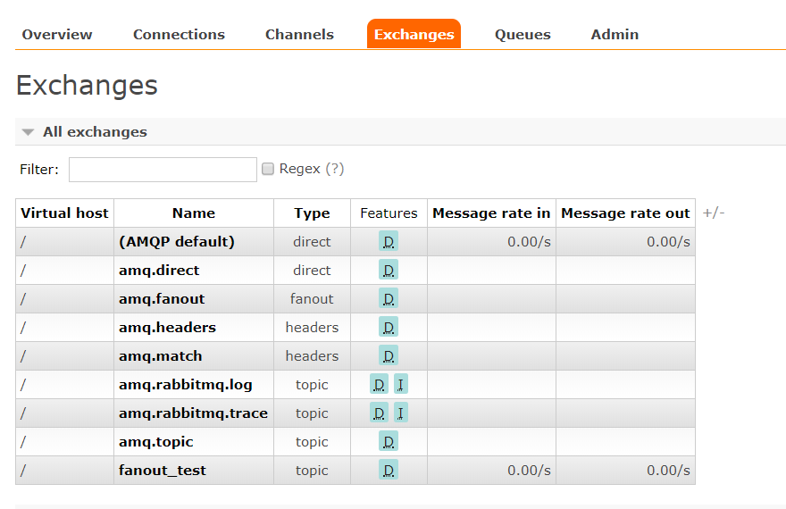
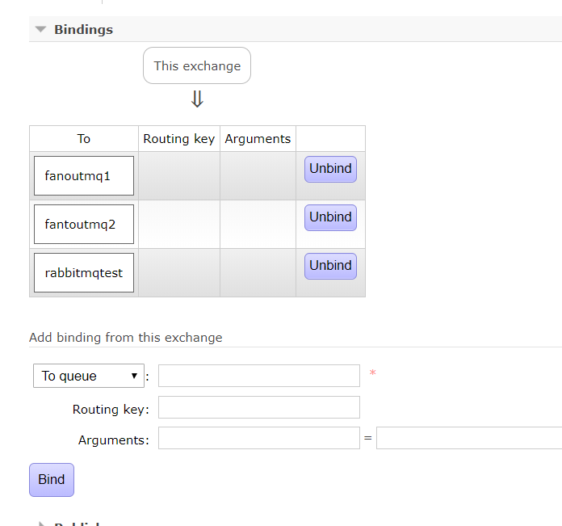
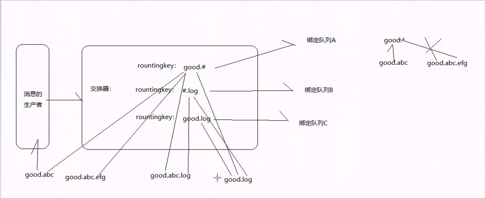

# RabbitMQ

RabbitMQ是流行的开源消息队列系统，用erlang语言开发。RabbitMQ是 AMQP（高级消息队列协议）的标准实现。

1. 概念说明:
   1. Broker:简单来说就是消息队列服务器实体。
   2. Exchange:消息交换机，它指定消息按什么规则，路由到哪个队列。
   3. Queue:消息队列载体，每个消息都会被投入到一个或多个队列。
   4. Binding:绑定，它的作用就是把exchange和queue按照路由规则绑定起来。
   5. Routing Key:路由关键字，exchange根据这个关键字进行消息投递。
   6. vhost:虚拟主机，一个broker里可以开设多个vhost，用作不同用户的权限分离。
   7. producer:消息生产者，就是投递消息的程序。
   8. consumer:消息消费者，就是接受消息的程序。
   9. channel:消息通道，在客户端的每个连接里，可建立多个channel，每个channel代表一个会话任务。

+ 注册队列(无交换机模式):

  + 在pom.xml中添加rabbitmq依赖：

    + ```xml
          <dependency>
                  <groupId>org.springframework.boot</groupId>
                  <artifactId>spring-boot-starter-amqp</artifactId>
           </dependency>
      ```

  + 在localhost:15672中进行队列注册

​	

 1. 发送消息： 

    ```java
    @Autowired
        private RabbitTemplate rabbitTemplate;
        @Test
        public void sendmsgtormq(){
            //指定向队列名为rabbitmqtest的消息队列中发送消息
            rabbitTemplate.convertAndSend("rabbitmqtest","生产消息测试");
        }
    ```

	2. 接受消息：

    ```java
    @RabbitListener(queues = "rabbitmqtest")
    @Component
    public class Getmsg {
        @RabbitHandler
        public void getmsg(String string) {
    
            System.out.println("ranbbitmqtest接收到的消息为:"+string);
        }
    }
    //可同时指定多个接受类，但是某个队列中的消息只能被接受一次，当消息被接收，队列中的该消息就被清除
    ```


+ 分裂模式fanout:

  1. 在rabbitmq后台注册交换机fanout_test：

     

  2. 将该交换机与消息队列进行绑定，确认消息的分发：

     

  3. 消息的发送：

     ```java
      @Test
      public void sendmsgtormq2(){
          //这里的convertAndSend方法的第一个参数指定为你将用来分发消息的交换机，第二个参数指定队列可以为空，第三个为你要发送的消息
             rabbitTemplate.convertAndSend("fanout_test","","生产消息测试");
         }
     ```

  4. 分裂模式消息的接受：

     ```java
     //如同上面的消息接收一样。只需要指定消息队列
     @RabbitListener(queues = "fanoutmq1")
     @Component
     public class Getmsg2 {
         @RabbitHandler
         public void getmsg(String string) {
     
             System.out.println("fanoutmq1接收到的消息为:"+string);
         }
     }
     ```

  5. 主题模式消息队列(需要编写匹配规则)：

     1.  #:相当于通配符，   a*:意味着a只能出现一次

     2. 

        
