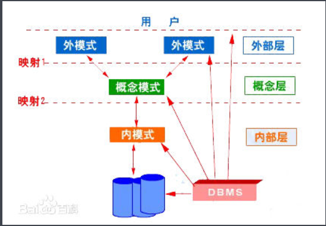

# 数据库

+ 设计范式：

  + 1 、第一范式（1NF）

    + 指数据库表的每一列(即每个属性)都是不可分割的基本数据项，同一列中不能有多个值，即实体中的某个属性不能有多个值或者不能有重复的属性。简而言之，第一范式就是无重复的列。

  + 2、 第二范式（2NF）(使用独立的主键，例如uuid，自增主键可以避免出现2NF的问题)

    + 第二范式（2NF）要求数据库表中的每个实例或行必须可以被唯一地区分。

    + 第二范式（2NF）要求实体的属性完全依赖于主关键字。

    + 所谓完全依赖是指不能存在仅依赖主关键字一部分的属性，如果存在，那么这个属性和主关键字的这一部分应该分离出来形成一个新的实体，新实体与原实体之间是一对多的关系。

      简而言之，第二范式就是非主属性依赖于主关键字。

  + 3 、第三范式（3NF）

    + 在满足第二范式的基础上，且不存在传递函数依赖，那么就是第三范式。
    
    + 简而言之，第三范式就是属性不依赖于其它非主属性。
  
+ Join关键字：
  
  + 
  + 数据库在通过连接两张或多张表来返回记录时，都会生成一张中间的临时表，然后再将这张临时表返回给用户。 在使用left jion时，on和where条件的区别如下：
    + 1. on条件是在生成临时表时使用的条件，它不管on中的条件是否为真，都会返回左边表中的记录。
      2. where条件是在临时表生成好后，再对临时表进行过滤的条件。这时已经没有left join的含义（必须返回左边表的记录）了，条件不为真的就全部过滤掉。
  
+ Mysql联合索引最左匹配原则:

  + ```sql
    CREATE TABLE `user` (
      `id` bigint(20) NOT NULL AUTO_INCREMENT COMMENT '主键Id',
      `name` varchar(255) DEFAULT NULL COMMENT '名称',
      `age` int(11) DEFAULT NULL COMMENT '年龄',
      `address` varchar(255) DEFAULT NULL COMMENT '地址',
      `created_time` datetime DEFAULT NULL COMMENT '创建时间',
      `updated_time` datetime DEFAULT NULL COMMENT '更新时间',
      PRIMARY KEY (`id`),
      KEY `idx_com1` (`name`,`age`,`address`)
    ) ENGINE=InnoDB DEFAULT CHARSET=utf8 COMMENT='用户表';
    ```

  + ```sql
    该查询语句没有使用到索引idx_com1
    select  *  from user where age = 25 and address='北京大兴区';
    原因：当b+树的数据项是复合的数据结构，比如(name,age,sex)的时候
    b+树是按照从左到右的顺序来建立搜索树的，
    比如当(张三,20,F)这样的数据来检索的时候，
    b+树会优先比较name来确定下一步的所搜方向，如果name相同再依次比较age和sex，最后得到检索的数据；
    但当(20,F)这样的没有name的数据来的时候，b+树就不知道下一步该查哪个节点
    ```

+ **truncate**和**delete**的相同点与不同点：

  + **相同点**：
  
    + 效果上，delete from tableA，与truncate table tableA的作用是一样的（如果delete后面不添加where条件过滤），而且与drop table tableA，接着create table tableA的效果也是一样的。
  + **不同点** ：
    + **1、语言上**
      + delete是DML，truncate是DDL，执行truncate需要drop权限。
    + **2、效率上**
      + delete是一行一行的删除，所以执行速度不快。由于truncate是DDL，是通过删除表然后重建表实现的，执行速度很快。
    + **3、事务上**
      + **delete过程如果出现错误，事务是可以回滚的，而truncate无法回滚。**
    + **4、效果上**
        + delete可以删除符合条件的数据行，而truncate只能删除整体
  
        + delete可以返回被删除的记录数，而truncate只返回0，没有任何意义
  
        + 在存储引擎为InnoDB的数据库服务器中，如果一个表的主键作为了另一个表的外键，那么truncate无法删除这个表中的数据，无论这个外键是否存在，这是由于drop表限制的。而delete可以，只要这个表的主键在另一个表的外键中不存在即可。
  
        + truncate删除一个表的数据后，这个表的auto_increment列重新设置为初始大小，而delete则使用删除之前的顺序。索引同理。
  
        + truncate 之后，如果该表有自增主键，则该主键被置为0，delete不会重置自增主键。
  
## SQL四类语言：

   + **DDL** ：(Data Definition Language 数据定义语言）用于操作对象及对象本身，这种对象包括数据库,表对象，及视图对象：
        + create:创建数据库和数据库的一些对象
        + drop:删除数据表、索引、触发程序、条件约束以及数据表的权限等
        + alter:修改数据表定义及数据属性
        
   + **DML**: （Data Manipulation Language 数据操控语言) 用于操作数据库对象对象中包含的数据
     - insert:向数据库插入一条数据
      - delete:删除表中的一条或多条记录
      - update:用于修改表中的数据   
     
   + **DQL**:(Data Query Language 数据查询语言 )用于查询数据
     
     - select:用于查询表中的数据
     
   + **DCL** : （Data Control Language 数据控制语句） 用于操作数据库对象的权限
       + greate:分配权限给用户
       + revoke:废除数据库中某用户的权限
       
+ **ACID**:
  + **原子性**(Atomicity)：事务是一组不可分割的操作单元，这组单元要么同时成功要么同时失败（由DBMS的事务管理子系统来实现）；
  + **一致性**(Consistency)：事务前后的数据完整性要保持一致（由DBMS的完整性子系统执行测试任务）；
  + **隔离性**(Isolation):多个用户的事务之间不要相互影响，要相互隔离（由DBMS的并发控制子系统实现）；
  + **持久性**(durability):一个事务一旦提交，那么它对数据库产生的影响就是永久的不可逆的，如果后面再回滚或者出异常，都不会影响已提交的事务（由DBMS的恢复管理子系统实现的）

+ 隔离级别：

  + Read uncommitted :（读未提交数据）

  + Read committed: （读已提交数据）

  + Repeatable read:（可重复读）

  + Serializable:（串行化）

    
    
    **脏读** ：脏读就是指当一个事务正在访问数据，并且对数据进行了修改，而这种修改还没有提交到数据库中，这时，另外一个事务也访问这个数据，然后使用了这个数据。
    
    **不可重复读** ：是指在一个事务内，多次读同一数据。在这个事务还没有结束时，另外一个事务也访问该同一数据。那么，在第一个事务中的两 次读数据之间，由于第二个事务的修改，那么第一个事务两次读到的的数据可能是不一样的。这样就发生了在一个事务内两次读到的数据是不一样的，因此称为是不 可重复读。例如，一个编辑人员两次读取同一文档，但在两次读取之间，作者重写了该文档。当编辑人员第二次读取文档时，文档已更改。原始读取不可重复。如果 只有在作者全部完成编写后编辑人员才可以读取文档，则可以避免该问题。
    
     **幻读** : 是指当事务不是独立执行时发生的一种现象，例如第一个事务对一个表中的数据进行了修改，这种修改涉及到表中的全部数据行。 同时，第二个事务也修改这个表中的数据，这种修改是向表中插入一行新数据。那么，以后就会发生操作第一个事务的用户发现表中还有没有修改的数据行，就好象 发生了幻觉一样。例如，一个编辑人员更改作者提交的文档，但当生产部门将其更改内容合并到该文档的主复本时，发现作者已将未编辑的新材料添加到该文档中。 如果在编辑人员和生产部门完成对原始文档的处理之前，任何人都不能将新材料添加到文档中，则可以避免该问题。
    
    **不可重复读和幻读的区别：** 简单来说，不可重复读是由于数据修改引起的，幻读是由数据插入或者删除引起的。

+ 传播行为：

  1. **PROPAGATION_REQUIRED**：如果当前没有事务，就创建一个新事务，如果当前存在事务，就加入该事务，该设置是最常用的设置。
  2. **PROPAGATION_SUPPORTS**：支持当前事务，如果当前存在事务，就加入该事务，如果当前不存在事务，就以非事务执行。
  3. **PROPAGATION_MANDATORY**：支持当前事务，如果当前存在事务，就加入该事务，如果当前不存在事务，就抛出异常。
  4. **PROPAGATION_REQUIRES_NEW**：创建新事务，无论当前存不存在事务，都创建新事务。
  5. **PROPAGATION_NOT_SUPPORTED**：以非事务方式执行操作，如果当前存在事务，就把当前事务挂起。
  6. **PROPAGATION_NEVER**：以非事务方式执行，如果当前存在事务，则抛出异常。
  7. **PROPAGATION_NESTED**：如果当前存在事务，则在嵌套事务内执行。如果当前没有事务，则执行与PROPAGATION_REQUIRED类似的操作。

+ **为什么要使用索引？**

  1. 通过创建唯一性索引，可以保证数据库表中每一行数据的唯一性。
  2. 可以大大加快 数据的检索速度（大大减少的检索的数据量）,  这也是创建索引的最主要的原因。 
  3. 帮助服务器避免排序和临时表
  4. 将**随机IO变为顺序IO** (将无序的数据变成有序的数据)
  5. 可以加速表和表之间的连接，特别是在实现数据的参考完整性方面特别有意义。
  6. 索引就是排好序的快速查找结构

+ **Mysql索引主要使用的哪两种数据结构？**

  - **哈希索引**：对于哈希索引来说，底层的数据结构就是哈希表，因此在绝大多数需求为**单条记录查询**的时候，可以选择哈希索引，查询性能最快；其余大部分场景，建议选择BTree索引。
  - **BTree索引**：Mysql的BTree索引使用的是B树中的B+Tree。但对于主要的两种存储引擎（MyISAM和InnoDB）的实现方式是不同的。

+ **什么是覆盖索引?**

  + 如果一个索引包含（或者说覆盖）所有需要查询的字段的值，我们就称
  之为“覆盖索引”。我们知道在InnoDB存储引擎中，如果不是主键索引，叶子节点存储的是主键+列值。最终还是要“回表”，也就是要通过主键再查找一次,这样就会比较慢。覆盖索引就是把要查询出的列和索引是对应的，不做回表操作！

+ **主键**与**索引**

  1. 主键为一种约束，唯一索引为一种索引，本质上就不同；

  2. 主键创建后一定包含唯一性索引，而唯一索引不一定就是主键； 

  3. 主键不允许空值，唯一索引可以为空；

  4. 主键可以被其他表引用，而唯一索引不可以；

  5. 一个表最多只能创建一个主键，而可以创建多个唯一索引；

  6. 主键和索引都是键，主键是逻辑键，索引为物理键，即主键不实际存在。  

  7. 索引对删除的影响：如果要删除的字段与建立索引的字段相同，删除效率会提高，如果不同，效率降低。

  
  
  ​		
  
+ 索引失效的操作：

  + 条件中有or，即使有条件带索引也不会使用；**要想使用or，又想让索引生效，只能将or条件中的每个列都加上索引**
  + 对于多列索引，如果不是使用的第一部分，则不会使用索引;(最左匹配原则)
  + like查询是以%开头的，不会用到索引
  + 如果列类型是字符串，那一定要在条件中将数据使用引号引用起来,否则不使用索引;
  + 如果mysql估计使用全表扫描要比使用索引快,则不使用索引;
  + 条件中包含&lt;  &gt;
  + **将打算加索引的列设置为 NOT NULL ，否则将导致引擎放弃使用索引而进行全表扫描**

+ 数据库表结构修改
  
  + 删除列:   ALTER TABLE table_name DROP clume_name
  + 添加列:   ALTER TABLE table_name ADD  column_name  dataType
  + 删除表：DROP TABLE table_name
  
  

+ 数据库模式：

  + 外模式：

    + 外模式又称子模式或用户模式，对应于用户级。它是某个或某几个用户所看到的数据库的数据视图，是与某一应用有关的数据的[逻辑表示](https://baike.baidu.com/item/逻辑表示)。外模式是从模式导出的一个子集，包含模式中允许特定用户使用的那部分数据。用户可以通过外模式描述语言来描述、定义对应于用户的[数据记录](https://baike.baidu.com/item/数据记录)(外模式)，也可以利用[数据操纵语言](https://baike.baidu.com/item/数据操纵语言)(Data Manipulation Language，DML)对这些数据记录进行操作。外模式反映了数据库系统的用户观。

  + 模式(概念模式):

    + 概念模式又称模式或逻辑模式，对应于概念级。它是由数据库设计者综合所有用户的数据，按照统一的观点构造的全局逻辑结构，是对数据库中全部数据的逻辑结构和特征的总体描述，是所有用户的公共数据视图(全局视图)。它是由数据库管理系统提供的数据模式描述语言(Data Description Language，DDL)来描述、定义的。概念模式反映了[数据库系统](https://baike.baidu.com/item/数据库系统)的整体观。

  + 内模式:

    + 内模式又称存储模式，对应于物理级。它是数据库中全体数据的内部表示或底层描述，是数据库最低一级的逻辑描述，它描述了数据在存储介质上的存储方式和物理结构，对应着实际存储在外存储介质上的数据库。内模式由内模式描述语言来描述、定义的。内模式反映了数据库系统的存储观。

      在一个数据库系统中，只有唯一的数据库， 因而作为定义 、描述数据库存储结构的内模式和定义、描述数据库逻辑结构的模式，也是唯一的，但建立在数据库系统之上的应用则是非常广泛、多样的，所以对应的外模式不是唯一的，也不可能是唯一的。

  + 

+ **Innodb**和**MyISAM**:

  + InnoDB 支持事务，MyISAM 不支持事务。
  +  InnoDB 支持外键，而 MyISAM 不支持。
  + InnoDB 是聚集索引，MyISAM 是非聚集索引。
    + 聚簇索引的文件存放在主键索引的叶子节点上，因此 InnoDB 必须要有主键，通过主键索引效率很高。但是辅助索引需要两次查询，先查询到主键，然后再通过主键查询到数据。因此，主键不应该过大，因为主键太大，其他索引也都会很大。而 MyISAM 是非聚集索引，数据文件是分离的，索引保存的是数据文件的指针。主键索引和辅助索引是独立的。
  + InnoDB 不保存表的具体行数，执行 select count(*) from table 时需要全表扫描。而MyISAM 用一个变量保存了整个表的行数，执行上述语句时只需要读出该变量即可，速度很快；
  + InnoDB 最小的锁粒度是行锁，MyISAM 最小的锁粒度是表锁。

+ 锁:

  + 共享锁(s)：读锁，若事务T对数据对象A加上S锁，则事务T可以读A但不能修改A，其他事务只能对A再加S锁，而不能加X锁，直到T释放A上的锁；
  + 排他锁(x)：又称写锁，若事务T对数据对象A加上X锁，则事务T可以读A也可以修改，其他事务不能再对A加任何锁，直到T释放A上的锁。


+ 数据库优化方案：
  + 数据分区
  + 索引
  + 缓存机制
  + 加大虚存
  + **分批处理**
  + 使用临时表和中间表
  + 优化查询语句
  + 使用视图
  + 使用存储过程
  + 用排序来取代非顺序存储

+ 在Mysql中不能对一张表同时进行删除查询操作，需要建立中间表：

  + 编写一个 SQL 查询，来删除 Person 表中所有重复的电子邮箱，重复的邮箱里只保留 Id 最小 的那个。

    ```sql
delete from Person 
    	where Id not in 
    		(select Id From
             	(select min(Id) as Id from Person group by Email) 
             as t) ;
    #需要临时表t才能进行删除+查询的操作
    ```
    


## 封锁协议

**一、背景**
在运用X锁和S锁对数据对象加锁时，还需要约定一些规则 ，例如何时申请X锁或S锁、持锁时间、何时释放等。称这些规则为封锁协议（Locking Protocol）。对封锁方式规定不同的规则，就形成了各种不同的封锁协议。不同的封锁协议，在不同的程度上为并发操作的正确调度提供一定的保证。
**二、三种封锁协议**
1.一级封锁协议
一级封锁协议是：事务T在修改数据R之前必须先对其加X锁，直到事束才释放。事务结束包括正常结束（COMMIT）和非正常结束（ROLLBACK）。
一级封锁协议可以防止丢失修改，并保证事务T是可恢复的。使用一级封锁协议可以解决丢失修改问题。
在一级封锁协议中，如果仅仅是读数据不对其进行修改，是不需要加锁的，它不能保证可重复读和不读“脏”数据。
2.二级封锁协议
二级封锁协议是：一级封锁协议加上事务T在读取数据R之前必须先对其加S锁，读完后方可释放S锁。
二级封锁协议除防止了丢失修改，还可以进一步防止读“脏”数据。但在二级封锁协议中，由于读完数据后即可释放S锁，所以它不能保证可重复读。
3.三级封锁协议
三级封锁协议是：一级封锁协议加上事务T在读取数据R之前必须先对其加S锁，直到事务结束才释放。
三级封锁协议除防止了丢失修改和不读“脏”数据外，还进一步防止了不可重复读。
**三、总结**
上述三级协议的主要区别在于什么操作需要申请封锁，以及何时释放。


## Sql关键词：

- Limit&&offset:

  - ```sql
    语句1：select * from student limit 9,4
    语句2：slect * from student limit 4 offset 9
    // 语句1和2均返回表student的第10、11、12、13行  
    //语句2中的4表示返回4行，9表示从表的第十行开始
    ```

    

- IFNULL:

  - ```sql
    编写一个 SQL 查询，获取 Employee 表中第二高的薪水（Salary） 。
    
    +----+--------+
    | Id | Salary |
    +----+--------+
    | 1  | 100    |
    | 2  | 200    |
    | 3  | 300    |
    +----+--------+
    select IFNULL(
        (select Salary 
        from Employee 
        group by Salary desc limit 1,1),null) as SecondHighestSalary ;
    
    
    ```

- DATEDIFF(判断时间差)：

  - ```sql
    给定一个 Weather 表，编写一个 SQL 查询，来查找与之前（昨天的）日期相比温度更高的所有日期的 Id。
    
    +---------+------------------+------------------+
    | Id(INT) | RecordDate(DATE) | Temperature(INT) |
    +---------+------------------+------------------+
    |       1 |       2015-01-01 |               10 |
    |       2 |       2015-01-02 |               25 |
    |       3 |       2015-01-03 |               20 |
    |       4 |       2015-01-04 |               30 |
    +---------+------------------+------------------+
    例如，根据上述给定的 Weather 表格，返回如下 Id:
    +----+
    | Id |
    +----+
    |  2 |
    |  4 |
    +----+
    select w2.Id from Weather w1,Weather w2 where DATEDIFF(w2.RecordDate,w1.RecordDate)=1 and  w2.Temperature>w1.Temperature;
    ```

+ exist 和 in:

  + ``` sql
    select * from A
    where id in(select id from B)
    #-----------------------------
    select a.* from A a
    where exists(select 1 from B b where a.id=b.id)
    #当B数据小的时候使用in
    #当A数据小的时候使用exist
    ```

    


## 索引相关 

###   1.什么是索引 

  索引是一种**数据结构**，可以帮助我们快速的进行数据查找。 

###   2.索引是什么样的数据结构 

  索引的存储结构跟**具体的存储引擎**实现**有关**，在mysql中使用较多的索引有Hash索引，B+树索引等。而我们经常使用的InnoDB存储引擎的默认索引实现是：B+树索引。 

###   3.Hash索引和B+树索引有什么区别或者劣势 

  首先要知道Hash索引和B+树索引的实现原理。 

####   Hash索引的实现原理： 

  hash索引底层是**hash表**，进行查找时，调用一次hash函数就可以取到相应的键值，之后进行回表查询获得实际数据。 

####   B+树索引实现原理： 

  B+树索引底层实现是多路平衡查找树，对于每一次查询都是从根节点出发，查找到叶子节点方可以获得所查键值，然后根据查询判断是否需要回表查询数据。 

####   区别： 

-    hash 索引进行等值查询更快（一般情况下），但是无法进行范围查询   

  因为在hash索引中经过hash函数建立索引之后，**索引的顺序与原顺序无法保持一致**，不能支持范围查询。而B+树的所有节点皆遵循（左节点小于父节点，右节点大于父节点）天然支持范围。 

-    hash索引不支持使用索引进行排序，原理同上   

###   4.什么是聚簇索引 

  在B+数索引中，叶子节点可能存储了当前key的值，也可能存储了当前的key值以及整行的数据，这就是非聚簇索引和聚簇索引。 

  在InnoDB中，只有主键索引是聚簇索引，如果没有主键，则挑选一个唯一键建立聚簇索引，如果没有唯一键，则隐式生成一个键来建立聚簇索引。 

  当查询使用聚簇索引时，在对应的叶子节点上，可以获取到整行数据，因此不用再次回表查询。 

###   5.非聚簇索引一定会回表查询吗 

  不一定，如果查询是覆盖索引，也就是查询的字段全部命中了索引，那么就不需要回表查询。 

  举个例子：假设我们在员工表的年龄列上建立了索引，那么当进行 

```
select age from employee where age < 20
```

  查询时，在索引子节点已经包含了age信息，不会再进行回表查询。 

###   6.建立索引有哪些需要考虑的因素 

  建立索引一般需要考虑到字段的使用频率，经常作为条件进行查询的字段比较适合作为索引。如果需要建立联合索引的话，还需要考虑联合索引中的顺序。 

  除此之外还需要考虑，防止过多的索引对表造成太大压力，这些都和实际的表结构以及查询方式有关。 

####   那些列需要建立索引 

  （1）在经常需要搜索的列上，可以加快搜索的速度； 

  （2）在作为主键的列上，强制该列的唯一性和组织表中数据的排列结构； 

  （3）在经常用在连接的列上，这些列主要是一些外键，可以加快连接的速度； 

  （4）在经常需要根据范围进行搜索的列上创建索引，因为索引已经排序，其指定的范围是连续的； 

  （5）在经常需要排序的列上创建索引，因为索引已经排序，这样查询可以利用索引的排序，加快排序查询时间； 

  （6）在经常使用在WHERE子句中的列上面创建索引，加快条件的判断速度。 

####   对于有些列不应该创建索引： 

  （1）对于那些在查询中很少使用或者参考的列不应该创建索引。 

  这是因为，既然这些列很少使用到，因此有索引或者无索引，并不能提高查询速度。相反，由于增加了索引，反而降低了系统的维护速度和增大了空间需求。 

  （2）对于那些只有很少数据值的列也不应该增加索引。 

  这是因为，由于这些列的取值很少，例如人事表的性别列，在查询的结果中，结果集的数据行占了表中数据行的很大比例，即需要在表中搜索的数据行的比例很大。增加索引，并不能明显加快检索速度。 

  （3）对于那些定义为text, image和bit数据类型的列不应该增加索引。 

  这是因为，这些列的数据量要么相当大，要么取值很少。 

  (4)当修改性能远远大于检索性能时，不应该创建索引。 

  这是因为，修改性能和检索性能是互相矛盾的。当增加索引时，会提高检索性能，但是会降低修改性能。当减少索引时，会提高修改性能，降低检索性能。因此，当修改性能远远大于检索性能时，不应该创建索引。 

###   7.联合索引是什么？为什么需要注意联合索引中的顺序 

  MySql中可以使用多个字段同时建立一个索引，叫作联合索引。在联合索引中，如果想要命中索引，需要按照建立索引时的字段顺序挨个使用，否则无法命中索引。 

  具体原因如下： 

  MySql使用索引时需要索引有序，假设现在建立了“name，age，school”的联合索引。 

  那么索引的排序为从左到右：先按照name排序，如果name相同则使用age排序，如果age也相等则使用school排序。 

  当进行查询时，此时索引仅仅按照name严格有序，因此必须首先使用name字段进行等值查询，之后对于匹配到的列而言，其按照age字段严格有序，此时可以按照age字段用作索引查找，以此类推。 

  因此在建立联合索引时应该把**频繁查询的字段**或者**选择性高**的列放到前面。此外还可以根据特例查询或者表结构进行单独的调整。 

###   8.创建的索引有没有被使用到？或者说怎么才可以知道这条语句运行很慢的原因 

  MySql提供了explain命令来查看语句的执行计划，MySql在执行某个语句之前，会将该语句过一遍查询优化器，之后会拿到对语句的分析，也就是执行计划，其中包含了许多信息。 

  可以通过其中和索引有关的信息来分析是否命中了索引，例如possible_key，key，key_len等字段。分别说明了此语句可能用到的索引，实际使用的索引，以及使用索引的长度。 

###   9.何时索引失效 

-    使用不等查询    
-    列参与了数***算或者函数    
-    字符串like时最左边是通配符："%aaa"    
-    当mysql分析全表扫描比使用索引快时不使用索引    
-    当使用联合索引时，前面一个条件为范围查询，后面的即使是符合最左前缀原则也不使用索引。   

##     10. 索引分析关键字(Mysql)

+ Explain:	

  + ID(查询顺序):

    + ID相同，执行顺序由上至下
    + ID不同，如果是子查询，id序号会递增，id值与查询优先级正相关，id越大越先被执行
    + ID有相同值，有不同值的情况，如果相同从上往下顺序执行，如果不同，ID大的先执行

  + select_type(查询类型):

    + SIMPLE：简单查询，不包含子查询或者union
    + PRIMARY：查询中若包含子查询，外层查询标记为PRIMARY
    + SUBQUERY：被进行子查询的查询类型
      + 
    + DERIVED：在From 列表中包含的子查询被标记喂DERIVED(衍生)，MySQL会递归执行这些子查询，把结果放在临时表里
    + UNION：弱第二个SELECT出现在UNION之后，则被标记为UNION，若UNION包含在FROM子句的子查询中，外层SELECT将被标记为DERIVED
    + UNION RESULT：从UNION表获取结果的SELECT

  + table：显示当前查询的表

  + type:访问类型排列

    + 查询性能：system->const->eq_ref->ref->range->index->All

    + system:一行数据的表(相当于系统表)

    + const:主键查询或者unique index查询

    + eq_ref:唯一性索引扫描:对每个索引键，表中只有一条记录与之匹配，常见于主键或唯一索引

    + ref:非唯一性索引扫描，返回匹配某个单独值的所有行，可能或找到多个符合条件的行，所以属于查找和扫描的混合体

      + ```sql
        explain select * from t where userName='john'
        ```

    + range:只检索给定的范围行，关键词 between，<,>,in...

    + index:只遍历索引树的全表扫描

    + all:不使用索引的全表扫描

##   事务相关 

###   1.什么是事务 

  事务最经典的例子是转账，从A账号转到B账号100块钱，要保证A账号减去了100同时B账号增加了100，这个事务才算是完成了，任何一方失败两方的操作都要回滚，否则就会出现不一致。 

  事务是一些列的操作，他们要符合ACID特性，最常见的理解就是，事务中的操作要么全部成功，要么全部失败，但是只是这样还不够。 

###   2.ACID是什么？可以详细说一下嘛？ 

####   A=Atomicity 

  原子性：就是说，要么完全成功，要么全部失败， 

####   C=Consistency 

  一致性：系统总是从一个一致性的状态转移到另一个一致性的状态，不会存在中间状态。一致性表示事务完成后，符合逻辑运算。 

####   I=Isolation 

  隔离型：通常来说，一个事务在完全提交之前，对其他事务是不可见的，注意是通常来说（如果隔离级别很低的话是可以看到其他事务未提交的数据的）。 

####   D=Durability 

  持久性：一旦事务提交了，那么永远都是这样子了，哪怕系统崩溃也不会影响到这个事务的结果。 

###   3.同时多个事务运行会怎么样 

  多事务并发一般会造成以下几个问题： 

-    脏读：**A**事务读取了**B事务未提交**的内容，而**B事务后面进行了回滚**。    
-    不可重复读：**A**事务读取了B事务**提交的内容（这里指修改）**。读取了修改数据。    
-    幻读：A事务读取了一个范围的内容，而同时事B事务在此期间插入了一条新数据，造成了**幻觉**。读取了新增数据。   

###   4.怎么解决这些问题，MySql的隔离级别了解吗？ 

  MySql四种隔离级别： 

-    未提交读   

  这就是上面所说的例外情况，这种隔离级别下，其他事务可以看到本事务没有提交的部分修改，因此会造成脏读问题。这个级别的**性能没有足够大的优势，但是又有很多问题**，因此很少使用。 

-    已提交读   

  其他事务只能读取到本事务已经提交的部分，这个隔离解绑有不可重复读的问题，在同一个事务内的两次读取，拿到的结果可能不一样，因为另外一个事务对数据进行了修改。 

-    可重复读   

  可重复读隔离级别解决了上面不可重复读的问题，但是仍然有一个问题就是幻读，当你读取id>10的数据行是，对涉及到的行加上了读锁，此时另外的一个事务新插入了一条数据id=11的数据，因为是新插入的，所以不会触发上面的锁的排斥。那么进行本事务的下一次的查询时会发现有一条id=11的数据，而上次查询操作并没有获取到。 

-    可串行化   

  这事最高的隔离级别，可以解决上面提到的所有问题，因为它强制所有的操作串行执行，这会导致并发能力，因此也不常用。 

###   5.InnoDB使用的是那种隔离级别？ 

  InnoDB默认使用的是可重复读的隔离级别。 

###   6.对MySql锁了解吗？ 

  当数据库有并发事务的时候，可能会产生数据的不一致，这时候需要一些机制来保证访问的次序，锁机制就是这样一个机制。 

  就像酒店的房间，如果大家随意进出，就会出现多个人抢夺同一个房间的情况，而在房间上装上锁，申请到钥匙的人才可以入住并且将房间锁起来，其他人只能等其他人使用完毕才可以再次使用。 

###   7.MySql都有哪些锁？ 

  从锁的类别上来讲，有共享锁和排他锁 

####   共享锁： 

  又叫做读锁，当用户要进行数据的读取时，对数据加上共享锁，共享锁可以同时加上多个。 

###   排他锁： 

  又叫做写锁，当用户要进行数据的写入时，对数据加上排它锁，排它锁值可以加一个，他和其他的排它锁，共享锁都互斥。 

  用上面的例子来说就是用户的行为有2种，一种是来看房，多个用户一起看房是可以接受的。一种是真正的入住一晚，在这期间，无论是想入住还是想看房都不可以。 

  锁的粒度取决于具体的存储引擎，InnoDB实现了行级锁、页级锁、表级锁。 

  他们的加锁开销从大到小，并发能力也是从大到小。 

##     

##   表结构设计 

###   1.为什么要尽量设定一个主键 

  主键是数据库确保数据行在整张表唯一性的保障，及时业务上本张表没有主键，也建议添加一个自增长的ID列作为主键。设定了主键后，在后续的删改查的时候可能更加快速以及确保操作数据范围安全。 

###   2.主键使用自增ID还是UUID 

  推荐使用自增ID，不要使用UUID，因为在InnoDB存储引擎中，主键索引是作为聚簇索引存在的，也就是说，主键索引的B+数叶子节点上存储了主键索引以及全部的数据（按照顺序），如果主键是自增ID，那么需要不断向后排列即可，如果是UUID，由于到来的ID与原来的大小不确定，会造成很多的数据插入，数据移动，然后导致产生很多的内存碎片进而造成插入性能下降。 

###   3.字段为什么要求定义为not null 

  null值会占用更多的字节,且会在程序中造成很多与预期不符的情况。 

###   4.如果要存储用户的密码散列，应该使用寿命字段进行存储 

  密码散列,盐,用户身份证号等固定长度的字符串应该使用char而不是varchar来存储，这样可以节省空间且提高检索效率。 

##     

##   存储引擎相关 

###   1.mysql支持哪些存储引擎 

  MySql支持多种存储引擎，比如InnoDB，MyISAM，Memory，Archive等等。 

  在大多数情况下，直接选择使用InnoDB引擎都是最合适的，InnoDB也是MySql的默认存储引擎。 

###   2.InnoDB和MyISAM有什么区别？ 

-    InnoDB支持事务，MyISAM不支持    
-    InnoDB支持行级锁，而MyISAM不支持    
-    InnoDB支持MVCC，而MyISAM不支持    
-    InnoDB支持外键，而MyISAM不支持    
-    InnoDB不支持全文索引，而MyISAM支持   

##     

##   零散问题 

###   1.MySql中的varchar和char有什么区别？ 

  char是一个定长字段,假如申请了char(10)的空间,那么无论实际存储多少内容.该字段都占用10个字符,而varchar是变长的  使用char. 

###   2.varchar(10)和int(10)各代表什么含义？ 

  varchar的10代表了申请的空间长度,也是可以存储的数据的最大长度,而int的10只是代表了**展示的长度**,不足10位以0填充. 

  也就是说,**int(1)和int(10)所能存储的数字大小**以及**占用的空间都是相同的**,只是在展示时按照长度展示。 

###   3.MySql的binlog有几种录入格式？有什么区别？ 

  有三种格式：statement、row、mixed 

-    statement模式   

  记录单元为语句，即每一条sql造成的影响都会记录，由于sql执行是有上下文的，因此保存的时候需要保存相关信息，同时还有一些使用了函数之类的语句无法被记录复制。 

-    row模式   

  row模式下记录单元为每一行的改动，基本是全部可以记录下来，但是由于很多操作，会导致大量行的改动（比如alter table），因此这种模式下的文件保存的信息太多，日志量太大。 

-    mixed模式   

  一种折中的方案，普通的操作使用statement记录，当无法使用statement记录的时候使用row。 

  此外新版本的mysql对row级别也做了一些优化，当表结构发生变化的时候，会记录语句而不是逐行记录。 

###   4.超大分页怎么处理？ 

  超大分页可以从三个方向来解决： 

-    数据库层面   

  数据库层面的优化可能性有许多种,但是**核心思想**都一样,就是**减少load的数据**。 

  像下面这种查询可以进行优化： 

```
select * from table where age > 20 limit 1000000,10 
```

  这条语句需要load1000000数据然后基本上全部丢弃,只取10条当然比较慢。 

  把查询所有修改为查询主键，之后根据主键id去查询行数据，这样一次查询的数据量就会小很多 

```
select * from table where id in (select id from table where age > 20 limit 1000000,10) 
```

  这样虽然也load了一百万的数据,但是由于**索引覆盖**,要查询的所有字段都在索引中,所以速度会很快。 

  如果ID连续的好，那么我们还可以使用如下语句查询：记录最大的id，效率很好 

```
select * from table where id > 1000000 limit 10 
```

-    从需求角度减少   

  主要是不做类似的需求(直接跳转到几百万页之后的具体某一页.只允许逐页查看或者按照给定的路线走,这样可预测,可缓存)以及防止ID泄漏且连续被人恶意攻击. 

-    缓存   

  解决超大分页,其实主要是靠缓存,可预测性的**提前查到内容**,缓存至redis等k-V数据库中,直接返回即可。 

###   5.sql耗时怎么统计，统计过慢查询吗？对慢查询怎么优化？ 

  慢查询的优化首先要搞明白慢的**原因是什么**? 是查询条件**没有命中索引**?是**load了不需要的数据列**?还是**数据量太大**? 

  所以优化也是针对这三个方向来的。 

-    load额外的数据   

  看看是否load了额外的数据,可能是**查询了多余的行并且抛弃掉了**,可能是**加载了许多**结果中并**不需要的列**,对语句进行分析以及重写。 

-    没有命中索引   

  分析语句的执行计划，然后**获得其使用索引的情况**，之后修改语句或者修改索引，**使得语句可以尽可能的命中索引**。 

-    数据量是不是太大   

  如果对语句的优化已经无法进行，可以考虑表中的**数据量是否太大**，如果是的话可以进行**横向或者纵向的分表**。 

###   6.横向分表和纵向分表，可以分别举一个例子吗？ 

####   横向分表 

  横向分表是按照行进行分表，假设我们有一张用户表，主键是自增ID同时是用户ID，数据量较大，如果有1亿多条，那么此时放在一张表里面查询效果就不太理想。 

  我们可以根据主键ID进行分表，无论是按照尾号分，或者按照ID区间分都是可以的。 

  假设按照尾号0-99分为100个表，那么每张表中只有100w，这时的查询效率无疑是可以满足要求的。 

####   纵向分表 

  纵向分表是按照列进行分表，假设我们有一张文章表，包含字段id-标题-摘要-内容，而系统中的展示形式是刷新出一个列表，列表中仅包含标题和摘要。 

  当用户点击某篇文章进入详情时才需要正文内容，此时，如果数据量大，将内容这个很大切不常用的列放在一起会拖慢原表的查询速度。 

  我们可以将上述表分为两张表：列表：id-标题-摘要-content-id，文章表：id-文章内容。当用户点击详情，根据content-id再取一次内容即可。而增加的存储量只是很小的content-id字段，代价很小。 

  当然，分表其实和业务的关联度很高，在分表之前，一定要做好调研和benchmark，不要按照自己的猜想盲目操作。 

###   7…说说三范式 

####   第一范式: 每个列都不可以再拆分，两列的属性相近或相似或一样，尽量合并属性一样的***保不产生冗余数据。 

  留言表 

| 名称     | 字段    |
| -------- | ------- |
| 留言编号 | name    |
| 留言姓名 | name    |
| 内容     | content |
| 邮箱     | email   |
| 地址     | address |

| 名称     | 字段     |
| -------- | -------- |
| 留言编号 | id       |
| 留言姓名 | name     |
| 内容     | content  |
| 邮箱     | email    |
| 省       | province |
| 市       | city     |
| 详细地址 | address  |

  如果需求知道那个省那个市并按其分类，那么显然第一个表格是不容易满足需求的，也不符合第一范式。 

| 名称      | 字段      |
| --------- | --------- |
| 室号      | roomId    |
| 物品1     | proName1  |
| 物品1数量 | proNum1   |
| 物品1价格 | proPrice1 |
| 物品2     | proName2  |
| 物品2数量 | proNum2   |
| 物品2价格 | proPrice2 |

| 名称     | 字段     |
| -------- | -------- |
| 室号     | roomId   |
| 物品     | proName  |
| 物品数量 | proNum   |
| 物品价格 | proPrice |

  显然第一个表结构不但不能满足足够多物品的要求，还会在物品少时产生冗余。也是不符合第一范式的。 

####   第二范式: 非主键列完全依赖于主键，而不能是依赖于主键的一部分。 

  每一行的数据只能与其中一列相关，即一行数据只做一件事。只要数据列中出现数据重复，就要把表拆分开来。 

| 名称       | 字段    |
| ---------- | ------- |
| 订单编号   | orderId |
| 房间编号   | roomId  |
| 联系人     | name    |
| 联系人电话 | phone   |
| 身份证号   | cardNo  |

  一个人同时订几个房间，就会出来一个订单号多条数据，这样子**联系人都是重复的**，就会造成数据冗余。我们应该把他拆开来。
 订单表 

| 名称     | 字段    |
| -------- | ------- |
| 订单编号 | orderId |
| 房间编号 | roomId  |
| 联系编号 | userId  |

  用户表 

| 名称       | 字段   |
| ---------- | ------ |
| 联系人编号 | id     |
| 联系人     | name   |
| 联系人电话 | phone  |
| 身份证号   | cardNo |

  这样便实现一条数据做一件事，不掺杂复杂的关系逻辑。同时对表数据的更新维护也更易操作。 

####   第三范式: 非主键列只依赖于主键,不依赖于其他非主键。 

  数据不能存在传递关系，即没个属性都跟主键有直接关系而不是间接关系。像：a–>b–>c 属性之间含有这样的关系，是不符合第三范式的。 

  比如Student表（学号，姓名，年龄，性别，所在院校，院校地址，院校电话） 

  这样一个表结构，就存在上述关系。 学号–> 所在院校 --> (院校地址，院校电话) 

  这样的表结构，我们应该拆开来，如下。 

  （学号，姓名，年龄，性别，所在院校）–（所在院校，院校地址，院校电话） 

  在设计数据库结构的时候,要尽量遵守三范式,如果不遵守,必须有足够的理由.比如性能. 事实上我们经常会为了性能而妥协数据库的设计. 

###   9.MyBatis 中的 # 和$区别 

  \#会将传入的内容当做字参数值,而$会直接将传入值拼接在sql语句中。
