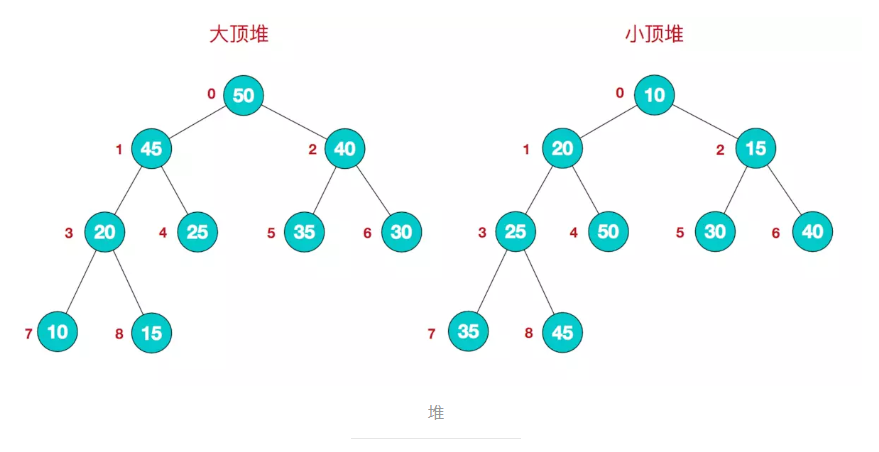
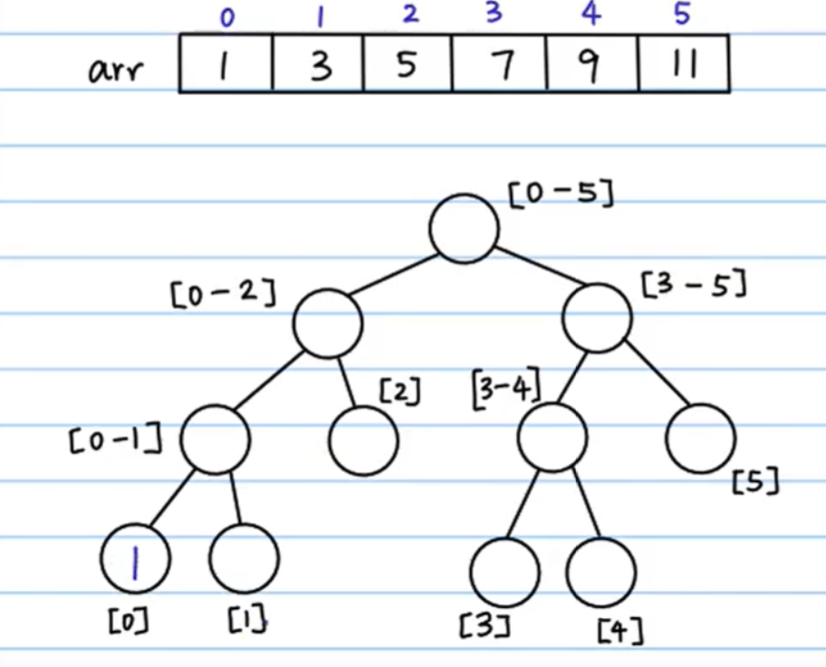
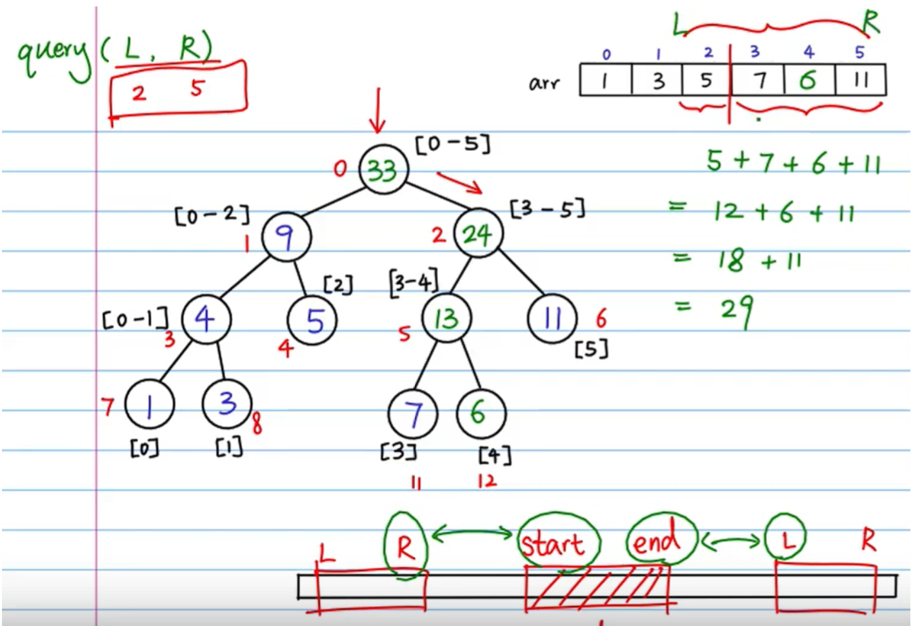

+ 堆：堆是具有以下性质的完全二叉树：每个结点的值都大于或等于其左右孩子结点的值，称为大顶堆；或者每个结点的值都小于或等于其左右孩子结点的值，称为小顶堆
  + 
+ 二叉树遍历的三种方式：
  + 前序：DLR
  + 中序：LDR
  + 后续：LRD
+ N层完全二叉树的结点总数=**2*N-1**,第N层的结点数为：**2*\(n-1)**
+ 哈夫曼树：
  + 带权路径最短的树。
  + 路径和路径长度:
    在一棵树中，从一个结点往下可以达到的孩子或孙子结点之间的通路，称为路径。通路中分支的数目称为路径长度。若规定根结点的层数为 1，则从根结点到第L层结点的路径长哈夫曼树度为 L-1。
  + 结点的权及带权路径长度:
    若将树中结点赋给一个有着某种含义的数值，则这个数值称为该结点的权。结点的带权路径长度为：从根结点到该结点之间的路径长度与该结点的权的乘积。
  + 树的带权路径长度:
    树的带权路径长度规定为所有叶子结点的带权路径长度之和，记为 WPL。即设二叉树有 n 个叶子结点，每个叶子结点带有权值 wk，从根结点到每个叶子的长度为 lk,则每个叶子结点的带权路径长度之和：WPL = ∑wi*li (i = 0,1,2...n)
  + 哈夫曼树(也称为最优二叉树)就是使 WPL 达到最小的二叉树, 哈夫曼树是带权路径长度最短的树，权值较大的结点离根较近。
+ 增加和删除数据时，ArrayList需要进行移动数据，LinkedList只要改变前后数据
+ 大顶堆：(根节点的关键字既大 
+ 小顶堆：(根结点的键值是所有堆结点键值中最小者)
+ 排序二叉树(二叉查找树/二叉搜索树)：中序遍历该树，是递增有序数列


+ HashMap数据结构：

| JDK版本 | 实现方式             | 节点数>=8     | 节点数<=6     |
| ------- | -------------------- | ------------- | ------------- |
| 1.8以前 | 数组+单向链表        | 数组+单向链表 | 数组+单向链表 |
| 1.8以后 | 数组+单向链表+红黑树 | 数组+红黑树   | 数组+单向链表 |


+ 前缀树：

  + ```java
    public class Trie {
        private TrieNode root;
    
        public Trie() {
            root = new TrieNode();
        }
    
    
        public void insert(String word) {
            if (word == null) return;
            char[] chs = word.toCharArray();
            int index;
            TrieNode node = root;
            for (char ch : chs) {
                index = ch - 'a';
                if (node.nexts[index] == null) {
                    node.nexts[index] = new TrieNode();
                }
                node = node.nexts[index];
                node.path++;
            }
            node.end++;
        }
    
        /**
         * @param word
         * @return nums Of word
         */
        public int search(String word) {
            if (word == null) return 0;
            char[] chs = word.toCharArray();
            TrieNode node = root;
            int index;
            for (char ch : chs) {
                index = ch - 'a';
                if (node.nexts[index] == null) {
                    return 0;
                }
                node = node.nexts[index];
            }
            return node.end;
        }
    
        /**
         * 删除字段树中的某个字符串
         *
         * @param word
         */
        public void delete(String word) {
            if (search(word) != 0) {
                char[] chs = word.toCharArray();
                TrieNode node = root;
                int index;
                for (char ch : chs) {
                    index = ch - 'a';
                    if (--node.nexts[index].path == 0) {
                        node.nexts[index] = null;
                        return;
                    }
                    node = node.nexts[index];
                }
                node.end--;
            }
        }
    
        /**
         * @param pre
         * @return 当前前缀字符串出现的次数
         */
        public int prefixNumber(String pre) {
            if (pre == null) return 0;
            char[] chs = pre.toCharArray();
            int index;
            TrieNode node = root;
            for (char ch : chs) {
                index = ch - 'a';
                if (node.nexts[index] == null) return 0;
                node = node.nexts[index];
            }
            return node.path;
        }
    
        public boolean startsWith(String prefix) {
            return prefixNumber(prefix) != 0;
        }
    
        public static void main(String[] args) {
            Trie trie = new Trie();
            trie.insert("apple");
    
        }
    }
    
    
    class TrieNode {
        public int path; //有多少字符串经过该点
        public int end;  //有多少字符串以该点结尾
        public TrieNode[] nexts; //当前点的儿子节点字母
    
        public TrieNode() {
            path = 0;
            end = 0;
            nexts = new TrieNode[26];
        }
    }
    ```

  + 

+ 并查集：

  + ```java
    public class UnionFindSet {
        public HashMap<UnioNode, UnioNode> fatherMap;
        public HashMap<UnioNode, Integer> sizeMap; //每个并查集的head节点和这个并查集的节点数量
    
        public UnionFindSet(List<UnioNode> nodes) {
            makeSet(nodes);
        }
    
        /**
         * 初始化并查集
         *
         * @param nodes
         */
        private void makeSet(List<UnioNode> nodes) {
            fatherMap = new HashMap<>();
            sizeMap = new HashMap<>();
            for (UnioNode node : nodes) {
                fatherMap.put(node, node);   //head节点的父节点是自己
                sizeMap.put(node, 1);       //head节点所在的并查集大小默认为1
            }
        }
    
        /**
         * @param node
         * @return 当前节点所在的父节点
         */
        public UnioNode findHead(UnioNode node) {
            UnioNode father = fatherMap.get(node);
            if (father != node) {
                father = findHead(father);
            }
            fatherMap.put(node, father); //是每个节点的父节点都是head节点
            return father;
        }
    
        /**
         * @param a
         * @param b
         * @return 两个节点是否在同一并查集
         */
        public boolean isSameSet(UnioNode a, UnioNode b) {
            return findHead(a) == findHead(b);
        }
    
        private void union(UnioNode a, UnioNode b) {
            if (a == null || b == null) return;
            UnioNode aHead = findHead(a);
            UnioNode bHead = findHead(b);
            if (aHead != bHead) {
                int sizeA = sizeMap.get(aHead);
                int sizeB = sizeMap.get(bHead);
                if (sizeA > sizeB) {
                    fatherMap.put(bHead, aHead);
                    sizeMap.put(aHead, sizeA + sizeB);
                } else {
                    fatherMap.put(aHead, bHead);
                    sizeMap.put(bHead, sizeA + sizeB);
                }
            }
        }
    }
    
    
    class UnioNode {
    
    }
    
    ```

+ 线段树:

  + 

  + 

  + ```java
    public class SegmentTree {
        private static int MAX_LEN = 1000;
    
        /**
         * @param arr   原数据数组
         * @param tree  用来保存树的数组
         * @param node  树中每个节点的位置
         * @param start 数据数组中的开始节点
         * @param end   数据数组中的结束节点
         */
        public static void build_tree(int arr[], int tree[], int node, int start, int end) {
            if (start == end) tree[node] = arr[start];
            else {
                //找到分割点,左右递归
                int mid = (start + end) / 2;
                int left_node = 2 * node + 1;
                int right_node = 2 * node + 2;
                build_tree(arr, tree, left_node, start, mid);
                build_tree(arr, tree, right_node, mid + 1, end);
                tree[node] = tree[left_node] + tree[right_node];
            }
        }
    
        /**
         * @param arr   原数据数组
         * @param tree  用来保存树的数组
         * @param node  树中每个节点的位置
         * @param start 数组中的开始节点
         * @param end   数组中的结束节点
         * @param idx   原数据中的要更改的index
         * @param val   要更改的值
         */
        public static void update_tree(int arr[], int tree[], int node, int start, int end, int idx, int val) {
            if (start == end) {
                arr[idx] = val;
                tree[node] = val;
            } else {
                int mid = (start + end) / 2;
                int left_node = 2 * node + 1;
                int right_node = 2 * node + 2;
                if (idx >= start && idx <= mid) {
                    update_tree(arr, tree, left_node, start, mid, idx, val);
                } else {
                    update_tree(arr, tree, right_node, mid + 1, end, idx, val);
                }
                tree[node] = tree[left_node] + tree[right_node];
            }
        }
    
        /**
         * 查询原数据中L-R之间数据的和
         *
         * @param tree  用来保存树的数组
         * @param node  树中每个节点的位置
         * @param start 数据数组中的开始节点
         * @param end   数据数组中的结束节点
         * @param L     查询的起点
         * @param R     查询的终点
         */
        public static int query_tree(int[] tree, int node, int start, int end, int L, int R) {
            if (R < start || L > end) return 0;
            else if (L <= start && R >= end) return tree[node];
            else {
                int mid = (start + end) / 2;
                int left_node = 2 * node + 1;
                int right_node = 2 * node + 2;
                int sum_left = query_tree(tree, left_node, start, mid, L, R);
                int sum_right = query_tree(tree, right_node, mid + 1, end, L, R);
                return sum_left + sum_right;
            }
        }
    
    ```

  + 
