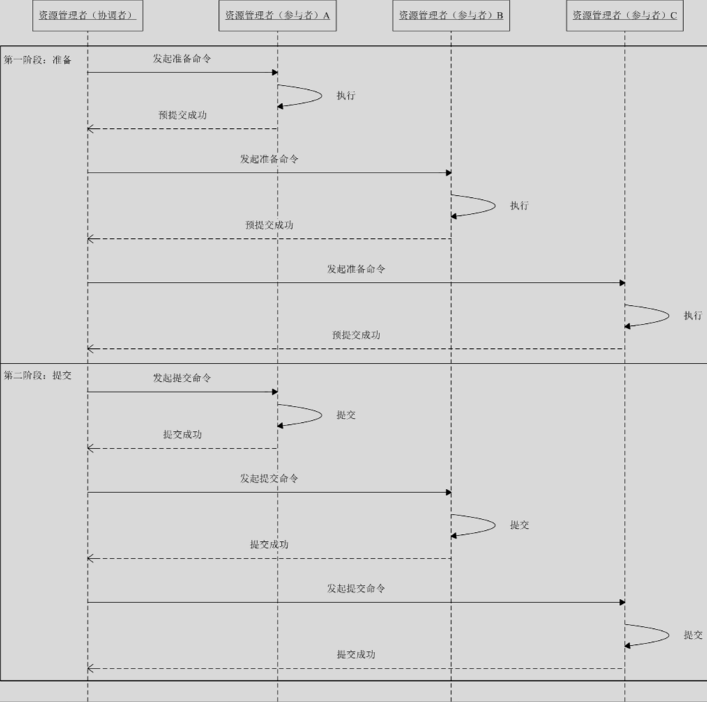
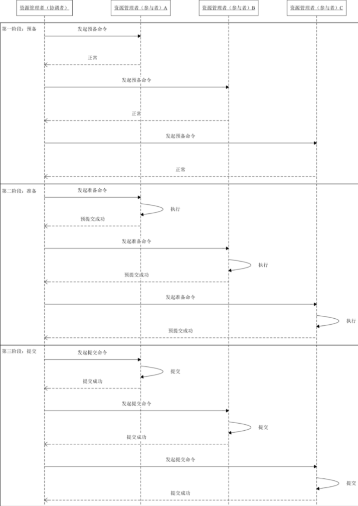

## 强一致性的两阶段提交协议(XA)

+ XA 协议是一个分布式事务协议，它有两个角色：事务管理者和资源管理者。这里，我们可以把事务管理者理解为协调者，而资源管理者理解为参与者。

+ XA 协议通过二阶段提交协议保证强一致性。

+ 二阶段提交协议，顾名思义，它具有两个阶段：第一阶段准备，第二阶段提交。这里，事务管理者（协调者）主要负责控制所有节点的操作结果，包括准备流程和提交流程。第一阶段，事务管理者（协调者）向资源管理者（参与者）发起准备指令，询问资源管理者（参与者）预提交是否成功。如果资源管理者（参与者）可以完成，就会执行操作，并不提交，最后给出自己响应结果，是预提交成功还是预提交失败。第二阶段，如果全部资源管理者（参与者）都回复预提交成功，资源管理者（参与者）正式提交命令。如果其中有一个资源管理者（参与者）回复预提交失败，则事务管理者（协调者）向所有的资源管理者（参与者）发起回滚命令。举个案例，现在我们有一个事务管理者（协调者），三个资源管理者（参与者），那么这个事务中我们需要保证这三个参与者在事务过程中的数据的强一致性。首先，事务管理者（协调者）发起准备指令预判它们是否已经预提交成功了，如果全部回复预提交成功，那么事务管理者（协调者）正式发起提交命令执行数据的变更。

  

+ 注意的是，虽然二阶段提交协议为保证强一致性提出了一套解决方案，但是仍然存在一些问题。

  1. 事务管理者（协调者）主要负责控制所有节点的操作结果，包括准备流程和提交流程，但是整个流程是同步的，所以事务管理者（协调者）必须等待每一个资源管理者（参与者）返回操作结果后才能进行下一步操作。这样就非常容易造成同步阻塞问题。
  2. 其二，单点故障也是需要认真考虑的问题。事务管理者（协调者）和资源管理者（参与者）都可能出现宕机，如果资源管理者（参与者）出现故障则无法响应而一直等待，事务管理者（协调者）出现故障则事务流程就失去了控制者，换句话说，就是整个流程会一直阻塞，甚至极端的情况下，一部分资源管理者（参与者）数据执行提交，一部分没有执行提交，也会出现数据不一致性。此时，读者会提出疑问：这些问题应该都是小概率情况，一般是不会产生的？是的，但是对于分布式事务场景，我们不仅仅需要考虑正常逻辑流程，还需要关注小概率的异常场景，如果我们对异常场景缺乏处理方案，可能就会出现数据的不一致性，那么后期靠人工干预处理，会是一个成本非常大的任务，此外，对于交易的核心链路也许就不是数据问题，而是更加严重的资损问题。

## 三阶段提交协议

+ 三阶段提交协议是二阶段提交协议的改良版本，它与二阶段提交协议不同之处在于，引入了超时机制解决同步阻塞问题，此外加入了预备阶段尽可能提早发现无法执行的资源管理者（参与者）并且终止事务，如果全部资源管理者（参与者）都可以完成，才发起第二阶段的准备和第三阶段的提交。否则，其中任何一个资源管理者（参与者）回复执行，或者超时等待，那么就终止事务。

+ 三阶段提交协议包括：第一阶段预备，第二阶段准备，第二阶段提交。

+ 三阶段提交协议很好的解决了二阶段提交协议带来的问题，是一个非常有参考意义的解决方案。但是，极小概率的场景下可能会出现数据的不一致性。因为三阶段提交协议引入了超时机制，如果出现资源管理者（参与者）超时场景会默认提交成功，但是如果其没有成功执行，或者其他资源管理者（参与者）出现回滚，那么就会出现数据的不一致性。

  

## 最终一致性的可靠事件模式、补偿模式

## TCC 模式

