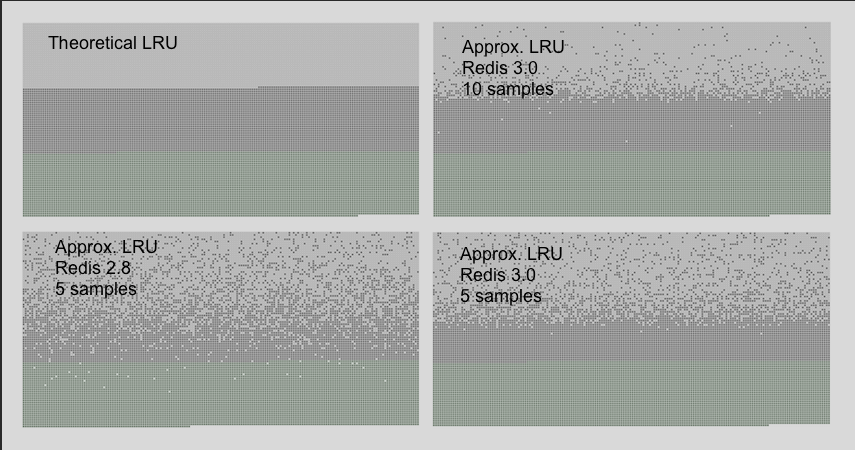

### Redis Maxmenory config

+ maxmemory 配置指令用于配置 Redis，使其为数据集使用指定数量的内存。可以使用 redis.conf 文件来设置该配置指令，或者以后在运行时使用 CONFIG SET 命令。

+ eg: 配置100M字节的内存限制，可以在redis.conf文件中使用以下指令

  + `maxmemory 100mb`

  + 将maxmemory设置为0会不限制redis的内存使用。这是64位系统的默认行为，而32位系统使用3GB的隐含内存限制。

+ 当redis使用内存到达**maxmemory**时,redis-server 将根据**maxmemory-policy** 策略来执行具体的行为。

  + maxmemory-policy:
    1. **noeviction**: 不做内存置换,当client执行命令使得server端超过了maxmemory 时，返回错误信息
    2. **allkeys-lru**：通过Lru算法(latest recently used) 清除key
    3. **volatile-lru**: 通过Lru算法(latest recently used) 清除key(需要key过期 key expire)
    4. **allkeys-random**: 随机清除key
    5. **volatile-random**:随机清除key(需要key过期 key expire)
    6. **volatile-ttl**: 随机清除key(需要key过期 key expire),并且尝试清除TTL(time to live) 较短的keys
  + 其中当满足条件的keys不存在的时候, **volatile-lru**, **volatile-random** 和 **volatile-ttl** 策略对应的行为会和 **noeviction** 一样

+ 如何选择一个合适的cache策略:

  + **allkeys-lru**:当请求主要呈幂律分布时,即某些key会被大量访问时,选择此策略
  + **allkeys-random**: 如果访问请求是平均的,即每个key被访问到的概率相近,选择此策略
  + **volatile-ttl**: 通过在创建缓存对象时使用不同的TTL值来向Redis提示哪些keys可以被淘汰

+ cache工作模式:

  + 客户端运行一个新的命令以添加数据到redis-server.
  + Redis检查内存的使用情况，如果它大于maxmemory的限制，它就会根据策略来驱逐键。
  + 一个新的命令被执行，以此类推。

## Lru_cache

+ Approximated LRU algorithm

  + Redis的LRU算法不是一个精确的实现。这意味着Redis不能选择最佳的驱逐对象，也就是在过去被访问最多的访问。相反，它将尝试运行LRU算法的近似值，通过对少量的键进行抽样，并驱逐被抽样的键中最好的一个（具有最古老的访问时间）。然而，自Redis 3.0以来，该算法被改进为也采取一个良好的候选池进行驱逐。这提高了算法的性能，使其能够更接近于真正的LRU算法的行为。

    Redis LRU算法的重要之处在于，你能够通过改变每次驱逐所检查的样本数来调整算法的精度。这个参数是由以下配置指令控制的。

    `maxmemory-samples 5`

  + Redis不使用真正的LRU实现的原因是它花费更多的内存。然而，对于使用Redis的应用程序来说，近似值几乎是等同的。下面是Redis使用的LRU近似算法与真正的LRU相比:

    + 亮色的部分是lru中应该被淘汰的内存区块
    + 灰色部分是尚未被lru算法选中淘汰的算法
    + 绿色部分是需要新添加到redis中的内存区块

    


## Lfu_cache

Starting with Redis 4.0, a new [Least Frequently Used eviction mode](http://antirez.com/news/109) is available. This mode may work better (provide a better hits/misses ratio) in certain cases, since using LFU Redis will try to track the frequency of access of items, so that the ones used rarely are evicted while the one used often have an higher chance of remaining in memory.

If you think at LRU, an item that was recently accessed but is actually almost never requested, will not get expired, so the risk is to evict a key that has an higher chance to be requested in the future. LFU does not have this problem, and in general should adapt better to different access patterns.

To configure the LFU mode, the following policies are available:

- `volatile-lfu` Evict using approximated LFU among the keys with an expire set.
- `allkeys-lfu` Evict any key using approximated LFU.

LFU is approximated like LRU: it uses a probabilistic counter, called a [Morris counter](https://en.wikipedia.org/wiki/Approximate_counting_algorithm) in order to estimate the object access frequency using just a few bits per object, combined with a decay period so that the counter is reduced over time: at some point we no longer want to consider keys as frequently accessed, even if they were in the past, so that the algorithm can adapt to a shift in the access pattern.

Those informations are sampled similarly to what happens for LRU (as explained in the previous section of this documentation) in order to select a candidate for eviction.

However unlike LRU, LFU has certain tunable parameters: for instance, how fast should a frequent item lower in rank if it gets no longer accessed? It is also possible to tune the Morris counters range in order to better adapt the algorithm to specific use cases.

By default Redis 4.0 is configured to:

- Saturate the counter at, around, one million requests.
- Decay the counter every one minute.

Those should be reasonable values and were tested experimental, but the user may want to play with these configuration settings in order to pick optimal values.

Instructions about how to tune these parameters can be found inside the example `redis.conf` file in the source distribution, but briefly, they are:

```
lfu-log-factor 10
lfu-decay-time 1
```

The decay time is the obvious one, it is the amount of minutes a counter should be decayed, when sampled and found to be older than that value. A special value of `0` means: always decay the counter every time is scanned, and is rarely useful.

The counter *logarithm factor* changes how many hits are needed in order to saturate the frequency counter, which is just in the range 0-255. The higher the factor, the more accesses are needed in order to reach the maximum. The lower the factor, the better is the resolution of the counter for low accesses, according to the following table:

```
+--------+------------+------------+------------+------------+------------+
| factor | 100 hits   | 1000 hits  | 100K hits  | 1M hits    | 10M hits   |
+--------+------------+------------+------------+------------+------------+
| 0      | 104        | 255        | 255        | 255        | 255        |
+--------+------------+------------+------------+------------+------------+
| 1      | 18         | 49         | 255        | 255        | 255        |
+--------+------------+------------+------------+------------+------------+
| 10     | 10         | 18         | 142        | 255        | 255        |
+--------+------------+------------+------------+------------+------------+
| 100    | 8          | 11         | 49         | 143        | 255        |
+--------+------------+------------+------------+------------+------------+
```

So basically the factor is a trade off between better distinguishing items with low accesses VS distinguishing items with high accesses. More informations are available in the example `redis.conf` file self documenting comments.

Since LFU is a new feature, we'll appreciate any feedback about how it performs in your use case compared to LRU.

