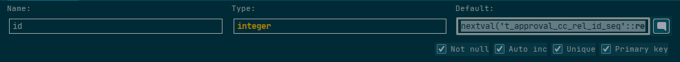

# PGSQL 设置自增主键

+ 前言:
  + postgresql数据库可以创建主键，但是没有像mysql那样直接指定主键自增的auto_increment关键字，因此如果在postgresql中创建表指定主键自增使用auto_increment会报错。那么如何实现主键自增，postgresql通过序列来实现。序列可以实现自动增长，而且表字段可以指定默认值，因此可以通过指定默认值的方式来实现主键自增。postgresql提供了三种serial类型：smallserial,serial,bigserial，他不是真正的类型，而是在创建唯一标识符列的标志以方便使用。bigserial会创建一个bigint类型的自增，serial用以创建一个int类型的自增，依次类推。

+ 使用数据库管理工具自动创建:

  + 
  + 如图当数据库类型为pgsql时,选择Auto inc 会自动生成一条table_name_id_seq的序列,默认从1开始。

+ 手动创建：

  + 直接创建序列

    ```sql
    CREATE SEQUENCE table_name_id_seq;
     
    CREATE TABLE table_name (
        id integer NOT NULL DEFAULT nextval('table_name_id_seq')
    );
     
    ALTER SEQUENCE table_name_id_seq
    OWNED BY table_name.id;
    ```

  + 创建表时(DDL)

    ```java
    CREATE TABLE table_name(
        id SERIAL
    );
    ```

+ 查询某序列的下一个值

  + ```sql
    select nextval('table_name_id_seq');
    ```

+ 手动设置序列的下一个值

  + ```sql
    select setval('t_monitor_cistern_id_seq',123,false)  #123 为想要设置的值
    
    # setval(regclass, bigint, boolean) 函数的最后一个参数含义为是否返回当前设置的值,或者是下一个值
    SELECT setval('foo', 42);           下一个值返回 43
    SELECT setval('foo', 42, true);     下一个值返回 43
    SELECT setval('foo', 42, false);    下一个值返回 42
    ```

+ 查询序列被哪些表所使用(设为**default nextval()**):

  + ```sql
    select seq_ns.nspname as sequence_schema,
           seq.relname as sequence_name,
           tab_ns.nspname as table_schema,
           tab.relname as related_table
    from pg_class seq
      join pg_namespace seq_ns on seq.relnamespace = seq_ns.oid
      JOIN pg_depend d ON d.objid = seq.oid AND d.deptype = 'a'
      JOIN pg_class tab ON d.objid = seq.oid AND d.refobjid = tab.oid
      JOIN pg_namespace tab_ns on tab.relnamespace = tab_ns.oid
    where seq.relkind = 'S'   and seq_ns.nspname = 'public';
    ```

+ 查询某个表的某个字段使用的序列(pgsql 自带函数):

  + ```sql
    select pg_get_serial_sequence('public.t_monitor_zss', 'id');
    ```


### other:

+ 在已存在的id的表中设置自增序列：

  + 前言: 数据表中已经存在部分id,直接设置字段为自增可能导致获取的下一个id值已经存在,会被唯一主键约束。

    + 解决方法 一:

      1. 创建自增主键序列: **table_name_id_seq**

      2.  设置自增主键基数值

         ```sql
         select setval('table_name_seq',select max(id) from table_name,false)
         ```

    + 解决方法二:

      1. 在创建自增序列的时候指定序列的基数值：

         ```sql
               CREATE SEQUENCE dbName.table_name_id_seq
                   INCREMENT 1
                   START 12345 # 设置为你想要的基数 
                   MINVALUE 1
                   MAXVALUE 99999999
                   CACHE 1;
               
               ALTER SEQUENCE dbName.table_name_id_seq
                   OWNER TO postgres;
         ```

      2. 在需要自增的主键中设置：

         ```sql
         ALTER TABLE tableName ALTER COLUMN idColumnName int DEFAULT nextval('t_table_name_id_seq'::regclass)
         ```

         


### 参考链接

+ [pgsql数据库表实现id自增](https://blog.csdn.net/feinifi/article/details/96478675)
+ [pgsql sequence](https://www.postgresql.org/docs/8.2/functions-sequence.html)
+ [使用navicat 创建pgsql id自增](https://www.pianshen.com/article/32311749236/)

