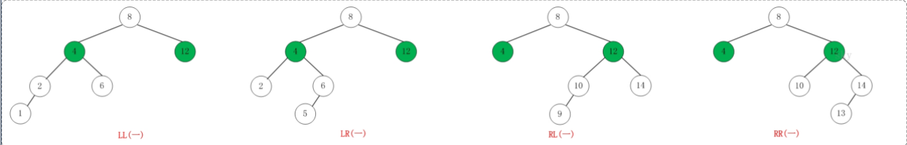
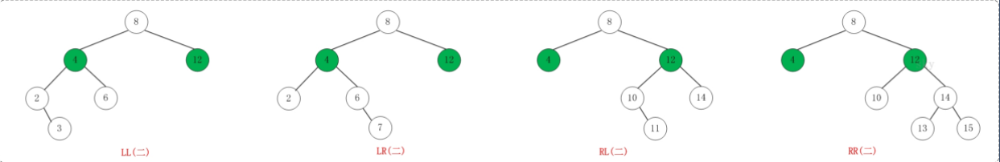
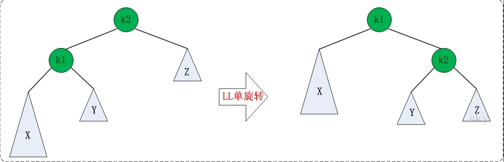
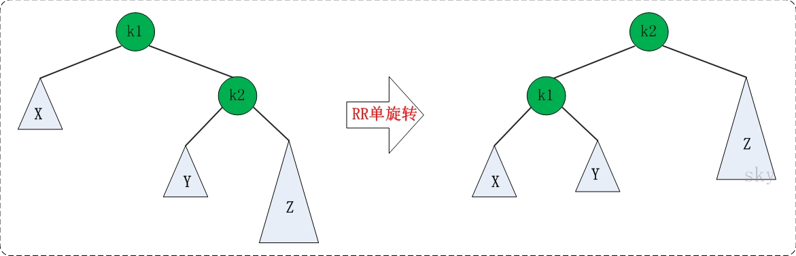
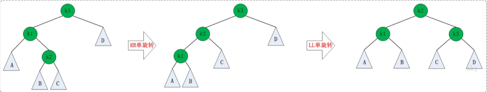
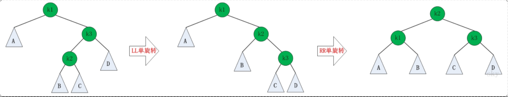

# AVL

## 性质[¶](https://oi-wiki.org/ds/avl/#_1)

1. 空二叉树是一个 AVL 树
2. 如果 T 是一棵 AVL 树，那么其左右子树也是 AVL 树，并且 ，h 是其左右子树的高度
3. 树高为 

平衡因子：右子树高度 - 左子树高度


+ AVL失去平衡的几种情况:

  

  

  +  **LL**：LeftLeft，也称为"左左"。插入或删除一个节点后，根节点的左子树的左子树还有非空子节点，导致"根的左子树的高度"比"根的右子树的高度"大2，导致AVL树失去了平衡。
       *例如，在上面LL情况中，由于"根节点(8)的左子树(4)的左子树(2)还有非空子节点"，而"根节点(8)的右子树(12)没有子节点"；导致"根节点(8)的左子树(4)高度"比"根节点(8)的右子树(12)"高2。*
  +  **LR**：LeftRight，也称为"左右"。插入或删除一个节点后，根节点的左子树的右子树还有非空子节点，导致"根的左子树的高度"比"根的右子树的高度"大2，导致AVL树失去了平衡。
       *例如，在上面LR情况中，由于"根节点(8)的左子树(4)的左子树(6)还有非空子节点"，而"根节点(8)的右子树(12)没有子节点"；导致"根节点(8)的左子树(4)高度"比"根节点(8)的右子树(12)"高2。*
  +  **RL**：RightLeft，称为"右左"。插入或删除一个节点后，根节点的右子树的左子树还有非空子节点，导致"根的右子树的高度"比"根的左子树的高度"大2，导致AVL树失去了平衡。
       *例如，在上面RL情况中，由于"根节点(8)的右子树(12)的左子树(10)还有非空子节点"，而"根节点(8)的左子树(4)没有子节点"；导致"根节点(8)的右子树(12)高度"比"根节点(8)的左子树(4)"高2。*
  +  **RR**：RightRight，称为"右右"。插入或删除一个节点后，根节点的右子树的右子树还有非空子节点，导致"根的右子树的高度"比"根的左子树的高度"大2，导致AVL树失去了平衡。
       *例如，在上面RR情况中，由于"根节点(8)的右子树(12)的右子树(14)还有非空子节点"，而"根节点(8)的左子树(4)没有子节点"；导致"根节点(8)的右子树(12)高度"比"根节点(8)的左子树(4)"高2。*


+ **Rotation**旋转以保持AVL

  + LL的旋转：

    

    ```java
        private AVLTreeNode<T> llRotation(AVLTreeNode<T> k2) {
            AVLTreeNode<T> k1 = k2.left;
            k2.left = k1.right;
            k1.right = k2;
            k2.height = Math.max(height(k2.left), height(k2.right)) + 1;
            k1.height = Math.max(height(k1.left), height(k1.right)) + 1;
            return k1;
        }
    ```

    

  + RR的旋转(与LL对称):

    

    ```java
    private AVLTreeNode<T> rrRotation(AVLTreeNode<T> k1) {
            AVLTreeNode<T> k2 = k1.right;
            k1.right = k2.left;
            k2.left = k1;
            k2.height = Math.max(height(k2.left), height(k2.right)) + 1;
            k1.height = Math.max(height(k1.left), height(k1.right)) + 1;
            return k2;
        }
    ```

    

  + LR的旋转(先RR 在LL):

    

    ```java
        private AVLTreeNode<T> lrRotation(AVLTreeNode<T> k3) {
            k3.left = rrRotation(k3.left);
            return llRotation(k3);
        }
    ```

  + RL的旋转(先LL 再 RR):

    

    ```java
        private AVLTreeNode<T> rlRotation(AVLTreeNode<T> k1) {
            k1.right = llRotation(k1.right);
            return rrRotation(k1);
        }
    ```


+ AVL 实现：

  ```java
  package algorithm;
  
  import java.awt.*;
  
  /**
   * AVL BST
   */
  public class AVL<T extends Comparable<T>> {
      //根节点
      private AVLTreeNode<T> mRoot;
  
      private int height(AVLTreeNode<T> treeNode) {
          return treeNode == null ? 0 : treeNode.height;
      }
  
      private int height() {
          return height(mRoot);
      }
  
      /**
       * LL 旋转(左单旋转)
       *
       * @param k2
       * @return 原k2.left-->k1
       */
      private AVLTreeNode<T> llRotation(AVLTreeNode<T> k2) {
          AVLTreeNode<T> k1 = k2.left;
          k2.left = k1.right;
          k1.right = k2;
          k2.height = Math.max(k2.left.height, k2.right.height) + 1;
          k1.height = Math.max(k1.left.height, k1.right.height) + 1;
          return k1;
      }
  
      /**
       * RR 旋转(左单旋转)
       *
       * @param k1
       * @return 原k1.right-->k2
       */
      private AVLTreeNode<T> rrRotation(AVLTreeNode<T> k1) {
          AVLTreeNode<T> k2 = k1.right;
          k1.right = k2.left;
          k2.left = k1;
          k2.height = Math.max(k2.left.height, k2.right.height) + 1;
          k1.height = Math.max(k1.left.height, k1.right.height) + 1;
          return k2;
      }
  
      /**
       * LR 左右情况 先RR 然后LL
       *
       * @param k3
       * @return
       */
      private AVLTreeNode<T> lrRotation(AVLTreeNode<T> k3) {
          k3.left = rrRotation(k3.left);
          return llRotation(k3);
      }
  
      /**
       * RL 右左情况 先LL 然后RR
       *
       * @param k1
       * @return
       */
      private AVLTreeNode<T> rlRotation(AVLTreeNode<T> k1) {
          k1.right = llRotation(k1.right);
          return rrRotation(k1);
      }
  
      public void insert(T key) {
          mRoot = insert(mRoot, key);
      }
  
      /**
       * 插入节点
       *
       * @param tree
       * @param key
       * @return
       */
      private AVLTreeNode<T> insert(AVLTreeNode<T> tree, T key) {
          if (tree == null) {
              //新建节点
              return new AVLTreeNode<>(key, null, null);
          } else {
              int cmp = key.compareTo(tree.key);
              if (cmp < 0) {
                  tree.left = insert(tree.left, key);
                  //如果失去平衡 fix it to AVL
                  if (height(tree.left) - height(tree.right) == 2) {
                      if (key.compareTo(tree.left.key) < 0) {
                          tree = llRotation(tree);
                      } else {
                          tree = lrRotation(tree);
                      }
                  }
              } else if (cmp > 0) {
                  tree.right = insert(tree.right, key);
                  if (height(tree.right) - height(tree.left) == 2) {
                      if (key.compareTo(tree.right.key) > 0) {
                          tree = rrRotation(tree);
                      } else {
                          tree = rlRotation(tree);
                      }
                  }
              } else {
                  //添加失败,禁止添加
                  return null;
              }
          }
          tree.height = Math.max(height(tree.left), height(tree.right)) + 1;
          return tree;
      }
  
      private AVLTreeNode<T> remove(AVLTreeNode<T> tree, AVLTreeNode<T> z) {
          if (tree == null || z == null) {
              return null;
          }
          int cmp = z.key.compareTo(tree.key);
          //待删除的点可能在左子树中
          if (cmp < 0) {
              tree.left = remove(tree.left, z);
              //删除后若AVL失去平衡,需要fix it to AVL
              if (height(tree.right) - height(tree.left) == 2) {
                  AVLTreeNode<T> r = tree.right;
                  if (height(r.left) > height(r.right)) {
                      tree = rlRotation(tree);
                  } else {
                      tree = rrRotation(tree);
                  }
              }
          } else if (cmp > 0) {
              tree.right = remove(tree.right, z);
              if (height(tree.left) - height(tree.right) == 2) {
                  AVLTreeNode<T> l = tree.left;
                  if (height(l.right) > height(l.left)) {
                      tree = lrRotation(tree);
                  } else {
                      tree = llRotation(tree);
                  }
              }
          } else {
              //当前Tree 是需要被删除的节点
              if ((tree.left != null) && (tree.right != null)) {
                  if (height(tree.left) > height(tree.right)) {
                      AVLTreeNode<T> max = maximum(tree.left);
                      tree.key = max.key;
                      tree.left = remove(tree.left, max);
                  } else {
                      AVLTreeNode<T> min = minimum(tree.right);
                      tree.key = min.key;
                      tree.right = remove(tree.right, min);
                  }
              } else {
                  tree = tree.left != null ? tree.left : tree.right;
              }
          }
          return tree;
      }
  
      private AVLTreeNode<T> minimum(AVLTreeNode<T> tree) {
          if (tree == null) return null;
          while (tree.left != null) {
              tree = tree.left;
          }
          return tree;
  
      }
  
      private AVLTreeNode<T> maximum(AVLTreeNode<T> tree) {
          if (tree == null) return null;
          while (tree.right != null) {
              tree = tree.right;
          }
          return tree;
      }
  }
  
  /**
   * AVL 节点
   * T 需要是实现Comparable 用于比较
   *
   * @param <T>
   */
  class AVLTreeNode<T extends Comparable<T>> {
      T key;
      int height;
      AVLTreeNode<T> left;
      AVLTreeNode<T> right;
  
      public AVLTreeNode(T key, AVLTreeNode<T> left, AVLTreeNode<T> right) {
          this.key = key;
          this.right = right;
          this.left = left;
          this.height = 0;
      }
  }
  
  ```

  