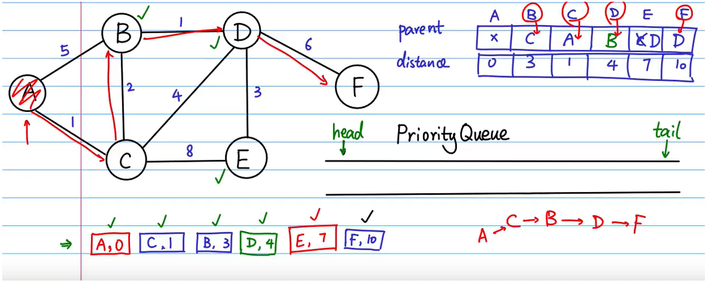

# Dijkstra




```java
public class Dijkstra {
    public HashMap<Character, Integer> init_distance(HashMap<Character, HashMap<Character, Integer>> graph, Character s) {
        HashMap<Character, Integer> distance = new HashMap<>();
        distance.put(s, 0);
        for (Character vertex : graph.keySet()) {
            if (s != vertex) {
                distance.put(vertex, Integer.MAX_VALUE);
            }
        }
        return distance;
    }

    public HashMap<Character, Integer> dijkstra(HashMap<Character, HashMap<Character, Integer>> graph, Character s) {
        Queue<Pair<Integer, Character>> pq = new PriorityQueue<>(Comparator.comparingInt(Pair::getKey));
        pq.add(new Pair<>(0, s));
        Set<Character> seen = new HashSet<>();
        HashMap<Character, Character> parent = new HashMap<>();
        HashMap<Character, Integer> distance = init_distance(graph, s);
        while (!pq.isEmpty()) {
            Pair<Integer, Character> poll = pq.poll();
            int dist = poll.getKey();
            Character vertex = poll.getValue();
            seen.add(vertex);
            Set<Character> nodes = graph.get(vertex).keySet();
            for (Character w : nodes) {
                if (!seen.contains(w)) {
                    int curDist = dist + graph.get(vertex).get(w);
                    if (curDist < distance.get(w)) {
                        distance.put(w, curDist);
                        pq.add(new Pair<>(curDist, w));
                        parent.put(w, vertex);
                    }
                }
            }
        }
        return distance;
    }
}
```

Python：

```python
import heapq
import math
graph = {
    "A": {"B": 5, "C": 1},
    "B": {"A": 5, "C": 2},
    "C": {"A": 1, "B": 2, "D": 4},
    "D": {"B": 1, "C": 4, "E": 3, "F": 6},
    "E": {"C": 8, "D": 3},
    "F": {"D": 6}
}


def init_distance(graph, s):
    distance = {s: 0}
    for vertex in graph.keys():
        if vertex != s:
            distance[vertex] = math.inf
    return distance


# 从s点到图中每个点的最短距离
def dijkstra(graph, s):
    pqueue = []  # 权重高的排前面
    heapq.heappush(pqueue, (0, s))
    seen = set()
    parent = {s: None}
    distance = init_distance(graph, s)

    while(len(pqueue) > 0):
        pair = heapq.heappop(pqueue)
        dist = pair[0]  # 取出来的点到s的距离
        vertex = pair[1]
        seen.add(vertex)

        nodes = graph[vertex].keys()
        for w in nodes:
            if w not in seen:
                if dist+graph[vertex][w] < distance[w]: 
                    distance[w] = dist+graph[vertex][w]
                    heapq.heappush(pqueue, (dist+graph[vertex][w], w))
                    parent[w] = vertex
    return parent, distance


parent, distance = dijkstra(graph, "A")
print(parent)
print("------------")
print(distance)
```

