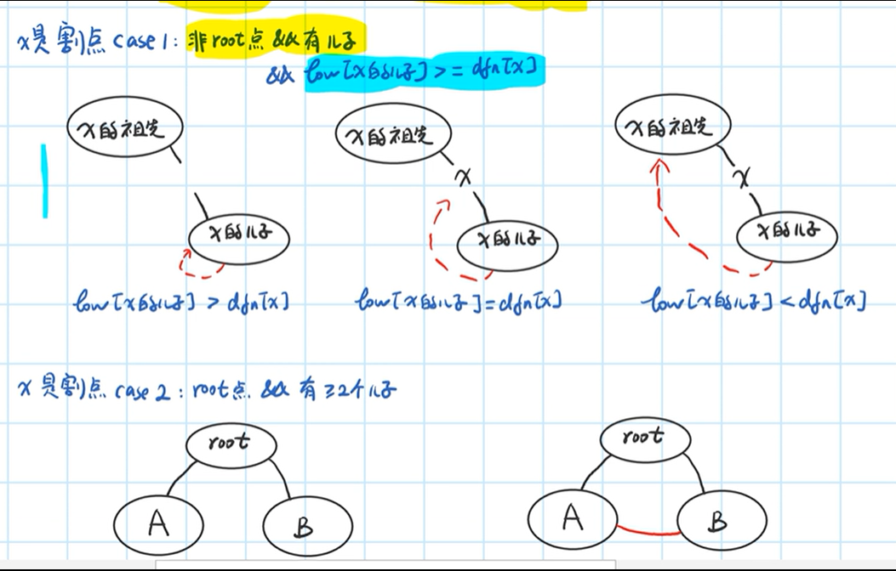
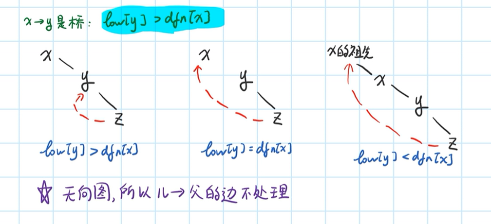
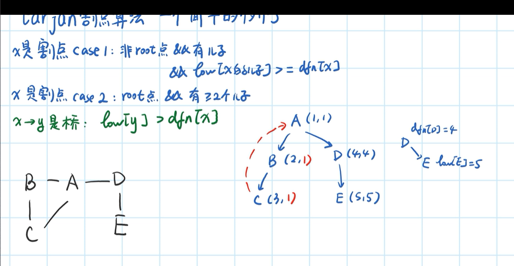

### 求强连通分量

名词解释:

+ 连通:无向图中,从任意点i可到达任意点j.
+ 强连通: 有向图中,从任意点i可到达任意点j.
+ 弱连通: 把有向图看作无向图时,从任意点i可到达任意点j.
+ 强连通分量:非强连通图有向图的极大强连通子图，称为强连通分量(strongly connected components)

```java
/**
 * Tarjan求有向图
 */
public class Tarjan {
    private int time = 0;
    private Stack<Integer> stack = new Stack<>();
    private List<List<Integer>> ret = new ArrayList<>();
    private boolean[] inStack;
    private int[] dfn;
    private int[] low;
    private int[][] graph;
    private int V;

    public void tarjan(int[][] graph) {
        this.graph = graph;
        this.V = graph.length;
        inStack = new boolean[V];
        dfn = new int[V];
        low = new int[V];
        for (int x = 0; x < V; x++) {
            if (dfn[x] == 0) {
                dfs(x);
            }
        }
    }

    private void dfs(int x) {
        stack.push(x);
        inStack[x] = true;
        dfn[x] = ++time;
        low[x] = dfn[x];
        for (int y = 0; y < V; y++) {
            if (graph[x][y] == 1) {
                if (dfn[y] == 0) {
                    dfs(y);
                    low[x] = Math.min(low[x], low[y]);
                } else if (inStack[y]) {
                    low[x] = Math.min(low[x], low[y]);
                }
            }
        }
        if (dfn[x] == low[x]) {
            List<Integer> l = new ArrayList<>();
            while (stack.peek() != x) {
                Integer pop = stack.pop();
                l.add(pop);
                inStack[pop] = false;
            }
            l.add(stack.pop());
            ret.add(l);
        }
    }

    public static void main(String[] args) {
        int[][] arr = new int[][]{{0, 1}, {1, 2}, {2, 3}, {2, 4}, {3, 4}, {3, 1}, {0, 5}, {5, 6}, {6, 0}, {4, 2}};
        int[][] graph = new int[7][7];
        for (int[] ints : arr) {
            graph[ints[0]][ints[1]] = 1;
        }
        Tarjan tarjan = new Tarjan();
        tarjan.tarjan(graph);
        for (List<Integer> integers : tarjan.ret) {
            for (Integer integer : integers) {
                System.out.print(integer + "-");
            }
            System.out.println();
        }
    }
}

```


### 求割点和桥

名词解释:

+ 无向连通图中，某点和连接点的边去掉后，图不在连通
+ 无向连通图中，某条边去掉后，图不在连通

割点case:

+ 1和2均满足x为割点,3不是割点

+ 

桥的case:

​	

例子:

