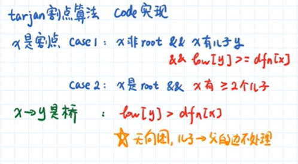

### 求强连通分量

名词解释:

+ 连通:无向图中,从任意点i可到达任意点j.
+ 强连通: 有向图中,从任意点i可到达任意点j.
+ 弱连通: 把有向图看作无向图时,从任意点i可到达任意点j.
+ 强连通分量:非强连通图有向图的极大强连通子图，称为强连通分量(strongly connected components)

```java
/**
 * Tarjan求有向图 强连通分量
 */
public class Tarjan1 {
    private int time = 0;
    private Stack<Integer> stack = new Stack<>();
    private List<List<Integer>> ret = new ArrayList<>();
    private boolean[] inStack;
    private int[] dfn;
    private int[] low;
    private int[][] graph;
    private int V;

    public void tarjan(int[][] graph) {
        this.graph = graph;
        this.V = graph.length;
        inStack = new boolean[V];
        dfn = new int[V];
        low = new int[V];
        for (int x = 0; x < V; x++) {
            if (dfn[x] == 0) {
                dfs(x);
            }
        }
    }

    private void dfs(int x) {
        stack.push(x);
        inStack[x] = true;
        dfn[x] = ++time;
        low[x] = dfn[x];
        for (int y = 0; y < V; y++) {
            if (graph[x][y] == 1) {
                if (dfn[y] == 0) {
                    dfs(y);
                    low[x] = Math.min(low[x], low[y]);
                } else if (inStack[y]) {
                    low[x] = Math.min(low[x], low[y]);
                }
            }
        }
        if (dfn[x] == low[x]) {
            List<Integer> l = new ArrayList<>();
            while (stack.peek() != x) {
                Integer pop = stack.pop();
                l.add(pop);
                inStack[pop] = false;
            }
            l.add(stack.pop());
            ret.add(l);
        }
    }

}

```


### 求割点和桥

名词解释:

+ 无向连通图中，某点和连接点的边去掉后，图不在连通
+ 无向连通图中，某条边去掉后，图不在连通

割点case:

+ 1和2均满足x为割点,3不是割点

+ 

桥的case:

​	只有第一种情况满足桥

例子:

​	儿子指的是深度搜索树中的儿子,在更新low[x]的时候要注意不能以父节点的相比较,不然所有的可联通节点low[x]就一样了



```java
public class Tarjan2 {
    private int time = 0;
    private int[] dfn;
    private int[] low;
    //父节点
    private int[] fa;
    private int[][] graph;
    private int V;

    //割点结果集
    private Set<Integer> cutPoint = new HashSet<>();
    //桥结果集
    private List<int[]> bridges = new ArrayList<>();

    public void tarjan(int[][] graph) {
        this.graph = graph;
        this.V = graph.length;
        dfn = new int[V];
        low = new int[V];
        fa = new int[V];
        Arrays.fill(fa, -1);
        for (int x = 0; x < V; x++) {
            //x 点还没有访问过
            if (dfn[x] == 0) {
                dfs(x);
            }
        }
    }

    private void dfs(int x) {
        dfn[x] = low[x] = ++time;
        //当前点在深度搜索树中的子树数量
        int child = 0;
        for (int y = 0; y < V; y++) {
            if (graph[x][y] == 1) {
                if (dfn[y] == 0) {
                    child++;
                    //标记当前y点父亲为x
                    fa[y] = x;
                    dfs(y);
                    //割点case
                    //x是root,且x有两个以上儿子
                    if (fa[x] == -1 && child >= 2) {
                        cutPoint.add(x);
                    }
                    //x不是root,但是x有儿子y,且low[y]>=dfn[x]
                    if (fa[x] != -1 && low[y] >= dfn[x]) {
                        cutPoint.add(x);
                    }
                    //桥的判定
                    if (low[y] > dfn[x]) {
                        bridges.add(new int[]{x, y});
                    }
                    //更新追溯值
                    low[x] = Math.min(low[x], low[y]);

                }
                //儿子到父亲的情况不更新
                else if (y != fa[x]) {
                    low[x] = Math.min(low[x], low[y]);
                }
            }
        }
    }
}
```

