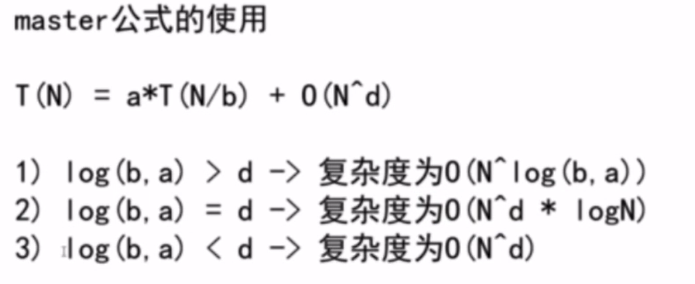
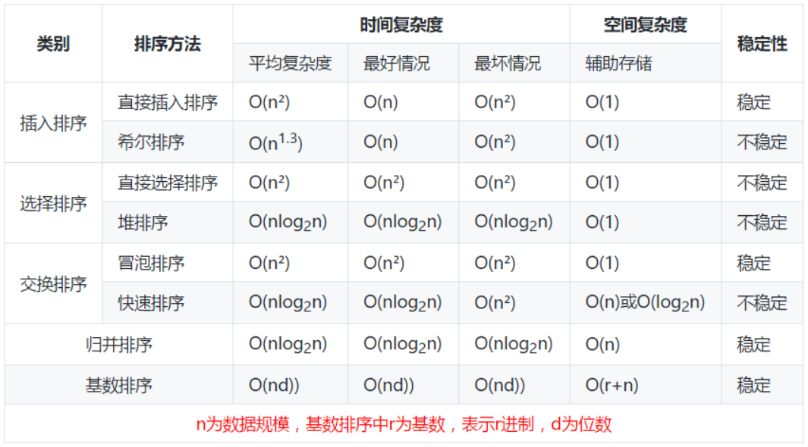
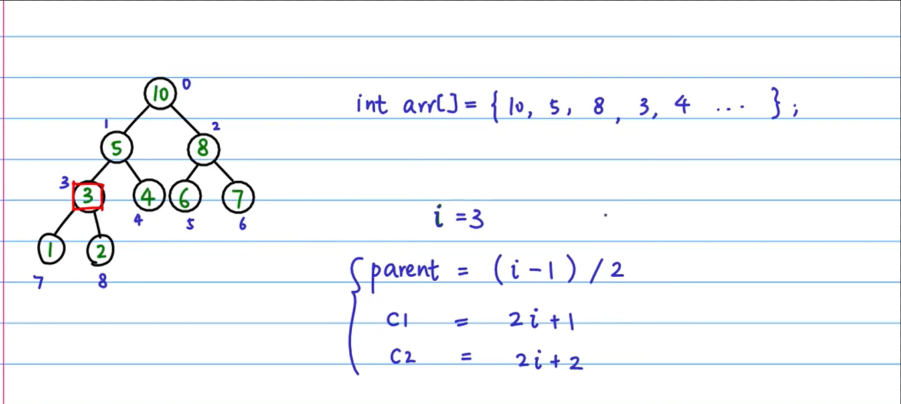

+ 递归的时间复杂度：

  + 

  + ```java
    public int getMax(int[] arr,int l,int r){
        if(l==r) return arr[l];
        int mid=(l+r)/2;
    	int leftMax=getMax(arr,l,mid);
        int rightMax=getMax(arr,mid+1,r);
        return Math.max(leftMax,rightmax);
    }
    ```

    + 在上面这道算法题目中每次**总数据量**就是**arr[l:r]**,每次递归都会进行两次运算，且每次的运算数据量都是(r-l)/2,然后接一次返回最大值的比较运算，时间复杂度为1

      所以公式T(N)=a*T(N/b)+O(N^d)中的**a=2(运算两次)**,**b=2(每次取h/2的数据量)**,**d=0(接的那次运算为1，N^0==1)**

      **T(N)=2*T(N/2)+O(N^0) ** 满足log(b,a)>d 所以复杂度为**0(N^log(b,a))==O(N^log(2,2))==O(N)**

+ 算法稳定性：

  + 一趟结束后能够确定一个元素的最终位置的排序方法有： 简单选择排序、快速排序、冒泡排序、堆排序

  + **稳定性定义：**排序前后两个相等的数相对位置不变，则算法稳定。

  + 常用排序时间复杂度：

    + 前面的为非线性比较类排序，后三个为线性时间非比较排序。

      

  

  + 数据结构                   search                                                      insert                        delete
    数组               O(n)，有序数组折半查找是O(lgn)                     O(n)                          O(n)
    双向链表                   O(n)                                                           O(1)                          O(1)
    排序二叉树              O(lgn)                                                         O(lgn)                       O(lgn)
    哈希表（n与槽数m成正比）O(1)                                             O(1)                           O(1)

+ 堆排序:

  + 

  + ```python
    def swap(treeArr, max, i):
        temp = treeArr[max]
        treeArr[max] = treeArr[i]
        treeArr[i] = temp
    
    
    # 使得某个节点大于等于它的子节点
    def heapify(treeArr, n, i):
        if(i >= n):
            return
        # 左右节点
        c1 = 2*i+1
        c2 = 2*i+2
    
        max = i
        if(c1 < n and treeArr[c1] > treeArr[max]):
            max = c1
        if(c2 < n and treeArr[c2] > treeArr[max]):
            max = c2
    
        if(max != i):
            swap(treeArr, max, i)
            heapify(treeArr, n, max)
    
    
    # 建立大顶推
    def build_heap(treeArr, n):
        last_node = n-1
        # 父节点位置
        parent = (last_node-1)//2
        # 从最后一层的父节点开始做heapify,下面的满足了，上面的就满足
        for i in range(parent, -1, -1):
            heapify(treeArr, n, i)
    
    # 大顶堆排序
    
    
    def heap_sort(treeArr, n):
        build_heap(treeArr, n)
        for i in range(n-1, -1, -1):
            swap(treeArr, i, 0)
            heapify(treeArr, i, 0)
    
    
    if __name__ == "__main__":
        treeArr = [4, 10, 15, 5, 1, 2, 34, 65, 123, 42]
        n = len(treeArr)
        heap_sort(treeArr, n)
        for i in treeArr:
            print(i)
    
    ```

    

+ 摩尔投票法：

  +  **查找输入中重复出现超过一半以上(n/2)的元素** 

  + ```java
        public int majorityElement(int[] nums) {
            int count = 0, mode = -1;
            for (int num : nums) {
                if (count == 0) {
                    mode = num;
                    count++;
                } else if (num == mode) count++;
                else count--;
            }
            return mode;
        }
    ```

+ 背包：

  + 01背包：

    + f\[i][j] = max (f\[i-1][j], f\[i-1][j-v] +w)

    + ```java
          /**
           * @param cost 每个物品需要占据的容量
           * @param w    每个物品的价值
           * @param n    物品数量
           * @param V    背包容量
           * @return
           */
          public int zerOnePack(int[] cost, int[] w, int n, int V) {
              int[][] dp = new int[n + 1][V + 1];
      
              for (int i = 1; i <= n; i++) {
                  //从cost[i]开始不用考虑小于问题
                  for (int v = cost[i]; v < V; v++) {
                      dp[i][v] = Math.max(dp[i - 1][v], dp[i - 1][v - cost[i]] + w[i]);
                  }
              }
              return dp[n][V];
          }
      
          //背包中的物品只能选一次
          public int zerOnePack2(int[] cost, int[] w, int n, int V) {
              int[] dpv = new int[V + 1];
              for (int i = 1; i <= n; i++) {
                  for (int v = V; v >= cost[i]; v--) {
                      dpv[v] = Math.max(dpv[v], dpv[v - cost[i]] + w[i]);
                  }
              }
              return dpv[V];
          }
      ```

  + 完全背包：

    + f\[i][j] = max (f\[i-1][j], f\[i][j-v] +w)

    + ```java
          //背包中的物品能选任意多次
          public int complete(int[] cost, int[] w, int n, int V) {
              int[] dp = new int[V + 1];
              for (int i = 1; i <= n; i++) {
                  for (int v = cost[i]; v <= V; v++) {
                      dp[v] = Math.max(dp[v], dp[v - cost[i]] + w[i]);
                  }
              }
              return dp[V];
          }
      ```

  + 使用杨辉三角计算排列组合:
  
    + 杨辉三角：
      　　　　　　　　　　　　　　										１
            　　　　　　　　　　　　　１　１
            　　　　　　　　　　　　１　２　１
            　　　　　　　　　　　１　３　３　１
            　　　　　　　　　　１　４　６　４　１
      + 特点
        + 一个数等于上面两个数相加。
        + 第m行第n列的值(m,n从0开始) 等于*C**m**n*
  
    + ```java
      long[][] c=new long[101][101];
      long MOD=(long)(1e9+7);
      void comb(){
          for(int i=0;i<c.length;i++){
              c[i][0]=1;
          }
          for (int i = 1; i < c.length; i++) {
          	for (int j = 1; j <= i; j++) {
                      c[i][j] = (c[i - 1][j - 1] + c[i - 1][j]) % MOD;
              }
         	}
      }
      ```
  
      
      