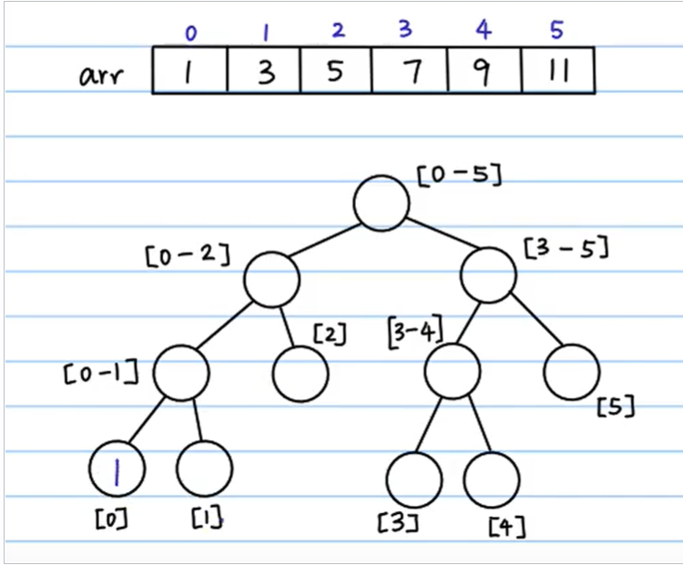
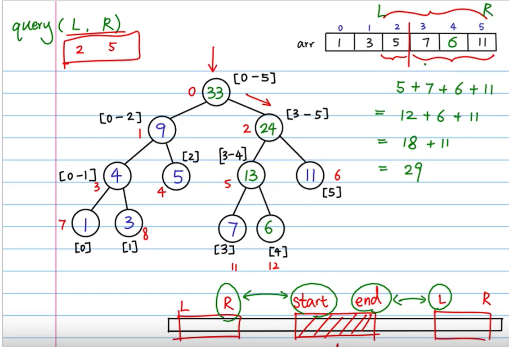

# 线段树



线段树查询:




Code实现：

```java
public class SegmentLine {
//    private static int MAX_LEN = 1000;

    /**
     * @param arr   原数据数组
     * @param tree  用来保存树的数组
     * @param node  树中每个节点的位置
     * @param start 数据数组中的开始节点
     * @param end   数据数组中的结束节点
     */
    public static void build_tree(int arr[], int tree[], int node, int start, int end) {
        if (start == end) tree[node] = arr[start];
        else {
            //找到分割点,左右递归
            int mid = (start + end) / 2;
            int left_node = 2 * node + 1;
            int right_node = 2 * node + 2;
            build_tree(arr, tree, left_node, start, mid);
            build_tree(arr, tree, right_node, mid + 1, end);
            tree[node] = tree[left_node] + tree[right_node];
        }
    }

    /**
     * @param arr   原数据数组
     * @param tree  用来保存树的数组
     * @param node  树中每个节点的位置
     * @param start 数组中的开始节点
     * @param end   数组中的结束节点
     * @param idx   原数据中的要更改的index
     * @param val   要更改的值
     */
    public static void update_tree(int arr[], int tree[], int node, int start, int end, int idx, int val) {
        if (start == end) {
            arr[idx] = val;
            tree[node] = val;
        } else {
            int mid = start + ((end - start) >> 1);
            int left_node = 2 * node + 1;
            int right_node = 2 * node + 2;
            if (idx >= start && idx <= mid) {
                update_tree(arr, tree, left_node, start, mid, idx, val);
            } else {
                update_tree(arr, tree, right_node, mid + 1, end, idx, val);
            }
            tree[node] = tree[left_node] + tree[right_node];
        }
    }

    /**
     * 查询原数据中L-R之间数据的和
     *
     * @param tree  用来保存树的数组
     * @param node  树中每个节点的位置
     * @param start 数据数组中的开始节点
     * @param end   数据数组中的结束节点
     * @param L     查询的起点
     * @param R     查询的终点
     */
    public static int query_tree(int[] tree, int node, int start, int end, int L, int R) {
        if (R < start || L > end) return 0;
        else if (L <= start && R >= end) return tree[node];
        else {
            int mid = (start + end) / 2;
            int left_node = 2 * node + 1;
            int right_node = 2 * node + 2;
            int sum_left = query_tree(tree, left_node, start, mid, L, R);
            int sum_right = query_tree(tree, right_node, mid + 1, end, L, R);
            return sum_left + sum_right;
        }
    }


    public static void main(String[] args) {
        int[] arr = new int[]{1, 3, 5, 7, 9, 11};
        int size = arr.length;
        //用数组模拟树
        int[] tree = new int[size * 4];
        build_tree(arr, tree, 0, 0, size - 1);
//        for (int i = 0; i < 15; i++) {
//            System.out.print(tree[i] + "-");
//        }
        System.out.println();
//        update_tree(arr, tree, 0, 0, size - 1, 4, 6);
        System.out.println(query_tree(tree, 0, 0, size - 1, 2, 4));

    }
}
```

