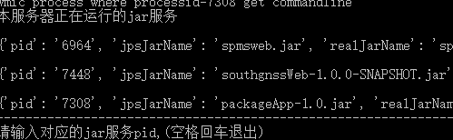
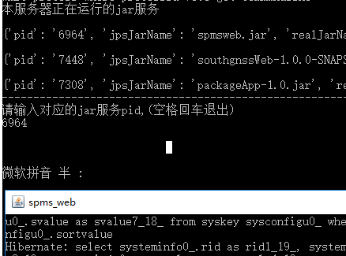
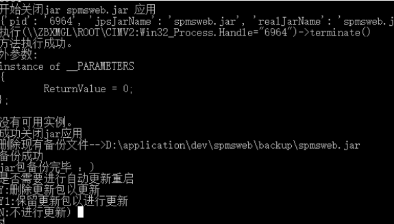
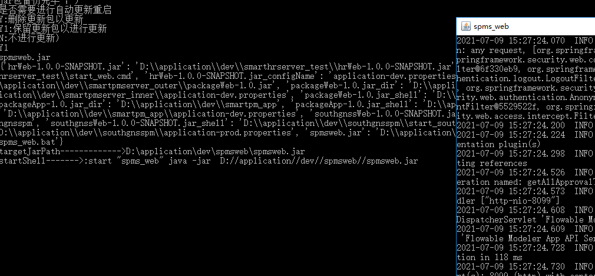

# Windows 平台下Java 服务运维脚本

+ BG:

  + 在项目开发过程中开发人员时常需要对服务端项目进行更新部署的动作,已满足前后端测试/功能发布等实际情况。我们将这个任务大致分解为:

    1. 找到服务器上运行的java服务进行关闭.
    2. 将上一个版本正常运行的jar包进行备份,以保证可随时回滚。
    3. 复制传输即将发布的新版本jar包.
    4. 更改配置文件(xxx.properties/xxx.yaml...)
    5. 执行类似于 start_jar_app.bat/start_jar_app.cmd 脚本进行启动项目.
    6. 结束更新.

  + 对于步骤一:因为服务器通常是多开发人员共享且可登陆的,每一次登陆上去,都需要先找到自己上一次发布的服务，并且精确的关闭,但是有可能会出现如下的情况:

    ​	

    运行了一堆jar包,哪一个是我想要的服务呢,还有可能出现上一次使用了另一个账户登陆,这次登陆后没有在任务栏发现自己上次发布的jar包,别说关闭了,找到要关闭的服务都十分费劲: (

  + 对于步骤二: 打开资源管理器,进入D盘(或者其他的什么服务盘),再一层一层定位到jar包所在文件夹,复制jar包到backup文件目录下用以备份文件,你甚至还会遇到这种烦人的情况,需要手动点击一次:
    

  + 最后执行你的启动服务行为。

+ Solution:

  + 这一套组合拳下来,不花个几分钟结束不了事儿.并且多次发布这种部署更新之后，会发现其实做的行为都是重复机械性的劳作.那么有没有能够快速部署更新，进行备份的工具呢，网上搜寻一番，给出的方案大多是基于CI/CD 来做，考虑到项目部大部分的项目没有使用jekins/gitlab runner等ci/cd工具，且需要提前在服务器安装部署对应服务。成本还是挺高的，鉴于此，我们编写了一个简易的java 服务运维脚本 -------- **easyjar**
  + easyjar 能够提供的能力如下:
    + 目标 java应用自动查杀
    + 目标 jar包自动备份
    + 应用自动更新重启
    + 兼容 bat/cmd 脚本,兼容 properties/yaml 配置文件格式
    + 提供配置文件,可选快速配置开发服务器中的jar包父目录(考虑到一个测试服务器通常部署多个java应用,且各jar所在目录处于同级文件夹)
    + 提供可选更新功能,自动查杀/备份之后,可按需更新jar包
    + 操作简单快捷,下方会进行演示
    + 提供.exe 执行文件和python源码,各项目组可根据实际情况定制化修改

+ eg:

  + 使用步骤:

    + 首先在**jarManager.properties**中配置一次java 服务所在地址:

      + **此地址为各jar包所在目录的根目录！以便于easyJar支持目标目录下的所有java 运维服务**

        ```java
        # 配置需要扫描的 目标jar包所在目录的父目录 
        # 如果不配置，则默认为 'D:\\application\dev'
        javaAppLocation=D:\application\dev
        #javaAppLocation = D:\Projects\SPMS\packageWeb
        ```

    1. 复制你需要进行更新的jar应用到 **updataJars** 文件夹中

       

       

    2. 启动webJarManager.exe 程序,程序会列出正在目标目录下正在运行的所有java应用

       

    3. 输入对应的 pid 用以查杀/备份java服务，这里以spmsweb.jar为例：

       

       回车执行:

       

    4. 进行更新启动操作(Y/Y1/N)

       

    

  

  

  + 至此,一个完整的java服务运维动作完成,操作成本浓缩为如下两个操作:
    + **传输jar**
    + **启动webJarManager.exe**
  + 解放双手从我做起！


### other: 

+ 此脚本为windows下的简单java服务自动化运维脚本,且由于使用了**wmic** 进行部分能力的实现，所以服务器应需要存在此组件(应该大部分的都有了吧！)

+ 对于linux下的java 服务自动化运维,我也曾使用python写了一个简单工具,大家有兴趣的可以参考下面这个link,现在看起来十分简陋,如果能给各位提供一点效率思路想法也是不错的:

  + [Python 自动部署JAVA项目 - zakl's blog](http://120.76.62.44/archives/python自动部署java项目)

  


### 脚本源代码(base on Python3)

```python
import os
import re
import shutil

# 默认部署应用包位置 a
# a//app1//app1.jar
# a//app2//app2.jar
# a//app3//app3.jar
javaAppLocation = 'D:\Projects\SPMS\packageWeb'
# javaAppLocation = 'D:\\application\dev'


# 指定目录下的jar位置信息
jarLocationMap = {}
# 系统运行的jar引用信息
jarPidInfoMap = {}
# 需要查杀的jar pid
killPid = ''
# kill pid 对应的realJarName
realJarName = ''
# realJarName 所在的地址
jarDirpath = ''


def initFormConfigFile():
    global javaAppLocation
    configPath= os.path.join('.','jarManager.properties')
    if( os.path.exists(configPath)):
        configFile = open(configPath, "r",encoding='UTF8')
        configContents=configFile.read().split('\n')
        for i in configContents:
            if i.strip().startswith('javaAppLocation'):
                javaAppLocation=i.split('=')[1].strip()
                break
        
    


# 自定义带层级的 文件遍历
def lwalk(top, topdown=True, followlinks=False, max_level=None):
    if max_level is None:
        new_max_level = None
    else:
        if max_level == 0:
            return
        else:
            new_max_level = max_level-1
    top = os.fspath(top)
    dirs, nondirs, walk_dirs = [], [], []
    with os.scandir(top) as it:
        for entry in it:
            if entry.is_dir():
                dirs.append(entry.name)
            else:
                nondirs.append(entry.name)
            if not topdown and entry.is_dir():
                if followlinks or not entry.is_symlink():
                    walk_dirs.append(entry.path)
        if topdown:
            yield top, dirs, nondirs
            for dirname in dirs:
                new_path = os.path.join(top, dirname)
                if followlinks or not os.path.islink(new_path):
                    yield from lwalk(new_path, topdown, followlinks, new_max_level)
        else:
            for new_path in walk_dirs:
                yield from lwalk(new_path, topdown, followlinks, new_max_level)
            yield top, dirs, nondirs


# 初始化jarLocationMap
def jarCatalogInit():
    global jarLocationMap
    global javaAppLocation

    # 获取每个jar所在的地址
    print('默认java 后台应用文件夹地址为-->'+javaAppLocation)
    print('如果需要更改文件夹地址,请输入新的地址,否则请执行空格回车(使用默认地址)')
    customJavaAppLocation = input().strip()
    if customJavaAppLocation:
        print('后台应用目录地址变更为--->'+customJavaAppLocation)
        javaAppLocation = customJavaAppLocation

    for root, dirs, _ in lwalk(javaAppLocation, topdown=True, followlinks=False, max_level=1):
        for sDir in dirs:
            targetJarDirPath = os.path.join(root, sDir)
            for targetJarRoot, _, files in lwalk(targetJarDirPath, topdown=True, followlinks=False, max_level=1):
                f = 0
                jarName = ''
                shellName = ''
                configName = ''
                for fileName in files:
                    if fileName.endswith('.jar'):
                        jarName = fileName
                        f += 1
                    elif fileName.endswith('.bat') or fileName.endswith('.cmd'):
                        shellName = fileName
                        f += 1
                    elif fileName.endswith('.properties') or fileName.endswith('.yml') or fileName.endswith('.yaml'):
                        configName = fileName
                        f += 1
                    if f == 3:
                        break
                if jarName:
                    jarLocationMap[jarName] = os.path.join(targetJarRoot, jarName)
                    jarLocationMap[jarName+'_dir'] = targetJarRoot
                if shellName and jarName:
                    jarLocationMap[jarName +'_shell'] = os.path.join(targetJarRoot, shellName)
                if configName:
                    jarLocationMap[jarName +'_configName'] = configName
                    jarLocationMap[jarName +'_configPath'] = os.path.join(targetJarRoot, configName)

# 获取运行的jar应用信息
def genJarInfos():
    global jarPidInfoMap
    jarinfos = os.popen('jps')
    for i in jarinfos:
        jarInfo = i.split(' ')
        pid = jarInfo[0]
        jpsJarName = jarInfo[1][0:-1]
        if not jpsJarName or jpsJarName.lower() != 'jps':
            jarPidInfoMap[pid] = {'pid': pid, 'jpsJarName': jpsJarName}

            processInfos = os.popen("netstat -ano|findstr " + pid)
            index = 0
            # 查端口
            for processInfo in processInfos:
                pInfo = re.split(r" +", processInfo)
                if pInfo[3].lower() == 'listening' and pInfo[1].lower()[0] != '[':
                    jarPidInfoMap[pid]['port:'+index] = pInfo[1].split(':')[1]
            wmicCommand = 'wmic process where processid={0} get commandline'.format(
                pid)
            print(wmicCommand)
            wmicCommandRet = os.popen(wmicCommand)
            realJarName = ''
            for j in wmicCommandRet:
                if j and j.startswith('java'):
                    realJarName = re.split(r" +", j)[2]
                    break

            if not realJarName.endswith('.jar'):
                continue

            # 取从.jar 往前的第一个分隔符
            m = "\\/"
            ti = realJarName.find('.jar')-1
            while ti >= 0 and realJarName[ti] not in m:
                ti -= 1
            if ti >= 0:
                realJarName = realJarName[ti+1:]

            jarPidInfoMap[pid]['realJarName'] = realJarName
            jarPidInfoMap[pid]['jarPath'] = jarLocationMap[realJarName]

    print("本服务器正在运行的jar服务")
    for i in jarPidInfoMap:
        if 'realJarName' in jarPidInfoMap[i].keys() and 'jarPath' in jarPidInfoMap[i].keys():
            print()
            print(jarPidInfoMap[i])

    print('-'*88)


# 查杀对应的java应用


def killJarApp():
    print("请输入对应的jar服务pid,(空格回车退出)")
    global killPid
    killPid = input().strip()
    if not killPid:
        exit(0)

    # todo 此命令是否== kill -9 
    terminateProcessCmd = 'wmic process where processid={0} call terminate'.format(
        killPid)
    deleteProcessCmd = 'wmic process where name={0} delete'.format(killPid)

    print('开始关闭jar {0} 应用'.format(jarPidInfoMap[killPid]['realJarName']))
    print(jarPidInfoMap[killPid])
    ret = os.system(terminateProcessCmd)
    os.system(deleteProcessCmd)
    if ret == 0:
        print("成功关闭jar应用")
    else:
        print(
            '\033[7;31m 执行 terminateProcessCmd 异常，请开发人员排查   \033[1;31;40m' + terminateProcessCmd)
        exit(1)


# 备份jar包
def backUpJar():
    if not killPid:
        exit(1)
    global realJarName
    global jarDirpath
    realJarName = jarPidInfoMap[killPid]['realJarName']
    jarDirpath = jarLocationMap[realJarName+'_dir']

    for root, _, files in lwalk(jarDirpath, topdown=True, followlinks=False, max_level=1):
        flag = False
        for fileName in files:
            if fileName.endswith('.jar'):
                jarFileName = fileName
                absoluteJarPath = os.path.join(root, fileName)
                absolutebackupDirPath = os.path.join(root, 'backup')
                if not os.path.exists(absolutebackupDirPath):
                    os.mkdir(absolutebackupDirPath)
                    print('不存在back up 文件夹,自动创建....')

                for backUpRoot, _, backupFiles in lwalk(absolutebackupDirPath, topdown=True, followlinks=False, max_level=1):
                    for backFileName in backupFiles:
                        if backFileName == jarFileName:
                            absolutebackupjarPath = os.path.join(
                                backUpRoot, backFileName)
                            print('删除现有备份文件-->'+absolutebackupjarPath)
                            os.remove(absolutebackupjarPath)
                            break
                    break
                # 执行备份操作
                shutil.move(absoluteJarPath, absolutebackupDirPath)
                print('备份成功')
                os.system('start '+root)
                flag = True
                break
        if flag:
            break


# 重新启动指定文件夹下的java应用
def restartNewJarApp():

    print("jar包备份完毕 ：）\n是否需要进行自动更新重启\nY:删除更新包以更新\nY1:保留更新包以进行更新\nN:不进行更新) ")
    restartOption = input().strip()
    
    if (not restartOption.startswith('Y')):
        exit(0)

    # 在当前文件目录下寻找一个叫updataJars的文件夹
    relativeUpdateJarsPath = os.path.join("./", 'updataJars')
    if not os.path.exists(relativeUpdateJarsPath):
        os.mkdir(relativeUpdateJarsPath)
        print('不存在updataJars 文件夹,自动创建....')
        exit(0)

    existTargetJar = False
    # 复制转移文件remo
    for root, _, files in lwalk(relativeUpdateJarsPath, topdown=True, followlinks=False,max_level=1):
        for newJarFileName in files:
            print(newJarFileName)
            if newJarFileName == realJarName:
                absluteNewJarFilePath = os.path.join(root, newJarFileName)
                if restartOption == 'Y1':
                    shutil.copy(absluteNewJarFilePath, jarDirpath)
                else:
                    shutil.move(absluteNewJarFilePath, jarDirpath)
                existTargetJar = True
                break

    if not existTargetJar:
        exit(1)

    # 执行重启行为
    targetJarPath = jarLocationMap[realJarName]

    if realJarName+'_shell' not in jarLocationMap.keys():
        print("不存在可執行脚本.bat/.cmd")
        input()
        exit(1)

    print('targetJarPath------------->'+targetJarPath)

    shellPath = jarLocationMap[realJarName+'_shell']

    shellContent = ''

    try:
        fh = open(shellPath, "r")
        shellContent = fh.read()
    except IOError:
        exit(0)
    else:
        fh.close()

    targetJarPath = targetJarPath.replace('\\', "//")

    for s in  shellContent.split('\n'):
        if s.find('java') !=-1:
            shellContent = s.strip()
            break

    # 应该没有人会用绝对地址去启动应用吧，不会吧不会吧！
    if shellContent.find('./'+realJarName) != -1:
        shellContent = shellContent.replace('./'+realJarName, targetJarPath, 1)
    elif shellContent.find(realJarName) != -1:
        shellContent = shellContent.replace(realJarName, targetJarPath, 1)
    else:
        print('\033[7;31m '+targetJarPath + '不存在   \033[1;31;40m')


    if realJarName+'_configName' in jarLocationMap.keys():
        configType=''
        if shellContent.find('.properties') !=-1:
            configType='.properties';
        elif shellContent.find('.yml') !=-1 :
            configType='.yml';
        elif shellContent.find('.yaml') !=-1:
            configType='.yaml';

        fi=shellContent.find(configType)
        if configType:
            pi=fi
            while shellContent[pi]!='=':
                pi-=1
            pi+=1
        
        # todo test
        oriConfig = shellContent[pi:fi+len(configType)]
        configPath= jarLocationMap[realJarName +'_configPath'].replace('\\', "//")
        shellContent = shellContent.replace(oriConfig,configPath)

    if shellContent:
        print('startShell------->:'+shellContent)

        os.system(shellContent)


banner = '''
            ########::::'###:::::'######::'##:::'##:::::::'##::::'###::::'########::
            ##.....::::'## ##:::'##... ##:. ##:'##:::::::: ##:::'## ##::: ##.... ##:
            ##::::::::'##:. ##:: ##:::..:::. ####::::::::: ##::'##:. ##:: ##:::: ##:
            ######:::'##:::. ##:. ######::::. ##:::::::::: ##:'##:::. ##: ########::
            ##...:::: #########::..... ##:::: ##::::'##::: ##: #########: ##.. ##:::
            ##::::::: ##.... ##:'##::: ##:::: ##:::: ##::: ##: ##.... ##: ##::. ##::
            ########: ##:::: ##:. ######::::: ##::::. ######:: ##:::: ##: ##:::. ##:
            ........::..:::::..:::......::::::..::::::......:::..:::::..::..:::::..::
        '''
print(banner)

# ----------------------代码实际执行逻辑---------------------------
# 初始化配置文件
initFormConfigFile()

# 执行目标目录扫描，获取jar信息
jarCatalogInit()

# 通过jps命令获取java 进程
genJarInfos()

# 查杀指定的java进程
killJarApp()

# 执行备份jar包操作
backUpJar()

# 执行重启操作
restartNewJarApp()

input()
```


