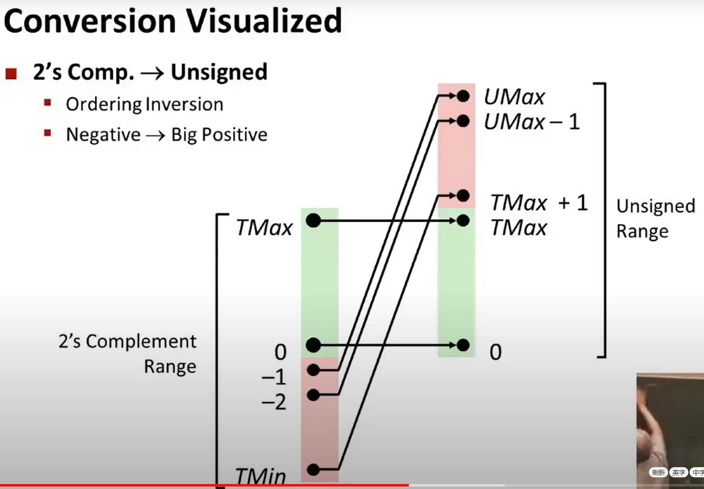
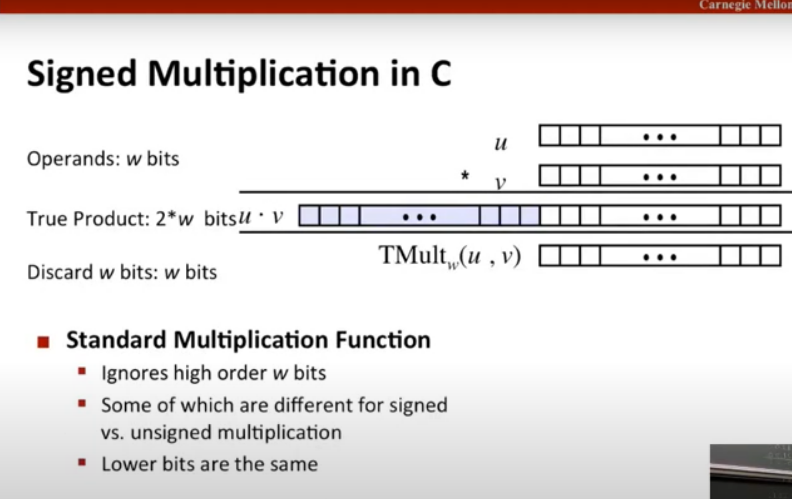

#  计算机组成原理

+ 原码
  + 整数： 最高位为符号位，为0
  + 负数： 最高位为符号位，为1
+ 反码
  + 整数： 和原码一样
  + 负数： 符号位不变,其他位取反
+ 补码(计算机中负数用补码表示)
  - 正数：正整数的补码是其二进制表示，与[原码](https://baike.baidu.com/item/原码)相同。
  - 负数：反码加1
+ a+b==> (a&b)<<1+a^b

+ 减法==>补码相加:
  + 以4位大小范围举例:
    + 5-3==>
      + 5 + -3的补码==>
        + 0101+ 1101 => 
          + 10010==> 0010 (四位大小截断最高位) 

+ 十进制转二进制:
  + 整数部分: 除二取余
    + 15=（1111）B
    + 15/2=7========余1
    + 7/2=3=========余1
    + 3/2=1=========余1
    + 1/2=0=========余1
  + 小数部分: 乘二取整
    + 0.625=（0.101）B
    + 0.625*2=1.25======取出整数部分1
    + 0.25*2=0.5========取出整数部分0
    +  0.5*2=1==========取出整数部分1

+ signed && unsigned

  

+ 乘法计算溢出的时候:

