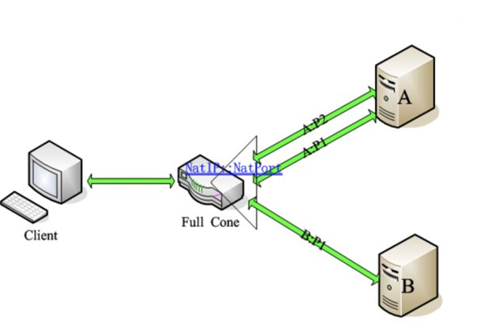

# Nat的类型——Cone Nat、Symmetic Nat

**Nat共分为四种类型：**

- 1.Full Cone Nat

- 2.Restriced Cone Nat

- 3.Port Restriced Cone Nat

- 4.Symmetric Nat

  

**Symmetric Nat 与 Cone Nat的区别**

+ **NAPT**
  端口多路复用技术。与静态NAT的差别是，NAPT不但要转换IP地址，还要进行传输层的端口转换。具体的表现形式就是，对外只有一个公网IP，通过端口来区别不同私有IP主机的数据。
  通过上面NAT实现方式的介绍，我们其实不难看出，现实环境中NAPT的应用显然是更广泛的。因此下面就重点介绍下NAPT的主要类型有哪些。

  **NAPT的主要类型**
  对于NAPT我们主要分为两大类：锥型NAT(Cone Nat)和对称型NAT(Symmetric Nat)。其中锥型NAT又分：完全锥型，受限锥型和端口受限锥型。

  概括的说：对称型NAT是一个请求对应一个端口；锥型NAT（非对称NAT）是多个请求（外部发向内部）对应一个端口，只要源IP端口不变，无论发往的目的IP是否相同，在NAT上都映射为同一个端口，形象的看起来就像锥子一样。1.三种Cone Nat同一主机，同一端口会被映射为相同的公网IP和端口

- 2.Symmetric Nat只有来自同一主机，同一端口发送到同一目的主机、端口，映射的公网IP和端口才会一致

#### 一、Full Cone NAT(完全锥形NAT)

**特点：**IP和端口都不受限。

该nat 将内网中一台主机的IP和端口映射到公网IP和一个指定端口，外网的任何主机都可以通过映射后的IP和端口发送消息

**表现形式：**将来自内部同一个IP地址同一个端口号（IP_IN_A : PORT_IN_A）的主机监听/请求，映射到公网IP某个端口（IP_OUT_B : PORT_OUT_B）的监听。任意外部IP地址与端口对其自己公网的IP这个映射后的端口访问（IP_OUT_B : PORT_OUT_B），都将重新定位到内部这个主机（IP_IN_A : PORT_IN_A）。该技术中，基于C/S架构的应用可以在任何一端发起连接。是不是很绕啊。再简单一点的说，就是，只要客户端，由内到外建立一个映射（NatIP:NatPort -> A1）之后，其他IP的主机B或端口A2都可以使用这个洞给客户端发送数据。见下图（图片来自网络）。

**eg:**主机A（192.168.0.123：4000）访问主机B，A的IP将会被映射为（222.123.12.23:50000);

当主机A使用4000端口访问主机C时，同样会被映射为（222.123.12.23:50000);而且此时任何主机C 、D·····（包含主机A未访问过的主机）都可以使用（222.123.12.23:50000)访问到主机A（192.168.0.123：4000）。

#### 二、Restriced Cone Nat(**受限锥型NAT**)

**特点：**IP受限，端口不受限。

该nat 将内网中一台主机的IP和端口映射到公网IP和一个指定端口，只有访问过的IP可以通过映射后的IP和端口连接主机A

**表现形式：**与完全锥形NAT不同的是，在公网映射端口后，并不允许所有IP进行对于该端口的访问，要想通信必需内部主机对某个外部IP主机发起过连接，然后这个外部IP主机就可以与该内部主机通信了，但端口不做限制。举个栗子。当客户端由内到外建立映射(NatIP:NatPort –> A1)，A机器可以使用他的其他端口（P2）主动连接客户端，但B机器则不被允许。因为IP受限啦，但是端口随便。见下图（绿色是允许通信，红色是禁止通信）。

**eg:**主机A（192.168.0.123：4000）访问主机B（223.124.34.23：9000），A的IP将会被映射为（222.123.12.23:50000);

此时只有Ip为（223.124.34.23）才能通过（222.123.12.23:50000)连接主机A。

#### 三、Port Restriced Cone Nat(**端口受限型NAT**)

**特点：**IP和端口都受限。

该nat 将内网中一台主机的IP和端口映射到公网IP和一个指定端口，只有访问过的IP和端口可以通过映射后的IP和端口连接主机A

**表现形式：**该技术与受限锥形NAT相比更为严格。除具有受限锥形NAT特性，对于回复主机的端口也有要求。也就是说：只有当内部主机曾经发送过报文给外部主机（假设其IP地址为A且端口为P1）之后，外部主机才能以公网IPORT中的信息作为目标地址和目标端口，向内部主机发送UDP报文，同时，其请求报文的IP必须是A，端口必须为P1（使用IP地址为A，端口为P2，或者IP地址为B，端口为P1都将通信失败）。例子见下图。这一要求进一步强化了对外部报文请求来源的限制，从而较Restrictd Cone更具安全性。

**eg:**主机A（192.168.0.123：4000）访问主机B（223.124.34.23：9000），A的IP将会被映射为（222.123.12.23:50000);

此时只有Ip为（223.124.34.23：9000）才能通过（222.123.12.23:50000)连接主机A。

#### 四、Symmetric Nat(**对称型NAT**)

**特点：**对每个外部主机或端口的会话都会映射为不同的端口（洞）。

**表现形式：**只有来自同一内部IPORT、且针对同一目标IPORT的请求才被NAT转换至同一个公网（外部）IPORT，否则的话，NAT将为之分配一个新的外部（公网）IPORT。并且，只有曾经收到过内部主机请求的外部主机才能向内部主机发送数据包。内部主机用同一IP与同一端口与外部多IP通信。客户端想和服务器A（IP_AORT_A）建立连接，是通过NAT映射为NatIP:NatPortA来进行的。而客户端和服务器B（IP_BORT_B）建立连接，是通过NAT映射为NatIP:NatPortB来进行的。即同一个客户端和不同的目标IP:PORT通信，经过NAT映射后的公网IP:PORT是不同的。此时，如果B想要和客户端通信，也只能通过NatIP:NatPortB（也就是紫色的洞洞）来进行，而不能通过NatIP:NatPortA（也就是黄色的洞洞）。
以上，就是NAPT的四种NAT类型。可以看出从类型1至类型4，NAT的限制是越来越大的。

**eg:**

当主机A（192.168.0.123：4000）访问主机B（223.124.34.23：9000），A的IP被映射为（222.123.12.23:50000)后，并将这三个IP、端口进行绑定;

等到主机A（192.168.0.123：4000）访问主机C时，可能（注意是可能，也有可能会不变）会被映射为（222.123.12.23:60010)，然后又会将这三个IP、端口绑定;

# NAT 打洞步骤

- ## Overview

  UDP hole punching is a method for establishing bidirectional UDP connections between [Internet](https://en.wikipedia.org/wiki/Internet) hosts in private networks using network address translators. The technique is not applicable in all scenarios or with all types of NATs, as NAT operating characteristics are not standardized.

  Hosts with network connectivity inside a private network connected via a NAT to the Internet typically use the [Session Traversal Utilities for NAT](https://en.wikipedia.org/wiki/Session_Traversal_Utilities_for_NAT) (STUN) method or [Interactive Connectivity Establishment](https://en.wikipedia.org/wiki/Interactive_Connectivity_Establishment) (ICE) to determine the public address of the NAT that its communications peers require. In this process another host on the public network is used to establish port mapping and other UDP port state that is assumed to be valid for direct communication between the application hosts. Since UDP state usually expires after short periods of time in the range of tens of seconds to a few minutes,[[2\]](https://en.wikipedia.org/wiki/UDP_hole_punching#cite_note-2) and the UDP port is closed in the process, UDP hole punching employs the transmission of periodic *keep-alive* packets, each renewing the life-time counters in the UDP state machine of the NAT.

  UDP hole punching will not work with [symmetric NAT](https://en.wikipedia.org/wiki/Network_address_translation#Methods_of_translation) devices (also known as bi-directional NAT) which tend to be found in large corporate networks. In symmetric NAT, the NAT's mapping associated with the connection to the well-known STUN server is restricted to receiving data from the well-known server, and therefore the NAT mapping the well-known server sees is not useful information to the endpoint.

  In a somewhat more elaborate approach both hosts will start sending to each other, using multiple attempts. On a [Restricted Cone NAT](https://en.wikipedia.org/wiki/Network_address_translation#Methods_of_translation), the first packet from the other host will be blocked. After that the NAT device has a record of having sent a packet to the other machine, and will let any packets coming from this IP address and port number through. This technique is widely used in [peer-to-peer](https://en.wikipedia.org/wiki/Peer-to-peer) software and [Voice over Internet Protocol](https://en.wikipedia.org/wiki/Voice_over_Internet_Protocol) telephony. It can also be used to assist the establishment of [virtual private networks](https://en.wikipedia.org/wiki/Virtual_private_network) operating over UDP. The same technique is sometimes extended to [Transmission Control Protocol](https://en.wikipedia.org/wiki/Transmission_Control_Protocol) (TCP) connections, though with less success because TCP connection streams are controlled by the host OS, not the application, and sequence numbers are selected randomly; thus any NAT device that performs sequence-number checking will not consider the packets to be associated with an existing connection and drop them.

  ## Flow

  Let A and B be the two hosts, each in its own private network; NA and NB are the two NAT devices with globally reachable IP addresses EIPA and EIPB respectively; S is a public server with a well-known, globally reachable IP address.

  1. A and B each begin a UDP conversation with S; the NAT devices NA and NB create UDP translation states and assign temporary external port numbers EPA and EPB.
  2. S examines the UDP packets to get the source port used by NA and NB (the external NAT ports EPA and EPB).
  3. S passes EIPA:EPA to B and EIPB:EPB to A.
  4. A sends a packet to EIPB:EPB.
  5. NA examines A's packet and creates the following [tuple](https://en.wikipedia.org/wiki/Tuple) in its translation table: (Source-IP-A, EPA, EIPB, EPB).
  6. B sends a packet to EIPA:EPA.
  7. NB examines B's packet and creates the following tuple in its translation table: (Source-IP-B, EPB, EIPA, EPA).
  8. Depending on the state of NA's translation table when B's first packet arrives (i.e. whether the tuple (Source-IP-A, EPA, EIPB, EPB) has been created by the time of arrival of B's first packet), B's first packet is dropped (no entry in translation table) or passed (entry in translation table has been made).
  9. Depending on the state of NB's translation table when A's first packet arrives (i.e. whether the tuple (Source-IP-B, EPB, EIPA, EPA) has been created by the time of arrival of A's first packet), A's first packet is dropped (no entry in translation table) or passed (entry in translation table has been made).
  10. At worst, the second packet from A reaches B; at worst the second packet from B reaches A. Holes have been "punched" in the NAT and both hosts can directly communicate.

  - If both hosts have [Restricted cone NATs](https://en.wikipedia.org/wiki/Restricted_cone_NAT) or [Symmetric NATs](https://en.wikipedia.org/wiki/Symmetric_NAT), the external NAT ports will differ from those used with S. On some routers, the external ports are picked sequentially, making it possible to establish a conversation through guessing nearby ports.

