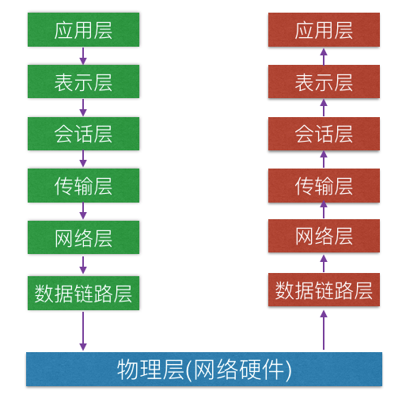
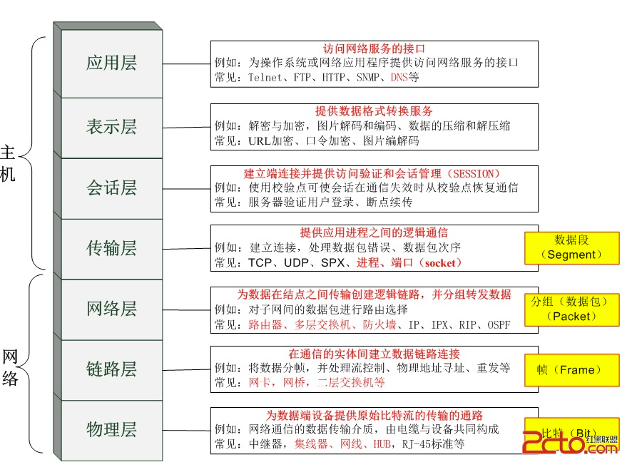

# OSI七层模型

### [关于七层模型的介绍](http://baike.baidu.com/link?url=jBuW8dEVavbr1xaapzIZ41CLA-P1wQ8RgdM33yF8wfx8XvGEgG5Ee959T9YWp1wH8zkXPfDD_YaIZY76C_J27K)

七层模型，也称为OSI（Open System Interconnection）参考模型，是国际标准化组织（ISO）制定的一个用于计算机或通讯系统间互联的标准体系。它是一个七层的、抽象的模型体，不仅包括一系列抽象的术语或概念，也包括具体的协议。
ISO 就是 Internationalization Standard Organization（国际标准组织）。

**起源**
看一下OSI的起源和出现过程还是挺有意思的。
OSI的大部分设计工作实际上只是Honeywell Information System公司的一个小组完成的，小组的技术负责人是Charlie Bachman。在70年代中期，这个小组主要是为了开发一些原型系统而成立的，主要关注数据库系统的设计。
70年代中，为了支持数据库系统的访问，需要一个结构化的分布式通信系统体系结构。于是这个小组研究了现有的一些解决方案，其中包括IBM公司的SNA(System Network Architecture)、ARPANET（Internet的前身）的协议、以及为标准化的数据库正在研究中的一些表示服务（presentation services）的相关概念，在1977年提出了一个七层的体系结构模型，他们内部称之为分布式系统体系结构（DSA）。
与此同时，1977年英国标准化协会向国际标准化组织（ISO）提议，为了定义分布处理之间的通信基础设施，需要一个标准的体系结构。结果，ISO就开放系统互联（OSI）问题成立了一个专委会（TC 97, Subcomittee 16），指定由美国国家标准协会（ANSI）开发一个标准草案，在专委会第一次正式会议之前提交。Bachman 参加了ANSI早期的会议，并提交了他的七层模型，这个模型就成了提交ISO专委会的唯一的一份草案。
1978年3月，在ISO的OSI专委会在华盛顿召开的会议上，与会专家很快达成了共识，认为这个分层的体系结构能够满足开放式系统的大多数需求，而且具有可扩展的能力，能够满足新的需求。于是，1978年发布了这个临时版本，1979年稍作细化之后，成了最终的版本。所以，OSI模型和1977年DSA模型基本相同。

### 模型优点

建立七层模型的主要目的是为解决异种网络互连时所遇到的兼容性问题。它的最大优点是将服务、接口和协议这三个概念明确地区分开来：服务说明某一层为上一层提供一些什么功能，接口说明上一层如何使用下层的服务，而协议涉及如何实现本层的服务；这样各层之间具有很强的独立性，互连网络中各实体采用什么样的协议是没有限制的，只要向上提供相同的服务并且不改变相邻层的接口就可以了。网络七层的划分也是为了使网络的不同功能模块（不同层次）分担起不同的职责，从而带来如下好处： 　　
● 减轻问题的复杂程度，一旦网络发生故障，可迅速定位故障所处层次，便于查找和纠错； 　　
● 在各层分别定义标准接口，使具备相同对等层的不同网络设备能实现互操作，各层之间则相对独立，一种高层协议可放在多种低层协议上运行； 　　
● 能有效刺激网络技术革新，因为每次更新都可以在小范围内进行，不需对整个网络动大手术； 　　
● 便于研究和教学。

### 详细介绍

OSI中的上面4层（应用层、表示层、会话层、传输层）为高层，定义了程序的功能；下面3层（网络层、数据链路层、物理层）为低层，主要是处理面向网络的端到端数据流。

### 应用层（Application Layer）

应用层是最靠近用户的OSI层。这一层为用户的应用程序（例如电子邮件、文件传输和终端仿真）提供网络服务。。
协议有：HTTP FTP TFTP SMTP SNMP DNS TELNET HTTPS POP3 DHCP等。

应用层也称为应用实体（AE），它由若干个特定应用服务元素（SASE）和一个或多个公用应用服务元素（CASE）组成。每个SASE提供特定的应用服务，例如文件运输访问和管理（FTAM）、电子文电处理（MHS）、虚拟终端协议（VAP）等。CASE提供一组公用的应用服务，例如联系控制服务元素（ACSE）、可靠运输服务元素（RTSE）和远程操作服务元素（ROSE）等。主要负责对软件提供接口以使程序能使用网络服务。术语“应用层”并不是指运行在网络上的某个特别应用程序 ，应用层提供的服务包括文件传输、文件管理以及电子邮件的信息处理。

### 表示层（Presentation Layer）

数据的表示、安全、压缩。可确保一个系统的应用层所发送的信息可以被另一个系统的应用层读取。
格式有：JPEG、ASCll、DECOIC、加密格式等。

应用程序和网络之间的翻译官，在表示层，数据将按照网络能理解的方案进行格式化；这种格式化也因所使用网络的类型不同而不同。 　　

表示层管理数据的解密与加密，如系统口令的处理。例如：在 Internet上查询你银行账户，使用的即是一种安全连接。你的账户数据在发送前被加密，在网络的另一端，表示层将对接收到的数据解密。除此之外，表示层协议还对图片和文件格式信息进行解码和编码。

### 会话层（Session Layer）

建立、管理、终止会话，对应主机进程，指本地主机与远程主机正在进行的会话。
通过传输层（端口号：传输端口与接收端口）建立数据传输的通路。主要在你的系统之间发起会话或者接受会话请求（设备之间需要互相认识可以是IP也可以是MAC或者是主机名）。

负责在网络中的两节点之间建立、维持和终止通信。 会话层的功能包括：建立通信链接，保持会话过程通信链接的畅通，同步两个节点之间的对话，决定通信是否被中断以及通信中断时决定从何处重新发送。 　　

你可能常常听到有人把会话层称作网络通信的“交通警察”。当通过拨号向你的 ISP （因特网服务提供商）请求连接到因特网时，ISP 服务器上的会话层向你与你的 PC 客户机上的会话层进行协商连接。若你的电话线偶然从墙上插孔脱落时，你终端机上的会话层将检测到连接中断并重新发起连接。会话层通过决定节点通信的优先级和通信时间的长短来设置通信期限。

### 传输层（Transport Layer）

定义传输数据的协议端口号，以及流控和差错校验。
协议有：TCP UDP等，数据包一旦离开网卡即进入网络传输层。

定义了一些传输数据的协议和端口号（WWW端口80等），如：TCP（传输控制协议，传输效率低，可靠性强，用于传输可靠性要求高，数据量大的数据），UDP（用户数据报协议，与TCP特性恰恰相反，用于传输可靠性要求不高，数据量小的数据，如QQ聊天数据就是通过这种方式传输的）。 主要是将从下层接收的数据进行分段和传输，到达目的地址后再进行重组。常常把这一层数据叫做段**Segment**。

O S I 模型中最重要的一层。传输协议同时进行流量控制或是基于接收方可接收数据的快慢程度规定适当的发送速率。除此之外，传输层按照网络能处理的最大尺寸将较长的数据包进行强制分割。例如，以太网无法接收大于1 5 0 0 字节的数据包。发送方节点的传输层将数据分割成较小的数据片，同时对每一数据片安排一序列号，以便数据到达接收方节点的传输层时，能以正确的顺序重组。该过程即被称为排序。工作在传输层的一种服务是 T C P / I P 协议套中的T C P （传输控制协议），另一项传输层服务是I P X / S P X 协议集的S P X （序列包交换）。

### 网络层（Network Layer）

进行逻辑地址寻址，实现不同网络之间的路径选择。
协议有：ICMP IGMP IP（IPV4 IPV6） ARP RARP等。

在位于不同地理位置的网络中的两个主机系统之间提供连接和路径选择。Internet的发展使得从世界各站点访问信息的用户数大大增加，而网络层正是管理这种连接的层。

O S I 模型的第三层，其主要功能是将网络地址翻译成对应的物理地址，并决定如何将数据从发送方路由到接收方。 　
　
网络层通过综合考虑发送优先权、网络拥塞程度、服务质量以及可选路由的花费来决定从一个网络中节点A 到另一个网络中节点B 的最佳路径。由于网络层处理，并智能指导数据传送，路由器连接网络各段，所以路由器属于网络层。在网络中，“路由”是基于编址方案、使用模式以及可达性来指引数据的发送。
　　
网络层负责在源机器和目标机器之间建立它们所使用的路由。这一层本身没有任何错误检测和修正机制，因此，网络层必须依赖于端端之间的由D L L提供的可靠传输服务。 　　

网络层用于本地L A N网段之上的计算机系统建立通信，它之所以可以这样做，是因为它有自己的路由地址结构，这种结构与第二层机器地址是分开的、独立的。这种协议称为路由或可路由协议。路由协议包括I P、N o v e l l公司的I P X以及A p p l e Ta l k协议。 　　

网络层是可选的，它只用于当两个计算机系统处于不同的由路由器分割开的网段这种情况，或者当通信应用要求某种网络层或传输层提供的服务、特性或者能力时。例如，当两台主机处于同一个L A N网段的直接相连这种情况，它们之间的通信只使用L A N的通信机制就可以了(即OSI 参考模型的一二层)。

### 数据链路层（Datalink Layer）

建立逻辑连接、进行硬件地址寻址、差错校验等功能。（由底层网络定义协议）
将比特组合成字节进而组合成帧，用MAC地址访问介质，错误发现但不能纠正。

数据链路层协议的代表包括：SDLC、HDLC、PPP、STP、帧中继等。

定义了如何让格式化数据以进行传输，以及如何让控制对物理介质的访问。这一层通常还提供错误检测和纠正，以确保数据的可靠传输。

OSI模型的第二层，它控制网络层与物理层之间的通信。它的主要功能是如何在不可靠的物理线路上进行数据的可靠传递。为了保证传输，从网络层接收到的数据被分割成特定的可被物理层传输的帧。帧是用来移动数据的结构包，它不仅包括原始数据，还包括发送方和接收方的物理地址以及检错和控制信息。其中的地址确定了帧将发送到何处，而纠错和控制信息则确保帧无差错到达。 如果在传送数据时，接收点检测到所传数据中有差错，就要通知发送方重发这一帧。
　　
数据链路层的功能独立于网络和它的节点和所采用的物理层类型，它也不关心是否正在运行 Wo r d 、E x c e l 或使用I n t e r n e t 。有一些连接设备，如交换机，由于它们要对帧解码并使用帧信息将数据发送到正确的接收方，所以它们是工作在数据链路层的。 　　

数据链路层（DataLinkLayer):在物理层提供比特流服务的基础上，建立相邻结点之间的数据链路，通过差错控制提供数据帧（Frame）在信道上无差错的传输，并进行各电路上的动作系列。 　
　
数据链路层在不可靠的物理介质上提供可靠的传输。该层的作用包括：物理地址寻址、数据的成帧、流量控制、数据的检错、重发等。

### 物理层（Physical Layer）

建立、维护、断开物理连接。（由底层网络定义协议）

主要定义物理设备标准，如网线的接口类型、光纤的接口类型、各种传输介质的传输速率等。它的主要作用是传输比特流（就是由1、0转化为电流强弱来进行传输,到达目的地后在转化为1、0，也就是我们常说的数模转换与模数转换）。这一层的数据叫做比特。

O S I 模型的最低层或第一层，该层包括物理连网媒介，如电缆连线连接器。物理层的协议产生并检测电压以便发送和接收携带数据的信号。在你的桌面P C 上插入网络接口卡，你就建立了计算机连网的基础。换言之，你提供了一个物理层。尽管物理层不提供纠错服务，但它能够设定数据传输速率并监测数据出错率。网络物理问题，如电线断开，将影响物理层。 　　用户要传递信息就要利用一些物理媒体，如双绞线、同轴电缆等，但具体的物理媒体并不在OSI的7层之内，有人把物理媒体当做第0层，物理层的任务就是为它的上一层提供一个物理连接，以及它们的机械、电气、功能和过程特性。如规定使用电缆和接头的类型、传送信号的电压等。在这一层，数据还没有被组织，仅作为原始的位流或电气电压处理，单位是bit比特。

### 补充知识

一个设备工作在哪一层，关键看它工作时利用哪一层的数据头部信息。网桥工作时，是以MAC头部来决定转发端口的，因此显然它是数据链路层的设备。
具体说:
物理层：网卡，网线，集线器，中继器，调制解调器
数据链路层：网桥，交换机
网络层：路由器
网关工作在第四层传输层及其以上。
集线器是物理层设备,采用广播的形式来传输信息。
交换机就是用来进行报文交换的机器。多为链路层设备(二层交换机)，能够进行地址学习，采用存储转发的形式来交换报文.。
路由器的一个作用是连通不同的网络，另一个作用是选择信息传送的线路。选择通畅快捷的近路，能大大提高通信速度，减轻网络系统通信负荷，节约网络系统资源，提高网络系统畅通率。

#### 交换机和路由器的区别

交换机拥有一条很高带宽的背部总线和内部交换矩阵。交换机的所有的端口都挂接在这条总线上，控制电路收到数据包以后，处理端口会查找内存中的地址对照表以确定目的MAC（网卡的硬件地址）的NIC（网卡）挂接在哪个端口上，通过内部交换矩阵迅速将数据包传送到目的端口，目的MAC若不存在则广播到所有的端口，接收端口回应后交换机会“学习”新的地址，并把它添加入内部MAC地址表中。

使用交换机也可以把网络“分段”，通过对照MAC地址表，交换机只允许必要的网络流量通过交换机。通过交换机的过滤和转发，可以有效的隔离广播风暴，减少误包和错包的出现，避免共享冲突。

交换机在同一时刻可进行多个端口对之间的数据传输。每一端口都可视为独立的网段，连接在其上的网络设备独自享有全部的带宽，无须同其他设备竞争使用。当节点A向节点D发送数据时，节点B可同时向节点C发送数据，而且这两个传输都享有网络的全部带宽，都有着自己的虚拟连接。假使这里使用的是10Mbps的以太网交换机，那么该交换机这时的总流通量就等于2×10Mbps＝20Mbps，而使用10Mbps的共享式HUB时，一个HUB的总流通量也不会超出10Mbps。

总之，交换机是一种基于MAC地址识别，能完成封装转发数据包功能的网络设备。交换机可以“学习”MAC地址，并把其存放在内部地址表中，通过在数据帧的始发者和目标接收者之间建立临时的交换路径，使数据帧直接由源地址到达目的地址。

从过滤网络流量的角度来看，路由器的作用与交换机和网桥非常相似。但是与工作在网络物理层，从物理上划分网段的交换机不同，路由器使用专门的软件协议从逻辑上对整个网络进行划分。例如，一台支持IP协议的路由器可以把网络划分成多个子网段，只有指向特殊IP地址的网络流量才可以通过路由器。对于每一个接收到的数据包，路由器都会重新计算其校验值，并写入新的物理地址。因此，使用路由器转发和过滤数据的速度往往要比只查看数据包物理地址的交换机慢。但是，对于那些结构复杂的网络，使用路由器可以提高网络的整体效率。路由器的另外一个明显优势就是可以自动过滤网络广播。

#### 集线器与路由器在功能上有什么不同?

首先说HUB,也就是集线器。它的作用可以简单的理解为将一些机器连接起来组成一个局域网。而交换机（又名交换式集线器）作用与集线器大体相同。但是两者在性能上有区别：集线器采用的式共享带宽的工作方式，而交换机是独享带宽。这样在机器很多或数据量很大时，两者将会有比较明显的。而路由器与以上两者有明显区别，它的作用在于连接不同的网段并且找到网络中数据传输最合适的路径。路由器是产生于交换机之后，就像交换机产生于集线器之后，所以路由器与交换机也有一定联系，不是完全独立的两种设备。路由器主要克服了交换机不能路由转发数据包的不足。

总的来说，路由器与交换机的主要区别体现在以下几个方面：

（1）工作层次不同
最初的的交换机是工作在数据链路层，而路由器一开始就设计工作在网络层。由于交换机工作在数据链路层，所以它的工作原理比较简单，而路由器工作在网络层，可以得到更多的协议信息，路由器可以做出更加智能的转发决策。

（2）数据转发所依据的对象不同
交换机是利用物理地址或者说MAC地址来确定转发数据的目的地址。而路由器则是利用IP地址来确定数据转发的地址。IP地址是在软件中实现的，描述的是设备所在的网络。MAC地址通常是硬件自带的，由网卡生产商来分配的，而且已经固化到了网卡中去，一般来说是不可更改的。而IP地址则通常由网络管理员或系统自动分配。

（3）传统的交换机只能分割冲突域，不能分割广播域；而路由器可以分割广播域
由交换机连接的网段仍属于同一个广播域，广播数据包会在交换机连接的所有网段上传播，在某些情况下会导致通信拥挤和安全漏洞。连接到路由器上的网段会被分配成不同的广播域，广播数据不会穿过路由器。虽然第三层以上交换机具有VLAN功能，也可以分割广播域，但是各子广播域之间是不能通信交流的，它们之间的交流仍然需要路由器。

（4）路由器提供了防火墙的服务
路由器仅仅转发特定地址的数据包，不传送不支持路由协议的数据包传送和未知目标网络数据包的传送，从而可以防止广播风暴。