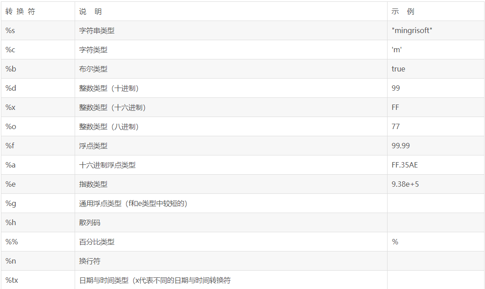

## 正则表达式模式

模式字符串使用特殊的语法来表示一个正则表达式：

| 模式        | 描述                                                         |
| :---------- | :----------------------------------------------------------- |
| ^           | 匹配字符串的开头                                             |
| $           | 匹配字符串的末尾。                                           |
| .           | 匹配任意字符，除了换行符，当re.DOTALL标记被指定时，则可以匹配包括换行符的任意字符。 |
| [...]       | 用来表示一组字符,单独列出：[amk] 匹配 'a'，'m'或'k'          |
| [^...]      | 不在[]中的字符：[ ^abc ] 匹配除了a,b,c之外的字符。           |
| re*         | 匹配0个或多个的表达式。                                      |
| re+         | 匹配1个或多个的表达式。                                      |
| re?         | 匹配0个或1个由前面的正则表达式定义的片段，非贪婪方式         |
| re{ n}      | 精确匹配 n 个前面表达式。例如， **o{2}** 不能匹配 "Bob" 中的 "o"，但是能匹配 "food" 中的两个 o。 |
| re{ n,}     | 匹配 n 个前面表达式。例如， o{2,} 不能匹配"Bob"中的"o"，但能匹配 "foooood"中的所有 o。"o{1,}" 等价于 "o+"。"o{0,}" 则等价于 "o*"。 |
| re{ n, m}   | 匹配 n 到 m 次由前面的正则表达式定义的片段，贪婪方式         |
| a\| b       | 匹配a或b                                                     |
| (re)        | 匹配括号内的表达式，也表示一个组                             |
| (?imx)      | 正则表达式包含三种可选标志：i, m, 或 x 。只影响括号中的区域。 |
| (?-imx)     | 正则表达式关闭 i, m, 或 x 可选标志。只影响括号中的区域。     |
| (?: re)     | 类似 (...), 但是不表示一个组                                 |
| (?imx: re)  | 在括号中使用i, m, 或 x 可选标志                              |
| (?-imx: re) | 在括号中不使用i, m, 或 x 可选标志                            |
| (?#...)     | 注释.                                                        |
| (?= re)     | 前向肯定界定符。如果所含正则表达式，以 ... 表示，在当前位置成功匹配时成功，否则失败。但一旦所含表达式已经尝试，匹配引擎根本没有提高；模式的剩余部分还要尝试界定符的右边。 |
| (?! re)     | 前向否定界定符。与肯定界定符相反；当所含表达式不能在字符串当前位置匹配时成功 |
| (?> re)     | 匹配的独立模式，省去回溯。                                   |
| \w          | 匹配字母数字及下划线                                         |
| \W          | 匹配非字母数字及下划线                                       |
| \s          | 匹配任意空白字符，等价于 [\t\n\r\f].                         |
| \S          | 匹配任意非空字符                                             |
| \d          | 匹配任意数字，等价于 [0-9].                                  |
| \D          | 匹配任意非数字                                               |
| \A          | 匹配字符串开始                                               |
| \Z          | 匹配字符串结束，如果是存在换行，只匹配到换行前的结束字符串。 |
| \z          | 匹配字符串结束                                               |
| \G          | 匹配最后匹配完成的位置。                                     |
| \b          | 匹配一个单词边界，也就是指单词和空格间的位置。例如， 'er\b' 可以匹配"never" 中的 'er'，但不能匹配 "verb" 中的 'er'。 |
| \B          | 匹配非单词边界。'er\B' 能匹配 "verb" 中的 'er'，但不能匹配 "never" 中的 'er'。 |
| \n, \t, 等. | 匹配一个换行符。匹配一个制表符。等                           |
| \1...\9     | 匹配第n个分组的内容。                                        |
| \10         | 匹配第n个分组的内容，如果它经匹配。否则指的是八进制字符码的表达式。 |

+ 常用正则表达式(java)
  + email:  regexp = "([a-z0-9A-Z]+[-|\\.]?)+[a-z0-9A-Z]@([a-z0-9A-Z]+(-[a-z0-9A-Z]+)?\\.)+[a-zA-Z]{2,}"

## java中String.format()函数常用匹配规则：

​	
