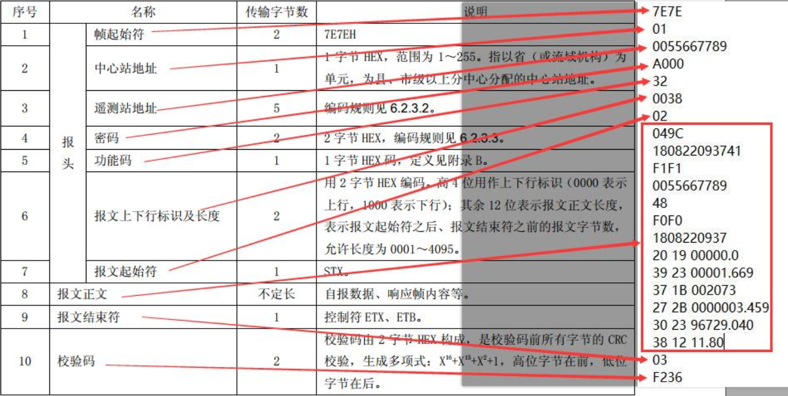

#  SL651-2014 解析

+ 本文档提供SL651-2014解析流程,根据公司业务需求，着重解析水位计/流量计定时发送相关报文。
+ 参考文档**水文监测数据通信规约SL651-2014**
+ 

+ 报文内容示例

  ```
  遥测站定时报
  7E7E010055667712A000320034020EE7200925020552F1F1005566771248F0F02009250200272B0000000000302B0018393400371B000000392300024720381212730378E5
  
  7E7E: 帧起始符
  01: 中心站地址
  0055667712: 遥测站地址
  A000: 通讯密码
  32: 遥测站定时报
  0034: 第一个字符0代表上行1代表下行,后三位代表报文字节数34==3*16+4=52个字节长度==104位长度
  
  02: 报文起始符
  0EE7: 报文流水号
  200925020552: 发报时间    解析；2020年09月25日02时05分52秒
  F1F1: 地址标识符
  0055667712: 遥测站地址
  48： 遥测站分类码->河道
  
  F0F0： 
  2009250200: 观测时间     解析；2020年09月25日02时00分
  
  272B: 瞬时流量
  0000000000
  
  302B: 总出库流量
  0018393400
  
  371B: 当前瞬时流速
  000000
  
  3923: 水位标识
  00024720: BCD解析值:24.720
  
  3812：电压数据
  1273： 电压数据     解析；12.73v
  
  03: 结束标识符
  78E5: CRC16校验码
  
  ```

  ```
  遥测站定时报
  7E7E010055667782A00032002102016E200925020248F1F1005566778248F0F020092502003923000262003812124503CD5A
  7E7E
  01
  0055667782
  A000
  32
  0021
  
  02
  016E
  200925020248
  
  F1F1
  0055667782
  
  48
  
  F0F0
  2009250200
  
  3923
  00026200
  
  3812
  1245
  
  03
  CD5A
  ```

+ 以上两段内容均遥测终端定时报，也是使用最多的报文形式，其他类型报文，可根据规约文档配合此文档了解解析流程。

+ 观测值解析流程:

  + 这里举一个例子来描述算法：

    ```
    302B
    0018393400
    ```

    1. 30代表总出库流量

    2. 将2B转换成对应的BCD码 0010 1011

    3. 取前五位代表该检测值的长度00101->5个字节  后三位011代表3位小数长度(这里一定要注意**前面五位是字节数**,**后面三位是长度**)

    4. 从302B往后取5个字节长度的数据信息，即10位长度，即紧跟着302B的**0018393400**;

    5. 后三位011的值位为3位,则该条数据值为**0018393.400**

    6. 为防止错误理解该流程

       3812
       1245

       ```
       3813
       38-->电压
       13--> 0001 0010 -> 前五位 0001 0 =2， 后三位010-> =2 ,往后取2*2位数，即1245,后三位的值为2，尾2位为小数,即12.45
       这个监测值为电压数据为12.45V
       ```


### 解析算法代码实现(定时报)

~~~java
```java
/**
 * 解析主函数
 * @param msg 源报文内容
 * @return
 */
public static MsgInfo parseData(String msg) {
    int len = msg.length();
    String crcInfo = msg.substring(len - 4);
    String dateInfo = msg.substring(0, len - 4);
    //crc校验
    if (!getCRC_ModBus(dateInfo).equals(crcInfo)) {
        return null;
    }
    /**
     * 报头:
     * 7E7E: 帧起始符 2
     * 01: 中心站地址 1
     * 0055667712: 遥测站地址 5
     * A000: 通讯密码 2
     * 32: 遥测站定时报 1
     * 0034: 第一个字符0代表上行1代表下行,后三位代表报文字节数34==3*16+4=52个字节长度==104位长度 2
     * 总长度为13*2=16
     */
    String msgHead = msg.substring(0, 26);
    /**
     * 报尾
     * 03: 结束标识符 1
     * 78E5: CRC16校验码 2
     * 总长度 3*2=6
     */
    String mainBody = msg.substring(26, len - 6);
    MsgInfo msgInfo = new MsgInfo();
    //报文头解析
    parseHead(msgHead, msgInfo);
    //报文正文解析
    parseMainBody(mainBody, msgInfo);
    return msgInfo;
}

/**
 * 报文头解析函数
 * @param head  报文头
 * @param msgInfo 解析数据接收
 */
public static void parseHead(String head, MsgInfo msgInfo) {
    int index = 4;
    msgInfo.setCenterAddr(head.substring(index, index + 2));
    index += 2;
    msgInfo.setStationAddr(head.substring(index, index + 10));
    index += 10;
    msgInfo.setPwd(head.substring(index, index + 4));
    index += 4;
    msgInfo.setType(head.substring(index, index + 2));
    index += 2;
    msgInfo.setUpload(head.charAt(index + 1) == '0');
    index += 1;
    msgInfo.setMainBodyLen(HexUtil.toBigInteger(head.substring(index, index + 3)).intValue() * 2);
}

/**
 * 报文正文解析
 * @param mainBody 报文正文
 * @param msgInfo 解析数据接收
 */
public static void parseMainBody(String mainBody, MsgInfo msgInfo) {
    int index = 2;
    //流水号
    msgInfo.setSerNum(mainBody.substring(index, index + 4));
    index += 4;
    //发报时间
    msgInfo.setDataTime(DateUtil.parse(mainBody.substring(index, index + 12), "YYMMDDHHmmss"));
    index += 12;
    Map<String, Object> mainBodyMap = msgInfo.getMainBody();
    index += 4;
    mainBodyMap.put("stationAddr", mainBody.substring(index, index + 10));
    index += 10;
    mainBodyMap.put("stationType", mainBody.substring(index, index + 2));
    index += 2;
    while (index < mainBody.length()) {
        String key;
        String tag = mainBody.substring(index, index + 2);
        index += 2;
        //观测时间做特殊处理
        if (tag.toUpperCase().equals("F0")) {
            index += 2;
            key = "dataTime";
            DateTime dateTime = DateUtil.parse(mainBody.substring(index, index + 10), "YYMMDDHHmm");
            index += 10;
            mainBodyMap.put(key, dateTime);
            continue;
        }

        String tagTail = mainBody.substring(index, index + 2);
        index += 2;
        String tagTailInfo = hexToBinary(tagTail);
        //前五位代表字节数计算长度 字节数*2 ,后三位代表位数计算小数长度
        int len = Integer.parseInt(tagTailInfo.substring(0, 5), 2) * 2;
        int decLen = Integer.parseInt(tagTailInfo.substring(5), 2);
        //截取标志信息
        String tagMsg = mainBody.substring(index, index + len);
        tagMsg = tagMsg.substring(0, len - decLen) + "." + tagMsg.substring(len - decLen);
        index += len;
        //标识符 参考水温监测数据通信规约SL651-2014
        switch (tag) {
            case "27":
                key = "rtdTraffic";
                break;
            case "30":
                key = "couTraffic";
                break;
            case "37":
                key = "rtdFlow";
                break;
            case "39":
                key = "rtdWaterLevel";
                break;
            case "38":
                key = "voltage";
                break;
            default:
                key = "";
        }
        mainBodyMap.put(key, Double.parseDouble(tagMsg));
    }
}
~~~

```java
    /**
     * 16进制转8进制,不满足8位补0
     * @param hex
     * @return
     */
    public static String hexToBinary(String hex) {
        StringBuilder sb = new StringBuilder();
        for (int i = 0; i < hex.length(); i++) {
            int v = Integer.parseInt(String.valueOf(hex.charAt(i)), 16);
            String s = Integer.toBinaryString(v);
            while (s.length() < 4) {
                s = String.format("0%s", s);
            }
            String tail4 = s.substring(s.length() - 4);
            sb.append(tail4);
        }
        return sb.toString();
    }
	/**
     * CRC-16/MODBUS 算法
     * @param str
     * @return
     */
     public static String getCRC_ModBus(String str) {
        //    CRC算法名称	多项式公式	        宽度	多项式	初始值	结果异或值	输入反转	输出反转
        //    CRC-16/MODBUS	x16 + x15 + x2 + 1	16	8005	FFFF	0000	    true	true
        /*ModBus 通信协议的 CRC ( 冗余循环校验码含2个字节, 即 16 位二进制数。
        CRC 码由发送设备计算, 放置于所发送信息帧的尾部。
        接收信息设备再重新计算所接收信息 (除 CRC 之外的部分）的 CRC,
        比较计算得到的 CRC 是否与接收到CRC相符, 如果两者不相符, 则认为数据出错。

        1) 预置 1 个 16 位的寄存器为十六进制FFFF(即全为 1) , 称此寄存器为 CRC寄存器。
        2) 把第一个 8 位二进制数据 (通信信息帧的第一个字节) 与 16 位的 CRC寄存器的低 8 位相异或, 把结果放于 CRC寄存器。
        3) 把 CRC 寄存器的内容右移一位( 朝低位)用 0 填补最高位, 并检查右移后的移出位。
        4) 如果移出位为 0, 重复第 3 步 ( 再次右移一位); 如果移出位为 1, CRC 寄存器与多项式A001 ( 1010 0000 0000 0001) 进行异或。
        5) 重复步骤 3 和步骤 4, 直到右移 8 次,这样整个8位数据全部进行了处理。
        6) 重复步骤 2 到步骤 5, 进行通信信息帧下一个字节的处理。
        8) 最后得到的 CRC寄存器内容即为 CRC码。*/
        char[] chars=new char[str.length()/2];
        str = str.toUpperCase();
        int index = 0;
        for (int i = 0; i < str.length(); i += 2) {
            String a = str.substring(i, i + 2);
            chars[index++] = (char) Integer.parseInt(a, 16);
        }
        int CRC = 0x0000ffff;
        int POLYNOMIAL = 0x0000a001;
        for (int anInt : chars) {
            CRC ^= anInt;
            for (int j = 0; j < 8; j++) {
                int t = CRC & 1;
                CRC >>= 1;
                if (t == 1) {
                    CRC ^= POLYNOMIAL;
                }
            }
        }
        return Integer.toHexString(CRC).toUpperCase();
    }


    /**
     * 解析报文信息
     */
    @Data
    @ToString
    static class MsgInfo {
        //报文源内容
        String msg;
        //中心站地址
        String centerAddr;
        //遥测站地址
        String stationAddr;
        //通讯密码
        String pwd;
        //报文类型
        String type;
        //是否上行
        Boolean upload;
        //报文正文长度
        int mainBodyLen;
        //以下属于正文内容
        //报文流水号
        String serNum;
        //发报时间
        Date dataTime;

        Map<String, Object> mainBody = new HashMap<>();

    }
```

### 解析测试

```java
public static void main(String[] args) {
        MsgInfo msgInfo = parseData("7E7E010055667782A00032002102016E200925020248F1F1005566778248F0F020092502003923000262003812124503CD5A");
        System.out.println(msgInfo);
        System.out.println("-------------");
        msgInfo = parseData("7E7E010055667712A000320034020EE7200925020552F1F1005566771248F0F02009250200272B0000000000302B0018393400371B000000392300024720381212730378E5");
        System.out.println(msgInfo);
    }
```

output:

```
olution.MsgInfo(msg=null, centerAddr=01, stationAddr=0055667782, pwd=A000, type=32, upload=true, mainBodyLen=66, serNum=016E, dataTime=2019-12-29 02:02:48, mainBody={dataTime=2019-12-29 02:00:00, stationType=48, rtdWaterLevel=26.2, stationAddr=0055667782, voltage=12.45})
-------------
Solution.MsgInfo(msg=null, centerAddr=01, stationAddr=0055667712, pwd=A000, type=32, upload=true, mainBodyLen=104, serNum=0EE7, dataTime=2019-12-29 02:05:52, mainBody={couTraffic=18393.4, dataTime=2019-12-29 02:00:00, stationType=48, rtdWaterLevel=24.72, stationAddr=0055667712, rtdFlow=0.0, rtdTraffic=0.0, voltage=12.73})
```


