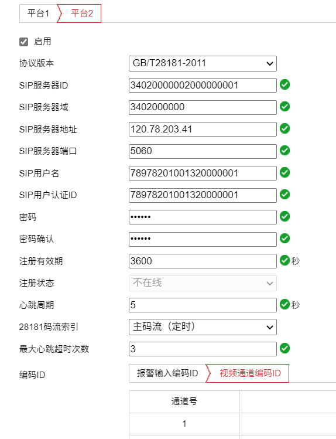
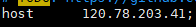
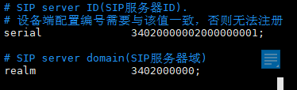
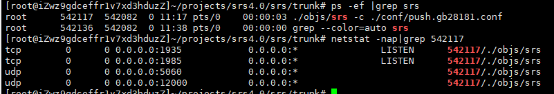
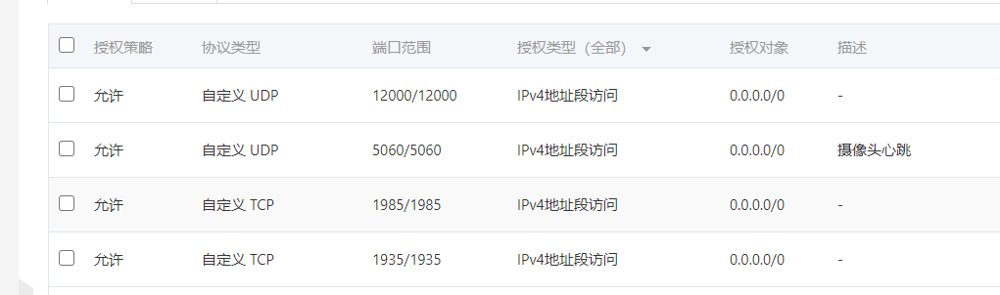

### srs流媒体服务安装：

+ 参考文件目录下的srs安装.pdf

### 外网海康摄像头配置：

+ sip为服务器接收摄像头信令端口，不传输数据包，对应服务中的push.gb28181.conf中的配置项：
  + 
+ sip服务器地址对应srs服务所在的ip地址，服务器配置项如下：
  + 

+ SipID及Sip域对应服务器配置：
  + 

+ 视频数据推流端口：
  + 

+ 查询应用所占用端口：

  + 

  + 1935： 为RTMP推流拉流端口 TCP协议
  + 1985： 为srs服务提供的httpAPI接口 TCP协议
  + 5060： Sip信令服务端口
  + 12000： 摄像头推流端口

+ 外网配置(阿里云举例)：

  1. 云服务器防火墙开放应用端口：

     + 1935/tcp
     + 1985/tcp
     + 5060/udp
     + 12000/udp

  2. 云服务安全组配置规则：

     

+ 备注
  + UDP端口抓包: tcpdump -i eth0(网卡名称)  -s 0 port 1814
  + UDP发包测试：nc -vuz 120.78.203.41 5060